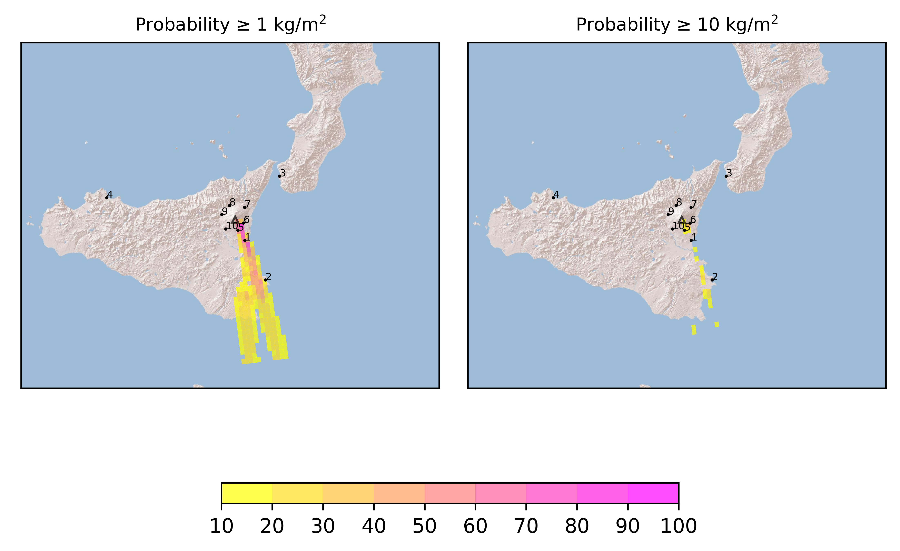

Forecast from VONA bulletin - 20210216_1631Z
============================================

Contents
========

* [Forecast products](#forecast-products)
	* [Forecast at 2021-02-16 19:30 Z](#forecast-at-2021-02-16-1930-z)
	* [Forecast at 2021-02-16 20:10 Z](#forecast-at-2021-02-16-2010-z)
	* [Forecast at 2021-02-16 20:10 Z](#forecast-at-2021-02-16-2010-z)
	* [Forecast at 2021-02-16 23:10 Z](#forecast-at-2021-02-16-2310-z)

# Forecast products

## Forecast at 2021-02-16 19:30 Z
  

|Eruption start [Z]|Eruption end [Z]|Forecast time [Z]|Column height distribution asl [m]|
| :--- | :--- | :--- | :--- |
|2021-02-16 16:30:00|Ongoing|2021-02-16 19:30:00|Gaussian from VONA|
  
  

|Percentile|MER [kg/s¹]|Mass in the air [kg]|Mass on the ground [kg]|
| :--- | :--- | :--- | :--- |
|5th|9.97e+03|5.88e+07|4.49e+07|
|50th|9.87e+04|3.69e+08|5.90e+08|
|95th|1.78e+05|6.31e+08|1.04e+09|
  

### Ground 2021-02-16 19:30 Z
  
  
  
  
  
  
  
  
  
  
  

|Location|Ground load [kg/m²] 5th perc|Ground load [kg/m²] 50th perc|Ground load [kg/m²] 95th perc|
| :--- | :--- | :--- | :--- |
|Catania AP (1)|1.23e-02|1.15e-01|1.30e+00|
|Siracusa (2)|5.19e-05|1.10e-02|7.65e-02|
|Reggio Calabria AP (3)|0.00e+00|0.00e+00|0.00e+00|
|Palermo AP (4)|0.00e+00|0.00e+00|0.00e+00|
|Nicolosi (5)|5.83e-02|5.71e-01|1.67e+00|
|Zafferana (6)|8.70e-07|5.31e-06|7.31e-04|
|Linguaglossa (7)|0.00e+00|1.00e-09|2.87e-08|
|Randazzo (8)|0.00e+00|0.00e+00|1.60e-10|
|Bronte (9)|0.00e+00|0.00e+00|1.60e-10|
|Biancavilla (10)|7.65e-08|8.05e-06|1.11e-04|
  

### Atmosphere 2021-02-16 19:30 Z
  

## Forecast at 2021-02-16 20:10 Z
  

|Eruption start [Z]|Eruption end [Z]|Forecast time [Z]|Column height distribution asl [m]|
| :--- | :--- | :--- | :--- |
|2021-02-16 16:30:00|Ongoing|2021-02-16 20:10:00|Gaussian from VONA|
  
  

|Percentile|MER [kg/s¹]|Mass in the air [kg]|Mass on the ground [kg]|
| :--- | :--- | :--- | :--- |
|5th|1.00e+05|6.20e+08|6.35e+08|
|50th|6.45e+05|3.31e+09|3.81e+09|
|95th|3.50e+06|1.09e+10|1.26e+10|
  

### Ground 2021-02-16 20:10 Z
  
  
  
  
  
  
  
  
  
  
  

|Location|Ground load [kg/m²] 5th perc|Ground load [kg/m²] 50th perc|Ground load [kg/m²] 95th perc|
| :--- | :--- | :--- | :--- |
|Catania AP (1)|1.95e-01|8.05e-01|2.80e+00|
|Siracusa (2)|2.73e-02|8.72e-02|2.74e-01|
|Reggio Calabria AP (3)|0.00e+00|0.00e+00|0.00e+00|
|Palermo AP (4)|0.00e+00|0.00e+00|0.00e+00|
|Nicolosi (5)|7.17e-01|3.49e+00|1.08e+01|
|Zafferana (6)|6.40e-06|7.65e-05|7.76e-04|
|Linguaglossa (7)|6.60e-10|8.20e-09|2.06e-07|
|Randazzo (8)|0.00e+00|0.00e+00|2.82e-09|
|Bronte (9)|0.00e+00|1.00e-10|3.08e-09|
|Biancavilla (10)|6.38e-06|2.45e-05|1.23e-04|
  

### Atmosphere 2021-02-16 20:10 Z
  

## Forecast at 2021-02-16 20:10 Z
  

|Eruption start [Z]|Eruption end [Z]|Forecast time [Z]|Column height distribution asl [m]|
| :--- | :--- | :--- | :--- |
|2021-02-16 16:30:00|Ongoing|2021-02-16 20:10:00|Gaussian from VONA|
  
  

|Percentile|MER [kg/s¹]|Mass in the air [kg]|Mass on the ground [kg]|
| :--- | :--- | :--- | :--- |
|5th|1.00e+05|6.20e+08|6.35e+08|
|50th|6.45e+05|3.31e+09|3.81e+09|
|95th|3.50e+06|1.09e+10|1.26e+10|
  

### Ground 2021-02-16 20:10 Z
  
  
  
  
  
  
  
  
  
  
  

|Location|Ground load [kg/m²] 5th perc|Ground load [kg/m²] 50th perc|Ground load [kg/m²] 95th perc|
| :--- | :--- | :--- | :--- |
|Catania AP (1)|1.95e-01|8.05e-01|2.80e+00|
|Siracusa (2)|2.73e-02|8.72e-02|2.74e-01|
|Reggio Calabria AP (3)|0.00e+00|0.00e+00|0.00e+00|
|Palermo AP (4)|0.00e+00|0.00e+00|0.00e+00|
|Nicolosi (5)|7.17e-01|3.49e+00|1.08e+01|
|Zafferana (6)|6.40e-06|7.65e-05|7.76e-04|
|Linguaglossa (7)|6.60e-10|8.20e-09|2.06e-07|
|Randazzo (8)|0.00e+00|0.00e+00|2.82e-09|
|Bronte (9)|0.00e+00|1.00e-10|3.08e-09|
|Biancavilla (10)|6.38e-06|2.45e-05|1.23e-04|
  

### Atmosphere 2021-02-16 20:10 Z
  

## Forecast at 2021-02-16 23:10 Z
  

|Eruption start [Z]|Eruption end [Z]|Forecast time [Z]|Column height distribution asl [m]|
| :--- | :--- | :--- | :--- |
|2021-02-16 16:30:00|Ongoing|2021-02-16 23:10:00|Uniform [5000 m, 10000 m]|
  
  

|Percentile|MER [kg/s¹]|Mass in the air [kg]|Mass on the ground [kg]|
| :--- | :--- | :--- | :--- |
|5th|3.33e+04|1.84e+08|1.59e+09|
|50th|2.30e+05|1.68e+09|6.08e+09|
|95th|4.61e+05|2.32e+09|1.86e+10|
  

### Ground 2021-02-16 23:10 Z
  
  
  
  
  
  
  
  
  
  
  

|Location|Ground load [kg/m²] 5th perc|Ground load [kg/m²] 50th perc|Ground load [kg/m²] 95th perc|
| :--- | :--- | :--- | :--- |
|Catania AP (1)|3.20e-01|1.42e+00|4.15e+00|
|Siracusa (2)|6.85e-02|1.61e-01|5.16e-01|
|Reggio Calabria AP (3)|0.00e+00|1.00e-10|3.30e-09|
|Palermo AP (4)|0.00e+00|0.00e+00|0.00e+00|
|Nicolosi (5)|1.25e+00|4.47e+00|1.26e+01|
|Zafferana (6)|5.68e-05|2.24e-04|3.47e-03|
|Linguaglossa (7)|4.18e-09|3.77e-07|7.79e-07|
|Randazzo (8)|0.00e+00|1.29e-08|4.04e-08|
|Bronte (9)|0.00e+00|1.37e-08|4.83e-08|
|Biancavilla (10)|2.39e-05|4.99e-05|1.56e-04|
  

### Atmosphere 2021-02-16 23:10 Z
  
  
Go to [Supplementary page](Supplementary_page.md)  
Go to [Main directory](https://github.com/federicapardini/Real_time_ash_forecast)