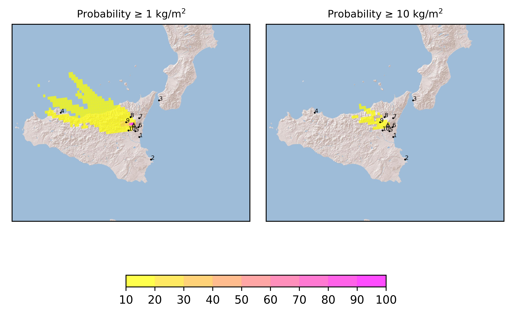

Forecast from VONA bulletin - 20210223_0446Z
============================================

Contents
========

* [Forecast products](#forecast-products)
	* [Forecast at 2021-02-23 07:50 Z](#forecast-at-2021-02-23-0750-z)
	* [Forecast at 2021-02-23 10:50 Z](#forecast-at-2021-02-23-1050-z)
	* [Forecast at 2021-02-23 13:50 Z](#forecast-at-2021-02-23-1350-z)
	* [Forecast at 2021-02-23 16:50 Z](#forecast-at-2021-02-23-1650-z)

# Forecast products

## Forecast at 2021-02-23 07:50 Z
  

|Eruption start [Z]|Eruption end [Z]|Forecast time [Z]|Column height distribution asl [m]|
| :--- | :--- | :--- | :--- |
|2021-02-23 04:50:00|Ongoing|2021-02-23 07:50:00|Uniform [5000 m, 10000 m]|
  
  

|Percentile|MER [kg/s¹]|Mass in the air [kg]|Mass on the ground [kg]|
| :--- | :--- | :--- | :--- |
|5th|1.15e+04|5.23e+07|6.71e+07|
|50th|4.10e+04|1.92e+08|2.08e+08|
|95th|1.15e+06|5.42e+09|4.46e+09|
  

### Ground 2021-02-23 07:50 Z
  
  
  
  
  
  
  
  
  
  
  

|Location|Ground load [kg/m²] 5th perc|Ground load [kg/m²] 50th perc|Ground load [kg/m²] 95th perc|
| :--- | :--- | :--- | :--- |
|Catania AP (1)|0.00e+00|0.00e+00|0.00e+00|
|Siracusa (2)|0.00e+00|0.00e+00|0.00e+00|
|Reggio Calabria AP (3)|0.00e+00|0.00e+00|0.00e+00|
|Palermo AP (4)|0.00e+00|0.00e+00|5.56e-05|
|Nicolosi (5)|0.00e+00|0.00e+00|7.07e-05|
|Zafferana (6)|0.00e+00|0.00e+00|7.91e-07|
|Linguaglossa (7)|0.00e+00|0.00e+00|3.27e-07|
|Randazzo (8)|0.00e+00|1.21e-05|2.54e-02|
|Bronte (9)|1.35e-05|1.06e-01|5.28e+00|
|Biancavilla (10)|4.61e-09|4.54e-03|1.65e-01|
  

### Atmosphere 2021-02-23 07:50 Z
  

## Forecast at 2021-02-23 10:50 Z
  

|Eruption start [Z]|Eruption end [Z]|Forecast time [Z]|Column height distribution asl [m]|
| :--- | :--- | :--- | :--- |
|2021-02-23 04:50:00|Ongoing|2021-02-23 10:50:00|Uniform [5000 m, 10000 m]|
  
  

|Percentile|MER [kg/s¹]|Mass in the air [kg]|Mass on the ground [kg]|
| :--- | :--- | :--- | :--- |
|5th|1.21e+04|1.40e+08|3.02e+08|
|50th|4.85e+04|3.97e+08|5.56e+08|
|95th|5.25e+05|3.26e+09|8.17e+09|
  

### Ground 2021-02-23 10:50 Z
  
  
  
  
  
  
  
  
  
  
  

|Location|Ground load [kg/m²] 5th perc|Ground load [kg/m²] 50th perc|Ground load [kg/m²] 95th perc|
| :--- | :--- | :--- | :--- |
|Catania AP (1)|0.00e+00|0.00e+00|0.00e+00|
|Siracusa (2)|0.00e+00|0.00e+00|0.00e+00|
|Reggio Calabria AP (3)|0.00e+00|0.00e+00|0.00e+00|
|Palermo AP (4)|0.00e+00|0.00e+00|2.83e-02|
|Nicolosi (5)|0.00e+00|1.56e-07|2.88e-03|
|Zafferana (6)|0.00e+00|0.00e+00|1.06e-05|
|Linguaglossa (7)|0.00e+00|0.00e+00|4.05e-07|
|Randazzo (8)|9.55e-10|8.33e-05|2.97e-02|
|Bronte (9)|4.10e-02|2.74e-01|6.18e+00|
|Biancavilla (10)|1.70e-04|7.88e-02|1.75e+00|
  

### Atmosphere 2021-02-23 10:50 Z
  

## Forecast at 2021-02-23 13:50 Z
  

|Eruption start [Z]|Eruption end [Z]|Forecast time [Z]|Column height distribution asl [m]|
| :--- | :--- | :--- | :--- |
|2021-02-23 04:50:00|Ongoing|2021-02-23 13:50:00|Uniform [5000 m, 10000 m]|
  
  

|Percentile|MER [kg/s¹]|Mass in the air [kg]|Mass on the ground [kg]|
| :--- | :--- | :--- | :--- |
|5th|1.26e+04|1.98e+08|5.98e+08|
|50th|4.76e+04|8.42e+08|1.49e+09|
|95th|5.17e+05|2.58e+09|9.89e+09|
  

### Ground 2021-02-23 13:50 Z
  
  
  
  
  
  
  
  
  
  
  

|Location|Ground load [kg/m²] 5th perc|Ground load [kg/m²] 50th perc|Ground load [kg/m²] 95th perc|
| :--- | :--- | :--- | :--- |
|Catania AP (1)|0.00e+00|0.00e+00|0.00e+00|
|Siracusa (2)|0.00e+00|0.00e+00|0.00e+00|
|Reggio Calabria AP (3)|0.00e+00|0.00e+00|0.00e+00|
|Palermo AP (4)|0.00e+00|7.20e-05|8.10e-02|
|Nicolosi (5)|1.59e-09|1.15e-05|5.85e-03|
|Zafferana (6)|0.00e+00|0.00e+00|1.67e-05|
|Linguaglossa (7)|0.00e+00|0.00e+00|1.64e-06|
|Randazzo (8)|1.03e-08|1.21e-04|3.00e-02|
|Bronte (9)|4.25e-02|4.97e-01|7.07e+00|
|Biancavilla (10)|2.28e-02|2.50e-01|2.84e+00|
  

### Atmosphere 2021-02-23 13:50 Z
  

## Forecast at 2021-02-23 16:50 Z
  

|Eruption start [Z]|Eruption end [Z]|Forecast time [Z]|Column height distribution asl [m]|
| :--- | :--- | :--- | :--- |
|2021-02-23 04:50:00|Ongoing|2021-02-23 16:50:00|Uniform [5000 m, 10000 m]|
  
  

|Percentile|MER [kg/s¹]|Mass in the air [kg]|Mass on the ground [kg]|
| :--- | :--- | :--- | :--- |
|5th|1.31e+04|1.84e+08|8.99e+08|
|50th|6.80e+04|7.73e+08|2.51e+09|
|95th|4.95e+05|4.05e+09|1.19e+10|
  

### Ground 2021-02-23 16:50 Z
  
  
  
  
  
  
  
  
  
  
  

|Location|Ground load [kg/m²] 5th perc|Ground load [kg/m²] 50th perc|Ground load [kg/m²] 95th perc|
| :--- | :--- | :--- | :--- |
|Catania AP (1)|0.00e+00|0.00e+00|0.00e+00|
|Siracusa (2)|0.00e+00|0.00e+00|0.00e+00|
|Reggio Calabria AP (3)|0.00e+00|0.00e+00|0.00e+00|
|Palermo AP (4)|5.56e-06|4.38e-03|1.03e-01|
|Nicolosi (5)|1.58e-08|6.02e-05|1.76e-02|
|Zafferana (6)|0.00e+00|4.20e-09|7.85e-05|
|Linguaglossa (7)|0.00e+00|2.50e-10|2.07e-06|
|Randazzo (8)|1.89e-07|1.34e-04|3.00e-02|
|Bronte (9)|5.74e-02|7.78e-01|7.81e+00|
|Biancavilla (10)|5.84e-02|5.83e-01|7.86e+00|
  

### Atmosphere 2021-02-23 16:50 Z
  
  
Go to [Supplementary page](Supplementary_page.md)  
Go to [Main directory](https://github.com/federicapardini/Real_time_ash_forecast)
