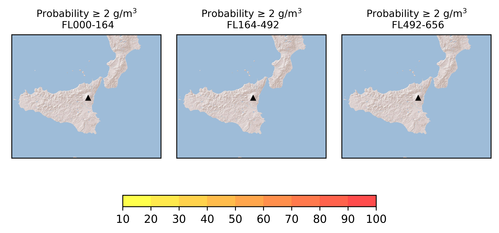
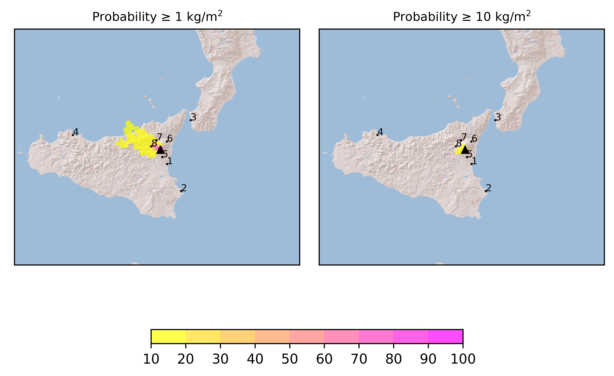

Forecast from VONA bulletin - 20210224_1821Z
============================================

Contents
========

* [Input data](#input-data)
	* [Meteorological data](#meteorological-data)
	* [Volcanological data](#volcanological-data)
	* [Computational domain](#computational-domain)
	* [HYSPLIT setting](#hysplit-setting)
* [Ensemble definition](#ensemble-definition)
* [Forecast products](#forecast-products)
	* [Forecast at 2021-02-24 21:20 Z](#forecast-at-2021-02-24-2120-z)
	* [Forecast at 2021-02-25 00:20 Z](#forecast-at-2021-02-25-0020-z)
	* [Forecast at 2021-02-25 03:20 Z](#forecast-at-2021-02-25-0320-z)
	* [VONA bulletins](#vona-bulletins)

# Input data

## Meteorological data
  

|Parameters|Values|
| :--- | :--- |
|Data source|ARPA-SIM Mesoscale Model|
|Data type|Forecast|
|Temporal resolution|3 h|
|Grid resolution|0.05°|

## Volcanological data
  

|Parameters|Values|
| :--- | :--- |
|Volcano|Mt. Etna|
|Vent height|3300 m|
|Vent lat|37.73°|
|Vent lon|15.00°|
|Total Grain Size Distribution|Lognormal|
|Mixture temperature|[1300] K|
|Water vapour content|[0.03]|
|Particle density|[900]|
|Particle sphericity|[0.5]|
|Particle specific heat|[1100] J/KgK|

## Computational domain
  

|Parameters|Values|
| :--- | :--- |
|Grid center lat|37.73°|
|Grid center lon|15.0°|
|Grid extension lat|3.0°|
|Grid extension lon|6.0°|
|Grid resolution lat|0.05°|
|Grid resolution lon|0.05°|
|Atmospheric levels|0 5000 15000 20000 m|

## HYSPLIT setting
  

|Parameters|Values|
| :--- | :--- |
|Pollutant type|Puff|
|Integration time step|10 min|
|Output resolution|10 min|

# Ensemble definition
  

|Parameters|Values|
| :--- | :--- |
|Number of perturbed meteo data|10|
|Perturbation on horizontal wind direction |Gaussian 0 ± 15°|
|Perturbation on horizontal wind intensity|Gaussian 1 ± 0.5m/s|
|Number of eruptive scenarios|1|
|Number of perturbed ESP per scenario|10|
|Column height|Uniform [5000 m, 10000 m]|
|Total Grain Size Distribution|Gaussian μ = 2.3 ± 0.5 φ,  σ = 1.5 ± 0.5 φ|
|Number of ensemble members per scenario|100|

# Forecast products
  

|Parameters|Values|
| :--- | :--- |
|Ground hazard maps|Probability in % that the deposit load exceeds 1 kg/m² and 10 kg/m²|
|Ground load at strategic locations|Probability density histograms of ground load in kg/m² at a number of locations. 95th percentile is also reported|
|Atmospheric hazard maps|Probability in % that the ash concentration between differnt FL exceeds 2 g/m³|

## Forecast at 2021-02-24 21:20 Z
  

|Eruption start [Z]|Eruption end [Z]|Forecast time [Z]|Column height distribution asl [m]|MER [kg/s¹] 95th perc|Mass in the air [kg] 95th perc|Mass on the ground [kg] 95th perc|
| :--- | :--- | :--- | :--- | :--- | :--- | :--- |
|2021-02-24 18:20:00|Ongoing|2021-02-24 21:20:00|Uniform [5000 m, 10000 m]|None|1.76e+09|1.32e+09|
  

### Ground 2021-02-24 21:20 Z
  
  
  
  
  
  
  
  
  

|Location|Ground load [kg/m²] 5th perc|Ground load [kg/m²] 50th perc|Ground load [kg/m²] 95th perc|
| :--- | :--- | :--- | :--- |
|Catania AP (1)|0.00e+00|0.00e+00|0.00e+00|
|Siracusa (2)|0.00e+00|0.00e+00|0.00e+00|
|Reggio Calabria AP (3)|0.00e+00|0.00e+00|0.00e+00|
|Palermo AP (4)|0.00e+00|0.00e+00|0.00e+00|
|Nicolosi (5)|0.00e+00|1.24e-06|2.43e-04|
|Linguaglossa (6)|0.00e+00|1.55e-09|8.30e-06|
|Randazzo (7)|8.00e-10|1.93e-04|1.04e-01|
|Bronte (8)|7.24e-03|2.52e-01|1.62e+00|
  

### Atmosphere 2021-02-24 21:20 Z
  

## Forecast at 2021-02-25 00:20 Z
  

|Eruption start [Z]|Eruption end [Z]|Forecast time [Z]|Column height distribution asl [m]|MER [kg/s¹] 95th perc|Mass in the air [kg] 95th perc|Mass on the ground [kg] 95th perc|
| :--- | :--- | :--- | :--- | :--- | :--- | :--- |
|2021-02-24 18:20:00|Ongoing|2021-02-25 00:20:00|Uniform [5000 m, 10000 m]|None|1.30e+09|2.41e+09|
  

### Ground 2021-02-25 00:20 Z
  
  
  
  
  
  
  
  
  

|Location|Ground load [kg/m²] 5th perc|Ground load [kg/m²] 50th perc|Ground load [kg/m²] 95th perc|
| :--- | :--- | :--- | :--- |
|Catania AP (1)|0.00e+00|0.00e+00|0.00e+00|
|Siracusa (2)|0.00e+00|0.00e+00|0.00e+00|
|Reggio Calabria AP (3)|0.00e+00|0.00e+00|0.00e+00|
|Palermo AP (4)|0.00e+00|0.00e+00|0.00e+00|
|Nicolosi (5)|9.50e-11|1.41e-05|7.52e-04|
|Linguaglossa (6)|0.00e+00|6.64e-07|1.54e-05|
|Randazzo (7)|5.23e-05|1.94e-03|2.68e-01|
|Bronte (8)|1.21e-01|8.20e-01|3.80e+00|
  

### Atmosphere 2021-02-25 00:20 Z
  

## Forecast at 2021-02-25 03:20 Z
  

|Eruption start [Z]|Eruption end [Z]|Forecast time [Z]|Column height distribution asl [m]|MER [kg/s¹] 95th perc|Mass in the air [kg] 95th perc|Mass on the ground [kg] 95th perc|
| :--- | :--- | :--- | :--- | :--- | :--- | :--- |
|2021-02-24 18:20:00|Ongoing|2021-02-25 03:20:00|Uniform [5000 m, 10000 m]|None|1.18e+09|3.20e+09|
  

### Ground 2021-02-25 03:20 Z
  
  
  
  
  
  
  
  
  

|Location|Ground load [kg/m²] 5th perc|Ground load [kg/m²] 50th perc|Ground load [kg/m²] 95th perc|
| :--- | :--- | :--- | :--- |
|Catania AP (1)|0.00e+00|0.00e+00|0.00e+00|
|Siracusa (2)|0.00e+00|0.00e+00|0.00e+00|
|Reggio Calabria AP (3)|0.00e+00|0.00e+00|0.00e+00|
|Palermo AP (4)|0.00e+00|0.00e+00|1.30e-09|
|Nicolosi (5)|1.17e-06|1.16e-04|5.07e-03|
|Linguaglossa (6)|2.14e-09|2.04e-06|2.20e-05|
|Randazzo (7)|1.87e-04|6.22e-03|3.79e-01|
|Bronte (8)|3.92e-01|1.50e+00|5.31e+00|
  

### Atmosphere 2021-02-25 03:20 Z
  

## VONA bulletins
  

|VONA issued|Color|Column height|Column height uncertainty|
| :--- | :--- | :--- | :--- |
|20210224_1821Z|RED|None|None|
