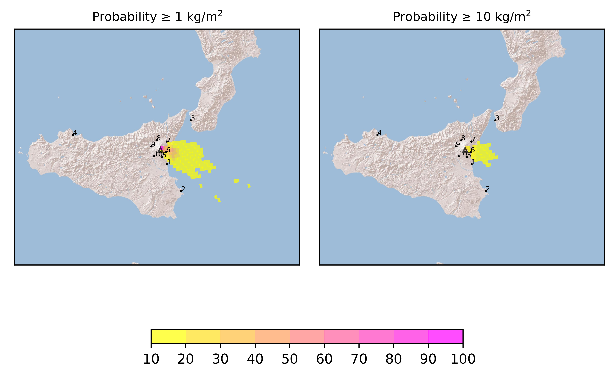
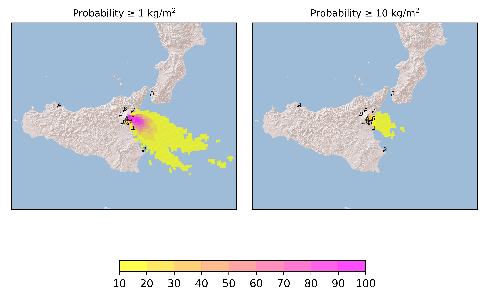

Forecast from VONA bulletin - 20210228_0835Z
============================================

Contents
========

* [Forecast products](#forecast-products)
	* [Forecast at 2021-02-28 11:40 Z](#forecast-at-2021-02-28-1140-z)
	* [Forecast at 2021-02-28 14:40 Z](#forecast-at-2021-02-28-1440-z)
	* [Forecast at 2021-02-28 17:40 Z](#forecast-at-2021-02-28-1740-z)
	* [Forecast at 2021-02-28 20:40 Z](#forecast-at-2021-02-28-2040-z)

# Forecast products

## Forecast at 2021-02-28 11:40 Z
  

|Eruption start [Z]|Eruption end [Z]|Forecast time [Z]|Column height distribution asl [m]|
| :--- | :--- | :--- | :--- |
|2021-02-28 08:40:00|Ongoing|2021-02-28 11:40:00|9 ± 1 km asl (from VONA)|
  
  

|Percentile|MER [kg/s¹]|Mass in the air [kg]|Mass on the ground [kg]|
| :--- | :--- | :--- | :--- |
|5th|2.98e+04|1.63e+08|1.40e+08|
|50th|1.99e+05|1.07e+09|9.40e+08|
|95th|1.57e+06|1.00e+10|5.70e+09|
  

### Ground 2021-02-28 11:40 Z
  
  
  
  
  
  
  
  
  
  
  

|Location|Ground load [kg/m²] 5th perc|Ground load [kg/m²] 50th perc|Ground load [kg/m²] 95th perc|
| :--- | :--- | :--- | :--- |
|Catania AP (1)|0.00e+00|1.54e-05|3.84e-01|
|Siracusa (2)|0.00e+00|0.00e+00|1.03e-07|
|Reggio Calabria AP (3)|0.00e+00|0.00e+00|0.00e+00|
|Palermo AP (4)|0.00e+00|0.00e+00|0.00e+00|
|Nicolosi (5)|5.80e-06|1.48e-02|5.43e-01|
|Zafferana (6)|7.33e-02|7.91e-01|6.92e+00|
|Linguaglossa (7)|0.00e+00|1.86e-05|7.87e-03|
|Randazzo (8)|0.00e+00|0.00e+00|2.11e-08|
|Bronte (9)|0.00e+00|0.00e+00|3.14e-08|
|Biancavilla (10)|0.00e+00|7.91e-07|1.37e-03|
  

### Atmosphere 2021-02-28 11:40 Z
  

## Forecast at 2021-02-28 14:40 Z
  

|Eruption start [Z]|Eruption end [Z]|Forecast time [Z]|Column height distribution asl [m]|
| :--- | :--- | :--- | :--- |
|2021-02-28 08:40:00|Ongoing|2021-02-28 14:40:00|9 ± 1 km asl (from VONA)|
  
  

|Percentile|MER [kg/s¹]|Mass in the air [kg]|Mass on the ground [kg]|
| :--- | :--- | :--- | :--- |
|5th|4.88e+04|5.26e+08|6.19e+08|
|50th|2.02e+05|1.91e+09|3.16e+09|
|95th|1.30e+06|7.37e+09|1.36e+10|
  

### Ground 2021-02-28 14:40 Z
  
  
  
  
  
  
  
  
  
  
  

|Location|Ground load [kg/m²] 5th perc|Ground load [kg/m²] 50th perc|Ground load [kg/m²] 95th perc|
| :--- | :--- | :--- | :--- |
|Catania AP (1)|1.61e-04|1.81e-02|8.15e-01|
|Siracusa (2)|0.00e+00|1.95e-05|1.91e-02|
|Reggio Calabria AP (3)|0.00e+00|0.00e+00|0.00e+00|
|Palermo AP (4)|0.00e+00|0.00e+00|0.00e+00|
|Nicolosi (5)|1.87e-02|1.19e-01|1.15e+00|
|Zafferana (6)|4.07e-01|2.16e+00|1.25e+01|
|Linguaglossa (7)|1.24e-08|2.63e-04|2.43e-02|
|Randazzo (8)|0.00e+00|0.00e+00|1.58e-04|
|Bronte (9)|0.00e+00|3.41e-08|4.43e-04|
|Biancavilla (10)|2.85e-10|2.12e-03|2.35e-02|
  

### Atmosphere 2021-02-28 14:40 Z
  

## Forecast at 2021-02-28 17:40 Z
  

|Eruption start [Z]|Eruption end [Z]|Forecast time [Z]|Column height distribution asl [m]|
| :--- | :--- | :--- | :--- |
|2021-02-28 08:40:00|Ongoing|2021-02-28 17:40:00|9 ± 1 km asl (from VONA)|
  
  

|Percentile|MER [kg/s¹]|Mass in the air [kg]|Mass on the ground [kg]|
| :--- | :--- | :--- | :--- |
|5th|3.72e+04|5.09e+08|1.80e+09|
|50th|2.29e+05|2.90e+09|6.48e+09|
|95th|1.37e+06|7.00e+09|1.88e+10|
  

### Ground 2021-02-28 17:40 Z
  
  
  
  
  
  
  
  
  
  
  

|Location|Ground load [kg/m²] 5th perc|Ground load [kg/m²] 50th perc|Ground load [kg/m²] 95th perc|
| :--- | :--- | :--- | :--- |
|Catania AP (1)|8.60e-03|3.16e-01|1.80e+00|
|Siracusa (2)|1.75e-04|7.80e-03|3.53e-01|
|Reggio Calabria AP (3)|0.00e+00|0.00e+00|0.00e+00|
|Palermo AP (4)|0.00e+00|0.00e+00|0.00e+00|
|Nicolosi (5)|1.19e-01|5.99e-01|2.04e+00|
|Zafferana (6)|8.75e-01|4.22e+00|1.46e+01|
|Linguaglossa (7)|3.01e-06|7.05e-04|2.45e-02|
|Randazzo (8)|0.00e+00|1.43e-08|2.45e-04|
|Bronte (9)|3.95e-10|1.73e-04|5.74e-03|
|Biancavilla (10)|2.68e-03|2.41e-02|1.02e-01|
  

### Atmosphere 2021-02-28 17:40 Z
  

## Forecast at 2021-02-28 20:40 Z
  

|Eruption start [Z]|Eruption end [Z]|Forecast time [Z]|Column height distribution asl [m]|
| :--- | :--- | :--- | :--- |
|2021-02-28 08:40:00|Ongoing|2021-02-28 20:40:00|9 ± 1 km asl (from VONA)|
  
  

|Percentile|MER [kg/s¹]|Mass in the air [kg]|Mass on the ground [kg]|
| :--- | :--- | :--- | :--- |
|5th|5.47e+04|8.06e+08|2.46e+09|
|50th|2.26e+05|2.24e+09|1.05e+10|
|95th|1.27e+06|1.02e+10|2.43e+10|
  

### Ground 2021-02-28 20:40 Z
  
  
  
  
  
  
  
  
  
  
  

|Location|Ground load [kg/m²] 5th perc|Ground load [kg/m²] 50th perc|Ground load [kg/m²] 95th perc|
| :--- | :--- | :--- | :--- |
|Catania AP (1)|1.79e-01|1.16e+00|3.77e+00|
|Siracusa (2)|5.33e-03|6.57e-02|6.50e-01|
|Reggio Calabria AP (3)|0.00e+00|0.00e+00|1.00e-10|
|Palermo AP (4)|0.00e+00|0.00e+00|1.61e-08|
|Nicolosi (5)|4.74e-01|1.11e+00|3.40e+00|
|Zafferana (6)|1.19e+00|5.49e+00|1.60e+01|
|Linguaglossa (7)|3.35e-06|8.78e-04|2.45e-02|
|Randazzo (8)|0.00e+00|1.39e-07|2.71e-04|
|Bronte (9)|5.95e-10|4.34e-04|6.89e-03|
|Biancavilla (10)|3.02e-03|4.11e-02|1.77e-01|
  

### Atmosphere 2021-02-28 20:40 Z
  
  
Go to [Supplementary page](Supplementary_page.md)  
Go to [Main directory](https://github.com/federicapardini/Real_time_ash_forecast)
