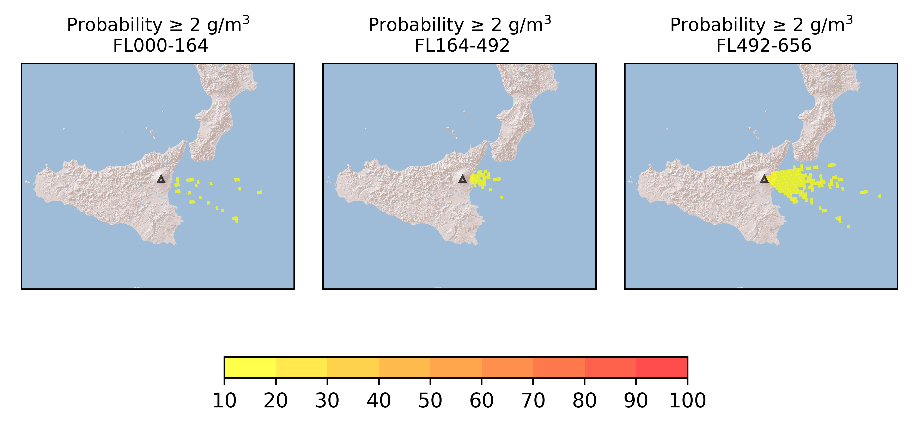

Forecast from VONA bulletin - 20210228_1047Z
============================================

Contents
========

* [Forecast products](#forecast-products)
	* [Forecast at 2021-02-28 13:50 Z](#forecast-at-2021-02-28-1350-z)

# Forecast products

## Forecast at 2021-02-28 13:50 Z
  

|Eruption start [Z]|Eruption end [Z]|Forecast time [Z]|Column height distribution asl [m]|
| :--- | :--- | :--- | :--- |
|2021-02-28 10:50:00|Ongoing|2021-02-28 13:50:00|Uniform [6000 m, 12000 m]|
  
  

|Percentile|MER [kg/s¹]|Mass in the air [kg]|Mass on the ground [kg]|
| :--- | :--- | :--- | :--- |
|5th|1.56e+04|8.91e+07|7.41e+07|
|50th|2.13e+05|1.04e+09|1.06e+09|
|95th|4.05e+06|2.66e+10|1.37e+10|
  

### Ground 2021-02-28 13:50 Z
  
  
  
  
  
  
  
  
  
  
  

|Location|Ground load [kg/m²] 5th perc|Ground load [kg/m²] 50th perc|Ground load [kg/m²] 95th perc|
| :--- | :--- | :--- | :--- |
|Catania AP (1)|0.00e+00|1.37e-04|4.25e-01|
|Siracusa (2)|0.00e+00|0.00e+00|2.20e-06|
|Reggio Calabria AP (3)|0.00e+00|0.00e+00|0.00e+00|
|Palermo AP (4)|0.00e+00|0.00e+00|0.00e+00|
|Nicolosi (5)|6.15e-06|1.59e-02|6.43e-01|
|Zafferana (6)|3.43e-02|8.40e-01|1.18e+01|
|Linguaglossa (7)|0.00e+00|1.41e-05|1.25e-02|
|Randazzo (8)|0.00e+00|0.00e+00|3.63e-09|
|Bronte (9)|0.00e+00|0.00e+00|5.51e-08|
|Biancavilla (10)|0.00e+00|1.12e-07|3.51e-03|
  

### Atmosphere 2021-02-28 13:50 Z
  
  
Go to [Supplementary page](Supplementary_page.md)  
Go to [Main directory](https://github.com/federicapardini/Real_time_ash_forecast)