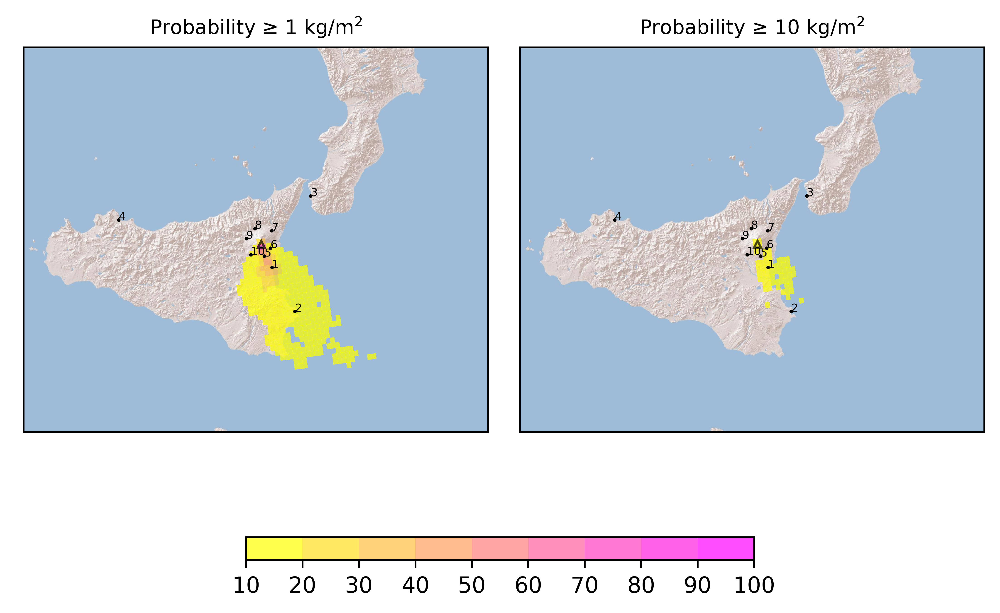
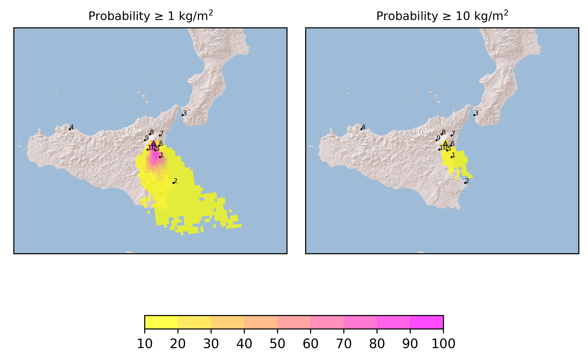

Forecast from VONA bulletin - 20210302_1317Z
============================================

Contents
========

* [Forecast products](#forecast-products)
	* [Forecast at 2021-03-02 16:20 Z](#forecast-at-2021-03-02-1620-z)
	* [Forecast at 2021-03-02 19:20 Z](#forecast-at-2021-03-02-1920-z)

# Forecast products

## Forecast at 2021-03-02 16:20 Z
  

|Eruption start [Z]|Eruption end [Z]|Forecast time [Z]|Column height distribution asl [m]|
| :--- | :--- | :--- | :--- |
|2021-03-02 13:20:00|Ongoing|2021-03-02 16:20:00|Gaussian from VONA|
  
  

|Percentile|MER [kg/s¹]|Mass in the air [kg]|Mass on the ground [kg]|
| :--- | :--- | :--- | :--- |
|5th|8.19e+04|3.96e+08|4.72e+08|
|50th|2.87e+05|1.49e+09|1.55e+09|
|95th|2.09e+06|1.21e+10|8.56e+09|
  

### Ground 2021-03-02 16:20 Z
  
  
  
  
  
  
  
  
  
  
  

|Location|Ground load [kg/m²] 5th perc|Ground load [kg/m²] 50th perc|Ground load [kg/m²] 95th perc|
| :--- | :--- | :--- | :--- |
|Catania AP (1)|1.18e-02|4.28e-01|4.64e+00|
|Siracusa (2)|0.00e+00|5.00e-11|1.36e+00|
|Reggio Calabria AP (3)|0.00e+00|0.00e+00|0.00e+00|
|Palermo AP (4)|0.00e+00|0.00e+00|0.00e+00|
|Nicolosi (5)|1.86e-02|7.33e-01|4.27e+00|
|Zafferana (6)|1.64e-07|1.79e-03|3.40e-01|
|Linguaglossa (7)|0.00e+00|0.00e+00|1.05e-10|
|Randazzo (8)|0.00e+00|0.00e+00|5.00e-12|
|Bronte (9)|0.00e+00|4.40e-09|1.29e-05|
|Biancavilla (10)|1.26e-03|7.99e-02|9.64e-01|
  

### Atmosphere 2021-03-02 16:20 Z
  

## Forecast at 2021-03-02 19:20 Z
  

|Eruption start [Z]|Eruption end [Z]|Forecast time [Z]|Column height distribution asl [m]|
| :--- | :--- | :--- | :--- |
|2021-03-02 13:20:00|Ongoing|2021-03-02 19:20:00|Gaussian from VONA|
  
  

|Percentile|MER [kg/s¹]|Mass in the air [kg]|Mass on the ground [kg]|
| :--- | :--- | :--- | :--- |
|5th|5.82e+04|5.90e+08|1.73e+09|
|50th|2.20e+05|1.66e+09|3.78e+09|
|95th|1.18e+06|6.46e+09|1.53e+10|
  

### Ground 2021-03-02 19:20 Z
  
  
  
  
  
  
  
  
  
  
  

|Location|Ground load [kg/m²] 5th perc|Ground load [kg/m²] 50th perc|Ground load [kg/m²] 95th perc|
| :--- | :--- | :--- | :--- |
|Catania AP (1)|1.23e-01|1.32e+00|1.06e+01|
|Siracusa (2)|0.00e+00|1.25e-03|2.21e+00|
|Reggio Calabria AP (3)|0.00e+00|0.00e+00|0.00e+00|
|Palermo AP (4)|0.00e+00|0.00e+00|0.00e+00|
|Nicolosi (5)|3.70e-01|1.60e+00|9.00e+00|
|Zafferana (6)|4.76e-04|1.92e-02|9.33e-01|
|Linguaglossa (7)|0.00e+00|0.00e+00|2.65e-07|
|Randazzo (8)|0.00e+00|0.00e+00|2.00e-10|
|Bronte (9)|9.50e-11|8.80e-08|1.89e-05|
|Biancavilla (10)|2.23e-01|6.61e-01|2.30e+00|
  

### Atmosphere 2021-03-02 19:20 Z
  
  
Go to [Supplementary page](Supplementary_page.md)  
Go to [Main directory](https://github.com/federicapardini/Real_time_ash_forecast)