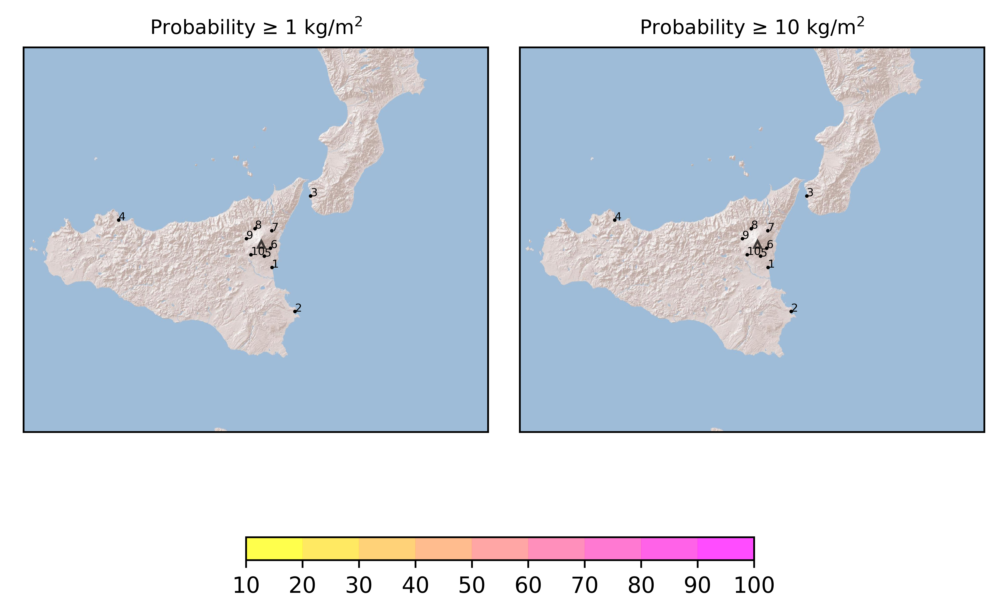

Forecast from VONA bulletin - 20210303_1702Z
============================================

Contents
========

* [Forecast products](#forecast-products)
	* [Forecast at 2021-03-03 20:00 Z](#forecast-at-2021-03-03-2000-z)

# Forecast products

## Forecast at 2021-03-03 20:00 Z
  

|Eruption start [Z]|Eruption end [Z]|Forecast time [Z]|Column height distribution asl [m]|
| :--- | :--- | :--- | :--- |
|2021-03-03 17:00:00|Ongoing|2021-03-03 20:00:00|Gaussian from VONA|
  
  

|Percentile|MER [kg/s¹]|Mass in the air [kg]|Mass on the ground [kg]|
| :--- | :--- | :--- | :--- |
|5th|9.43e+02|6.98e+06|6.55e+06|
|50th|3.75e+03|1.40e+07|2.66e+07|
|95th|8.20e+03|3.08e+07|5.27e+07|
  

### Ground 2021-03-03 20:00 Z
  
  
  
  
  
  
  
  
  
  
  

|Location|Ground load [kg/m²] 5th perc|Ground load [kg/m²] 50th perc|Ground load [kg/m²] 95th perc|
| :--- | :--- | :--- | :--- |
|Catania AP (1)|0.00e+00|0.00e+00|0.00e+00|
|Siracusa (2)|0.00e+00|0.00e+00|0.00e+00|
|Reggio Calabria AP (3)|0.00e+00|0.00e+00|0.00e+00|
|Palermo AP (4)|0.00e+00|0.00e+00|0.00e+00|
|Nicolosi (5)|9.29e-06|1.28e-04|1.87e-04|
|Zafferana (6)|6.34e-05|1.03e-03|2.53e-03|
|Linguaglossa (7)|2.08e-06|2.67e-05|8.30e-04|
|Randazzo (8)|2.11e-06|5.71e-05|1.19e-03|
|Bronte (9)|7.17e-06|5.32e-05|2.22e-04|
|Biancavilla (10)|1.68e-05|4.12e-05|5.34e-05|
  

### Atmosphere 2021-03-03 20:00 Z
  
  
Go to [Supplementary page](Supplementary_page.md)  
Go to [Main directory](https://github.com/federicapardini/Real_time_ash_forecast)