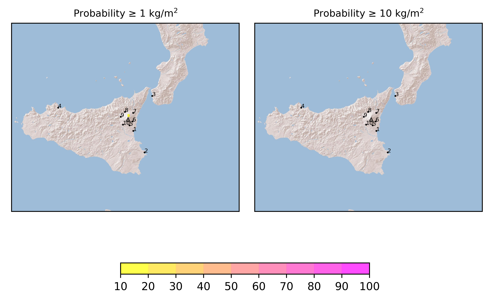

Forecast from VONA bulletin - 20210304_0228Z
============================================

Contents
========

* [Forecast products](#forecast-products)
	* [Forecast at 2021-03-04 05:30 Z](#forecast-at-2021-03-04-0530-z)

# Forecast products

## Forecast at 2021-03-04 05:30 Z
  

|Eruption start [Z]|Eruption end [Z]|Forecast time [Z]|Column height asl [m]|
| :--- | :--- | :--- | :--- |
|2021-03-04 02:30:00|Ongoing|2021-03-04 05:30:00|5000 ± 1000 - from VONA|
  
  

|Percentile|MER [kg/s¹]|Mass in the air [kg]|Mass on the ground [kg]|
| :--- | :--- | :--- | :--- |
|5th|1.06e+02|6.88e+05|7.22e+05|
|50th|3.10e+03|1.07e+07|2.28e+07|
|95th|8.67e+03|2.86e+07|5.51e+07|
  

### Ground 2021-03-04 05:30 Z
  
  
  
  
  
  
  
  
  
  
  

|Location|Ground load [kg/m²] 5th perc|Ground load [kg/m²] 50th perc|Ground load [kg/m²] 95th perc|
| :--- | :--- | :--- | :--- |
|Catania AP (1)|0.00e+00|0.00e+00|0.00e+00|
|Siracusa (2)|0.00e+00|0.00e+00|0.00e+00|
|Reggio Calabria AP (3)|0.00e+00|0.00e+00|0.00e+00|
|Palermo AP (4)|0.00e+00|0.00e+00|0.00e+00|
|Nicolosi (5)|1.77e-08|5.33e-06|2.01e-05|
|Zafferana (6)|2.10e-05|2.19e-03|7.62e-03|
|Linguaglossa (7)|3.42e-04|3.43e-03|1.31e-01|
|Randazzo (8)|1.35e-06|6.23e-06|6.14e-05|
|Bronte (9)|0.00e+00|0.00e+00|0.00e+00|
|Biancavilla (10)|2.14e-09|7.93e-08|1.58e-06|
  

### Atmosphere 2021-03-04 05:30 Z
  
  
Go to [Supplementary page](Supplementary_page.md)  
Go to [Main directory](https://github.com/federicapardini/Real_time_ash_forecast)