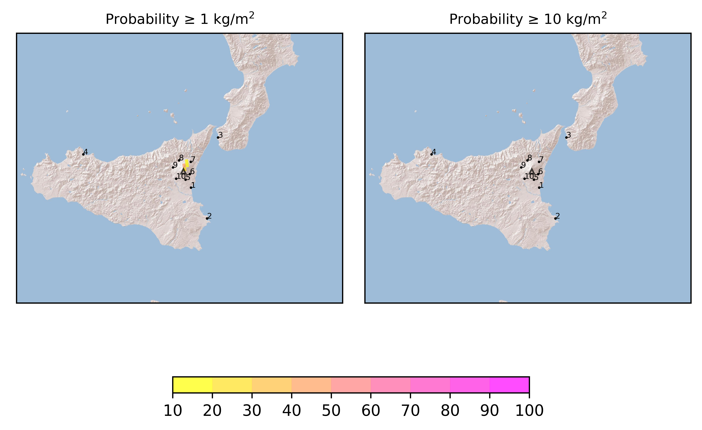

Forecast from VONA bulletin - 20210304_0616Z
============================================

Contents
========

* [Forecast products](#forecast-products)
	* [Forecast at 2021-03-04 09:20 Z](#forecast-at-2021-03-04-0920-z)
	* [Forecast at 2021-03-04 12:20 Z](#forecast-at-2021-03-04-1220-z)
	* [Forecast at 2021-03-04 15:20 Z](#forecast-at-2021-03-04-1520-z)
	* [Forecast at 2021-03-04 18:20 Z](#forecast-at-2021-03-04-1820-z)

# Forecast products

## Forecast at 2021-03-04 09:20 Z
  

|Eruption start [Z]|Eruption end [Z]|Forecast time [Z]|Column height asl [m]|
| :--- | :--- | :--- | :--- |
|2021-03-04 06:20:00|Ongoing|2021-03-04 09:20:00|5000 ± 1000 - from VONA|
  
  

|Percentile|MER [kg/s¹]|Mass in the air [kg]|Mass on the ground [kg]|
| :--- | :--- | :--- | :--- |
|5th|2.76e+02|9.73e+05|1.29e+06|
|50th|3.73e+03|9.09e+06|2.30e+07|
|95th|2.26e+04|1.08e+08|1.18e+08|
  

### Ground 2021-03-04 09:20 Z
  
  
  
  
  
  
  
  
  
  
  

|Location|Ground load [kg/m²] 5th perc|Ground load [kg/m²] 50th perc|Ground load [kg/m²] 95th perc|
| :--- | :--- | :--- | :--- |
|Catania AP (1)|0.00e+00|0.00e+00|0.00e+00|
|Siracusa (2)|0.00e+00|0.00e+00|0.00e+00|
|Reggio Calabria AP (3)|0.00e+00|0.00e+00|0.00e+00|
|Palermo AP (4)|0.00e+00|0.00e+00|0.00e+00|
|Nicolosi (5)|0.00e+00|2.73e-07|1.52e-05|
|Zafferana (6)|8.26e-06|3.45e-04|4.88e-03|
|Linguaglossa (7)|6.36e-05|8.60e-03|2.13e-01|
|Randazzo (8)|1.91e-07|1.70e-05|1.02e-02|
|Bronte (9)|0.00e+00|0.00e+00|1.16e-07|
|Biancavilla (10)|2.00e-10|3.99e-08|1.38e-06|
  

### Atmosphere 2021-03-04 09:20 Z
  

## Forecast at 2021-03-04 12:20 Z
  

|Eruption start [Z]|Eruption end [Z]|Forecast time [Z]|Column height asl [m]|
| :--- | :--- | :--- | :--- |
|2021-03-04 06:20:00|Ongoing|2021-03-04 12:20:00|5000 ± 1000 - from VONA|
  
  

|Percentile|MER [kg/s¹]|Mass in the air [kg]|Mass on the ground [kg]|
| :--- | :--- | :--- | :--- |
|5th|4.48e+01|2.09e+06|4.95e+06|
|50th|4.24e+03|2.69e+07|6.52e+07|
|95th|2.23e+04|9.81e+07|2.24e+08|
  

### Ground 2021-03-04 12:20 Z
  
  
  
  
  
  
  
  
  
  
  

|Location|Ground load [kg/m²] 5th perc|Ground load [kg/m²] 50th perc|Ground load [kg/m²] 95th perc|
| :--- | :--- | :--- | :--- |
|Catania AP (1)|0.00e+00|0.00e+00|0.00e+00|
|Siracusa (2)|0.00e+00|0.00e+00|0.00e+00|
|Reggio Calabria AP (3)|0.00e+00|4.00e-10|1.02e-05|
|Palermo AP (4)|0.00e+00|0.00e+00|0.00e+00|
|Nicolosi (5)|0.00e+00|7.70e-07|2.72e-05|
|Zafferana (6)|6.22e-05|1.22e-03|1.25e-02|
|Linguaglossa (7)|1.71e-03|6.02e-02|4.16e-01|
|Randazzo (8)|1.79e-05|2.09e-04|1.90e-02|
|Bronte (9)|0.00e+00|3.00e-10|4.81e-07|
|Biancavilla (10)|2.59e-09|9.19e-08|2.66e-06|
  

### Atmosphere 2021-03-04 12:20 Z
  

## Forecast at 2021-03-04 15:20 Z
  

|Eruption start [Z]|Eruption end [Z]|Forecast time [Z]|Column height asl [m]|
| :--- | :--- | :--- | :--- |
|2021-03-04 06:20:00|Ongoing|2021-03-04 15:20:00|5000 ± 1000 - from VONA|
  
  

|Percentile|MER [kg/s¹]|Mass in the air [kg]|Mass on the ground [kg]|
| :--- | :--- | :--- | :--- |
|5th|7.12e+02|1.06e+07|5.94e+07|
|50th|7.01e+03|5.10e+07|1.46e+08|
|95th|2.80e+04|1.22e+08|3.31e+08|
  

### Ground 2021-03-04 15:20 Z
  
  
  
  
  
  
  
  
  
  
  

|Location|Ground load [kg/m²] 5th perc|Ground load [kg/m²] 50th perc|Ground load [kg/m²] 95th perc|
| :--- | :--- | :--- | :--- |
|Catania AP (1)|0.00e+00|0.00e+00|0.00e+00|
|Siracusa (2)|0.00e+00|0.00e+00|0.00e+00|
|Reggio Calabria AP (3)|0.00e+00|7.22e-06|2.53e-02|
|Palermo AP (4)|0.00e+00|0.00e+00|0.00e+00|
|Nicolosi (5)|4.70e-08|2.69e-06|2.79e-05|
|Zafferana (6)|3.14e-04|2.81e-03|2.34e-02|
|Linguaglossa (7)|4.22e-02|1.80e-01|5.57e-01|
|Randazzo (8)|4.50e-05|1.53e-03|2.13e-02|
|Bronte (9)|5.95e-10|3.18e-08|6.09e-07|
|Biancavilla (10)|8.78e-09|1.59e-07|2.66e-06|
  

### Atmosphere 2021-03-04 15:20 Z
  

## Forecast at 2021-03-04 18:20 Z
  

|Eruption start [Z]|Eruption end [Z]|Forecast time [Z]|Column height asl [m]|
| :--- | :--- | :--- | :--- |
|2021-03-04 06:20:00|Ongoing|2021-03-04 18:20:00|5000 ± 1000 - from VONA|
  
  

|Percentile|MER [kg/s¹]|Mass in the air [kg]|Mass on the ground [kg]|
| :--- | :--- | :--- | :--- |
|5th|1.30e+02|7.40e+06|8.84e+07|
|50th|5.54e+03|5.15e+07|2.23e+08|
|95th|2.81e+04|1.69e+08|4.24e+08|
  

### Ground 2021-03-04 18:20 Z
  
  
  
  
  
  
  
  
  
  
  

|Location|Ground load [kg/m²] 5th perc|Ground load [kg/m²] 50th perc|Ground load [kg/m²] 95th perc|
| :--- | :--- | :--- | :--- |
|Catania AP (1)|0.00e+00|0.00e+00|0.00e+00|
|Siracusa (2)|0.00e+00|0.00e+00|0.00e+00|
|Reggio Calabria AP (3)|1.95e-10|9.87e-04|3.79e-02|
|Palermo AP (4)|0.00e+00|0.00e+00|0.00e+00|
|Nicolosi (5)|8.46e-08|3.97e-06|2.81e-05|
|Zafferana (6)|8.21e-04|4.21e-03|2.53e-02|
|Linguaglossa (7)|6.75e-02|2.75e-01|7.17e-01|
|Randazzo (8)|8.75e-05|1.64e-03|2.33e-02|
|Bronte (9)|1.17e-09|3.78e-08|6.35e-07|
|Biancavilla (10)|1.10e-08|2.33e-07|2.66e-06|
  

### Atmosphere 2021-03-04 18:20 Z
  
  
Go to [Supplementary page](Supplementary_page.md)  
Go to [Main directory](https://github.com/federicapardini/Real_time_ash_forecast)