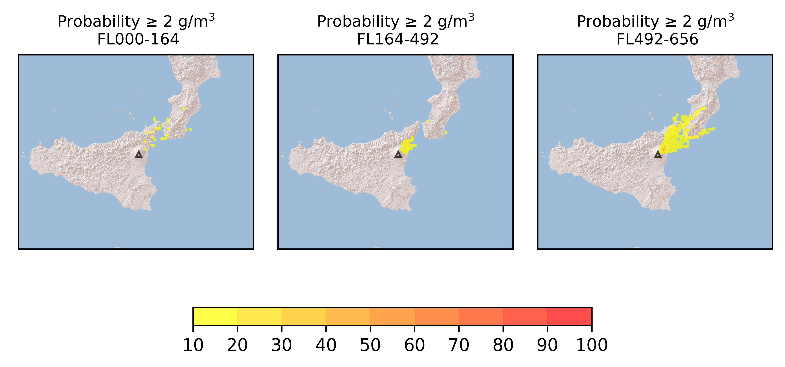
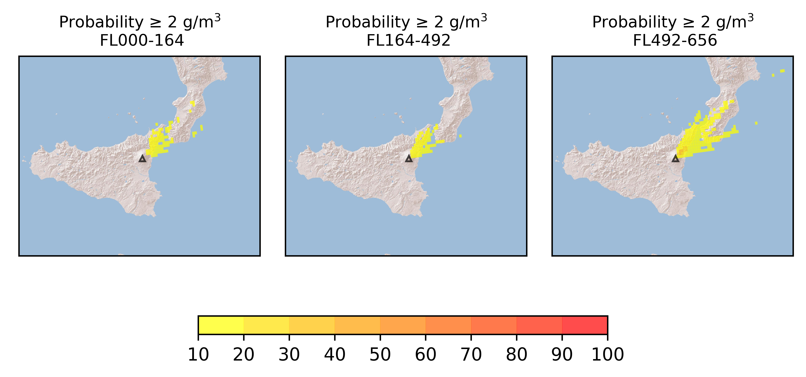

Forecast from VONA bulletin - 20210304_0751Z
============================================

Contents
========

* [Forecast products](#forecast-products)
	* [Forecast at 2021-03-04 10:50 Z](#forecast-at-2021-03-04-1050-z)
	* [Forecast at 2021-03-04 11:20 Z](#forecast-at-2021-03-04-1120-z)
	* [Forecast at 2021-03-04 14:20 Z](#forecast-at-2021-03-04-1420-z)

# Forecast products

## Forecast at 2021-03-04 10:50 Z
  

|Eruption start [Z]|Eruption end [Z]|Forecast time [Z]|Column height asl [m]|
| :--- | :--- | :--- | :--- |
|2021-03-04 07:50:00|Ongoing|2021-03-04 10:50:00|6000 ± 1000 - from VONA|
  
  

|Percentile|MER [kg/s¹]|Mass in the air [kg]|Mass on the ground [kg]|
| :--- | :--- | :--- | :--- |
|5th|7.47e+02|2.59e+06|5.68e+06|
|50th|1.07e+04|4.64e+07|6.92e+07|
|95th|4.61e+04|2.38e+08|2.33e+08|
  

### Ground 2021-03-04 10:50 Z
  
  
  
  
  
  
  
  
  
  
  

|Location|Ground load [kg/m²] 5th perc|Ground load [kg/m²] 50th perc|Ground load [kg/m²] 95th perc|
| :--- | :--- | :--- | :--- |
|Catania AP (1)|0.00e+00|0.00e+00|0.00e+00|
|Siracusa (2)|0.00e+00|0.00e+00|0.00e+00|
|Reggio Calabria AP (3)|0.00e+00|0.00e+00|0.00e+00|
|Palermo AP (4)|0.00e+00|0.00e+00|0.00e+00|
|Nicolosi (5)|0.00e+00|8.23e-08|2.52e-05|
|Zafferana (6)|3.50e-05|9.36e-04|1.36e-02|
|Linguaglossa (7)|7.42e-04|5.01e-02|4.90e-01|
|Randazzo (8)|4.40e-07|4.93e-05|1.81e-02|
|Bronte (9)|0.00e+00|0.00e+00|5.00e-12|
|Biancavilla (10)|0.00e+00|8.90e-09|1.92e-06|
  

### Atmosphere 2021-03-04 10:50 Z
  

## Forecast at 2021-03-04 11:20 Z
  

|Eruption start [Z]|Eruption end [Z]|Forecast time [Z]|Column height asl [m]|
| :--- | :--- | :--- | :--- |
|2021-03-04 07:50:00|Ongoing|2021-03-04 11:20:00|11000 ± 1000 - from VONA|
  
  

|Percentile|MER [kg/s¹]|Mass in the air [kg]|Mass on the ground [kg]|
| :--- | :--- | :--- | :--- |
|5th|1.58e+05|7.83e+08|6.80e+08|
|50th|9.14e+05|6.51e+09|2.60e+09|
|95th|3.27e+06|2.05e+10|1.52e+10|
  

### Ground 2021-03-04 11:20 Z
  
  
  
  
  
  
  
  
  
  
  

|Location|Ground load [kg/m²] 5th perc|Ground load [kg/m²] 50th perc|Ground load [kg/m²] 95th perc|
| :--- | :--- | :--- | :--- |
|Catania AP (1)|0.00e+00|0.00e+00|0.00e+00|
|Siracusa (2)|0.00e+00|0.00e+00|0.00e+00|
|Reggio Calabria AP (3)|0.00e+00|0.00e+00|6.54e-01|
|Palermo AP (4)|0.00e+00|0.00e+00|0.00e+00|
|Nicolosi (5)|0.00e+00|2.20e-06|5.50e-04|
|Zafferana (6)|3.14e-04|1.27e-02|8.81e-01|
|Linguaglossa (7)|3.90e-01|2.50e+00|2.10e+01|
|Randazzo (8)|3.73e-06|2.37e-04|2.27e-02|
|Bronte (9)|0.00e+00|0.00e+00|1.05e-10|
|Biancavilla (10)|0.00e+00|1.36e-08|4.03e-06|
  

### Atmosphere 2021-03-04 11:20 Z
  

## Forecast at 2021-03-04 14:20 Z
  

|Eruption start [Z]|Eruption end [Z]|Forecast time [Z]|Column height asl [m]|
| :--- | :--- | :--- | :--- |
|2021-03-04 07:50:00|Ongoing|2021-03-04 14:20:00|11000 ± 1000 - from VONA|
  
  

|Percentile|MER [kg/s¹]|Mass in the air [kg]|Mass on the ground [kg]|
| :--- | :--- | :--- | :--- |
|5th|1.41e+05|2.23e+09|4.05e+09|
|50th|1.05e+06|1.04e+10|1.33e+10|
|95th|3.97e+06|2.90e+10|2.96e+10|
  

### Ground 2021-03-04 14:20 Z
  
  
  
  
  
  
  
  
  
  
  

|Location|Ground load [kg/m²] 5th perc|Ground load [kg/m²] 50th perc|Ground load [kg/m²] 95th perc|
| :--- | :--- | :--- | :--- |
|Catania AP (1)|0.00e+00|0.00e+00|0.00e+00|
|Siracusa (2)|0.00e+00|0.00e+00|0.00e+00|
|Reggio Calabria AP (3)|1.00e-10|1.39e-01|4.93e+00|
|Palermo AP (4)|0.00e+00|0.00e+00|0.00e+00|
|Nicolosi (5)|6.85e-10|8.56e-06|7.95e-04|
|Zafferana (6)|8.25e-04|5.33e-02|9.92e-01|
|Linguaglossa (7)|1.64e+00|8.26e+00|3.44e+01|
|Randazzo (8)|5.17e-05|1.99e-03|3.05e-02|
|Bronte (9)|0.00e+00|2.50e-08|1.88e-06|
|Biancavilla (10)|4.00e-10|1.26e-07|1.03e-05|
  

### Atmosphere 2021-03-04 14:20 Z
  
  
Go to [Supplementary page](Supplementary_page.md)  
Go to [Main directory](https://github.com/federicapardini/Real_time_ash_forecast)