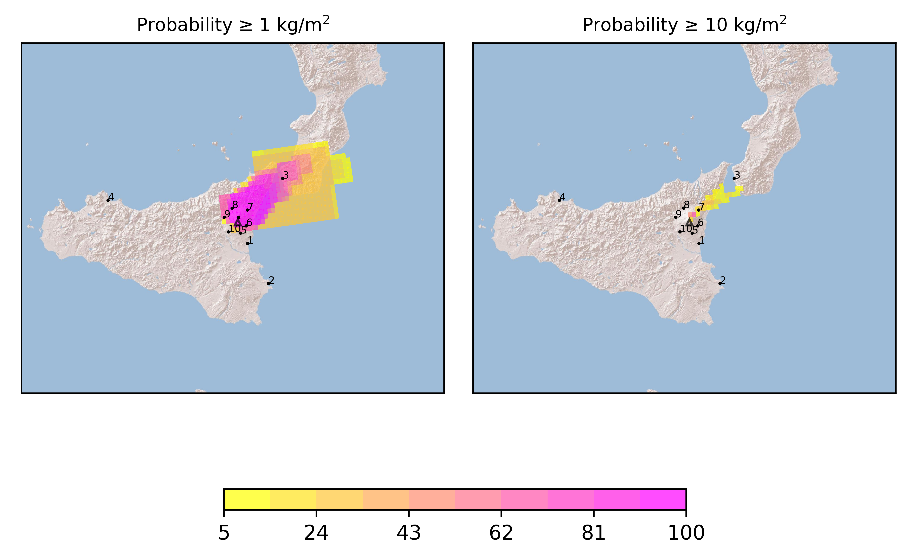
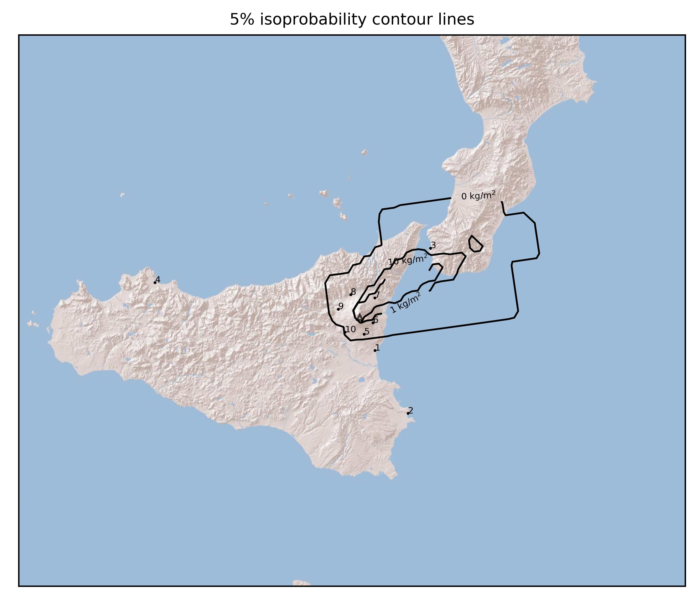
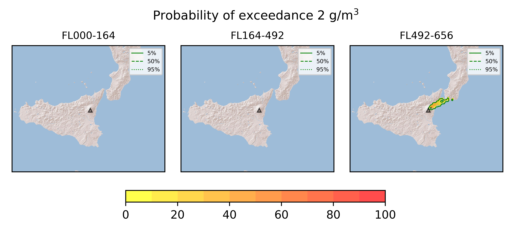

Forecast from VONA bulletin - 20210304_1130Z
============================================

Contents
========

* [Forecast products](#forecast-products)
	* [Forecast at 2021-03-04 14:30 Z](#forecast-at-2021-03-04-1430-z)

# Forecast products

## Forecast at 2021-03-04 14:30 Z
  

|Eruption start [Z]|Eruption end [Z]|Forecast time [Z]|Column height asl [m]|
| :--- | :--- | :--- | :--- |
|2021-03-04 11:30:00|Ongoing|2021-03-04 14:30:00|11000 ± 1000 - from VONA|
  
  

|Percentile|MER [kg/s¹]|Mass in the air [kg]|Mass on the ground [kg]|
| :--- | :--- | :--- | :--- |
|5th|2.11e+05|2.39e+09|5.04e+08|
|50th|1.08e+06|6.44e+09|4.34e+09|
|95th|2.84e+06|1.55e+10|9.23e+09|
  

### Ground 2021-03-04 14:30 Z
  
  
  
  
  
  
  
  
  
  
  
  

|Location|Ground load [kg/m²] 5th perc|Ground load [kg/m²] 50th perc|Ground load [kg/m²] 95th perc|
| :--- | :--- | :--- | :--- |
|Catania AP (1)|0.00e+00|0.00e+00|0.00e+00|
|Siracusa (2)|0.00e+00|0.00e+00|0.00e+00|
|Reggio Calabria AP (3)|0.00e+00|1.46e-02|5.61e-02|
|Palermo AP (4)|0.00e+00|0.00e+00|0.00e+00|
|Nicolosi (5)|0.00e+00|0.00e+00|4.42e-06|
|Zafferana (6)|8.93e-05|1.92e-03|9.18e-02|
|Linguaglossa (7)|4.62e-01|2.99e+00|1.54e+01|
|Randazzo (8)|2.52e-06|1.30e-05|2.49e-04|
|Bronte (9)|0.00e+00|0.00e+00|4.20e-10|
|Biancavilla (10)|0.00e+00|0.00e+00|1.83e-07|
  

### Atmosphere 2021-03-04 14:30 Z
  
  
Go to [Supplementary page](Supplementary_page.md)  
Go to [Main directory](https://github.com/federicapardini/Real_time_ash_forecast)