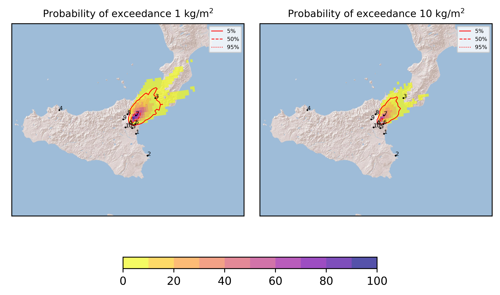
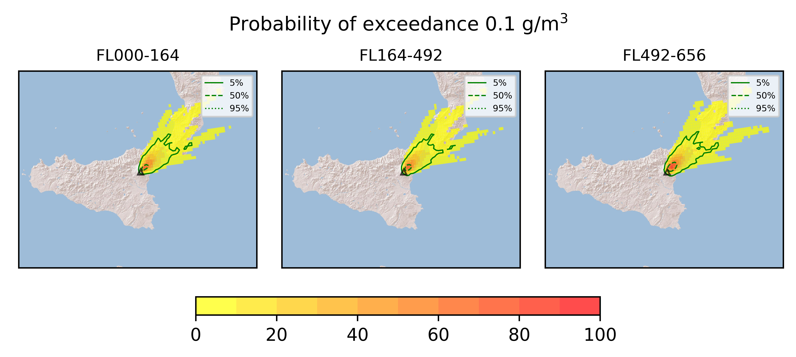

Forecast from VONA bulletin - 20210304_2310Z
============================================

Contents
========

* [Forecast products](#forecast-products)
	* [Forecast at 2021-03-05 02:10 Z](#forecast-at-2021-03-05-0210-z)

# Forecast products

## Forecast at 2021-03-05 02:10 Z
  

|Eruption start [Z]|Eruption end [Z]|Forecast time [Z]|Column height asl [m]|
| :--- | :--- | :--- | :--- |
|2021-03-04 23:10:00|Ongoing|2021-03-05 02:10:00|11000 ± 500 - from VONA|
  
  

|Percentile|MER [kg/s¹]|Mass in the air [kg]|Mass on the ground [kg]|
| :--- | :--- | :--- | :--- |
|5th|3.48e+04|3.74e+07|3.15e+08|
|50th|1.18e+06|1.20e+09|9.78e+09|
|95th|1.26e+07|3.29e+10|9.01e+10|
  

### Ground 2021-03-05 02:10 Z
  
  
  
  
  
  
  
  
  
  
  

|Location|Ground load [kg/m²] 5th perc|Ground load [kg/m²] 50th perc|Ground load [kg/m²] 95th perc|
| :--- | :--- | :--- | :--- |
|Catania AP (1)|0.00e+00|0.00e+00|0.00e+00|
|Siracusa (2)|0.00e+00|0.00e+00|0.00e+00|
|Reggio Calabria AP (3)|0.00e+00|5.00e-11|3.19e+00|
|Palermo AP (4)|0.00e+00|0.00e+00|0.00e+00|
|Nicolosi (5)|0.00e+00|0.00e+00|2.00e-03|
|Zafferana (6)|2.16e-08|1.77e-02|4.73e+00|
|Linguaglossa (7)|9.50e-02|6.28e+00|1.41e+02|
|Randazzo (8)|0.00e+00|1.73e-06|1.65e-02|
|Bronte (9)|0.00e+00|0.00e+00|0.00e+00|
|Biancavilla (10)|0.00e+00|0.00e+00|1.33e-05|
  

### Atmosphere 2021-03-05 02:10 Z
  
  
Go to [Supplementary page](Supplementary_page.md)  
Go to [Main directory](https://github.com/federicapardini/Real_time_ash_forecast)