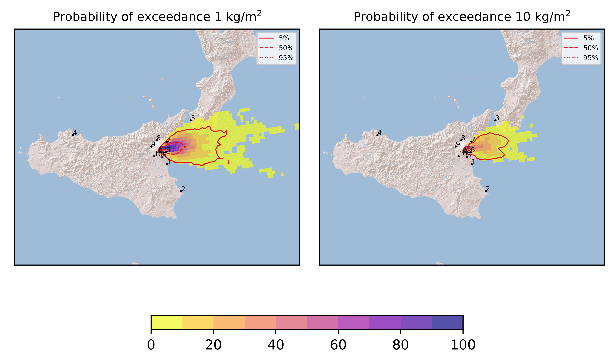

Forecast from VONA bulletin - 20210307_1113Z
============================================

Contents
========

* [Forecast products](#forecast-products)
	* [Forecast at 2021-03-07 14:10 Z](#forecast-at-2021-03-07-1410-z)
	* [Forecast at 2021-03-07 17:10 Z](#forecast-at-2021-03-07-1710-z)

# Forecast products

## Forecast at 2021-03-07 14:10 Z
  

|Eruption start [Z]|Eruption end [Z]|Forecast time [Z]|Column height asl [m]|
| :--- | :--- | :--- | :--- |
|2021-03-07 11:10:00|Ongoing|2021-03-07 14:10:00|[6000 m, 12000 m]|
  
  

|Percentile|MER [kg/s¹]|Mass in the air [kg]|Mass on the ground [kg]|
| :--- | :--- | :--- | :--- |
|5th|3.99e+04|3.54e+07|3.65e+08|
|50th|2.94e+05|4.01e+08|2.84e+09|
|95th|6.06e+06|1.37e+10|4.84e+10|
  

### Ground 2021-03-07 14:10 Z
  
  
  
  
  
  
  
  
  
  
  

|Location|Ground load [kg/m²] 5th perc|Ground load [kg/m²] 50th perc|Ground load [kg/m²] 95th perc|
| :--- | :--- | :--- | :--- |
|Catania AP (1)|0.00e+00|2.18e-08|1.97e-03|
|Siracusa (2)|0.00e+00|0.00e+00|0.00e+00|
|Reggio Calabria AP (3)|0.00e+00|0.00e+00|9.42e-06|
|Palermo AP (4)|0.00e+00|0.00e+00|0.00e+00|
|Nicolosi (5)|0.00e+00|3.00e-05|2.83e-02|
|Zafferana (6)|2.11e-02|9.27e-01|1.81e+01|
|Linguaglossa (7)|3.36e-09|6.27e-03|8.39e-01|
|Randazzo (8)|0.00e+00|1.50e-10|6.32e-06|
|Bronte (9)|0.00e+00|0.00e+00|1.18e-08|
|Biancavilla (10)|0.00e+00|0.00e+00|8.70e-09|
  

### Atmosphere 2021-03-07 14:10 Z
  

## Forecast at 2021-03-07 17:10 Z
  

|Eruption start [Z]|Eruption end [Z]|Forecast time [Z]|Column height asl [m]|
| :--- | :--- | :--- | :--- |
|2021-03-07 11:10:00|Ongoing|2021-03-07 17:10:00|[6000 m, 12000 m]|
  
  

|Percentile|MER [kg/s¹]|Mass in the air [kg]|Mass on the ground [kg]|
| :--- | :--- | :--- | :--- |
|5th|3.48e+04|6.19e+07|1.37e+09|
|50th|2.61e+05|6.06e+08|1.19e+10|
|95th|4.85e+06|7.34e+09|7.27e+10|
  

### Ground 2021-03-07 17:10 Z
  
  
  
  
  
  
  
  
  
  
  

|Location|Ground load [kg/m²] 5th perc|Ground load [kg/m²] 50th perc|Ground load [kg/m²] 95th perc|
| :--- | :--- | :--- | :--- |
|Catania AP (1)|0.00e+00|2.56e-06|2.38e-03|
|Siracusa (2)|0.00e+00|0.00e+00|7.50e-10|
|Reggio Calabria AP (3)|0.00e+00|3.50e-10|1.15e-03|
|Palermo AP (4)|0.00e+00|0.00e+00|0.00e+00|
|Nicolosi (5)|8.24e-07|8.58e-04|5.63e-02|
|Zafferana (6)|4.21e-01|3.09e+00|4.14e+01|
|Linguaglossa (7)|5.92e-05|5.07e-02|2.17e+00|
|Randazzo (8)|0.00e+00|4.28e-08|7.65e-05|
|Bronte (9)|0.00e+00|1.00e-10|2.50e-07|
|Biancavilla (10)|0.00e+00|4.50e-10|2.18e-06|
  

### Atmosphere 2021-03-07 17:10 Z
  
  
Go to [Supplementary page](Supplementary_page.md)  
Go to [Main directory](https://github.com/federicapardini/Real_time_ash_forecast)