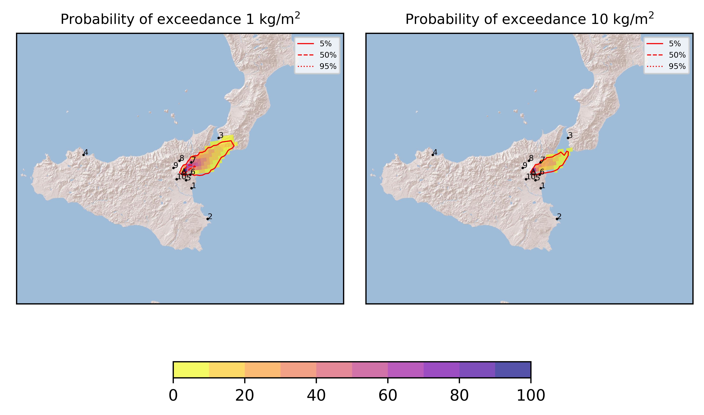
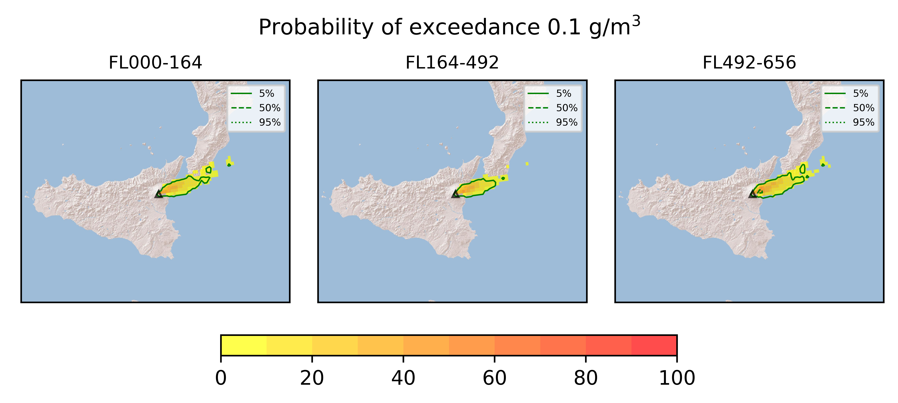

Forecast from VONA bulletin - 20210308_1113Z
============================================

Contents
========

* [Forecast products](#forecast-products)
	* [Forecast at 2021-03-08 14:10 Z](#forecast-at-2021-03-08-1410-z)

# Forecast products

## Forecast at 2021-03-08 14:10 Z
  

|Eruption start [Z]|Eruption end [Z]|Forecast time [Z]|Column height asl [m]|
| :--- | :--- | :--- | :--- |
|2021-03-08 11:10:00|Ongoing|2021-03-08 14:10:00|[6000 m, 12000 m]|
  
  

|Percentile|MER [kg/s¹]|Mass in the air [kg]|Mass on the ground [kg]|
| :--- | :--- | :--- | :--- |
|5th|1.47e+04|4.68e+06|1.34e+08|
|50th|6.71e+04|6.00e+07|6.53e+08|
|95th|3.48e+06|7.54e+09|3.15e+10|
  

### Ground 2021-03-08 14:10 Z
  
  
  
  
  
  
  
  
  
  
  

|Location|Ground load [kg/m²] 5th perc|Ground load [kg/m²] 50th perc|Ground load [kg/m²] 95th perc|
| :--- | :--- | :--- | :--- |
|Catania AP (1)|0.00e+00|0.00e+00|0.00e+00|
|Siracusa (2)|0.00e+00|0.00e+00|0.00e+00|
|Reggio Calabria AP (3)|0.00e+00|0.00e+00|2.43e-01|
|Palermo AP (4)|0.00e+00|0.00e+00|0.00e+00|
|Nicolosi (5)|8.68e-08|1.81e-05|7.55e-04|
|Zafferana (6)|7.99e-03|5.38e-02|1.48e+00|
|Linguaglossa (7)|1.20e-02|7.16e-01|1.68e+01|
|Randazzo (8)|2.63e-09|3.16e-05|5.16e-03|
|Bronte (9)|0.00e+00|0.00e+00|2.28e-05|
|Biancavilla (10)|0.00e+00|6.25e-09|6.46e-05|
  

### Atmosphere 2021-03-08 14:10 Z
  
  
Go to [Supplementary page](Supplementary_page.md)  
Go to [Main directory](https://github.com/federicapardini/FILES)