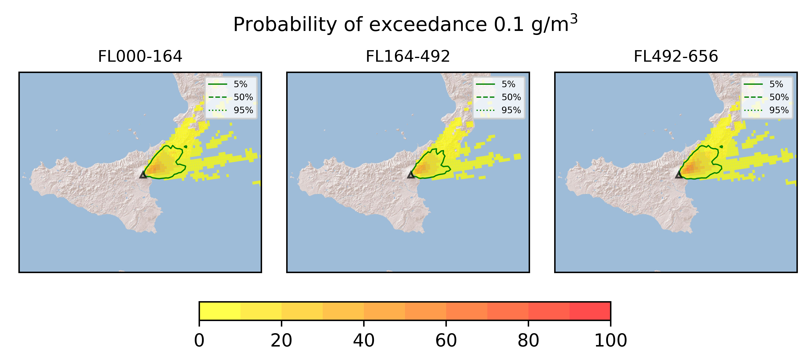

Forecast from VONA bulletin - 20210309_1836Z
============================================

Contents
========

* [Forecast products](#forecast-products)
	* [Forecast at 2021-03-09 21:40 Z](#forecast-at-2021-03-09-2140-z)
	* [Forecast at 2021-03-10 00:40 Z](#forecast-at-2021-03-10-0040-z)

# Forecast products

## Forecast at 2021-03-09 21:40 Z
  

|Eruption start [Z]|Eruption end [Z]|Forecast time [Z]|Column height asl [m]|
| :--- | :--- | :--- | :--- |
|2021-03-09 18:40:00|Ongoing|2021-03-09 21:40:00|[6000 m, 12000 m]|
  
  

|Percentile|MER [kg/s¹]|Mass in the air [kg]|Mass on the ground [kg]|
| :--- | :--- | :--- | :--- |
|5th|3.77e+04|2.56e+07|3.64e+08|
|50th|4.67e+05|4.61e+08|4.15e+09|
|95th|8.06e+06|1.80e+10|6.53e+10|
  

### Ground 2021-03-09 21:40 Z
  
  
  
  
  
  
  
  
  
  
  

|Location|Ground load [kg/m²] 5th perc|Ground load [kg/m²] 50th perc|Ground load [kg/m²] 95th perc|
| :--- | :--- | :--- | :--- |
|Catania AP (1)|0.00e+00|0.00e+00|2.10e-10|
|Siracusa (2)|0.00e+00|0.00e+00|0.00e+00|
|Reggio Calabria AP (3)|0.00e+00|5.09e-07|1.03e+01|
|Palermo AP (4)|0.00e+00|0.00e+00|0.00e+00|
|Nicolosi (5)|0.00e+00|0.00e+00|2.81e-04|
|Zafferana (6)|2.42e-09|8.35e-02|3.94e+00|
|Linguaglossa (7)|2.25e-05|3.72e-01|2.05e+01|
|Randazzo (8)|0.00e+00|0.00e+00|5.81e-07|
|Bronte (9)|0.00e+00|0.00e+00|0.00e+00|
|Biancavilla (10)|0.00e+00|0.00e+00|0.00e+00|
  

### Atmosphere 2021-03-09 21:40 Z
  

## Forecast at 2021-03-10 00:40 Z
  

|Eruption start [Z]|Eruption end [Z]|Forecast time [Z]|Column height asl [m]|
| :--- | :--- | :--- | :--- |
|2021-03-09 18:40:00|Ongoing|2021-03-10 00:40:00|[6000 m, 12000 m]|
  
  

|Percentile|MER [kg/s¹]|Mass in the air [kg]|Mass on the ground [kg]|
| :--- | :--- | :--- | :--- |
|5th|4.98e+04|9.56e+07|1.42e+09|
|50th|5.11e+05|1.03e+09|1.84e+10|
|95th|7.30e+06|9.09e+09|1.08e+11|
  

### Ground 2021-03-10 00:40 Z
  
  
  
  
  
  
  
  
  
  
  

|Location|Ground load [kg/m²] 5th perc|Ground load [kg/m²] 50th perc|Ground load [kg/m²] 95th perc|
| :--- | :--- | :--- | :--- |
|Catania AP (1)|0.00e+00|0.00e+00|7.50e-09|
|Siracusa (2)|0.00e+00|0.00e+00|0.00e+00|
|Reggio Calabria AP (3)|0.00e+00|3.88e-04|2.26e+01|
|Palermo AP (4)|0.00e+00|0.00e+00|0.00e+00|
|Nicolosi (5)|0.00e+00|7.05e-08|9.33e-04|
|Zafferana (6)|4.93e-08|3.98e-01|1.04e+01|
|Linguaglossa (7)|1.20e-03|1.41e+00|3.52e+01|
|Randazzo (8)|0.00e+00|0.00e+00|6.84e-07|
|Bronte (9)|0.00e+00|0.00e+00|0.00e+00|
|Biancavilla (10)|0.00e+00|0.00e+00|5.00e-12|
  

### Atmosphere 2021-03-10 00:40 Z
  
  
Go to [Supplementary page](Supplementary_page.md)  
Go to [Main directory](https://github.com/federicapardini/Real_time_ash_forecast)