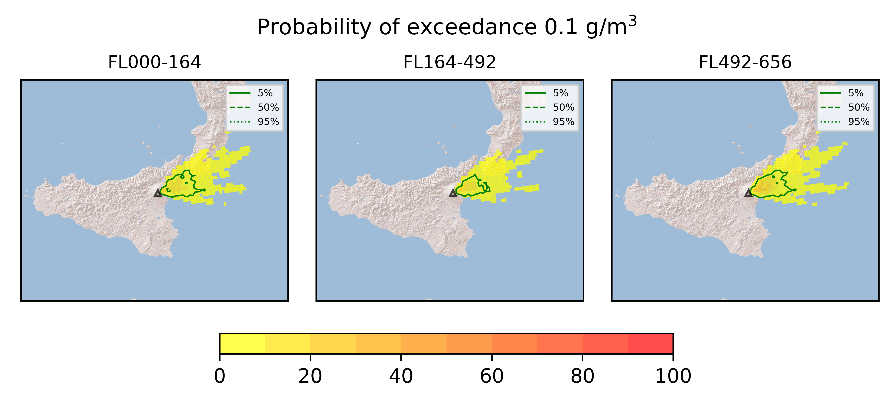
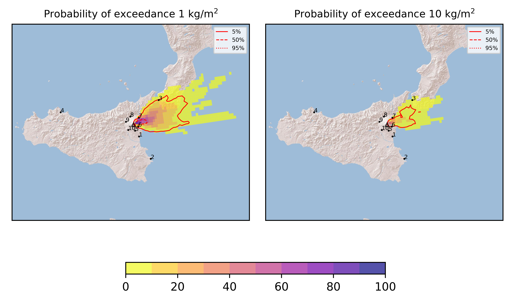
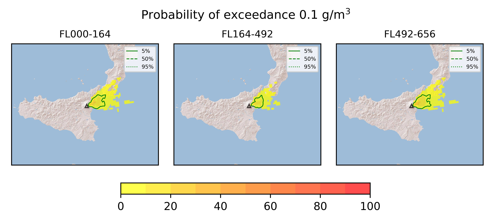

Forecast from VONA bulletin - 20210310_0056Z
============================================

Contents
========

* [Forecast products](#forecast-products)
	* [Forecast at 2021-03-10 04:00 Z](#forecast-at-2021-03-10-0400-z)
	* [Forecast at 2021-03-10 07:00 Z](#forecast-at-2021-03-10-0700-z)

# Forecast products

## Forecast at 2021-03-10 04:00 Z
  

|Eruption start [Z]|Eruption end [Z]|Forecast time [Z]|Column height asl [m]|
| :--- | :--- | :--- | :--- |
|2021-03-10 01:00:00|Ongoing|2021-03-10 04:00:00|7500 ± 500 - from VONA|
  
  

|Percentile|MER [kg/s¹]|Mass in the air [kg]|Mass on the ground [kg]|
| :--- | :--- | :--- | :--- |
|5th|7.82e+03|3.30e+06|8.02e+07|
|50th|1.67e+05|1.87e+08|1.44e+09|
|95th|2.15e+06|5.95e+09|1.75e+10|
  

### Ground 2021-03-10 04:00 Z
  
  
  
  
  
  
  
  
  
  
  

|Location|Ground load [kg/m²] 5th perc|Ground load [kg/m²] 50th perc|Ground load [kg/m²] 95th perc|
| :--- | :--- | :--- | :--- |
|Catania AP (1)|0.00e+00|0.00e+00|2.05e-07|
|Siracusa (2)|0.00e+00|0.00e+00|0.00e+00|
|Reggio Calabria AP (3)|0.00e+00|0.00e+00|2.16e-01|
|Palermo AP (4)|0.00e+00|0.00e+00|0.00e+00|
|Nicolosi (5)|0.00e+00|5.25e-09|4.41e-04|
|Zafferana (6)|5.46e-09|9.23e-02|2.19e+00|
|Linguaglossa (7)|3.71e-07|1.69e-02|1.81e+00|
|Randazzo (8)|0.00e+00|0.00e+00|3.05e-10|
|Bronte (9)|0.00e+00|0.00e+00|0.00e+00|
|Biancavilla (10)|0.00e+00|0.00e+00|0.00e+00|
  

### Atmosphere 2021-03-10 04:00 Z
  

## Forecast at 2021-03-10 07:00 Z
  

|Eruption start [Z]|Eruption end [Z]|Forecast time [Z]|Column height asl [m]|
| :--- | :--- | :--- | :--- |
|2021-03-10 01:00:00|Ongoing|2021-03-10 07:00:00|7500 ± 500 - from VONA|
  
  

|Percentile|MER [kg/s¹]|Mass in the air [kg]|Mass on the ground [kg]|
| :--- | :--- | :--- | :--- |
|5th|1.54e+04|2.14e+07|7.50e+08|
|50th|2.06e+05|3.03e+08|4.53e+09|
|95th|1.96e+06|1.97e+09|2.68e+10|
  

### Ground 2021-03-10 07:00 Z
  
  
  
  
  
  
  
  
  
  
  

|Location|Ground load [kg/m²] 5th perc|Ground load [kg/m²] 50th perc|Ground load [kg/m²] 95th perc|
| :--- | :--- | :--- | :--- |
|Catania AP (1)|0.00e+00|0.00e+00|3.45e-06|
|Siracusa (2)|0.00e+00|0.00e+00|0.00e+00|
|Reggio Calabria AP (3)|0.00e+00|2.10e-09|1.40e+00|
|Palermo AP (4)|0.00e+00|0.00e+00|0.00e+00|
|Nicolosi (5)|0.00e+00|6.77e-07|6.99e-04|
|Zafferana (6)|2.17e-07|4.42e-01|6.38e+00|
|Linguaglossa (7)|1.03e-05|3.57e-02|3.00e+00|
|Randazzo (8)|0.00e+00|0.00e+00|1.13e-09|
|Bronte (9)|0.00e+00|0.00e+00|0.00e+00|
|Biancavilla (10)|0.00e+00|0.00e+00|1.00e-10|
  

### Atmosphere 2021-03-10 07:00 Z
  
  
Go to [Supplementary page](Supplementary_page.md)  
Go to [Main directory](https://github.com/federicapardini/Real_time_ash_forecast)