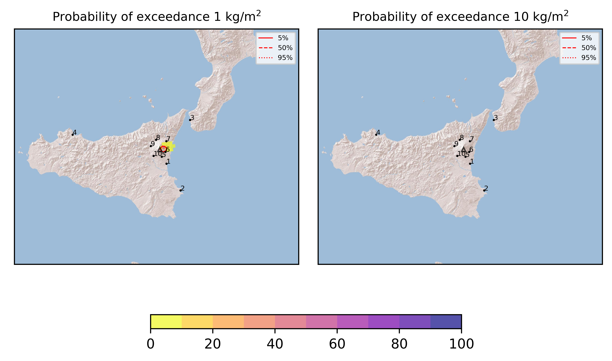

Forecast from VONA bulletin - 20210312_0618Z
============================================

Contents
========

* [Forecast products](#forecast-products)
	* [Forecast at 2021-03-12 09:20 Z](#forecast-at-2021-03-12-0920-z)
	* [Forecast at 2021-03-12 12:20 Z](#forecast-at-2021-03-12-1220-z)

# Forecast products

## Forecast at 2021-03-12 09:20 Z
  

|Eruption start [Z]|Eruption end [Z]|Forecast time [Z]|Column height asl [m]|
| :--- | :--- | :--- | :--- |
|2021-03-12 06:20:00|Ongoing|2021-03-12 09:20:00|4000 ± 500 - from VONA|
  
  

|Percentile|MER [kg/s¹]|Mass in the air [kg]|Mass on the ground [kg]|
| :--- | :--- | :--- | :--- |
|5th|4.49e+01|2.31e+04|3.80e+05|
|50th|1.38e+03|2.58e+05|1.34e+07|
|95th|2.70e+04|1.98e+07|2.20e+08|
  

### Ground 2021-03-12 09:20 Z
  
  
  
  
  
  
  
  
  
  
  

|Location|Ground load [kg/m²] 5th perc|Ground load [kg/m²] 50th perc|Ground load [kg/m²] 95th perc|
| :--- | :--- | :--- | :--- |
|Catania AP (1)|0.00e+00|0.00e+00|6.37e-08|
|Siracusa (2)|0.00e+00|0.00e+00|0.00e+00|
|Reggio Calabria AP (3)|0.00e+00|0.00e+00|0.00e+00|
|Palermo AP (4)|0.00e+00|0.00e+00|0.00e+00|
|Nicolosi (5)|1.82e-07|4.86e-05|5.69e-03|
|Zafferana (6)|3.68e-04|1.19e-02|3.91e-01|
|Linguaglossa (7)|3.00e-07|5.68e-05|1.96e-02|
|Randazzo (8)|0.00e+00|0.00e+00|1.42e-08|
|Bronte (9)|0.00e+00|0.00e+00|0.00e+00|
|Biancavilla (10)|0.00e+00|0.00e+00|8.85e-07|
  

### Atmosphere 2021-03-12 09:20 Z
  

## Forecast at 2021-03-12 12:20 Z
  

|Eruption start [Z]|Eruption end [Z]|Forecast time [Z]|Column height asl [m]|
| :--- | :--- | :--- | :--- |
|2021-03-12 06:20:00|Ongoing|2021-03-12 12:20:00|4000 ± 500 - from VONA|
  
  

|Percentile|MER [kg/s¹]|Mass in the air [kg]|Mass on the ground [kg]|
| :--- | :--- | :--- | :--- |
|5th|4.50e+01|2.64e+04|8.90e+05|
|50th|2.08e+03|7.22e+05|6.70e+07|
|95th|1.75e+04|1.07e+07|2.78e+08|
  

### Ground 2021-03-12 12:20 Z
  
  
  
  
  
  
  
  
  
  
  

|Location|Ground load [kg/m²] 5th perc|Ground load [kg/m²] 50th perc|Ground load [kg/m²] 95th perc|
| :--- | :--- | :--- | :--- |
|Catania AP (1)|0.00e+00|0.00e+00|9.30e-08|
|Siracusa (2)|0.00e+00|0.00e+00|0.00e+00|
|Reggio Calabria AP (3)|0.00e+00|0.00e+00|0.00e+00|
|Palermo AP (4)|0.00e+00|0.00e+00|0.00e+00|
|Nicolosi (5)|1.32e-06|3.11e-04|1.13e-02|
|Zafferana (6)|9.78e-04|4.93e-02|5.51e-01|
|Linguaglossa (7)|2.27e-06|8.51e-04|7.14e-02|
|Randazzo (8)|0.00e+00|0.00e+00|6.80e-08|
|Bronte (9)|0.00e+00|0.00e+00|0.00e+00|
|Biancavilla (10)|0.00e+00|1.60e-09|4.66e-06|
  

### Atmosphere 2021-03-12 12:20 Z
  
  
Go to [Supplementary page](Supplementary_page.md)  
Go to [Main directory](https://github.com/federicapardini/Real_time_ash_forecast)