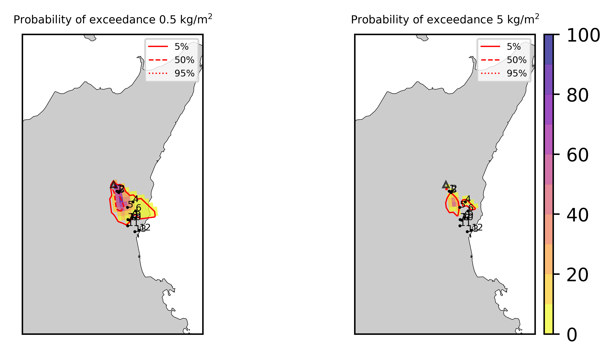
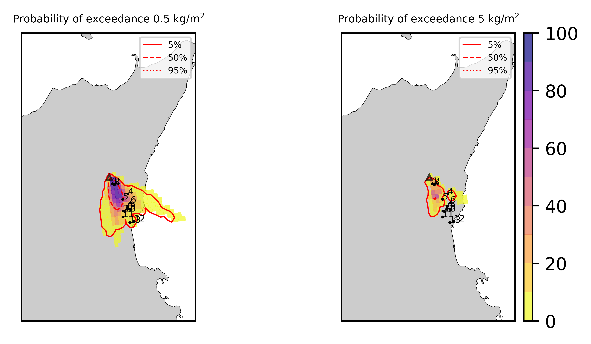
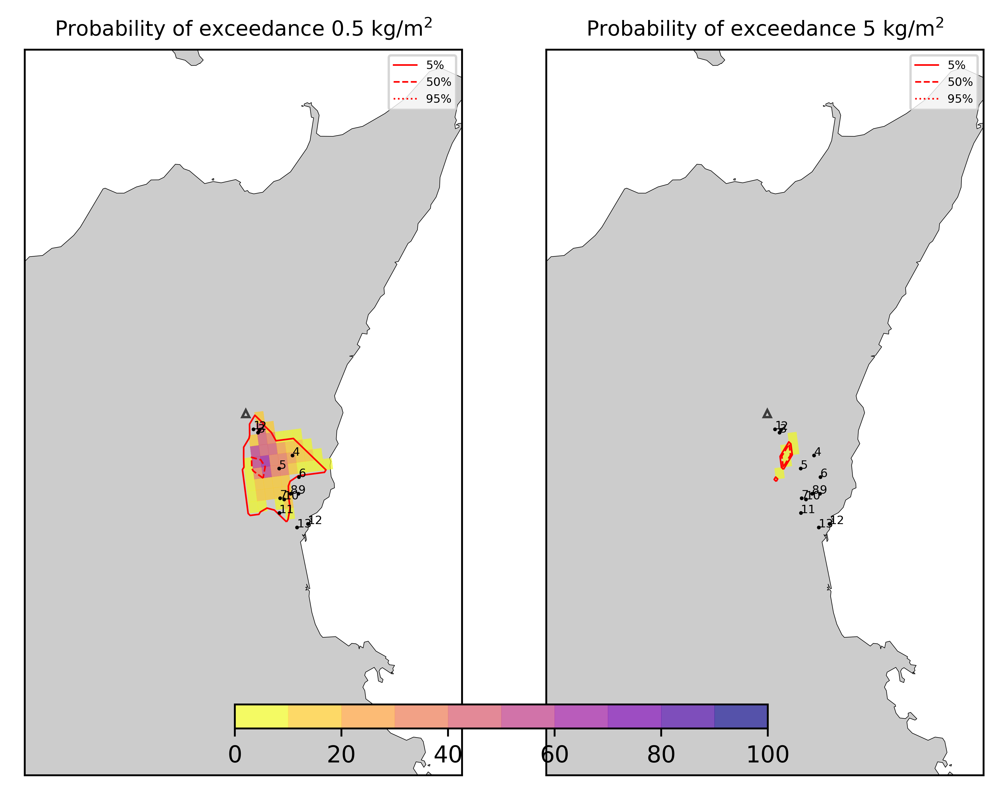
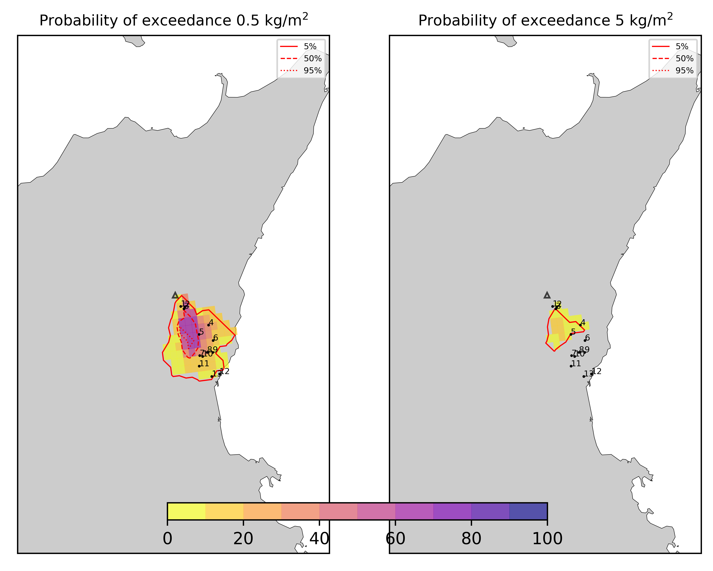
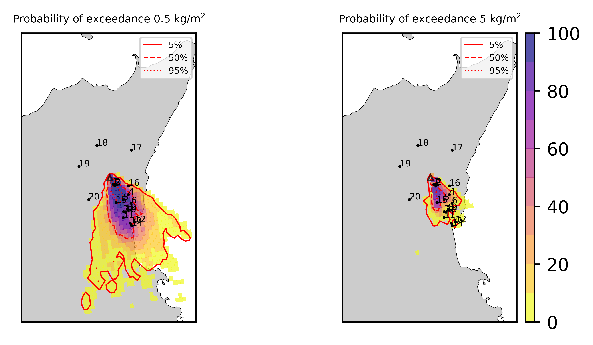

Forecast from VONA_20210216_1631Z
=================================

Contents
========

* [Forecast products](#forecast-products)
	* [Forecast at 2021-02-16 17:30 Z from RED VONA issued at 20210216_1631Z](#forecast-at-2021-02-16-1730-z-from-red-vona-issued-at-20210216_1631z)
	* [Forecast at 2021-02-16 18:30 Z from RED VONA issued at 20210216_1631Z](#forecast-at-2021-02-16-1830-z-from-red-vona-issued-at-20210216_1631z)
	* [Forecast at 2021-02-16 19:30 Z from RED VONA issued at 20210216_1631Z](#forecast-at-2021-02-16-1930-z-from-red-vona-issued-at-20210216_1631z)
	* [Forecast at 2021-02-16 22:30 Z from RED VONA issued at 20210216_1631Z](#forecast-at-2021-02-16-2230-z-from-red-vona-issued-at-20210216_1631z)
	* [Forecast at 2021-02-17 01:30 Z from RED VONA issued at 20210216_1631Z](#forecast-at-2021-02-17-0130-z-from-red-vona-issued-at-20210216_1631z)

# Forecast products

## Forecast at 2021-02-16 17:30 Z from RED VONA issued at 20210216_1631Z
  

|Eruption start [Z]|Eruption end [Z]|Forecast time [Z]|Column height asl [m]|
| :--- | :--- | :--- | :--- |
|2021-02-16 16:30:00|Ongoing|2021-02-16 17:30:00|6000 ± 500 - from VONA|
  
  

|Percentile|MER [kg/s¹]|Mass air [kg]|Mass air nested dom. [kg]|Mass grd [kg]|Mass grd nested dom. [kg]|
| :--- | :--- | :--- | :--- | :--- | :--- |
|5th|1.24e+04|1.89e+07|1.89e+07|2.80e+07|2.80e+07|
|50th|7.23e+04|1.04e+08|9.42e+07|1.46e+08|1.45e+08|
|95th|1.61e+05|2.00e+08|1.74e+08|4.16e+08|4.17e+08|
  

### Ground Nested Domain 2021-02-16 17:30 Z
  
  
  
  
  
  
  
  
  
  
  
  
  
  
  
  
  
  
  
  
  
  
  
  

|Location|Ground load [kg/m²] 5th perc|Ground load [kg/m²] 50th perc|Ground load [kg/m²] 95th perc|
| :--- | :--- | :--- | :--- |
|Catania AP (1)|0.00e+00|6.36e-05|1.33e-01|
|Siracusa (2)|nan|nan|nan|
|Reggio Calabria (3)|nan|nan|nan|
|Palermo (4)|nan|nan|nan|
|Nicolosi (5)|0.00e+00|5.82e-01|3.27e+00|
|Zafferana (6)|0.00e+00|0.00e+00|1.78e-02|
|Linguaglossa (7)|0.00e+00|0.00e+00|0.00e+00|
|Randazzo (8)|0.00e+00|0.00e+00|0.00e+00|
|Bronte (9)|0.00e+00|0.00e+00|0.00e+00|
|Biancavilla (10)|0.00e+00|0.00e+00|0.00e+00|
|Schiena Asino (11)|7.16e-04|5.36e-01|2.79e+00|
|Rif.Vescovo (12)|0.00e+00|4.10e-01|2.82e+00|
|Serra Pituzza (13)|0.00e+00|5.05e-01|3.87e+00|
|Monterosso (14)|0.00e+00|7.16e-04|1.16e+00|
|Cim.Pedara (15)|5.96e-05|3.73e-02|4.79e+00|
|Cim.Viagrande (16)|0.00e+00|6.79e-06|2.83e+00|
|Cim.Mascalucia (17)|0.00e+00|4.03e-03|7.35e-01|
|Cim.Tremestieri (18)|0.00e+00|6.36e-03|7.64e-01|
|Cim.S.Giov.La Punta (19)|0.00e+00|8.20e-04|6.09e-01|
|Cim.Gravina (20)|0.00e+00|1.08e-03|9.00e-01|
|ENI S.Giov.Galermo (21)|0.00e+00|2.64e-03|4.28e-01|
|Bio Piazza Europa (22)|0.00e+00|1.20e-04|1.81e-01|
|INGV-OE (23)|0.00e+00|5.57e-04|1.76e-01|
  

### Atmosphere 2021-02-16 17:30 Z
  

## Forecast at 2021-02-16 18:30 Z from RED VONA issued at 20210216_1631Z
  

|Eruption start [Z]|Eruption end [Z]|Forecast time [Z]|Column height asl [m]|
| :--- | :--- | :--- | :--- |
|2021-02-16 16:30:00|Ongoing|2021-02-16 18:30:00|6000 ± 500 - from VONA|
  
  

|Percentile|MER [kg/s¹]|Mass air [kg]|Mass air nested dom. [kg]|Mass grd [kg]|Mass grd nested dom. [kg]|
| :--- | :--- | :--- | :--- | :--- | :--- |
|5th|9.87e+03|3.89e+07|3.79e+07|1.96e+08|1.96e+08|
|50th|9.76e+04|1.55e+08|1.11e+08|4.08e+08|3.76e+08|
|95th|1.72e+05|3.75e+08|3.33e+08|6.84e+08|6.80e+08|
  

### Ground Nested Domain 2021-02-16 18:30 Z
  
  
  
  
  
  
  
  
  
  
  
  
  
  
  
  
  
  
  
  
  
  
  
  

|Location|Ground load [kg/m²] 5th perc|Ground load [kg/m²] 50th perc|Ground load [kg/m²] 95th perc|
| :--- | :--- | :--- | :--- |
|Catania AP (1)|2.10e-05|7.93e-02|5.80e-01|
|Siracusa (2)|nan|nan|nan|
|Reggio Calabria (3)|nan|nan|nan|
|Palermo (4)|nan|nan|nan|
|Nicolosi (5)|1.57e-01|2.51e+00|8.22e+00|
|Zafferana (6)|0.00e+00|1.33e-05|1.16e-01|
|Linguaglossa (7)|0.00e+00|0.00e+00|0.00e+00|
|Randazzo (8)|0.00e+00|0.00e+00|0.00e+00|
|Bronte (9)|0.00e+00|0.00e+00|0.00e+00|
|Biancavilla (10)|0.00e+00|0.00e+00|7.08e-05|
|Schiena Asino (11)|2.38e-01|1.22e+00|3.98e+00|
|Rif.Vescovo (12)|7.35e-02|8.86e-01|4.42e+00|
|Serra Pituzza (13)|8.80e-02|9.04e-01|6.05e+00|
|Monterosso (14)|0.00e+00|1.03e-01|2.34e+00|
|Cim.Pedara (15)|2.15e-02|5.45e-01|8.44e+00|
|Cim.Viagrande (16)|0.00e+00|5.42e-02|3.47e+00|
|Cim.Mascalucia (17)|3.95e-04|3.25e-01|1.80e+00|
|Cim.Tremestieri (18)|1.83e-03|3.70e-01|2.06e+00|
|Cim.S.Giov.La Punta (19)|5.52e-06|2.30e-01|1.73e+00|
|Cim.Gravina (20)|0.00e+00|2.40e-01|1.90e+00|
|ENI S.Giov.Galermo (21)|1.47e-03|1.86e-01|1.45e+00|
|Bio Piazza Europa (22)|6.34e-06|4.87e-02|9.61e-01|
|INGV-OE (23)|1.00e-05|8.33e-02|8.31e-01|
  

### Atmosphere 2021-02-16 18:30 Z
  

## Forecast at 2021-02-16 19:30 Z from RED VONA issued at 20210216_1631Z
  

|Eruption start [Z]|Eruption end [Z]|Forecast time [Z]|Column height asl [m]|
| :--- | :--- | :--- | :--- |
|2021-02-16 16:30:00|Ongoing|2021-02-16 19:30:00|6000 ± 500 - from VONA|
  
  

|Percentile|MER [kg/s¹]|Mass air [kg]|Mass air nested dom. [kg]|Mass grd [kg]|Mass grd nested dom. [kg]|
| :--- | :--- | :--- | :--- | :--- | :--- |
|5th|1.84e+04|5.93e+07|4.22e+07|3.32e+08|3.32e+08|
|50th|7.33e+04|1.90e+08|1.27e+08|6.71e+08|6.37e+08|
|95th|1.88e+05|3.39e+08|2.82e+08|1.11e+09|9.91e+08|
  

### Ground Nested Domain 2021-02-16 19:30 Z
  
  
  
  
  
  
  
  
  
  
  
  
  
  
  
  
  
  
  
  
  
  
  
  

|Location|Ground load [kg/m²] 5th perc|Ground load [kg/m²] 50th perc|Ground load [kg/m²] 95th perc|
| :--- | :--- | :--- | :--- |
|Catania AP (1)|1.13e-02|1.48e-01|1.16e+00|
|Siracusa (2)|nan|nan|nan|
|Reggio Calabria (3)|nan|nan|nan|
|Palermo (4)|nan|nan|nan|
|Nicolosi (5)|1.09e+00|4.18e+00|1.02e+01|
|Zafferana (6)|0.00e+00|9.00e-05|1.21e-01|
|Linguaglossa (7)|0.00e+00|0.00e+00|0.00e+00|
|Randazzo (8)|0.00e+00|0.00e+00|0.00e+00|
|Bronte (9)|0.00e+00|0.00e+00|0.00e+00|
|Biancavilla (10)|0.00e+00|0.00e+00|1.13e-03|
|Schiena Asino (11)|6.05e-01|2.58e+00|5.92e+00|
|Rif.Vescovo (12)|1.12e-01|2.20e+00|6.65e+00|
|Serra Pituzza (13)|1.04e-01|1.90e+00|8.83e+00|
|Monterosso (14)|6.26e-05|2.17e-01|2.62e+00|
|Cim.Pedara (15)|7.66e-02|1.41e+00|8.87e+00|
|Cim.Viagrande (16)|2.54e-04|2.33e-01|4.35e+00|
|Cim.Mascalucia (17)|1.58e-01|6.32e-01|6.20e+00|
|Cim.Tremestieri (18)|2.41e-02|6.65e-01|2.55e+00|
|Cim.S.Giov.La Punta (19)|6.09e-03|4.74e-01|2.24e+00|
|Cim.Gravina (20)|5.87e-02|5.59e-01|4.89e+00|
|ENI S.Giov.Galermo (21)|7.29e-02|4.65e-01|4.91e+00|
|Bio Piazza Europa (22)|1.95e-03|1.60e-01|1.78e+00|
|INGV-OE (23)|9.47e-03|1.33e-01|1.74e+00|
  

### Atmosphere 2021-02-16 19:30 Z
  

## Forecast at 2021-02-16 22:30 Z from RED VONA issued at 20210216_1631Z
  

|Eruption start [Z]|Eruption end [Z]|Forecast time [Z]|Column height asl [m]|
| :--- | :--- | :--- | :--- |
|2021-02-16 16:30:00|Ongoing|2021-02-16 22:30:00|6000 ± 500 - from VONA|
  
  

|Percentile|MER [kg/s¹]|Mass air [kg]|Mass air nested dom. [kg]|Mass grd [kg]|Mass grd nested dom. [kg]|
| :--- | :--- | :--- | :--- | :--- | :--- |
|5th|2.07e+04|8.47e+07|4.85e+07|8.24e+08|8.12e+08|
|50th|6.64e+04|1.92e+08|1.12e+08|1.39e+09|1.33e+09|
|95th|1.46e+05|4.61e+08|2.75e+08|1.94e+09|1.86e+09|
  

### Ground Nested Domain 2021-02-16 22:30 Z
  
  
  
  
  
  
  
  
  
  
  
  
  
  
  
  
  
  
  
  
  
  
  
  

|Location|Ground load [kg/m²] 5th perc|Ground load [kg/m²] 50th perc|Ground load [kg/m²] 95th perc|
| :--- | :--- | :--- | :--- |
|Catania AP (1)|4.75e-02|2.96e-01|1.71e+00|
|Siracusa (2)|nan|nan|nan|
|Reggio Calabria (3)|nan|nan|nan|
|Palermo (4)|nan|nan|nan|
|Nicolosi (5)|2.87e+00|8.13e+00|1.40e+01|
|Zafferana (6)|0.00e+00|3.77e-03|3.07e-01|
|Linguaglossa (7)|0.00e+00|0.00e+00|0.00e+00|
|Randazzo (8)|0.00e+00|0.00e+00|0.00e+00|
|Bronte (9)|0.00e+00|0.00e+00|0.00e+00|
|Biancavilla (10)|0.00e+00|1.42e-05|2.73e-03|
|Schiena Asino (11)|1.17e+00|4.10e+00|1.35e+01|
|Rif.Vescovo (12)|3.65e-01|2.88e+00|1.42e+01|
|Serra Pituzza (13)|4.15e-01|3.11e+00|1.68e+01|
|Monterosso (14)|3.91e-04|7.12e-01|4.77e+00|
|Cim.Pedara (15)|1.45e-01|3.22e+00|1.43e+01|
|Cim.Viagrande (16)|1.19e-03|4.51e-01|6.87e+00|
|Cim.Mascalucia (17)|3.04e-01|1.32e+00|7.12e+00|
|Cim.Tremestieri (18)|4.40e-02|1.03e+00|3.56e+00|
|Cim.S.Giov.La Punta (19)|1.51e-02|6.46e-01|4.52e+00|
|Cim.Gravina (20)|1.68e-01|9.70e-01|5.21e+00|
|ENI S.Giov.Galermo (21)|2.13e-01|1.26e+00|5.08e+00|
|Bio Piazza Europa (22)|2.51e-02|2.42e-01|2.33e+00|
|INGV-OE (23)|5.74e-02|3.17e-01|2.15e+00|
  

### Atmosphere 2021-02-16 22:30 Z
  

## Forecast at 2021-02-17 01:30 Z from RED VONA issued at 20210216_1631Z
  

|Eruption start [Z]|Eruption end [Z]|Forecast time [Z]|Column height asl [m]|
| :--- | :--- | :--- | :--- |
|2021-02-16 16:30:00|Ongoing|2021-02-17 01:30:00|6000 ± 500 - from VONA|
  
  

|Percentile|MER [kg/s¹]|Mass air [kg]|Mass air nested dom. [kg]|Mass grd [kg]|Mass grd nested dom. [kg]|
| :--- | :--- | :--- | :--- | :--- | :--- |
|5th|1.75e+04|8.61e+07|5.99e+07|1.33e+09|1.16e+09|
|50th|6.21e+04|1.79e+08|1.11e+08|2.01e+09|1.89e+09|
|95th|1.28e+05|4.43e+08|3.19e+08|3.22e+09|2.97e+09|
  

### Ground Nested Domain 2021-02-17 01:30 Z
  
  
  
  
  
  
  
  
  
  
  
  
  
  
  
  
  
  
  
  
  
  
  
  

|Location|Ground load [kg/m²] 5th perc|Ground load [kg/m²] 50th perc|Ground load [kg/m²] 95th perc|
| :--- | :--- | :--- | :--- |
|Catania AP (1)|1.21e-01|4.86e-01|2.35e+00|
|Siracusa (2)|nan|nan|nan|
|Reggio Calabria (3)|nan|nan|nan|
|Palermo (4)|nan|nan|nan|
|Nicolosi (5)|3.44e+00|1.04e+01|2.89e+01|
|Zafferana (6)|7.67e-05|3.52e-02|9.86e-01|
|Linguaglossa (7)|0.00e+00|0.00e+00|4.58e-06|
|Randazzo (8)|0.00e+00|0.00e+00|0.00e+00|
|Bronte (9)|0.00e+00|0.00e+00|0.00e+00|
|Biancavilla (10)|0.00e+00|1.19e-04|2.89e-03|
|Schiena Asino (11)|2.30e+00|7.90e+00|1.55e+01|
|Rif.Vescovo (12)|9.37e-01|6.14e+00|1.62e+01|
|Serra Pituzza (13)|1.20e+00|7.96e+00|1.85e+01|
|Monterosso (14)|2.76e-02|1.71e+00|9.57e+00|
|Cim.Pedara (15)|4.79e-01|6.75e+00|1.86e+01|
|Cim.Viagrande (16)|8.48e-02|1.82e+00|7.74e+00|
|Cim.Mascalucia (17)|3.74e-01|2.20e+00|7.15e+00|
|Cim.Tremestieri (18)|1.94e-01|1.72e+00|6.38e+00|
|Cim.S.Giov.La Punta (19)|1.89e-01|2.04e+00|4.84e+00|
|Cim.Gravina (20)|3.10e-01|1.75e+00|5.63e+00|
|ENI S.Giov.Galermo (21)|2.71e-01|1.32e+00|5.76e+00|
|Bio Piazza Europa (22)|1.14e-01|4.53e-01|2.56e+00|
|INGV-OE (23)|1.05e-01|6.36e-01|2.63e+00|
  

### Atmosphere 2021-02-17 01:30 Z
  
  
Go to [Supplementary page](Supplementary_page.md)  
Go to [Main directory](https://github.com/federicapardini/Real_time_ash_forecast)