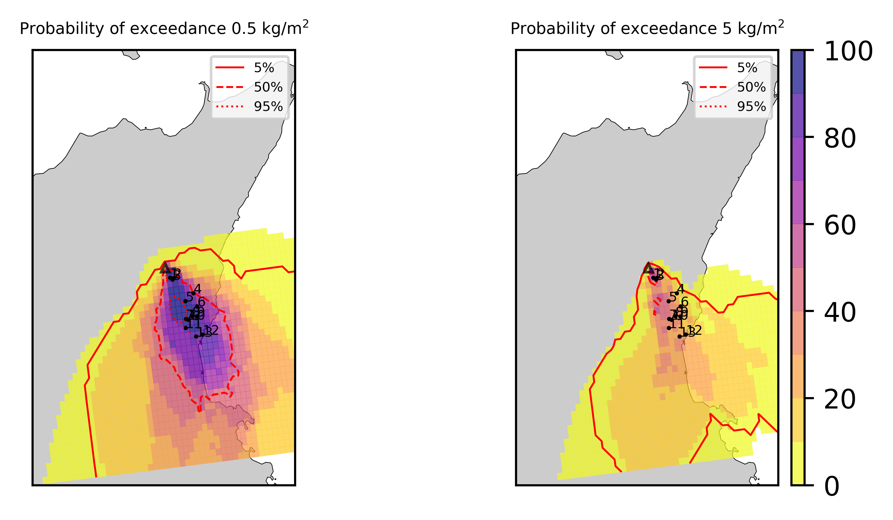
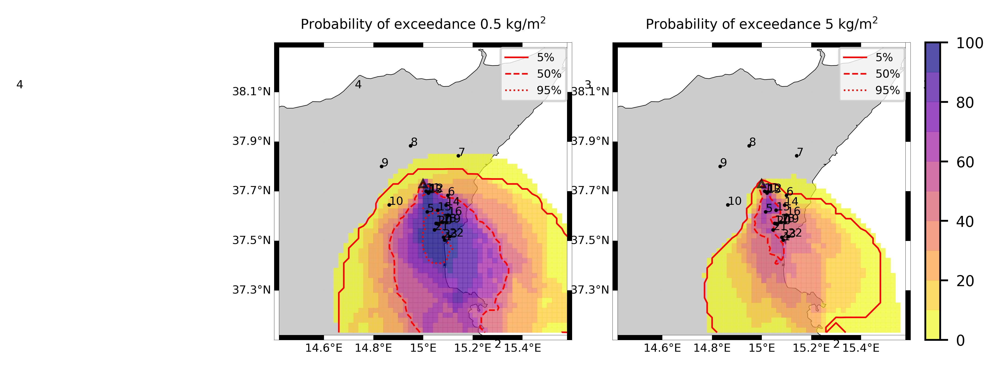
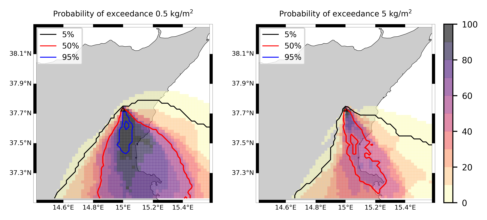
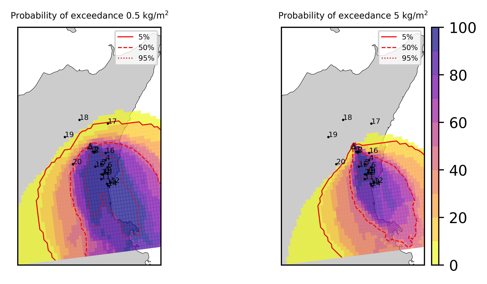

Forecast from VONA_20210216_1631Z
=================================

Contents
========

* [Forecast products](#forecast-products)
	* [Forecast at 2021-02-16 17:30 Z from RED VONA issued at 20210216_1631Z](#forecast-at-2021-02-16-1730-z-from-red-vona-issued-at-20210216_1631z)
	* [Forecast at 2021-02-16 18:30 Z from RED VONA issued at 20210216_1631Z](#forecast-at-2021-02-16-1830-z-from-red-vona-issued-at-20210216_1631z)
	* [Forecast at 2021-02-16 19:30 Z from RED VONA issued at 20210216_1631Z](#forecast-at-2021-02-16-1930-z-from-red-vona-issued-at-20210216_1631z)
	* [Forecast at 2021-02-16 22:30 Z from RED VONA issued at 20210216_1631Z](#forecast-at-2021-02-16-2230-z-from-red-vona-issued-at-20210216_1631z)
	* [Forecast at 2021-02-17 01:30 Z from RED VONA issued at 20210216_1631Z](#forecast-at-2021-02-17-0130-z-from-red-vona-issued-at-20210216_1631z)
	* [Forecast at 2021-02-16 18:10 Z from RED VONA issued at 20210216_1705Z](#forecast-at-2021-02-16-1810-z-from-red-vona-issued-at-20210216_1705z)
	* [Forecast at 2021-02-16 18:40 Z from RED VONA issued at 20210216_1738Z](#forecast-at-2021-02-16-1840-z-from-red-vona-issued-at-20210216_1738z)
	* [Forecast at 2021-02-16 19:40 Z from RED VONA issued at 20210216_1738Z](#forecast-at-2021-02-16-1940-z-from-red-vona-issued-at-20210216_1738z)
	* [Forecast at 2021-02-16 20:40 Z from RED VONA issued at 20210216_1738Z](#forecast-at-2021-02-16-2040-z-from-red-vona-issued-at-20210216_1738z)
	* [Forecast at 2021-02-16 23:40 Z from RED VONA issued at 20210216_1738Z](#forecast-at-2021-02-16-2340-z-from-red-vona-issued-at-20210216_1738z)

# Forecast products

## Forecast at 2021-02-16 17:30 Z from RED VONA issued at 20210216_1631Z
  

|Eruption start [Z]|Eruption end [Z]|Forecast time [Z]|Column height asl [m]|
| :--- | :--- | :--- | :--- |
|2021-02-16 16:30:00|Ongoing|2021-02-16 17:30:00|6000 ± 500 - from VONA|
  
  

|Percentile|MER [kg/s¹]|Mass air [kg]|Mass air nested dom. [kg]|Mass grd [kg]|Mass grd nested dom. [kg]|
| :--- | :--- | :--- | :--- | :--- | :--- |
|5th|1.48e+04|1.80e+07|1.80e+07|3.90e+07|3.90e+07|
|50th|7.79e+04|7.61e+07|7.60e+07|1.78e+08|1.78e+08|
|95th|1.86e+05|1.97e+08|1.97e+08|4.72e+08|4.72e+08|
  

### Ground Nested Domain 2021-02-16 17:30 Z
  
  
  
  
  
  
  
  
  
  
  
  
  
  

|Location|Ground load [kg/m²] 5th perc|Ground load [kg/m²] 50th perc|Ground load [kg/m²] 95th perc|
| :--- | :--- | :--- | :--- |
|Schiena Asino (1)|5.00e-04|1.50e+00|3.03e+00|
|Rif.Vescovo (2)|0.00e+00|5.04e-01|2.97e+00|
|Serra Pituzza (3)|0.00e+00|5.10e-01|3.20e+00|
|Monterosso (4)|0.00e+00|1.55e-05|1.62e+00|
|Cim.Pedara (5)|0.00e+00|8.13e-02|9.29e+00|
|Cim.Viagrande (6)|0.00e+00|2.36e-05|2.30e+00|
|Cim.Mascalucia (7)|0.00e+00|5.12e-03|3.95e+00|
|Cim.Tremestieri (8)|0.00e+00|2.68e-03|3.44e+00|
|Cim.S.Giov.La Punta (9)|0.00e+00|4.47e-04|2.27e+00|
|Cim.Gravina (10)|0.00e+00|3.04e-03|2.58e+00|
|ENI S.Giov.Galermo (11)|0.00e+00|3.79e-03|1.82e+00|
|Bio Piazza Europa (12)|0.00e+00|7.36e-05|1.53e-01|
|INGV-OE (13)|0.00e+00|4.80e-04|1.88e-01|
  

### Atmosphere 2021-02-16 17:30 Z
  

## Forecast at 2021-02-16 18:30 Z from RED VONA issued at 20210216_1631Z
  

|Eruption start [Z]|Eruption end [Z]|Forecast time [Z]|Column height asl [m]|
| :--- | :--- | :--- | :--- |
|2021-02-16 16:30:00|Ongoing|2021-02-16 18:30:00|6000 ± 500 - from VONA|
  
  

|Percentile|MER [kg/s¹]|Mass air [kg]|Mass air nested dom. [kg]|Mass grd [kg]|Mass grd nested dom. [kg]|
| :--- | :--- | :--- | :--- | :--- | :--- |
|5th|2.25e+04|4.31e+07|4.14e+07|1.96e+08|1.95e+08|
|50th|6.17e+04|1.20e+08|9.96e+07|4.10e+08|4.07e+08|
|95th|1.54e+05|2.31e+08|1.95e+08|1.01e+09|1.01e+09|
  

### Ground Nested Domain 2021-02-16 18:30 Z
  
  
  
  
  
  
  
  
  
  
  
  
  
  

|Location|Ground load [kg/m²] 5th perc|Ground load [kg/m²] 50th perc|Ground load [kg/m²] 95th perc|
| :--- | :--- | :--- | :--- |
|Schiena Asino (1)|5.62e-01|2.80e+00|7.90e+00|
|Rif.Vescovo (2)|3.97e-01|1.76e+00|7.39e+00|
|Serra Pituzza (3)|1.98e-01|2.41e+00|1.01e+01|
|Monterosso (4)|1.24e-05|1.66e-01|1.91e+00|
|Cim.Pedara (5)|1.53e-02|1.05e+00|1.47e+01|
|Cim.Viagrande (6)|0.00e+00|1.74e-01|2.62e+00|
|Cim.Mascalucia (7)|2.25e-03|1.31e-01|5.37e+00|
|Cim.Tremestieri (8)|5.77e-03|1.64e-01|4.24e+00|
|Cim.S.Giov.La Punta (9)|1.86e-04|1.29e-01|2.66e+00|
|Cim.Gravina (10)|4.60e-04|9.94e-02|5.97e+00|
|ENI S.Giov.Galermo (11)|3.51e-03|1.32e-01|3.98e+00|
|Bio Piazza Europa (12)|2.65e-04|8.26e-02|8.06e-01|
|INGV-OE (13)|1.68e-03|2.81e-02|1.43e+00|
  

### Atmosphere 2021-02-16 18:30 Z
  

## Forecast at 2021-02-16 19:30 Z from RED VONA issued at 20210216_1631Z
  

|Eruption start [Z]|Eruption end [Z]|Forecast time [Z]|Column height asl [m]|
| :--- | :--- | :--- | :--- |
|2021-02-16 16:30:00|Ongoing|2021-02-16 19:30:00|6000 ± 500 - from VONA|
  
  

|Percentile|MER [kg/s¹]|Mass air [kg]|Mass air nested dom. [kg]|Mass grd [kg]|Mass grd nested dom. [kg]|
| :--- | :--- | :--- | :--- | :--- | :--- |
|5th|1.91e+04|5.07e+07|3.75e+07|4.79e+08|4.78e+08|
|50th|6.72e+04|1.32e+08|9.44e+07|6.65e+08|6.48e+08|
|95th|1.69e+05|2.18e+08|1.97e+08|1.16e+09|1.16e+09|
  

### Ground Nested Domain 2021-02-16 19:30 Z
  
  
  
  
  
  
  
  
  
  
  
  
  
  

|Location|Ground load [kg/m²] 5th perc|Ground load [kg/m²] 50th perc|Ground load [kg/m²] 95th perc|
| :--- | :--- | :--- | :--- |
|Schiena Asino (1)|1.84e+00|4.36e+00|8.89e+00|
|Rif.Vescovo (2)|4.66e-01|2.91e+00|8.22e+00|
|Serra Pituzza (3)|4.00e-01|3.33e+00|1.08e+01|
|Monterosso (4)|3.18e-05|7.34e-01|5.27e+00|
|Cim.Pedara (5)|7.78e-02|1.97e+00|1.60e+01|
|Cim.Viagrande (6)|1.94e-04|6.75e-01|4.82e+00|
|Cim.Mascalucia (7)|9.26e-02|7.98e-01|6.56e+00|
|Cim.Tremestieri (8)|3.57e-02|8.51e-01|4.87e+00|
|Cim.S.Giov.La Punta (9)|2.44e-03|2.68e-01|2.83e+00|
|Cim.Gravina (10)|3.51e-02|7.59e-01|7.13e+00|
|ENI S.Giov.Galermo (11)|3.77e-02|3.59e-01|4.29e+00|
|Bio Piazza Europa (12)|3.29e-03|1.28e-01|9.12e-01|
|INGV-OE (13)|2.33e-02|1.14e-01|1.43e+00|
  

### Atmosphere 2021-02-16 19:30 Z
  

## Forecast at 2021-02-16 22:30 Z from RED VONA issued at 20210216_1631Z
  

|Eruption start [Z]|Eruption end [Z]|Forecast time [Z]|Column height asl [m]|
| :--- | :--- | :--- | :--- |
|2021-02-16 16:30:00|Ongoing|2021-02-16 22:30:00|6000 ± 500 - from VONA|
  
  

|Percentile|MER [kg/s¹]|Mass air [kg]|Mass air nested dom. [kg]|Mass grd [kg]|Mass grd nested dom. [kg]|
| :--- | :--- | :--- | :--- | :--- | :--- |
|5th|1.07e+04|4.03e+07|2.98e+07|9.07e+08|9.04e+08|
|50th|5.57e+04|1.06e+08|7.35e+07|1.41e+09|1.33e+09|
|95th|1.74e+05|3.65e+08|2.11e+08|2.07e+09|2.04e+09|
  

### Ground Nested Domain 2021-02-16 22:30 Z
  
  
  
  
  
  
  
  
  
  
  
  
  
  

|Location|Ground load [kg/m²] 5th perc|Ground load [kg/m²] 50th perc|Ground load [kg/m²] 95th perc|
| :--- | :--- | :--- | :--- |
|Schiena Asino (1)|4.05e+00|7.33e+00|1.47e+01|
|Rif.Vescovo (2)|9.33e-01|4.55e+00|1.27e+01|
|Serra Pituzza (3)|1.24e+00|5.26e+00|1.73e+01|
|Monterosso (4)|4.35e-03|1.39e+00|8.01e+00|
|Cim.Pedara (5)|5.92e-01|8.00e+00|1.94e+01|
|Cim.Viagrande (6)|2.17e-02|1.03e+00|8.53e+00|
|Cim.Mascalucia (7)|2.30e-01|1.45e+00|7.75e+00|
|Cim.Tremestieri (8)|7.52e-02|1.82e+00|4.88e+00|
|Cim.S.Giov.La Punta (9)|1.49e-01|1.48e+00|3.01e+00|
|Cim.Gravina (10)|8.72e-02|1.12e+00|7.15e+00|
|ENI S.Giov.Galermo (11)|2.18e-01|6.96e-01|6.29e+00|
|Bio Piazza Europa (12)|4.53e-02|5.01e-01|1.33e+00|
|INGV-OE (13)|9.49e-02|3.50e-01|3.37e+00|
  

### Atmosphere 2021-02-16 22:30 Z
  

## Forecast at 2021-02-17 01:30 Z from RED VONA issued at 20210216_1631Z
  

|Eruption start [Z]|Eruption end [Z]|Forecast time [Z]|Column height asl [m]|
| :--- | :--- | :--- | :--- |
|2021-02-16 16:30:00|Ongoing|2021-02-17 01:30:00|6000 ± 500 - from VONA|
  
  

|Percentile|MER [kg/s¹]|Mass air [kg]|Mass air nested dom. [kg]|Mass grd [kg]|Mass grd nested dom. [kg]|
| :--- | :--- | :--- | :--- | :--- | :--- |
|5th|2.04e+04|6.01e+07|3.56e+07|1.28e+09|1.26e+09|
|50th|4.57e+04|1.17e+08|9.48e+07|2.00e+09|1.96e+09|
|95th|1.35e+05|3.09e+08|2.19e+08|3.39e+09|3.09e+09|
  

### Ground Nested Domain 2021-02-17 01:30 Z
  
  
  
  
  
  
  
  
  
  
  
  
  
  

|Location|Ground load [kg/m²] 5th perc|Ground load [kg/m²] 50th perc|Ground load [kg/m²] 95th perc|
| :--- | :--- | :--- | :--- |
|Schiena Asino (1)|6.20e+00|1.26e+01|2.31e+01|
|Rif.Vescovo (2)|3.59e+00|5.92e+00|1.81e+01|
|Serra Pituzza (3)|4.68e+00|6.61e+00|2.30e+01|
|Monterosso (4)|6.08e-02|2.24e+00|9.54e+00|
|Cim.Pedara (5)|1.71e+00|9.92e+00|2.23e+01|
|Cim.Viagrande (6)|1.36e-01|2.14e+00|8.78e+00|
|Cim.Mascalucia (7)|3.05e-01|1.96e+00|8.75e+00|
|Cim.Tremestieri (8)|5.84e-01|2.41e+00|5.95e+00|
|Cim.S.Giov.La Punta (9)|2.25e-01|1.96e+00|4.35e+00|
|Cim.Gravina (10)|1.04e-01|1.68e+00|7.58e+00|
|ENI S.Giov.Galermo (11)|2.45e-01|9.94e-01|6.84e+00|
|Bio Piazza Europa (12)|1.54e-01|6.87e-01|1.42e+00|
|INGV-OE (13)|1.03e-01|6.14e-01|3.74e+00|
  

### Atmosphere 2021-02-17 01:30 Z
  

## Forecast at 2021-02-16 18:10 Z from RED VONA issued at 20210216_1705Z
  

|Eruption start [Z]|Eruption end [Z]|Forecast time [Z]|Column height asl [m]|
| :--- | :--- | :--- | :--- |
|2021-02-16 16:30:00|Ongoing|2021-02-16 18:10:00|10000 ± 500 - from VONA|
  
  

|Percentile|MER [kg/s¹]|Mass air [kg]|Mass air nested dom. [kg]|Mass grd [kg]|Mass grd nested dom. [kg]|
| :--- | :--- | :--- | :--- | :--- | :--- |
|5th|1.53e+05|2.97e+08|2.78e+08|6.21e+08|6.16e+08|
|50th|6.96e+05|1.19e+09|6.92e+08|1.75e+09|1.54e+09|
|95th|2.18e+06|4.48e+09|1.81e+09|3.02e+09|2.98e+09|
  

### Ground Nested Domain 2021-02-16 18:10 Z
  
  
  
  
  
  
  
  
  
  
  
  
  
  

|Location|Ground load [kg/m²] 5th perc|Ground load [kg/m²] 50th perc|Ground load [kg/m²] 95th perc|
| :--- | :--- | :--- | :--- |
|Schiena Asino (1)|8.63e-01|6.27e+00|1.71e+01|
|Rif.Vescovo (2)|7.35e-02|3.56e+00|1.24e+01|
|Serra Pituzza (3)|1.03e-01|3.31e+00|1.63e+01|
|Monterosso (4)|2.22e-05|5.26e-01|3.41e+00|
|Cim.Pedara (5)|5.10e-02|1.51e+00|7.08e+00|
|Cim.Viagrande (6)|3.78e-04|3.99e-01|3.24e+00|
|Cim.Mascalucia (7)|3.96e-02|7.65e-01|5.38e+00|
|Cim.Tremestieri (8)|5.22e-02|5.43e-01|7.09e+00|
|Cim.S.Giov.La Punta (9)|8.00e-03|6.84e-01|3.75e+00|
|Cim.Gravina (10)|4.26e-02|7.37e-01|6.64e+00|
|ENI S.Giov.Galermo (11)|5.00e-03|7.20e-01|5.87e+00|
|Bio Piazza Europa (12)|7.05e-03|2.65e-01|4.84e+00|
|INGV-OE (13)|3.57e-03|5.75e-01|4.96e+00|
  

### Atmosphere 2021-02-16 18:10 Z
  

## Forecast at 2021-02-16 18:40 Z from RED VONA issued at 20210216_1738Z
  

|Eruption start [Z]|Eruption end [Z]|Forecast time [Z]|Column height asl [m]|
| :--- | :--- | :--- | :--- |
|2021-02-16 16:30:00|Ongoing|2021-02-16 18:40:00|[5000 m, 15000 m]|
  
  

|Percentile|MER [kg/s¹]|Mass air [kg]|Mass air nested dom. [kg]|Mass grd [kg]|Mass grd nested dom. [kg]|
| :--- | :--- | :--- | :--- | :--- | :--- |
|5th|4.28e+04|2.76e+08|7.75e+07|1.44e+09|1.36e+09|
|50th|5.39e+05|2.13e+09|9.15e+08|3.00e+09|2.22e+09|
|95th|3.59e+07|6.61e+10|2.69e+10|5.97e+10|4.28e+10|
  

### Ground Nested Domain 2021-02-16 18:40 Z
  
  
  
  
  
  
  
  
  
  
  
  
  
  

|Location|Ground load [kg/m²] 5th perc|Ground load [kg/m²] 50th perc|Ground load [kg/m²] 95th perc|
| :--- | :--- | :--- | :--- |
|Schiena Asino (1)|1.12e+00|9.40e+00|6.11e+01|
|Rif.Vescovo (2)|4.47e-01|5.78e+00|4.06e+01|
|Serra Pituzza (3)|4.21e-01|6.07e+00|4.18e+01|
|Monterosso (4)|1.66e-01|1.52e+00|3.00e+01|
|Cim.Pedara (5)|4.98e-01|3.09e+00|2.53e+01|
|Cim.Viagrande (6)|1.80e-01|1.09e+00|9.81e+00|
|Cim.Mascalucia (7)|7.97e-01|3.66e+00|1.27e+01|
|Cim.Tremestieri (8)|8.49e-01|2.33e+00|1.25e+01|
|Cim.S.Giov.La Punta (9)|4.77e-01|2.09e+00|1.08e+01|
|Cim.Gravina (10)|3.76e-01|2.90e+00|1.29e+01|
|ENI S.Giov.Galermo (11)|4.17e-01|3.55e+00|7.45e+00|
|Bio Piazza Europa (12)|1.95e-01|2.62e+00|1.22e+01|
|INGV-OE (13)|3.48e-01|2.38e+00|1.07e+01|
  

### Atmosphere 2021-02-16 18:40 Z
  

## Forecast at 2021-02-16 19:40 Z from RED VONA issued at 20210216_1738Z
  

|Eruption start [Z]|Eruption end [Z]|Forecast time [Z]|Column height asl [m]|
| :--- | :--- | :--- | :--- |
|2021-02-16 16:30:00|Ongoing|2021-02-16 19:40:00|[5000 m, 15000 m]|
  
  

|Percentile|MER [kg/s¹]|Mass air [kg]|Mass air nested dom. [kg]|Mass grd [kg]|Mass grd nested dom. [kg]|
| :--- | :--- | :--- | :--- | :--- | :--- |
|5th|5.01e+04|2.99e+08|1.04e+08|2.42e+09|2.06e+09|
|50th|6.22e+05|7.38e+09|1.73e+09|1.32e+10|1.21e+10|
|95th|2.22e+07|6.36e+10|2.43e+10|1.01e+11|6.56e+10|
  

### Ground Nested Domain 2021-02-16 19:40 Z
  
  
  
  
  
  
  
  
  
  
  
  
  
  

|Location|Ground load [kg/m²] 5th perc|Ground load [kg/m²] 50th perc|Ground load [kg/m²] 95th perc|
| :--- | :--- | :--- | :--- |
|Schiena Asino (1)|3.51e+00|2.67e+01|1.31e+02|
|Rif.Vescovo (2)|1.57e+00|1.12e+01|7.69e+01|
|Serra Pituzza (3)|9.11e-01|1.48e+01|9.98e+01|
|Monterosso (4)|3.04e-01|2.59e+00|3.76e+01|
|Cim.Pedara (5)|1.27e+00|1.00e+01|4.38e+01|
|Cim.Viagrande (6)|3.81e-01|3.98e+00|1.37e+01|
|Cim.Mascalucia (7)|2.63e+00|7.60e+00|2.48e+01|
|Cim.Tremestieri (8)|1.03e+00|6.36e+00|2.16e+01|
|Cim.S.Giov.La Punta (9)|5.51e-01|5.01e+00|1.61e+01|
|Cim.Gravina (10)|2.21e+00|6.40e+00|2.27e+01|
|ENI S.Giov.Galermo (11)|2.13e+00|6.88e+00|2.23e+01|
|Bio Piazza Europa (12)|1.38e+00|5.81e+00|2.08e+01|
|INGV-OE (13)|1.21e+00|5.63e+00|1.73e+01|
  

### Atmosphere 2021-02-16 19:40 Z
  

## Forecast at 2021-02-16 20:40 Z from RED VONA issued at 20210216_1738Z
  

|Eruption start [Z]|Eruption end [Z]|Forecast time [Z]|Column height asl [m]|
| :--- | :--- | :--- | :--- |
|2021-02-16 16:30:00|Ongoing|2021-02-16 20:40:00|[5000 m, 15000 m]|
  
  

|Percentile|MER [kg/s¹]|Mass air [kg]|Mass air nested dom. [kg]|Mass grd [kg]|Mass grd nested dom. [kg]|
| :--- | :--- | :--- | :--- | :--- | :--- |
|5th|6.85e+04|2.91e+08|9.16e+07|3.77e+09|2.93e+09|
|50th|3.75e+05|1.36e+10|1.67e+09|2.56e+10|1.99e+10|
|95th|2.90e+07|9.67e+10|2.94e+10|1.51e+11|9.61e+10|
  

### Ground Nested Domain 2021-02-16 20:40 Z
  
  
  
  
  
  
  
  
  
  
  
  
  
  

|Location|Ground load [kg/m²] 5th perc|Ground load [kg/m²] 50th perc|Ground load [kg/m²] 95th perc|
| :--- | :--- | :--- | :--- |
|Schiena Asino (1)|7.63e+00|4.89e+01|1.92e+02|
|Rif.Vescovo (2)|1.57e+00|2.28e+01|1.08e+02|
|Serra Pituzza (3)|9.11e-01|2.68e+01|1.24e+02|
|Monterosso (4)|3.31e-01|3.87e+00|4.84e+01|
|Cim.Pedara (5)|1.85e+00|1.27e+01|5.76e+01|
|Cim.Viagrande (6)|5.92e-01|5.20e+00|4.22e+01|
|Cim.Mascalucia (7)|3.68e+00|1.29e+01|3.67e+01|
|Cim.Tremestieri (8)|1.88e+00|9.21e+00|3.05e+01|
|Cim.S.Giov.La Punta (9)|1.39e+00|6.88e+00|2.52e+01|
|Cim.Gravina (10)|2.74e+00|1.27e+01|3.52e+01|
|ENI S.Giov.Galermo (11)|2.93e+00|1.04e+01|3.28e+01|
|Bio Piazza Europa (12)|1.67e+00|8.21e+00|2.22e+01|
|INGV-OE (13)|1.66e+00|1.22e+01|2.42e+01|
  

### Atmosphere 2021-02-16 20:40 Z
  

## Forecast at 2021-02-16 23:40 Z from RED VONA issued at 20210216_1738Z
  

|Eruption start [Z]|Eruption end [Z]|Forecast time [Z]|Column height asl [m]|
| :--- | :--- | :--- | :--- |
|2021-02-16 16:30:00|Ongoing|2021-02-16 23:40:00|[5000 m, 15000 m]|
  
  

|Percentile|MER [kg/s¹]|Mass air [kg]|Mass air nested dom. [kg]|Mass grd [kg]|Mass grd nested dom. [kg]|
| :--- | :--- | :--- | :--- | :--- | :--- |
|5th|4.70e+04|5.83e+08|1.76e+08|7.88e+09|7.42e+09|
|50th|6.49e+05|3.28e+09|2.13e+09|9.54e+10|6.67e+10|
|95th|1.93e+07|7.74e+10|2.73e+10|2.72e+11|1.47e+11|
  

### Ground Nested Domain 2021-02-16 23:40 Z
  
  
  
  
  
  
  
  
  
  
  
  
  
  

|Location|Ground load [kg/m²] 5th perc|Ground load [kg/m²] 50th perc|Ground load [kg/m²] 95th perc|
| :--- | :--- | :--- | :--- |
|Schiena Asino (1)|2.85e+01|1.31e+02|3.01e+02|
|Rif.Vescovo (2)|1.23e+01|4.81e+01|2.08e+02|
|Serra Pituzza (3)|1.44e+01|5.96e+01|2.68e+02|
|Monterosso (4)|3.96e+00|1.38e+01|7.71e+01|
|Cim.Pedara (5)|6.20e+00|4.04e+01|1.65e+02|
|Cim.Viagrande (6)|5.57e+00|1.45e+01|8.21e+01|
|Cim.Mascalucia (7)|8.35e+00|3.01e+01|4.94e+01|
|Cim.Tremestieri (8)|6.42e+00|2.77e+01|6.03e+01|
|Cim.S.Giov.La Punta (9)|6.32e+00|2.41e+01|1.03e+02|
|Cim.Gravina (10)|6.73e+00|2.89e+01|4.73e+01|
|ENI S.Giov.Galermo (11)|8.23e+00|2.44e+01|6.24e+01|
|Bio Piazza Europa (12)|7.65e+00|2.37e+01|7.62e+01|
|INGV-OE (13)|8.96e+00|2.55e+01|6.38e+01|
  

### Atmosphere 2021-02-16 23:40 Z
  
  
Go to [Supplementary page](Supplementary_page.md)  
Go to [Main directory](https://github.com/federicapardini/Real_time_ash_forecast)