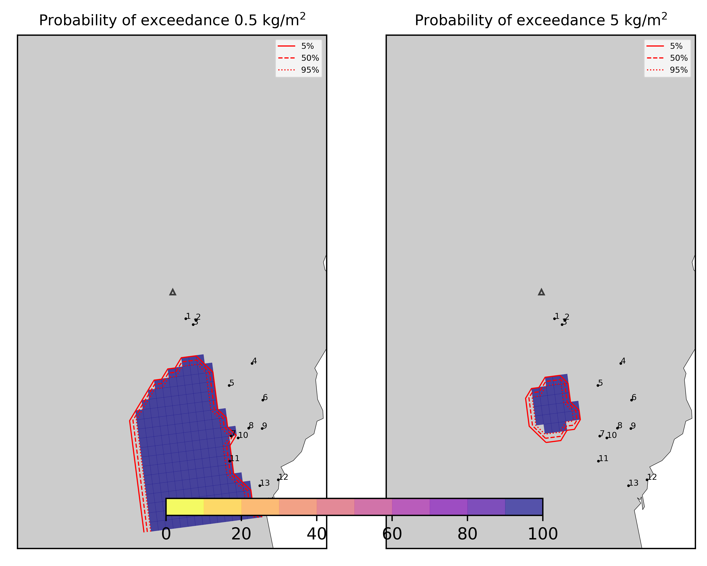
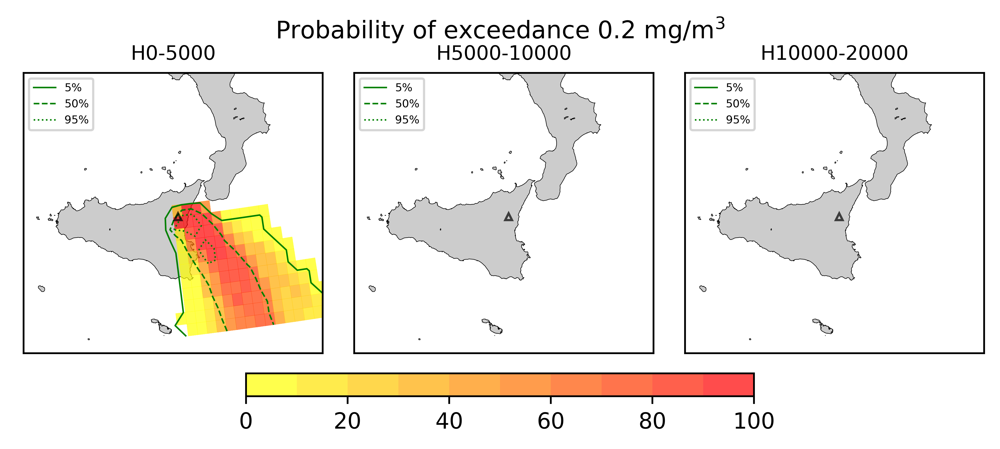

Forecast from VONA bulletin - 20210216_1631Z
============================================

Contents
========

* [Forecast products](#forecast-products)
	* [Forecast at 2021-02-16 19:30 Z - Ongoing Eruption](#forecast-at-2021-02-16-1930-z---ongoing-eruption)
	* [Forecast at 2021-02-16 22:30 Z - Ongoing Eruption](#forecast-at-2021-02-16-2230-z---ongoing-eruption)
	* [Forecast at 2021-02-17 01:30 Z - Ongoing Eruption](#forecast-at-2021-02-17-0130-z---ongoing-eruption)
	* [Forecast at 2021-02-17 04:30 Z - Ongoing Eruption](#forecast-at-2021-02-17-0430-z---ongoing-eruption)

# Forecast products

## Forecast at 2021-02-16 19:30 Z - Ongoing Eruption
  

|Eruption start [Z]|Eruption end [Z]|Forecast time [Z]|Column height asl [m]|
| :--- | :--- | :--- | :--- |
|2021-02-16 16:30:00|Ongoing|2021-02-16 19:30:00|6000 ± 500 - from VONA|
  
  

|Percentile|MER [kg/s¹]|Mass air [kg]|Mass air nested dom. [kg]|Mass grd [kg]|Mass grd nested dom. [kg]|
| :--- | :--- | :--- | :--- | :--- | :--- |
|5th|1.78e+04|3.10e+07|2.84e+07|1.65e+08|1.46e+08|
|50th|6.50e+04|1.64e+08|9.20e+07|5.23e+08|4.31e+08|
|95th|2.14e+05|6.47e+08|1.93e+08|1.27e+09|1.93e+08|
  

### Ground Nested Domain 2021-02-16 19:30 Z
  
  
  
  
  
  
  
  
  
  
  
  
  
  

|Location|Ground load [kg/m²] 5th perc|Ground load [kg/m²] 50th perc|Ground load [kg/m²] 95th perc|
| :--- | :--- | :--- | :--- |
|Schiena Asino (1)|0.00e+00|0.00e+00|4.68e+00|
|Rif.Vescovo (2)|0.00e+00|0.00e+00|1.40e+01|
|Serra Pituzza (3)|0.00e+00|6.36e-06|1.63e+01|
|Monterosso (4)|0.00e+00|4.70e-04|1.32e+00|
|Cim.Pedara (5)|3.46e-04|3.94e-01|8.01e+00|
|Cim.Viagrande (6)|1.87e-04|7.79e-03|2.16e+00|
|Cim.Mascalucia (7)|9.48e-03|5.06e-01|6.96e+00|
|Cim.Tremestieri (8)|1.07e-03|1.96e-01|3.90e+00|
|Cim.S.Giov.La Punta (9)|1.16e-03|6.30e-02|5.42e+00|
|Cim.Gravina (10)|5.86e-03|5.42e-01|6.38e+00|
|ENI S.Giov.Galermo (11)|2.28e-03|8.80e-01|4.86e+00|
|Bio Piazza Europa (12)|1.56e-03|1.37e-01|2.45e+00|
|INGV-OE (13)|2.39e-03|1.39e-01|3.28e+00|
  

### Atmosphere 2021-02-16 19:30 Z
  

## Forecast at 2021-02-16 22:30 Z - Ongoing Eruption
  

|Eruption start [Z]|Eruption end [Z]|Forecast time [Z]|Column height asl [m]|
| :--- | :--- | :--- | :--- |
|2021-02-16 16:30:00|Ongoing|2021-02-16 22:30:00|6000 ± 500 - from VONA|
  
  

|Percentile|MER [kg/s¹]|Mass air [kg]|Mass air nested dom. [kg]|Mass grd [kg]|Mass grd nested dom. [kg]|
| :--- | :--- | :--- | :--- | :--- | :--- |
|5th|9.06e+03|4.61e+07|3.77e+07|3.11e+08|2.95e+08|
|50th|8.06e+04|1.63e+08|9.39e+07|1.35e+09|8.94e+08|
|95th|1.62e+05|3.61e+08|1.69e+08|2.52e+09|1.69e+08|
  

### Ground Nested Domain 2021-02-16 22:30 Z
  
  
  
  
  
  
  
  
  
  
  
  
  
  

|Location|Ground load [kg/m²] 5th perc|Ground load [kg/m²] 50th perc|Ground load [kg/m²] 95th perc|
| :--- | :--- | :--- | :--- |
|Schiena Asino (1)|0.00e+00|6.43e-04|6.75e+00|
|Rif.Vescovo (2)|0.00e+00|8.41e-04|1.58e+01|
|Serra Pituzza (3)|0.00e+00|2.34e-03|1.53e+01|
|Monterosso (4)|2.02e-04|7.82e-03|3.79e+00|
|Cim.Pedara (5)|8.25e-03|2.00e+00|1.02e+01|
|Cim.Viagrande (6)|9.70e-04|3.06e-01|2.46e+00|
|Cim.Mascalucia (7)|9.99e-03|2.30e+00|1.15e+01|
|Cim.Tremestieri (8)|3.54e-02|1.64e+00|5.63e+00|
|Cim.S.Giov.La Punta (9)|7.79e-03|5.67e-01|9.21e+00|
|Cim.Gravina (10)|1.27e-02|1.89e+00|1.14e+01|
|ENI S.Giov.Galermo (11)|1.80e-02|3.65e+00|1.64e+01|
|Bio Piazza Europa (12)|8.70e-03|6.94e-01|5.72e+00|
|INGV-OE (13)|4.26e-03|1.33e+00|8.74e+00|
  

### Atmosphere 2021-02-16 22:30 Z
  

## Forecast at 2021-02-17 01:30 Z - Ongoing Eruption
  

|Eruption start [Z]|Eruption end [Z]|Forecast time [Z]|Column height asl [m]|
| :--- | :--- | :--- | :--- |
|2021-02-16 16:30:00|Ongoing|2021-02-17 01:30:00|6000 ± 500 - from VONA|
  
  

|Percentile|MER [kg/s¹]|Mass air [kg]|Mass air nested dom. [kg]|Mass grd [kg]|Mass grd nested dom. [kg]|
| :--- | :--- | :--- | :--- | :--- | :--- |
|5th|1.53e+04|3.86e+07|3.47e+07|9.82e+08|7.57e+08|
|50th|5.78e+04|1.41e+08|9.25e+07|1.75e+09|1.23e+09|
|95th|1.81e+05|5.12e+08|1.71e+08|3.02e+09|1.71e+08|
  

### Ground Nested Domain 2021-02-17 01:30 Z
  
  
  
  
  
  
  
  
  
  
  
  
  
  

|Location|Ground load [kg/m²] 5th perc|Ground load [kg/m²] 50th perc|Ground load [kg/m²] 95th perc|
| :--- | :--- | :--- | :--- |
|Schiena Asino (1)|0.00e+00|2.23e-03|6.61e+00|
|Rif.Vescovo (2)|0.00e+00|9.49e-01|2.11e+01|
|Serra Pituzza (3)|0.00e+00|3.54e+00|1.50e+01|
|Monterosso (4)|6.27e-04|2.48e-01|4.83e+00|
|Cim.Pedara (5)|6.26e-01|5.73e+00|1.46e+01|
|Cim.Viagrande (6)|3.18e-02|5.09e-01|4.84e+00|
|Cim.Mascalucia (7)|8.07e-01|6.89e+00|1.68e+01|
|Cim.Tremestieri (8)|1.31e-01|3.55e+00|1.02e+01|
|Cim.S.Giov.La Punta (9)|1.33e-01|2.43e+00|9.94e+00|
|Cim.Gravina (10)|3.99e-01|3.52e+00|1.60e+01|
|ENI S.Giov.Galermo (11)|5.60e-01|4.32e+00|1.64e+01|
|Bio Piazza Europa (12)|1.26e-01|1.19e+00|7.61e+00|
|INGV-OE (13)|3.23e-01|2.59e+00|9.84e+00|
  

### Atmosphere 2021-02-17 01:30 Z
  

## Forecast at 2021-02-17 04:30 Z - Ongoing Eruption
  

|Eruption start [Z]|Eruption end [Z]|Forecast time [Z]|Column height asl [m]|
| :--- | :--- | :--- | :--- |
|2021-02-16 16:30:00|Ongoing|2021-02-17 04:30:00|6000 ± 500 - from VONA|
  
  

|Percentile|MER [kg/s¹]|Mass air [kg]|Mass air nested dom. [kg]|Mass grd [kg]|Mass grd nested dom. [kg]|
| :--- | :--- | :--- | :--- | :--- | :--- |
|5th|9.09e+03|3.18e+07|2.77e+07|1.57e+09|1.16e+09|
|50th|6.00e+04|1.66e+08|1.10e+08|2.16e+09|1.48e+09|
|95th|1.62e+05|5.11e+08|2.04e+08|4.16e+09|2.04e+08|
  

### Ground Nested Domain 2021-02-17 04:30 Z
  
  
  
  
  
  
  
  
  
  
  
  
  
  

|Location|Ground load [kg/m²] 5th perc|Ground load [kg/m²] 50th perc|Ground load [kg/m²] 95th perc|
| :--- | :--- | :--- | :--- |
|Schiena Asino (1)|0.00e+00|5.32e-02|7.50e+00|
|Rif.Vescovo (2)|1.65e-06|4.77e+00|2.82e+01|
|Serra Pituzza (3)|1.12e-06|5.67e+00|1.48e+01|
|Monterosso (4)|3.44e-02|1.54e+00|4.86e+00|
|Cim.Pedara (5)|1.83e+00|9.08e+00|2.09e+01|
|Cim.Viagrande (6)|3.86e-01|1.77e+00|5.89e+00|
|Cim.Mascalucia (7)|1.42e+00|7.28e+00|1.90e+01|
|Cim.Tremestieri (8)|1.82e-01|6.84e+00|1.28e+01|
|Cim.S.Giov.La Punta (9)|2.43e-01|4.06e+00|1.11e+01|
|Cim.Gravina (10)|8.16e-01|6.70e+00|1.60e+01|
|ENI S.Giov.Galermo (11)|1.28e+00|5.60e+00|1.65e+01|
|Bio Piazza Europa (12)|2.76e-01|1.93e+00|7.54e+00|
|INGV-OE (13)|4.09e-01|3.09e+00|9.87e+00|
  

### Atmosphere 2021-02-17 04:30 Z
  
  
Go to [Supplementary page](Supplementary_page.md)  
Go to [Main directory](https://github.com/federicapardini/Real_time_ash_forecast)