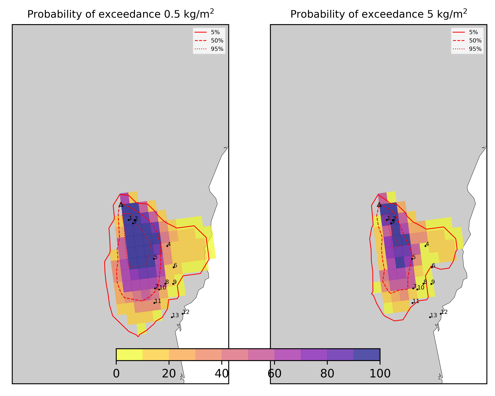
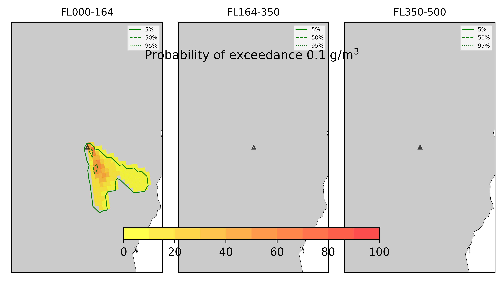

Forecast from VONA bulletin - 20210216_1631Z
============================================

Contents
========

* [Forecast products](#forecast-products)
	* [Forecast at 2021-02-16 19:30 Z - Ongoing Eruption](#forecast-at-2021-02-16-1930-z---ongoing-eruption)
	* [Forecast at 2021-02-16 22:30 Z - Ongoing Eruption](#forecast-at-2021-02-16-2230-z---ongoing-eruption)
	* [Forecast at 2021-02-17 01:30 Z - Ongoing Eruption](#forecast-at-2021-02-17-0130-z---ongoing-eruption)
	* [Forecast at 2021-02-17 04:30 Z - Ongoing Eruption](#forecast-at-2021-02-17-0430-z---ongoing-eruption)

# Forecast products

## Forecast at 2021-02-16 19:30 Z - Ongoing Eruption
  

|Eruption start [Z]|Eruption end [Z]|Forecast time [Z]|Column height asl [m]|
| :--- | :--- | :--- | :--- |
|2021-02-16 16:30:00|Ongoing|2021-02-16 19:30:00|6000 ± 500 - from VONA|
  
  

|Percentile|MER [kg/s¹]|Mass air [kg]|Mass air nested dom. [kg]|Mass grd [kg]|Mass grd nested dom. [kg]|
| :--- | :--- | :--- | :--- | :--- | :--- |
|5th|1.59e+04|4.51e+06|3.99e+06|1.67e+08|1.67e+08|
|50th|7.14e+04|2.76e+07|2.60e+07|7.12e+08|7.15e+08|
|95th|2.27e+05|1.13e+08|1.02e+08|2.00e+09|1.02e+08|
  

### Ground Nested Domain 2021-02-16 19:30 Z
  
  
  
  
  
  
  
  
  
  
  
  
  
  

|Location|Ground load [kg/m²] 5th perc|Ground load [kg/m²] 50th perc|Ground load [kg/m²] 95th perc|
| :--- | :--- | :--- | :--- |
|Schiena Asino (1)|1.10e-01|9.44e+00|2.45e+01|
|Rif.Vescovo (2)|0.00e+00|7.40e+00|1.71e+01|
|Serra Pituzza (3)|0.00e+00|8.65e+00|2.88e+01|
|Monterosso (4)|0.00e+00|1.25e-04|3.85e+00|
|Cim.Pedara (5)|0.00e+00|2.28e-01|5.55e+00|
|Cim.Viagrande (6)|0.00e+00|0.00e+00|4.87e+00|
|Cim.Mascalucia (7)|0.00e+00|3.56e-03|1.61e+01|
|Cim.Tremestieri (8)|0.00e+00|6.73e-04|6.99e+00|
|Cim.S.Giov.La Punta (9)|0.00e+00|8.28e-06|2.70e+00|
|Cim.Gravina (10)|0.00e+00|1.44e-03|1.09e+01|
|ENI S.Giov.Galermo (11)|0.00e+00|1.58e-06|6.34e+00|
|Bio Piazza Europa (12)|0.00e+00|0.00e+00|1.86e-02|
|INGV-OE (13)|0.00e+00|0.00e+00|4.60e-02|
  

### Atmosphere 2021-02-16 19:30 Z
  

## Forecast at 2021-02-16 22:30 Z - Ongoing Eruption
  

|Eruption start [Z]|Eruption end [Z]|Forecast time [Z]|Column height asl [m]|
| :--- | :--- | :--- | :--- |
|2021-02-16 16:30:00|Ongoing|2021-02-16 22:30:00|6000 ± 500 - from VONA|
  
  

|Percentile|MER [kg/s¹]|Mass air [kg]|Mass air nested dom. [kg]|Mass grd [kg]|Mass grd nested dom. [kg]|
| :--- | :--- | :--- | :--- | :--- | :--- |
|5th|9.86e+03|2.58e+06|2.19e+06|6.17e+08|6.19e+08|
|50th|6.81e+04|2.75e+07|2.49e+07|1.44e+09|1.44e+09|
|95th|1.46e+05|6.79e+07|6.72e+07|2.80e+09|6.72e+07|
  

### Ground Nested Domain 2021-02-16 22:30 Z
  
  
  
  
  
  
  
  
  
  
  
  
  
  

|Location|Ground load [kg/m²] 5th perc|Ground load [kg/m²] 50th perc|Ground load [kg/m²] 95th perc|
| :--- | :--- | :--- | :--- |
|Schiena Asino (1)|2.11e+00|1.78e+01|3.92e+01|
|Rif.Vescovo (2)|2.30e+00|1.36e+01|3.14e+01|
|Serra Pituzza (3)|1.74e+00|2.16e+01|3.98e+01|
|Monterosso (4)|7.00e-06|3.49e-03|3.74e+00|
|Cim.Pedara (5)|7.13e-02|1.02e+00|1.08e+01|
|Cim.Viagrande (6)|0.00e+00|3.20e-05|4.35e+00|
|Cim.Mascalucia (7)|0.00e+00|1.17e-01|1.46e+01|
|Cim.Tremestieri (8)|0.00e+00|5.70e-02|7.68e+00|
|Cim.S.Giov.La Punta (9)|0.00e+00|2.91e-03|3.04e+00|
|Cim.Gravina (10)|0.00e+00|1.80e-02|9.87e+00|
|ENI S.Giov.Galermo (11)|0.00e+00|1.92e-03|5.85e+00|
|Bio Piazza Europa (12)|0.00e+00|0.00e+00|1.82e-02|
|INGV-OE (13)|0.00e+00|0.00e+00|4.44e-02|
  

### Atmosphere 2021-02-16 22:30 Z
  

## Forecast at 2021-02-17 01:30 Z - Ongoing Eruption
  

|Eruption start [Z]|Eruption end [Z]|Forecast time [Z]|Column height asl [m]|
| :--- | :--- | :--- | :--- |
|2021-02-16 16:30:00|Ongoing|2021-02-17 01:30:00|6000 ± 500 - from VONA|
  
  

|Percentile|MER [kg/s¹]|Mass air [kg]|Mass air nested dom. [kg]|Mass grd [kg]|Mass grd nested dom. [kg]|
| :--- | :--- | :--- | :--- | :--- | :--- |
|5th|9.58e+03|5.14e+06|4.56e+06|8.24e+08|8.24e+08|
|50th|5.38e+04|2.00e+07|1.85e+07|1.93e+09|1.93e+09|
|95th|1.82e+05|6.67e+07|6.15e+07|3.70e+09|6.15e+07|
  

### Ground Nested Domain 2021-02-17 01:30 Z
  
  
  
  
  
  
  
  
  
  
  
  
  
  

|Location|Ground load [kg/m²] 5th perc|Ground load [kg/m²] 50th perc|Ground load [kg/m²] 95th perc|
| :--- | :--- | :--- | :--- |
|Schiena Asino (1)|1.20e+01|3.41e+01|5.64e+01|
|Rif.Vescovo (2)|6.80e+00|2.66e+01|3.91e+01|
|Serra Pituzza (3)|7.83e+00|3.06e+01|5.33e+01|
|Monterosso (4)|1.43e-04|5.14e-02|5.76e+00|
|Cim.Pedara (5)|2.03e-01|3.11e+00|1.15e+01|
|Cim.Viagrande (6)|0.00e+00|7.46e-04|4.35e+00|
|Cim.Mascalucia (7)|0.00e+00|2.89e+00|1.46e+01|
|Cim.Tremestieri (8)|0.00e+00|1.34e-01|7.56e+00|
|Cim.S.Giov.La Punta (9)|0.00e+00|1.41e-02|2.99e+00|
|Cim.Gravina (10)|0.00e+00|5.15e-01|9.75e+00|
|ENI S.Giov.Galermo (11)|0.00e+00|1.50e-01|5.85e+00|
|Bio Piazza Europa (12)|0.00e+00|0.00e+00|1.82e-02|
|INGV-OE (13)|0.00e+00|1.74e-05|4.44e-02|
  

### Atmosphere 2021-02-17 01:30 Z
  

## Forecast at 2021-02-17 04:30 Z - Ongoing Eruption
  

|Eruption start [Z]|Eruption end [Z]|Forecast time [Z]|Column height asl [m]|
| :--- | :--- | :--- | :--- |
|2021-02-16 16:30:00|Ongoing|2021-02-17 04:30:00|6000 ± 500 - from VONA|
  
  

|Percentile|MER [kg/s¹]|Mass air [kg]|Mass air nested dom. [kg]|Mass grd [kg]|Mass grd nested dom. [kg]|
| :--- | :--- | :--- | :--- | :--- | :--- |
|5th|1.98e+04|7.49e+06|6.49e+06|1.39e+09|1.39e+09|
|50th|5.41e+04|1.99e+07|1.81e+07|2.55e+09|2.56e+09|
|95th|1.77e+05|6.37e+07|5.72e+07|3.97e+09|5.72e+07|
  

### Ground Nested Domain 2021-02-17 04:30 Z
  
  
  
  
  
  
  
  
  
  
  
  
  
  

|Location|Ground load [kg/m²] 5th perc|Ground load [kg/m²] 50th perc|Ground load [kg/m²] 95th perc|
| :--- | :--- | :--- | :--- |
|Schiena Asino (1)|1.84e+01|4.20e+01|7.86e+01|
|Rif.Vescovo (2)|2.05e+01|3.69e+01|6.17e+01|
|Serra Pituzza (3)|2.04e+01|4.09e+01|6.87e+01|
|Monterosso (4)|8.98e-04|7.37e-02|1.65e+01|
|Cim.Pedara (5)|2.53e-01|4.96e+00|1.47e+01|
|Cim.Viagrande (6)|0.00e+00|2.21e-03|4.38e+00|
|Cim.Mascalucia (7)|8.59e-06|2.69e+00|1.46e+01|
|Cim.Tremestieri (8)|5.28e-04|1.17e-01|7.56e+00|
|Cim.S.Giov.La Punta (9)|3.22e-06|1.27e-02|2.99e+00|
|Cim.Gravina (10)|0.00e+00|5.09e-01|9.75e+00|
|ENI S.Giov.Galermo (11)|0.00e+00|1.34e-01|5.89e+00|
|Bio Piazza Europa (12)|0.00e+00|0.00e+00|1.82e-02|
|INGV-OE (13)|0.00e+00|1.74e-05|4.44e-02|
  

### Atmosphere 2021-02-17 04:30 Z
  
  
Go to [Supplementary page](Supplementary_page.md)  
Go to [Main directory](https://github.com/federicapardini/Real_time_ash_forecast)