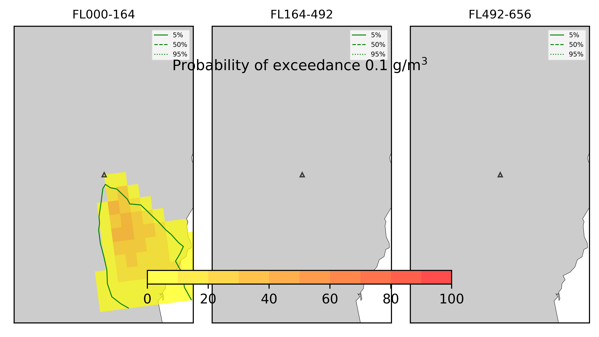

Forecast from VONA bulletin - 20210216_1631Z
============================================

Contents
========

* [Forecast products](#forecast-products)
	* [Forecast at 2021-02-16 19:30 Z - Ongoing Eruption](#forecast-at-2021-02-16-1930-z---ongoing-eruption)

# Forecast products

## Forecast at 2021-02-16 19:30 Z - Ongoing Eruption
  

|Eruption start [Z]|Eruption end [Z]|Forecast time [Z]|Column height asl [m]|
| :--- | :--- | :--- | :--- |
|2021-02-16 16:30:00|Ongoing|2021-02-16 19:30:00|6000 ± 500 - from VONA|
  
  

|Percentile|MER [kg/s¹]|Mass in the air [kg]|Mass on the ground [kg]|
| :--- | :--- | :--- | :--- |
|5th|1.87e+04|9.49e+06|1.87e+08|
|50th|7.89e+04|8.97e+07|7.35e+08|
|95th|1.91e+05|3.98e+08|1.64e+09|
  

### Ground 2021-02-16 19:30 Z
  
  
  
  
  
  
  
  
  
  
  
  
  
  

|Location|Ground load [kg/m²] 5th perc|Ground load [kg/m²] 50th perc|Ground load [kg/m²] 95th perc|
| :--- | :--- | :--- | :--- |
|Schiena Asino (1)|0.00e+00|6.94e-01|2.95e+00|
|Rif.Vescovo (2)|0.00e+00|8.02e-01|4.29e+00|
|Serra Pituzza (3)|0.00e+00|1.03e+00|3.82e+00|
|Monterosso (4)|3.74e-03|7.08e-01|8.22e+00|
|Cim.Pedara (5)|2.12e-02|3.44e+00|8.71e+00|
|Cim.Viagrande (6)|6.28e-04|4.17e-02|8.25e+00|
|Cim.Mascalucia (7)|8.69e-02|1.48e+00|1.26e+01|
|Cim.Tremestieri (8)|5.28e-02|1.52e+00|6.29e+00|
|Cim.S.Giov.La Punta (9)|3.23e-02|3.94e-01|3.34e+00|
|Cim.Gravina (10)|1.15e-01|1.52e+00|9.24e+00|
|ENI S.Giov.Galermo (11)|1.70e-02|9.48e-01|1.08e+01|
|Bio Piazza Europa (12)|3.04e-03|1.30e-01|1.42e+00|
|INGV-OE (13)|2.14e-03|2.70e-01|6.40e+00|
  

### Atmosphere 2021-02-16 19:30 Z
  
  
Go to [Supplementary page](Supplementary_page.md)  
Go to [Main directory](https://github.com/federicapardini/Real_time_ash_forecast)