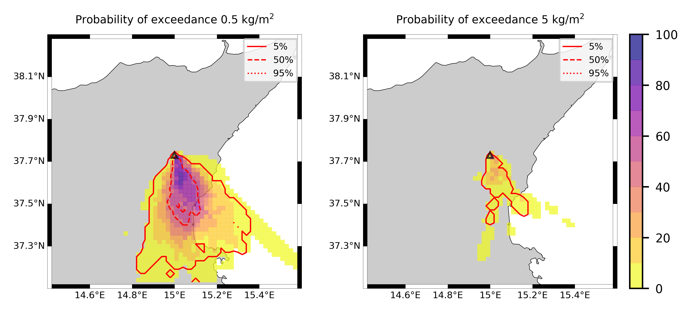

Forecast from VONA_20210216_1631Z
=================================

Contents
========

* [Forecast products](#forecast-products)
	* [Forecast at 2021-02-16 17:30 Z from RED VONA issued at 20210216_1631Z](#forecast-at-2021-02-16-1730-z-from-red-vona-issued-at-20210216_1631z)
	* [Forecast at 2021-02-16 18:30 Z from RED VONA issued at 20210216_1631Z](#forecast-at-2021-02-16-1830-z-from-red-vona-issued-at-20210216_1631z)
	* [Forecast at 2021-02-16 19:30 Z from RED VONA issued at 20210216_1631Z](#forecast-at-2021-02-16-1930-z-from-red-vona-issued-at-20210216_1631z)
	* [Forecast at 2021-02-16 22:30 Z from RED VONA issued at 20210216_1631Z](#forecast-at-2021-02-16-2230-z-from-red-vona-issued-at-20210216_1631z)
	* [Forecast at 2021-02-17 01:30 Z from RED VONA issued at 20210216_1631Z](#forecast-at-2021-02-17-0130-z-from-red-vona-issued-at-20210216_1631z)
	* [Forecast at 2021-02-16 18:10 Z from RED VONA issued at 20210216_1705Z](#forecast-at-2021-02-16-1810-z-from-red-vona-issued-at-20210216_1705z)

# Forecast products

## Forecast at 2021-02-16 17:30 Z from RED VONA issued at 20210216_1631Z
  

|Eruption start [Z]|Eruption end [Z]|Forecast time [Z]|Column height asl [m]|
| :--- | :--- | :--- | :--- |
|2021-02-16 16:30:00|Ongoing|2021-02-16 17:30:00|6000 ± 500 - from VONA|
  
  

|Percentile|MER [kg/s¹]|Mass air [kg]|Mass air nested dom. [kg]|Mass grd [kg]|Mass grd nested dom. [kg]|
| :--- | :--- | :--- | :--- | :--- | :--- |
|5th|1.61e+04|1.66e+07|1.66e+07|4.57e+07|4.57e+07|
|50th|7.06e+04|7.12e+07|7.12e+07|1.75e+08|1.75e+08|
|95th|2.15e+05|3.68e+08|2.96e+08|4.69e+08|4.68e+08|
  

### Ground Nested Domain 2021-02-16 17:30 Z
  
  
  
  
  
  
  
  
  
  
  
  
  
  
  
  
  
  
  
  
  
  
  
  

|Location|Ground load [kg/m²] 5th perc|Ground load [kg/m²] 50th perc|Ground load [kg/m²] 95th perc|
| :--- | :--- | :--- | :--- |
|Catania AP (1)|0.00e+00|9.82e-05|1.38e+00|
|Siracusa (2)|nan|nan|nan|
|Reggio Calabria (3)|nan|nan|nan|
|Palermo (4)|nan|nan|nan|
|Nicolosi (5)|0.00e+00|3.77e-01|2.92e+00|
|Zafferana (6)|0.00e+00|0.00e+00|4.61e-02|
|Linguaglossa (7)|0.00e+00|0.00e+00|0.00e+00|
|Randazzo (8)|0.00e+00|0.00e+00|0.00e+00|
|Bronte (9)|0.00e+00|0.00e+00|0.00e+00|
|Biancavilla (10)|0.00e+00|0.00e+00|0.00e+00|
|Schiena Asino (11)|1.43e-04|1.39e+00|3.73e+00|
|Rif.Vescovo (12)|0.00e+00|7.08e-01|3.97e+00|
|Serra Pituzza (13)|0.00e+00|5.63e-01|5.29e+00|
|Monterosso (14)|0.00e+00|2.69e-04|1.55e+00|
|Cim.Pedara (15)|8.03e-06|4.84e-02|3.75e+00|
|Cim.Viagrande (16)|0.00e+00|5.62e-06|2.86e+00|
|Cim.Mascalucia (17)|0.00e+00|2.28e-02|2.13e+00|
|Cim.Tremestieri (18)|0.00e+00|1.90e-03|2.98e+00|
|Cim.S.Giov.La Punta (19)|0.00e+00|1.83e-04|2.72e+00|
|Cim.Gravina (20)|0.00e+00|6.81e-03|2.24e+00|
|ENI S.Giov.Galermo (21)|0.00e+00|2.41e-03|2.68e+00|
|Bio Piazza Europa (22)|0.00e+00|8.37e-05|6.10e-01|
|INGV-OE (23)|0.00e+00|3.19e-04|1.79e+00|
  

### Atmosphere 2021-02-16 17:30 Z
  

## Forecast at 2021-02-16 18:30 Z from RED VONA issued at 20210216_1631Z
  

|Eruption start [Z]|Eruption end [Z]|Forecast time [Z]|Column height asl [m]|
| :--- | :--- | :--- | :--- |
|2021-02-16 16:30:00|Ongoing|2021-02-16 18:30:00|6000 ± 500 - from VONA|
  
  

|Percentile|MER [kg/s¹]|Mass air [kg]|Mass air nested dom. [kg]|Mass grd [kg]|Mass grd nested dom. [kg]|
| :--- | :--- | :--- | :--- | :--- | :--- |
|5th|8.58e+03|2.78e+07|1.66e+07|1.45e+08|1.45e+08|
|50th|7.88e+04|1.12e+08|9.63e+07|4.67e+08|4.67e+08|
|95th|1.92e+05|2.62e+08|2.02e+08|1.18e+09|1.17e+09|
  

### Ground Nested Domain 2021-02-16 18:30 Z
  
  
  
  
  
  
  
  
  
  
  
  
  
  
  
  
  
  
  
  
  
  
  
  

|Location|Ground load [kg/m²] 5th perc|Ground load [kg/m²] 50th perc|Ground load [kg/m²] 95th perc|
| :--- | :--- | :--- | :--- |
|Catania AP (1)|2.40e-04|2.51e-02|1.79e+00|
|Siracusa (2)|nan|nan|nan|
|Reggio Calabria (3)|nan|nan|nan|
|Palermo (4)|nan|nan|nan|
|Nicolosi (5)|6.08e-04|1.32e+00|5.45e+00|
|Zafferana (6)|0.00e+00|0.00e+00|2.42e-01|
|Linguaglossa (7)|0.00e+00|0.00e+00|0.00e+00|
|Randazzo (8)|0.00e+00|0.00e+00|0.00e+00|
|Bronte (9)|0.00e+00|0.00e+00|0.00e+00|
|Biancavilla (10)|0.00e+00|0.00e+00|0.00e+00|
|Schiena Asino (11)|7.65e-01|2.65e+00|7.97e+00|
|Rif.Vescovo (12)|1.46e-03|1.75e+00|6.86e+00|
|Serra Pituzza (13)|2.04e-03|2.35e+00|8.42e+00|
|Monterosso (14)|0.00e+00|1.23e-03|1.81e+00|
|Cim.Pedara (15)|2.00e-03|2.42e-01|5.63e+00|
|Cim.Viagrande (16)|0.00e+00|1.96e-03|5.41e+00|
|Cim.Mascalucia (17)|9.95e-04|3.49e-01|2.55e+00|
|Cim.Tremestieri (18)|1.79e-04|1.43e-01|7.80e+00|
|Cim.S.Giov.La Punta (19)|1.33e-05|5.25e-02|7.52e+00|
|Cim.Gravina (20)|9.58e-04|3.62e-01|3.48e+00|
|ENI S.Giov.Galermo (21)|2.53e-03|1.67e-01|3.55e+00|
|Bio Piazza Europa (22)|2.63e-06|3.42e-03|1.64e+00|
|INGV-OE (23)|2.22e-04|2.61e-02|2.31e+00|
  

### Atmosphere 2021-02-16 18:30 Z
  

## Forecast at 2021-02-16 19:30 Z from RED VONA issued at 20210216_1631Z
  

|Eruption start [Z]|Eruption end [Z]|Forecast time [Z]|Column height asl [m]|
| :--- | :--- | :--- | :--- |
|2021-02-16 16:30:00|Ongoing|2021-02-16 19:30:00|6000 ± 500 - from VONA|
  
  

|Percentile|MER [kg/s¹]|Mass air [kg]|Mass air nested dom. [kg]|Mass grd [kg]|Mass grd nested dom. [kg]|
| :--- | :--- | :--- | :--- | :--- | :--- |
|5th|1.68e+04|5.33e+07|2.51e+07|2.98e+08|2.95e+08|
|50th|6.72e+04|1.19e+08|7.96e+07|7.35e+08|7.33e+08|
|95th|1.89e+05|2.85e+08|2.03e+08|1.62e+09|1.61e+09|
  

### Ground Nested Domain 2021-02-16 19:30 Z
  
  
  
  
  
  
  
  
  
  
  
  
  
  
  
  
  
  
  
  
  
  
  
  

|Location|Ground load [kg/m²] 5th perc|Ground load [kg/m²] 50th perc|Ground load [kg/m²] 95th perc|
| :--- | :--- | :--- | :--- |
|Catania AP (1)|8.31e-04|1.20e-01|2.17e+00|
|Siracusa (2)|nan|nan|nan|
|Reggio Calabria (3)|nan|nan|nan|
|Palermo (4)|nan|nan|nan|
|Nicolosi (5)|1.07e-01|2.31e+00|8.02e+00|
|Zafferana (6)|0.00e+00|1.80e-04|2.42e-01|
|Linguaglossa (7)|0.00e+00|0.00e+00|0.00e+00|
|Randazzo (8)|0.00e+00|0.00e+00|0.00e+00|
|Bronte (9)|0.00e+00|0.00e+00|0.00e+00|
|Biancavilla (10)|0.00e+00|0.00e+00|0.00e+00|
|Schiena Asino (11)|1.88e+00|4.28e+00|1.01e+01|
|Rif.Vescovo (12)|6.79e-02|3.39e+00|8.80e+00|
|Serra Pituzza (13)|9.52e-02|4.43e+00|1.11e+01|
|Monterosso (14)|2.41e-04|4.53e-01|2.40e+00|
|Cim.Pedara (15)|1.30e-01|1.42e+00|6.22e+00|
|Cim.Viagrande (16)|5.72e-05|2.64e-01|8.56e+00|
|Cim.Mascalucia (17)|1.24e-01|1.36e+00|6.32e+00|
|Cim.Tremestieri (18)|3.31e-02|4.68e-01|8.73e+00|
|Cim.S.Giov.La Punta (19)|1.78e-03|5.32e-01|9.75e+00|
|Cim.Gravina (20)|7.90e-03|6.89e-01|7.94e+00|
|ENI S.Giov.Galermo (21)|1.68e-02|5.43e-01|4.27e+00|
|Bio Piazza Europa (22)|1.63e-03|4.97e-02|1.68e+00|
|INGV-OE (23)|2.95e-03|1.22e-01|2.96e+00|
  

### Atmosphere 2021-02-16 19:30 Z
  

## Forecast at 2021-02-16 22:30 Z from RED VONA issued at 20210216_1631Z
  

|Eruption start [Z]|Eruption end [Z]|Forecast time [Z]|Column height asl [m]|
| :--- | :--- | :--- | :--- |
|2021-02-16 16:30:00|Ongoing|2021-02-16 22:30:00|6000 ± 500 - from VONA|
  
  

|Percentile|MER [kg/s¹]|Mass air [kg]|Mass air nested dom. [kg]|Mass grd [kg]|Mass grd nested dom. [kg]|
| :--- | :--- | :--- | :--- | :--- | :--- |
|5th|1.55e+04|3.32e+07|1.30e+07|8.40e+08|8.39e+08|
|50th|6.33e+04|8.78e+07|6.46e+07|1.31e+09|1.29e+09|
|95th|1.40e+05|2.30e+08|1.33e+08|2.55e+09|2.46e+09|
  

### Ground Nested Domain 2021-02-16 22:30 Z
  
  
  
  
  
  
  
  
  
  
  
  
  
  
  
  
  
  
  
  
  
  
  
  

|Location|Ground load [kg/m²] 5th perc|Ground load [kg/m²] 50th perc|Ground load [kg/m²] 95th perc|
| :--- | :--- | :--- | :--- |
|Catania AP (1)|2.43e-02|2.99e-01|3.73e+00|
|Siracusa (2)|nan|nan|nan|
|Reggio Calabria (3)|nan|nan|nan|
|Palermo (4)|nan|nan|nan|
|Nicolosi (5)|1.37e+00|5.12e+00|1.68e+01|
|Zafferana (6)|0.00e+00|1.13e-03|5.00e-01|
|Linguaglossa (7)|0.00e+00|0.00e+00|0.00e+00|
|Randazzo (8)|0.00e+00|0.00e+00|0.00e+00|
|Bronte (9)|0.00e+00|0.00e+00|0.00e+00|
|Biancavilla (10)|0.00e+00|0.00e+00|7.08e-06|
|Schiena Asino (11)|2.03e+00|1.11e+01|1.73e+01|
|Rif.Vescovo (12)|7.49e-02|8.43e+00|1.56e+01|
|Serra Pituzza (13)|1.05e-01|9.69e+00|2.10e+01|
|Monterosso (14)|2.63e-04|1.53e+00|4.15e+00|
|Cim.Pedara (15)|2.51e-01|3.44e+00|1.40e+01|
|Cim.Viagrande (16)|5.72e-05|6.10e-01|1.10e+01|
|Cim.Mascalucia (17)|1.93e-01|1.94e+00|8.31e+00|
|Cim.Tremestieri (18)|4.27e-02|1.07e+00|1.20e+01|
|Cim.S.Giov.La Punta (19)|1.05e-02|7.76e-01|1.40e+01|
|Cim.Gravina (20)|6.33e-02|1.38e+00|9.46e+00|
|ENI S.Giov.Galermo (21)|9.93e-02|1.18e+00|6.50e+00|
|Bio Piazza Europa (22)|1.62e-02|1.30e-01|1.93e+00|
|INGV-OE (23)|2.80e-02|3.73e-01|4.99e+00|
  

### Atmosphere 2021-02-16 22:30 Z
  

## Forecast at 2021-02-17 01:30 Z from RED VONA issued at 20210216_1631Z
  

|Eruption start [Z]|Eruption end [Z]|Forecast time [Z]|Column height asl [m]|
| :--- | :--- | :--- | :--- |
|2021-02-16 16:30:00|Ongoing|2021-02-17 01:30:00|6000 ± 500 - from VONA|
  
  

|Percentile|MER [kg/s¹]|Mass air [kg]|Mass air nested dom. [kg]|Mass grd [kg]|Mass grd nested dom. [kg]|
| :--- | :--- | :--- | :--- | :--- | :--- |
|5th|1.21e+04|2.27e+07|2.10e+07|1.33e+09|1.31e+09|
|50th|6.63e+04|9.52e+07|7.10e+07|1.90e+09|1.89e+09|
|95th|1.13e+05|2.91e+08|1.53e+08|3.50e+09|3.31e+09|
  

### Ground Nested Domain 2021-02-17 01:30 Z
  
  
  
  
  
  
  
  
  
  
  
  
  
  
  
  
  
  
  
  
  
  
  
  

|Location|Ground load [kg/m²] 5th perc|Ground load [kg/m²] 50th perc|Ground load [kg/m²] 95th perc|
| :--- | :--- | :--- | :--- |
|Catania AP (1)|1.14e-01|4.02e-01|3.86e+00|
|Siracusa (2)|nan|nan|nan|
|Reggio Calabria (3)|nan|nan|nan|
|Palermo (4)|nan|nan|nan|
|Nicolosi (5)|2.09e+00|9.27e+00|2.06e+01|
|Zafferana (6)|0.00e+00|1.71e-02|1.00e+00|
|Linguaglossa (7)|0.00e+00|0.00e+00|0.00e+00|
|Randazzo (8)|0.00e+00|0.00e+00|0.00e+00|
|Bronte (9)|0.00e+00|0.00e+00|0.00e+00|
|Biancavilla (10)|0.00e+00|0.00e+00|7.08e-06|
|Schiena Asino (11)|7.25e+00|1.29e+01|2.79e+01|
|Rif.Vescovo (12)|4.25e+00|1.21e+01|2.54e+01|
|Serra Pituzza (13)|4.82e+00|1.39e+01|3.35e+01|
|Monterosso (14)|3.39e-03|2.80e+00|1.07e+01|
|Cim.Pedara (15)|4.09e-01|7.55e+00|1.61e+01|
|Cim.Viagrande (16)|4.58e-04|3.32e+00|1.41e+01|
|Cim.Mascalucia (17)|1.24e+00|3.42e+00|9.73e+00|
|Cim.Tremestieri (18)|1.48e-01|5.56e+00|1.25e+01|
|Cim.S.Giov.La Punta (19)|3.49e-02|2.68e+00|1.41e+01|
|Cim.Gravina (20)|5.81e-01|2.91e+00|9.51e+00|
|ENI S.Giov.Galermo (21)|3.44e-01|1.84e+00|6.64e+00|
|Bio Piazza Europa (22)|2.55e-02|6.21e-01|2.06e+00|
|INGV-OE (23)|1.33e-01|5.26e-01|5.17e+00|
  

### Atmosphere 2021-02-17 01:30 Z
  

## Forecast at 2021-02-16 18:10 Z from RED VONA issued at 20210216_1705Z
  

|Eruption start [Z]|Eruption end [Z]|Forecast time [Z]|Column height asl [m]|
| :--- | :--- | :--- | :--- |
|2021-02-16 16:30:00|Ongoing|2021-02-16 18:10:00|10000 ± 500 - from VONA|
  
  

|Percentile|MER [kg/s¹]|Mass air [kg]|Mass air nested dom. [kg]|Mass grd [kg]|Mass grd nested dom. [kg]|
| :--- | :--- | :--- | :--- | :--- | :--- |
|5th|1.73e+05|3.64e+08|3.63e+08|4.55e+08|4.55e+08|
|50th|6.84e+05|1.53e+09|8.40e+08|1.19e+09|1.07e+09|
|95th|2.18e+06|3.70e+09|3.31e+09|4.28e+09|3.55e+09|
  

### Ground Nested Domain 2021-02-16 18:10 Z
  
  
  
  
  
  
  
  
  
  
  
  
  
  
  
  
  
  
  
  
  
  
  
  

|Location|Ground load [kg/m²] 5th perc|Ground load [kg/m²] 50th perc|Ground load [kg/m²] 95th perc|
| :--- | :--- | :--- | :--- |
|Catania AP (1)|4.10e-04|2.57e-01|1.88e+00|
|Siracusa (2)|nan|nan|nan|
|Reggio Calabria (3)|nan|nan|nan|
|Palermo (4)|nan|nan|nan|
|Nicolosi (5)|3.24e-03|9.84e-01|6.99e+00|
|Zafferana (6)|0.00e+00|1.37e-04|1.54e-01|
|Linguaglossa (7)|0.00e+00|0.00e+00|0.00e+00|
|Randazzo (8)|0.00e+00|0.00e+00|0.00e+00|
|Bronte (9)|0.00e+00|0.00e+00|0.00e+00|
|Biancavilla (10)|0.00e+00|0.00e+00|8.93e-04|
|Schiena Asino (11)|4.24e-01|7.91e+00|2.54e+01|
|Rif.Vescovo (12)|7.93e-04|2.97e+00|2.60e+01|
|Serra Pituzza (13)|1.11e-03|4.12e+00|3.59e+01|
|Monterosso (14)|0.00e+00|5.68e-02|2.57e+00|
|Cim.Pedara (15)|5.39e-03|4.10e-01|4.50e+00|
|Cim.Viagrande (16)|0.00e+00|5.07e-02|5.81e+00|
|Cim.Mascalucia (17)|1.60e-02|3.80e-01|2.91e+00|
|Cim.Tremestieri (18)|8.25e-04|3.35e-01|3.40e+00|
|Cim.S.Giov.La Punta (19)|4.70e-05|1.87e-01|3.20e+00|
|Cim.Gravina (20)|5.19e-03|2.47e-01|3.62e+00|
|ENI S.Giov.Galermo (21)|2.46e-03|3.76e-01|3.09e+00|
|Bio Piazza Europa (22)|6.42e-05|4.30e-01|1.73e+00|
|INGV-OE (23)|1.94e-04|2.19e-01|1.80e+00|
  

### Atmosphere 2021-02-16 18:10 Z
  
  
Go to [Supplementary page](Supplementary_page.md)  
Go to [Main directory](https://github.com/federicapardini/Real_time_ash_forecast)