Forecast from VONA_20210216_1631Z
=================================

Contents
========

* [Forecast products](#forecast-products)
	* [Forecast at 2021-02-16 17:30 Z from RED VONA issued at 20210216_1631Z](#forecast-at-2021-02-16-1730-z-from-red-vona-issued-at-20210216_1631z)
	* [Forecast at 2021-02-16 18:30 Z from RED VONA issued at 20210216_1631Z](#forecast-at-2021-02-16-1830-z-from-red-vona-issued-at-20210216_1631z)
	* [Forecast at 2021-02-16 19:30 Z from RED VONA issued at 20210216_1631Z](#forecast-at-2021-02-16-1930-z-from-red-vona-issued-at-20210216_1631z)
	* [Forecast at 2021-02-16 22:30 Z from RED VONA issued at 20210216_1631Z](#forecast-at-2021-02-16-2230-z-from-red-vona-issued-at-20210216_1631z)
	* [Forecast at 2021-02-17 01:30 Z from RED VONA issued at 20210216_1631Z](#forecast-at-2021-02-17-0130-z-from-red-vona-issued-at-20210216_1631z)
	* [Forecast at 2021-02-16 18:10 Z from RED VONA issued at 20210216_1705Z](#forecast-at-2021-02-16-1810-z-from-red-vona-issued-at-20210216_1705z)
	* [Forecast at 2021-02-16 18:40 Z from RED VONA issued at 20210216_1738Z](#forecast-at-2021-02-16-1840-z-from-red-vona-issued-at-20210216_1738z)
	* [Forecast at 2021-02-16 19:40 Z from RED VONA issued at 20210216_1738Z](#forecast-at-2021-02-16-1940-z-from-red-vona-issued-at-20210216_1738z)
	* [Forecast at 2021-02-16 20:40 Z from RED VONA issued at 20210216_1738Z](#forecast-at-2021-02-16-2040-z-from-red-vona-issued-at-20210216_1738z)
	* [Forecast at 2021-02-16 23:40 Z from RED VONA issued at 20210216_1738Z](#forecast-at-2021-02-16-2340-z-from-red-vona-issued-at-20210216_1738z)
	* [Forecast at 2021-02-17 02:40 Z from RED VONA issued at 20210216_1738Z](#forecast-at-2021-02-17-0240-z-from-red-vona-issued-at-20210216_1738z)
	* [Forecast at 2021-02-17 05:40 Z from RED VONA issued at 20210216_1738Z](#forecast-at-2021-02-17-0540-z-from-red-vona-issued-at-20210216_1738z)
	* [Forecast at 2021-02-17 08:30 Z from ORANGE VONA issued at 20210217_0531Z](#forecast-at-2021-02-17-0830-z-from-orange-vona-issued-at-20210217_0531z)
	* [Forecast at 2021-02-17 11:30 Z from ORANGE VONA issued at 20210217_0531Z](#forecast-at-2021-02-17-1130-z-from-orange-vona-issued-at-20210217_0531z)
	* [Forecast at 2021-02-17 14:30 Z from ORANGE VONA issued at 20210217_0531Z](#forecast-at-2021-02-17-1430-z-from-orange-vona-issued-at-20210217_0531z)
	* [Forecast at 2021-02-17 17:30 Z from ORANGE VONA issued at 20210217_0531Z](#forecast-at-2021-02-17-1730-z-from-orange-vona-issued-at-20210217_0531z)

# Forecast products

## Forecast at 2021-02-16 17:30 Z from RED VONA issued at 20210216_1631Z
  

|Eruption start [Z]|Eruption end [Z]|Forecast time [Z]|Column height asl [m]|
| :--- | :--- | :--- | :--- |
|2021-02-16 16:30:00|Ongoing|2021-02-16 17:30:00|6000 ± 500 - from VONA|
  
  

|Percentile|MER [kg/s¹]|Mass air [kg]|Mass air nested dom. [kg]|Mass grd [kg]|Mass grd nested dom. [kg]|
| :--- | :--- | :--- | :--- | :--- | :--- |
|5th|1.61e+04|1.66e+07|1.66e+07|4.57e+07|4.57e+07|
|50th|7.06e+04|7.12e+07|7.12e+07|1.75e+08|1.75e+08|
|95th|2.15e+05|3.68e+08|2.96e+08|4.69e+08|4.68e+08|
  

### Ground Nested Domain 2021-02-16 17:30 Z
  
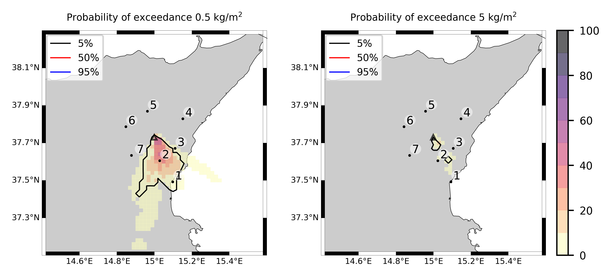  
  

|Location|Ground load [kg/m²] 5th perc|Ground load [kg/m²] 50th perc|Ground load [kg/m²] 95th perc|
| :--- | :--- | :--- | :--- |
|Catania AP (1)|0.00e+00|9.82e-05|1.38e+00|
|Nicolosi (2)|0.00e+00|3.77e-01|2.92e+00|
|Zafferana (3)|0.00e+00|0.00e+00|4.61e-02|
|Linguaglossa (4)|0.00e+00|0.00e+00|0.00e+00|
|Randazzo (5)|0.00e+00|0.00e+00|0.00e+00|
|Bronte (6)|0.00e+00|0.00e+00|0.00e+00|
|Biancavilla (7)|0.00e+00|0.00e+00|0.00e+00|
  

### Atmosphere 2021-02-16 17:30 Z
  
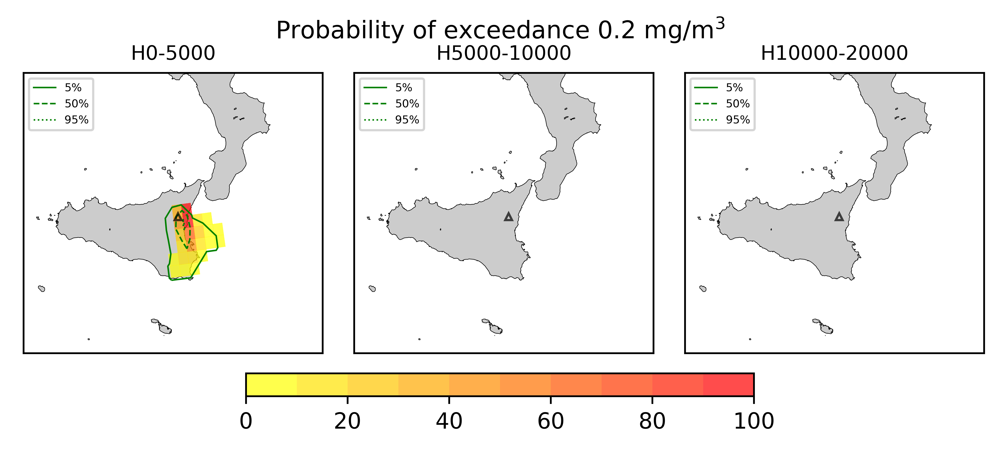
## Forecast at 2021-02-16 18:30 Z from RED VONA issued at 20210216_1631Z
  

|Eruption start [Z]|Eruption end [Z]|Forecast time [Z]|Column height asl [m]|
| :--- | :--- | :--- | :--- |
|2021-02-16 16:30:00|Ongoing|2021-02-16 18:30:00|6000 ± 500 - from VONA|
  
  

|Percentile|MER [kg/s¹]|Mass air [kg]|Mass air nested dom. [kg]|Mass grd [kg]|Mass grd nested dom. [kg]|
| :--- | :--- | :--- | :--- | :--- | :--- |
|5th|8.58e+03|2.78e+07|1.66e+07|1.45e+08|1.45e+08|
|50th|7.88e+04|1.12e+08|9.63e+07|4.67e+08|4.67e+08|
|95th|1.92e+05|2.62e+08|2.02e+08|1.18e+09|1.17e+09|
  

### Ground Nested Domain 2021-02-16 18:30 Z
  
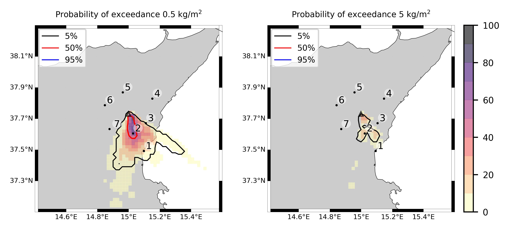  
  
  
  
  
  
  
  
  
  
  
  
  
  
  
  
  
  
  
  
  
  
  

|Location|Ground load [kg/m²] 5th perc|Ground load [kg/m²] 50th perc|Ground load [kg/m²] 95th perc|
| :--- | :--- | :--- | :--- |
|Catania AP (1)|2.40e-04|2.51e-02|1.79e+00|
|Nicolosi (2)|6.08e-04|1.32e+00|5.45e+00|
|Zafferana (3)|0.00e+00|0.00e+00|2.42e-01|
|Linguaglossa (4)|0.00e+00|0.00e+00|0.00e+00|
|Randazzo (5)|0.00e+00|0.00e+00|0.00e+00|
|Bronte (6)|0.00e+00|0.00e+00|0.00e+00|
|Biancavilla (7)|0.00e+00|0.00e+00|0.00e+00|
  

### Atmosphere 2021-02-16 18:30 Z
  
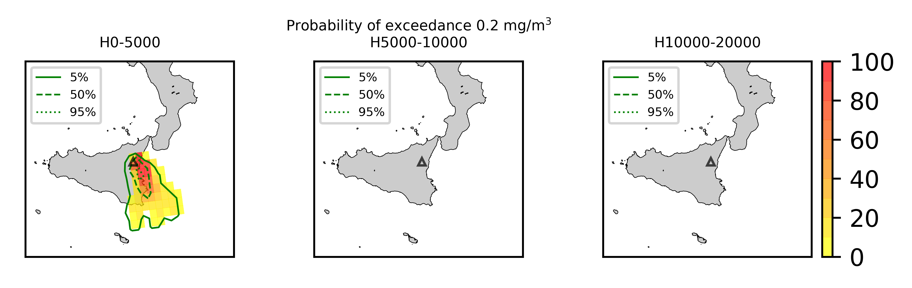
## Forecast at 2021-02-16 19:30 Z from RED VONA issued at 20210216_1631Z
  

|Eruption start [Z]|Eruption end [Z]|Forecast time [Z]|Column height asl [m]|
| :--- | :--- | :--- | :--- |
|2021-02-16 16:30:00|Ongoing|2021-02-16 19:30:00|6000 ± 500 - from VONA|
  
  

|Percentile|MER [kg/s¹]|Mass air [kg]|Mass air nested dom. [kg]|Mass grd [kg]|Mass grd nested dom. [kg]|
| :--- | :--- | :--- | :--- | :--- | :--- |
|5th|1.68e+04|5.33e+07|2.51e+07|2.98e+08|2.95e+08|
|50th|6.72e+04|1.19e+08|7.96e+07|7.35e+08|7.33e+08|
|95th|1.89e+05|2.85e+08|2.03e+08|1.62e+09|1.61e+09|
  

### Ground Nested Domain 2021-02-16 19:30 Z
  
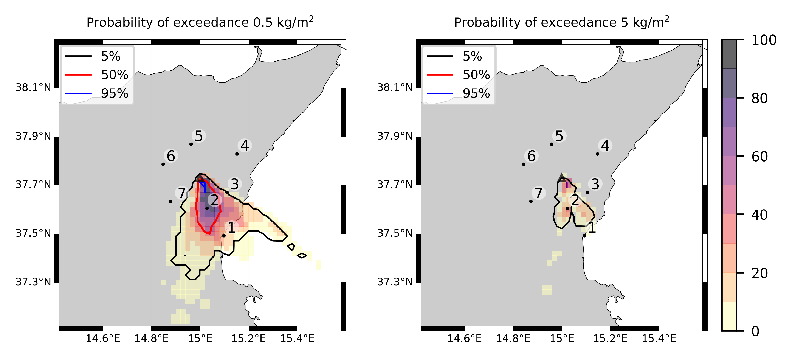  
  
  
  
  
  
  
  
  
  
  
  
  
  
  
  
  
  
  
  
  
  
  

|Location|Ground load [kg/m²] 5th perc|Ground load [kg/m²] 50th perc|Ground load [kg/m²] 95th perc|
| :--- | :--- | :--- | :--- |
|Catania AP (1)|8.31e-04|1.20e-01|2.17e+00|
|Nicolosi (2)|1.07e-01|2.31e+00|8.02e+00|
|Zafferana (3)|0.00e+00|1.80e-04|2.42e-01|
|Linguaglossa (4)|0.00e+00|0.00e+00|0.00e+00|
|Randazzo (5)|0.00e+00|0.00e+00|0.00e+00|
|Bronte (6)|0.00e+00|0.00e+00|0.00e+00|
|Biancavilla (7)|0.00e+00|0.00e+00|0.00e+00|
  

### Atmosphere 2021-02-16 19:30 Z
  
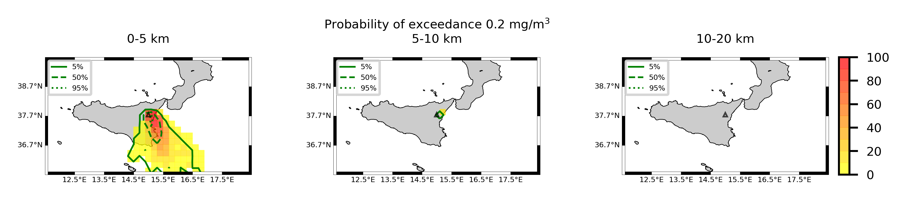
## Forecast at 2021-02-16 22:30 Z from RED VONA issued at 20210216_1631Z
  

|Eruption start [Z]|Eruption end [Z]|Forecast time [Z]|Column height asl [m]|
| :--- | :--- | :--- | :--- |
|2021-02-16 16:30:00|Ongoing|2021-02-16 22:30:00|6000 ± 500 - from VONA|
  
  

|Percentile|MER [kg/s¹]|Mass air [kg]|Mass air nested dom. [kg]|Mass grd [kg]|Mass grd nested dom. [kg]|
| :--- | :--- | :--- | :--- | :--- | :--- |
|5th|1.55e+04|3.32e+07|1.30e+07|8.40e+08|8.39e+08|
|50th|6.33e+04|8.78e+07|6.46e+07|1.31e+09|1.29e+09|
|95th|1.40e+05|2.30e+08|1.33e+08|2.55e+09|2.46e+09|
  

### Ground Nested Domain 2021-02-16 22:30 Z
  
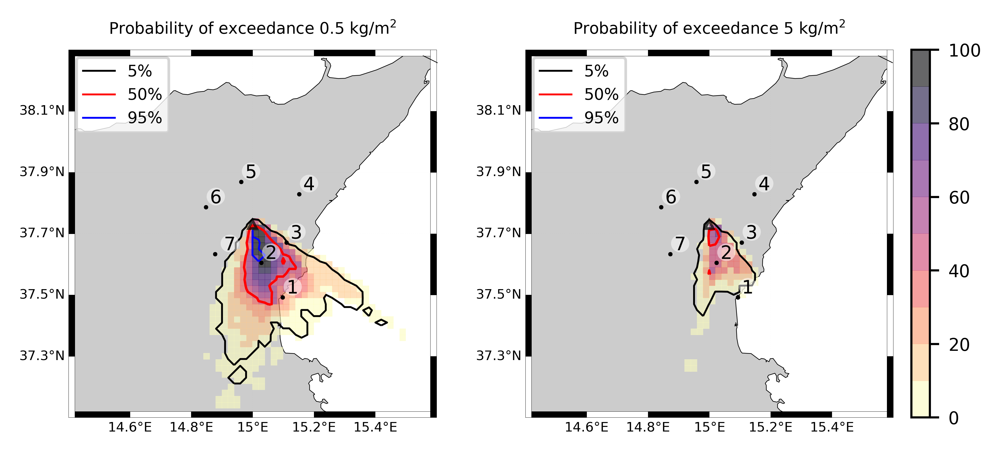  
  
  
  
  
  
  
  
  
  
  
  
  
  
  
  
  
  
  
  
  
  
  

|Location|Ground load [kg/m²] 5th perc|Ground load [kg/m²] 50th perc|Ground load [kg/m²] 95th perc|
| :--- | :--- | :--- | :--- |
|Catania AP (1)|2.43e-02|2.99e-01|3.73e+00|
|Nicolosi (2)|1.37e+00|5.12e+00|1.68e+01|
|Zafferana (3)|0.00e+00|1.13e-03|5.00e-01|
|Linguaglossa (4)|0.00e+00|0.00e+00|0.00e+00|
|Randazzo (5)|0.00e+00|0.00e+00|0.00e+00|
|Bronte (6)|0.00e+00|0.00e+00|0.00e+00|
|Biancavilla (7)|0.00e+00|0.00e+00|7.08e-06|
  

### Atmosphere 2021-02-16 22:30 Z
  
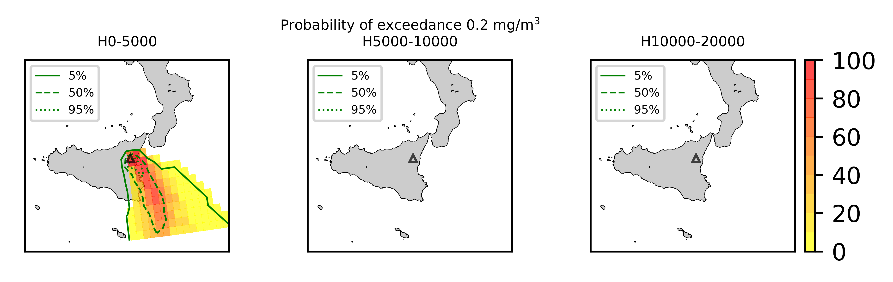
## Forecast at 2021-02-17 01:30 Z from RED VONA issued at 20210216_1631Z
  

|Eruption start [Z]|Eruption end [Z]|Forecast time [Z]|Column height asl [m]|
| :--- | :--- | :--- | :--- |
|2021-02-16 16:30:00|Ongoing|2021-02-17 01:30:00|6000 ± 500 - from VONA|
  
  

|Percentile|MER [kg/s¹]|Mass air [kg]|Mass air nested dom. [kg]|Mass grd [kg]|Mass grd nested dom. [kg]|
| :--- | :--- | :--- | :--- | :--- | :--- |
|5th|1.21e+04|2.27e+07|2.10e+07|1.33e+09|1.31e+09|
|50th|6.63e+04|9.52e+07|7.10e+07|1.90e+09|1.89e+09|
|95th|1.13e+05|2.91e+08|1.53e+08|3.50e+09|3.31e+09|
  

### Ground Nested Domain 2021-02-17 01:30 Z
  
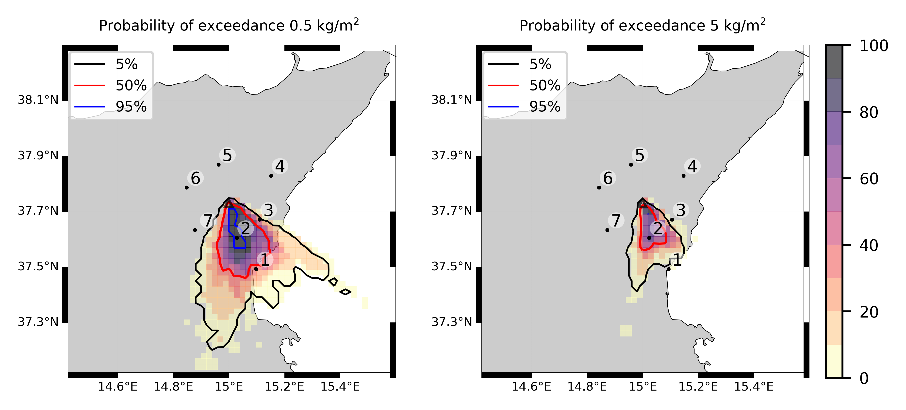  
  
  
  
  
  
  
  
  
  
  
  
  
  
  
  
  
  
  
  
  
  
  

|Location|Ground load [kg/m²] 5th perc|Ground load [kg/m²] 50th perc|Ground load [kg/m²] 95th perc|
| :--- | :--- | :--- | :--- |
|Catania AP (1)|1.14e-01|4.02e-01|3.86e+00|
|Nicolosi (2)|2.09e+00|9.27e+00|2.06e+01|
|Zafferana (3)|0.00e+00|1.71e-02|1.00e+00|
|Linguaglossa (4)|0.00e+00|0.00e+00|0.00e+00|
|Randazzo (5)|0.00e+00|0.00e+00|0.00e+00|
|Bronte (6)|0.00e+00|0.00e+00|0.00e+00|
|Biancavilla (7)|0.00e+00|0.00e+00|7.08e-06|
  

### Atmosphere 2021-02-17 01:30 Z
  
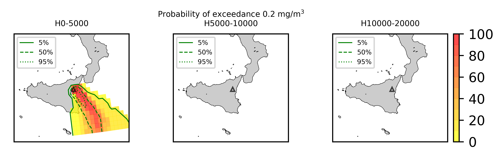
## Forecast at 2021-02-16 18:10 Z from RED VONA issued at 20210216_1705Z
  

|Eruption start [Z]|Eruption end [Z]|Forecast time [Z]|Column height asl [m]|
| :--- | :--- | :--- | :--- |
|2021-02-16 16:30:00|Ongoing|2021-02-16 18:10:00|10000 ± 500 - from VONA|
  
  

|Percentile|MER [kg/s¹]|Mass air [kg]|Mass air nested dom. [kg]|Mass grd [kg]|Mass grd nested dom. [kg]|
| :--- | :--- | :--- | :--- | :--- | :--- |
|5th|1.73e+05|3.64e+08|3.63e+08|4.55e+08|4.55e+08|
|50th|6.84e+05|1.53e+09|8.40e+08|1.19e+09|1.07e+09|
|95th|2.18e+06|3.70e+09|3.31e+09|4.28e+09|3.55e+09|
  

### Ground Nested Domain 2021-02-16 18:10 Z
  
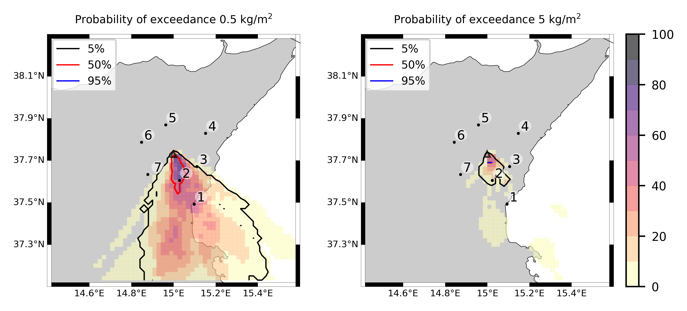  
  
  
  
  
  
  
  
  
  
  
  
  
  
  
  
  
  
  
  
  
  
  

|Location|Ground load [kg/m²] 5th perc|Ground load [kg/m²] 50th perc|Ground load [kg/m²] 95th perc|
| :--- | :--- | :--- | :--- |
|Catania AP (1)|4.10e-04|2.57e-01|1.88e+00|
|Nicolosi (2)|3.24e-03|9.84e-01|6.99e+00|
|Zafferana (3)|0.00e+00|1.37e-04|1.54e-01|
|Linguaglossa (4)|0.00e+00|0.00e+00|0.00e+00|
|Randazzo (5)|0.00e+00|0.00e+00|0.00e+00|
|Bronte (6)|0.00e+00|0.00e+00|0.00e+00|
|Biancavilla (7)|0.00e+00|0.00e+00|8.93e-04|
  

### Atmosphere 2021-02-16 18:10 Z
  
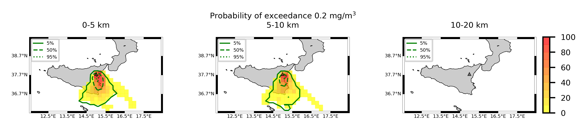
## Forecast at 2021-02-16 18:40 Z from RED VONA issued at 20210216_1738Z
  

|Eruption start [Z]|Eruption end [Z]|Forecast time [Z]|Column height asl [m]|
| :--- | :--- | :--- | :--- |
|2021-02-16 16:30:00|Ongoing|2021-02-16 18:40:00|[5000 m, 15000 m]|
  
  

|Percentile|MER [kg/s¹]|Mass air [kg]|Mass air nested dom. [kg]|Mass grd [kg]|Mass grd nested dom. [kg]|
| :--- | :--- | :--- | :--- | :--- | :--- |
|5th|2.11e+04|4.12e+07|3.84e+07|1.40e+09|1.07e+09|
|50th|6.82e+05|1.13e+09|1.02e+09|4.51e+09|4.28e+09|
|95th|2.62e+07|6.73e+10|3.18e+10|2.80e+10|2.38e+10|
  

### Ground Nested Domain 2021-02-16 18:40 Z
  
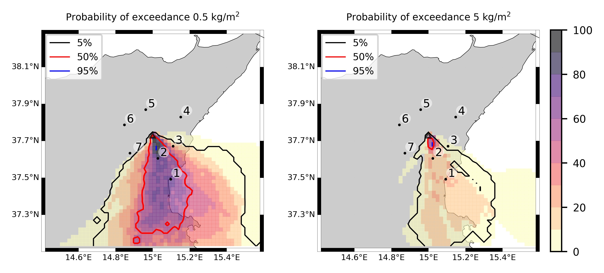  
  
  
  
  
  
  
  
  
  
  
  
  
  
  
  
  
  
  
  
  
  
  

|Location|Ground load [kg/m²] 5th perc|Ground load [kg/m²] 50th perc|Ground load [kg/m²] 95th perc|
| :--- | :--- | :--- | :--- |
|Catania AP (1)|6.73e-02|9.65e-01|1.28e+01|
|Nicolosi (2)|5.67e-01|3.01e+00|2.96e+01|
|Zafferana (3)|0.00e+00|1.78e-02|1.98e+00|
|Linguaglossa (4)|0.00e+00|0.00e+00|5.69e-03|
|Randazzo (5)|0.00e+00|0.00e+00|2.37e-04|
|Bronte (6)|0.00e+00|0.00e+00|6.63e-03|
|Biancavilla (7)|0.00e+00|0.00e+00|1.84e-01|
  

### Atmosphere 2021-02-16 18:40 Z
  
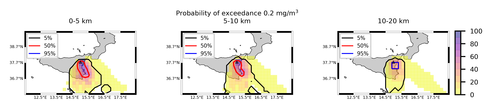
## Forecast at 2021-02-16 19:40 Z from RED VONA issued at 20210216_1738Z
  

|Eruption start [Z]|Eruption end [Z]|Forecast time [Z]|Column height asl [m]|
| :--- | :--- | :--- | :--- |
|2021-02-16 16:30:00|Ongoing|2021-02-16 19:40:00|[5000 m, 15000 m]|
  
  

|Percentile|MER [kg/s¹]|Mass air [kg]|Mass air nested dom. [kg]|Mass grd [kg]|Mass grd nested dom. [kg]|
| :--- | :--- | :--- | :--- | :--- | :--- |
|5th|2.55e+04|3.02e+08|6.64e+07|2.15e+09|1.96e+09|
|50th|4.74e+05|4.21e+09|7.56e+08|1.27e+10|7.55e+09|
|95th|2.68e+07|6.20e+10|3.71e+10|1.07e+11|6.70e+10|
  

### Ground Nested Domain 2021-02-16 19:40 Z
  
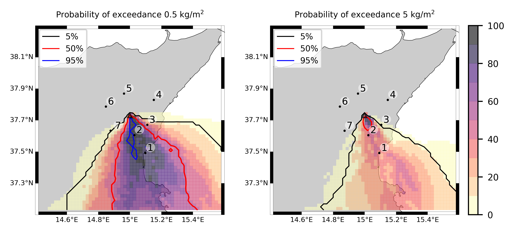  
  
  
  
  
  
  
  
  
  
  
  
  
  
  
  
  
  
  
  
  
  
  

|Location|Ground load [kg/m²] 5th perc|Ground load [kg/m²] 50th perc|Ground load [kg/m²] 95th perc|
| :--- | :--- | :--- | :--- |
|Catania AP (1)|3.60e-01|3.08e+00|1.80e+01|
|Nicolosi (2)|1.15e+00|4.14e+00|3.72e+01|
|Zafferana (3)|0.00e+00|5.86e-02|2.36e+00|
|Linguaglossa (4)|0.00e+00|0.00e+00|7.01e-03|
|Randazzo (5)|0.00e+00|0.00e+00|3.23e-04|
|Bronte (6)|0.00e+00|0.00e+00|8.31e-03|
|Biancavilla (7)|0.00e+00|1.28e-03|2.64e-01|
  

### Atmosphere 2021-02-16 19:40 Z
  
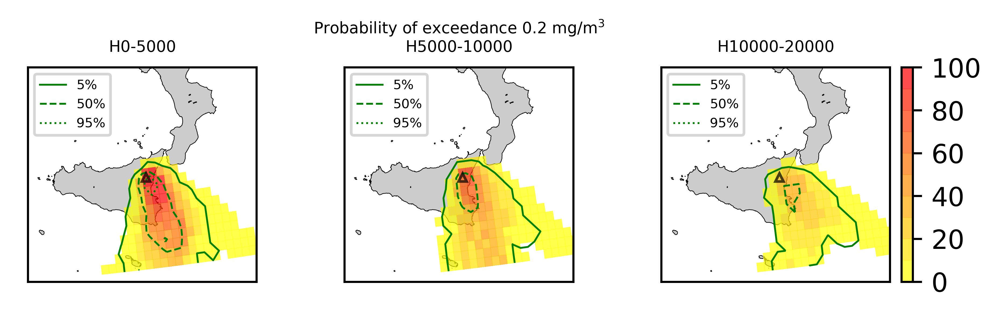
## Forecast at 2021-02-16 20:40 Z from RED VONA issued at 20210216_1738Z
  

|Eruption start [Z]|Eruption end [Z]|Forecast time [Z]|Column height asl [m]|
| :--- | :--- | :--- | :--- |
|2021-02-16 16:30:00|Ongoing|2021-02-16 20:40:00|[5000 m, 15000 m]|
  
  

|Percentile|MER [kg/s¹]|Mass air [kg]|Mass air nested dom. [kg]|Mass grd [kg]|Mass grd nested dom. [kg]|
| :--- | :--- | :--- | :--- | :--- | :--- |
|5th|6.85e+04|2.20e+08|7.64e+07|3.00e+09|2.39e+09|
|50th|5.77e+05|2.39e+09|7.48e+08|2.94e+10|1.69e+10|
|95th|3.51e+07|9.12e+10|3.56e+10|2.29e+11|1.01e+11|
  

### Ground Nested Domain 2021-02-16 20:40 Z
  
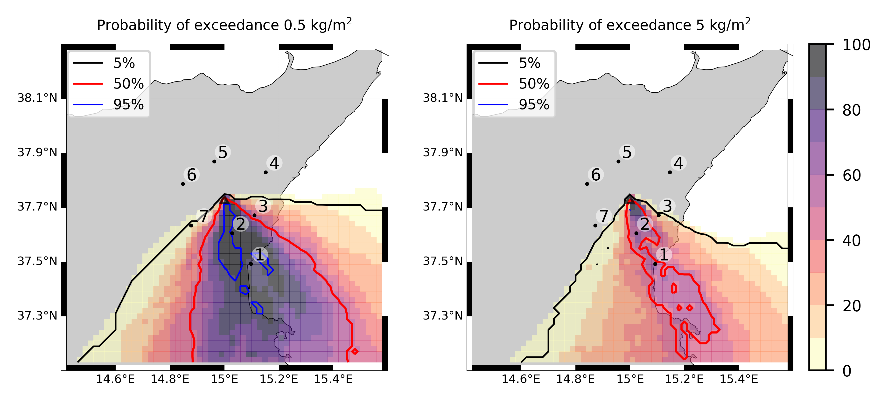  
  
  
  
  
  
  
  
  
  
  
  
  
  
  
  
  
  
  
  
  
  
  

|Location|Ground load [kg/m²] 5th perc|Ground load [kg/m²] 50th perc|Ground load [kg/m²] 95th perc|
| :--- | :--- | :--- | :--- |
|Catania AP (1)|3.85e-01|5.57e+00|2.04e+01|
|Nicolosi (2)|1.53e+00|7.12e+00|3.89e+01|
|Zafferana (3)|3.00e-05|1.54e-01|1.94e+01|
|Linguaglossa (4)|0.00e+00|0.00e+00|1.54e-02|
|Randazzo (5)|0.00e+00|0.00e+00|4.52e-04|
|Bronte (6)|0.00e+00|0.00e+00|8.42e-03|
|Biancavilla (7)|0.00e+00|9.04e-03|3.14e-01|
  

### Atmosphere 2021-02-16 20:40 Z
  
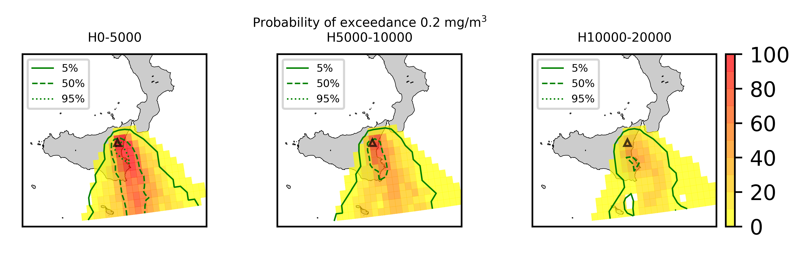
## Forecast at 2021-02-16 23:40 Z from RED VONA issued at 20210216_1738Z
  

|Eruption start [Z]|Eruption end [Z]|Forecast time [Z]|Column height asl [m]|
| :--- | :--- | :--- | :--- |
|2021-02-16 16:30:00|Ongoing|2021-02-16 23:40:00|[5000 m, 15000 m]|
  
  

|Percentile|MER [kg/s¹]|Mass air [kg]|Mass air nested dom. [kg]|Mass grd [kg]|Mass grd nested dom. [kg]|
| :--- | :--- | :--- | :--- | :--- | :--- |
|5th|6.52e+04|1.00e+08|6.96e+07|9.63e+09|7.58e+09|
|50th|4.87e+05|1.05e+09|7.97e+08|9.05e+10|5.03e+10|
|95th|3.11e+07|5.98e+10|2.59e+10|3.08e+11|1.15e+11|
  

### Ground Nested Domain 2021-02-16 23:40 Z
  
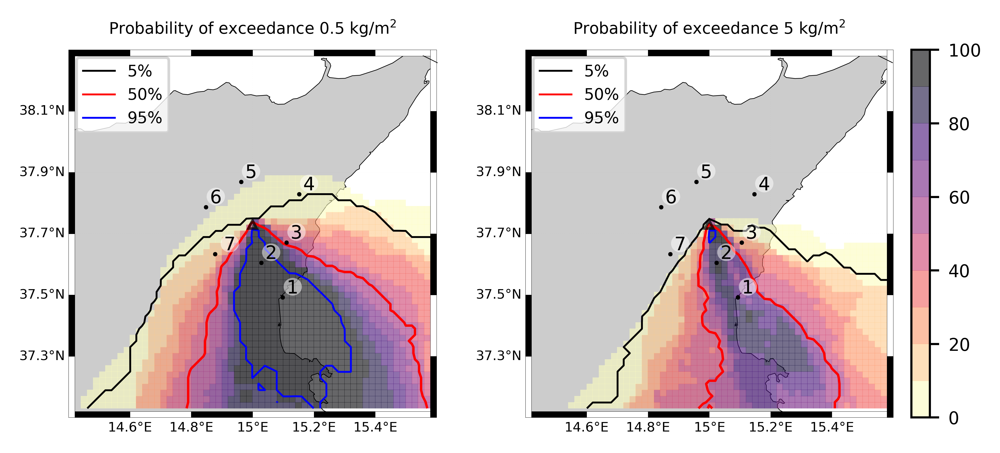  
  
  
  
  
  
  
  
  
  
  
  
  
  
  
  
  
  
  
  
  
  
  

|Location|Ground load [kg/m²] 5th perc|Ground load [kg/m²] 50th perc|Ground load [kg/m²] 95th perc|
| :--- | :--- | :--- | :--- |
|Catania AP (1)|2.06e+00|8.58e+00|3.63e+01|
|Nicolosi (2)|3.81e+00|1.46e+01|1.63e+02|
|Zafferana (3)|1.89e-02|2.33e-01|2.34e+01|
|Linguaglossa (4)|0.00e+00|0.00e+00|1.42e-01|
|Randazzo (5)|0.00e+00|0.00e+00|4.00e-03|
|Bronte (6)|0.00e+00|8.33e-05|2.68e-02|
|Biancavilla (7)|1.26e-05|3.02e-02|1.07e+00|
  

### Atmosphere 2021-02-16 23:40 Z
  
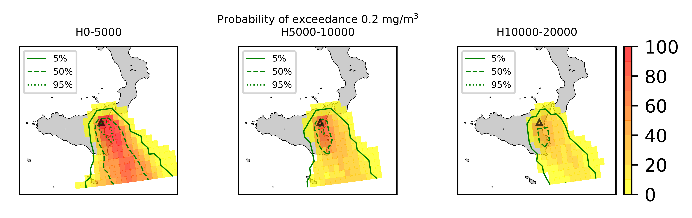
## Forecast at 2021-02-17 02:40 Z from RED VONA issued at 20210216_1738Z
  

|Eruption start [Z]|Eruption end [Z]|Forecast time [Z]|Column height asl [m]|
| :--- | :--- | :--- | :--- |
|2021-02-16 16:30:00|Ongoing|2021-02-17 02:40:00|[5000 m, 15000 m]|
  
  

|Percentile|MER [kg/s¹]|Mass air [kg]|Mass air nested dom. [kg]|Mass grd [kg]|Mass grd nested dom. [kg]|
| :--- | :--- | :--- | :--- | :--- | :--- |
|5th|3.64e+04|7.79e+07|5.16e+07|1.75e+10|1.27e+10|
|50th|6.15e+05|9.55e+08|8.12e+08|1.76e+11|6.60e+10|
|95th|1.83e+07|4.73e+10|2.26e+10|3.90e+11|1.50e+11|
  

### Ground Nested Domain 2021-02-17 02:40 Z
  
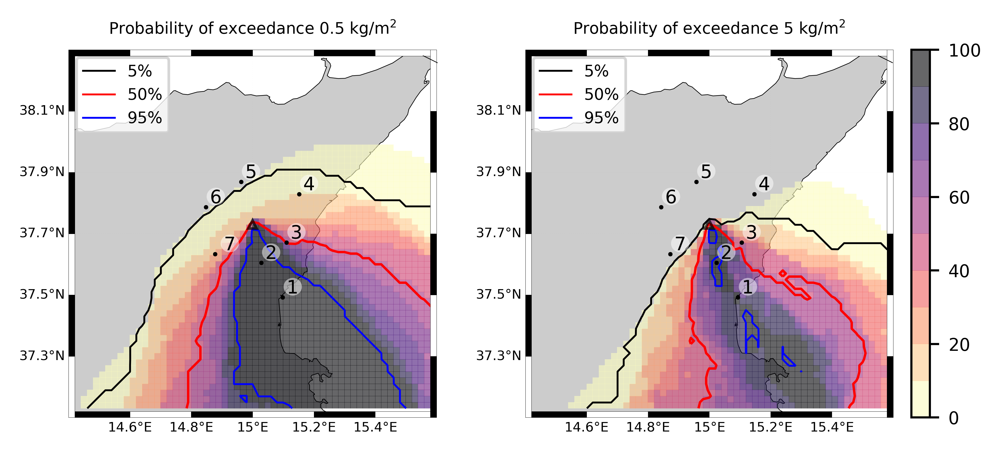  
  
  
  
  
  
  
  
  
  
  
  
  
  
  
  
  
  
  
  
  
  
  

|Location|Ground load [kg/m²] 5th perc|Ground load [kg/m²] 50th perc|Ground load [kg/m²] 95th perc|
| :--- | :--- | :--- | :--- |
|Catania AP (1)|4.28e+00|2.14e+01|5.76e+01|
|Nicolosi (2)|7.52e+00|1.99e+01|1.99e+02|
|Zafferana (3)|2.27e-02|3.65e-01|7.33e+01|
|Linguaglossa (4)|0.00e+00|0.00e+00|1.44e+00|
|Randazzo (5)|0.00e+00|0.00e+00|2.69e-01|
|Bronte (6)|0.00e+00|8.33e-05|2.44e-01|
|Biancavilla (7)|1.26e-05|3.07e-02|2.51e+00|
  

### Atmosphere 2021-02-17 02:40 Z
  

## Forecast at 2021-02-17 05:40 Z from RED VONA issued at 20210216_1738Z
  

|Eruption start [Z]|Eruption end [Z]|Forecast time [Z]|Column height asl [m]|
| :--- | :--- | :--- | :--- |
|2021-02-16 16:30:00|Ongoing|2021-02-17 05:40:00|[5000 m, 15000 m]|
  
  

|Percentile|MER [kg/s¹]|Mass air [kg]|Mass air nested dom. [kg]|Mass grd [kg]|Mass grd nested dom. [kg]|
| :--- | :--- | :--- | :--- | :--- | :--- |
|5th|5.76e+04|1.35e+08|6.80e+07|3.33e+10|2.45e+10|
|50th|3.82e+05|2.37e+09|5.24e+08|2.28e+11|9.24e+10|
|95th|2.64e+07|5.57e+10|2.73e+10|4.81e+11|2.01e+11|
  

### Ground Nested Domain 2021-02-17 05:40 Z
  
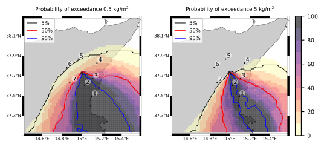  
  
  
  
  
  
  
  
  
  
  
  
  
  
  
  
  
  
  
  
  
  
  

|Location|Ground load [kg/m²] 5th perc|Ground load [kg/m²] 50th perc|Ground load [kg/m²] 95th perc|
| :--- | :--- | :--- | :--- |
|Catania AP (1)|6.33e+00|2.46e+01|6.17e+01|
|Nicolosi (2)|7.74e+00|3.14e+01|2.20e+02|
|Zafferana (3)|3.43e-02|2.02e+00|7.55e+01|
|Linguaglossa (4)|0.00e+00|9.07e-04|1.44e+00|
|Randazzo (5)|0.00e+00|0.00e+00|2.69e-01|
|Bronte (6)|0.00e+00|2.68e-04|3.02e-01|
|Biancavilla (7)|1.26e-05|1.30e-01|2.54e+00|
  

### Atmosphere 2021-02-17 05:40 Z
  
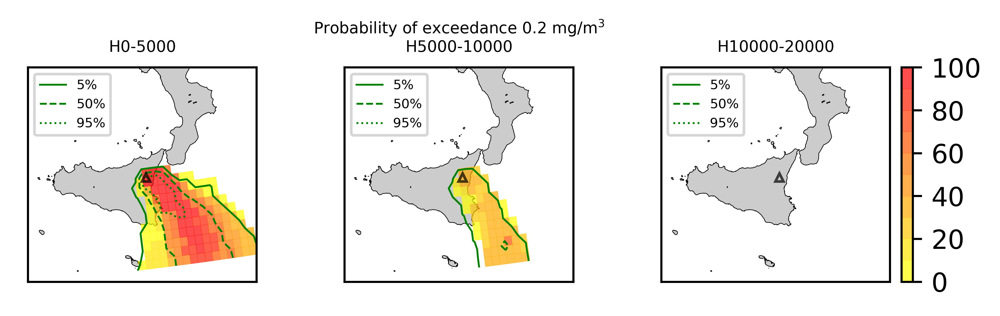
## Forecast at 2021-02-17 08:30 Z from ORANGE VONA issued at 20210217_0531Z
  

|Eruption start [Z]|Eruption end [Z]|Forecast time [Z]|Column height asl [m]|
| :--- | :--- | :--- | :--- |
|2021-02-16 16:30:00|2021-02-17 05:30:00|2021-02-17 08:30:00|[5000 m, 15000 m]|
  
  

|Percentile|MER [kg/s¹]|Mass air [kg]|Mass air nested dom. [kg]|Mass grd [kg]|Mass grd nested dom. [kg]|
| :--- | :--- | :--- | :--- | :--- | :--- |
|5th|0.00e+00|2.85e+06|4.20e+03|3.49e+10|2.57e+10|
|50th|0.00e+00|3.30e+07|1.93e+05|2.28e+11|9.91e+10|
|95th|0.00e+00|1.55e+09|4.94e+06|5.02e+11|2.01e+11|
  

### Ground Nested Domain 2021-02-17 08:30 Z
  
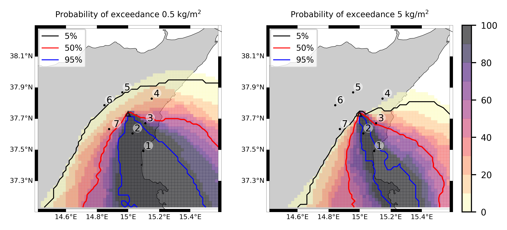  
  
  
  
  
  
  
  
  
  
  
  
  
  
  
  
  
  
  
  
  
  
  

|Location|Ground load [kg/m²] 5th perc|Ground load [kg/m²] 50th perc|Ground load [kg/m²] 95th perc|
| :--- | :--- | :--- | :--- |
|Catania AP (1)|7.04e+00|2.47e+01|6.18e+01|
|Nicolosi (2)|8.24e+00|3.16e+01|2.21e+02|
|Zafferana (3)|3.96e-02|1.96e+00|7.55e+01|
|Linguaglossa (4)|0.00e+00|9.07e-04|1.44e+00|
|Randazzo (5)|0.00e+00|0.00e+00|2.69e-01|
|Bronte (6)|0.00e+00|5.58e-04|3.02e-01|
|Biancavilla (7)|1.26e-05|1.35e-01|2.54e+00|
  

### Atmosphere 2021-02-17 08:30 Z
  
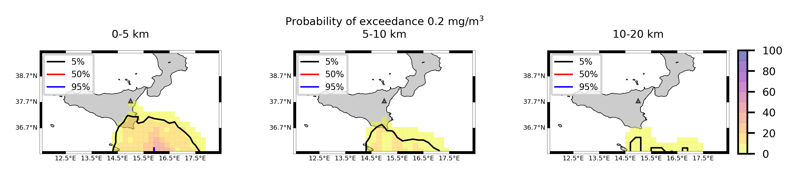
## Forecast at 2021-02-17 11:30 Z from ORANGE VONA issued at 20210217_0531Z
  

|Eruption start [Z]|Eruption end [Z]|Forecast time [Z]|Column height asl [m]|
| :--- | :--- | :--- | :--- |
|2021-02-16 16:30:00|2021-02-17 05:30:00|2021-02-17 11:30:00|None|
  
  

|Percentile|MER [kg/s¹]|Mass air [kg]|Mass air nested dom. [kg]|Mass grd [kg]|Mass grd nested dom. [kg]|
| :--- | :--- | :--- | :--- | :--- | :--- |
|5th|0.00e+00|1.97e+05|7.04e+02|3.49e+10|2.57e+10|
|50th|0.00e+00|1.64e+06|1.42e+04|2.28e+11|9.91e+10|
|95th|0.00e+00|5.70e+07|1.29e+05|5.03e+11|2.01e+11|
  

### Ground Nested Domain 2021-02-17 11:30 Z
  
  
  
  
  
  
  
  
  
  
  
  
  
  
  
  
  
  
  
  
  
  
  
  

|Location|Ground load [kg/m²] 5th perc|Ground load [kg/m²] 50th perc|Ground load [kg/m²] 95th perc|
| :--- | :--- | :--- | :--- |
|Catania AP (1)|7.04e+00|2.47e+01|6.18e+01|
|Nicolosi (2)|8.24e+00|3.16e+01|2.21e+02|
|Zafferana (3)|3.96e-02|1.96e+00|7.55e+01|
|Linguaglossa (4)|0.00e+00|9.07e-04|1.44e+00|
|Randazzo (5)|0.00e+00|0.00e+00|2.69e-01|
|Bronte (6)|0.00e+00|5.58e-04|3.02e-01|
|Biancavilla (7)|1.26e-05|1.35e-01|2.54e+00|
  

### Atmosphere 2021-02-17 11:30 Z
  
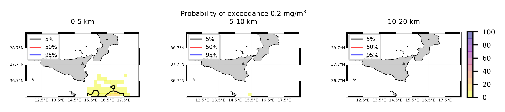
## Forecast at 2021-02-17 14:30 Z from ORANGE VONA issued at 20210217_0531Z
  

|Eruption start [Z]|Eruption end [Z]|Forecast time [Z]|Column height asl [m]|
| :--- | :--- | :--- | :--- |
|2021-02-16 16:30:00|2021-02-17 05:30:00|2021-02-17 14:30:00|None|
  
  

|Percentile|MER [kg/s¹]|Mass air [kg]|Mass air nested dom. [kg]|Mass grd [kg]|Mass grd nested dom. [kg]|
| :--- | :--- | :--- | :--- | :--- | :--- |
|5th|0.00e+00|2.58e+04|3.71e+02|3.49e+10|2.57e+10|
|50th|0.00e+00|3.32e+05|4.00e+03|2.28e+11|9.91e+10|
|95th|0.00e+00|1.46e+07|3.65e+04|5.03e+11|2.01e+11|
  

### Ground Nested Domain 2021-02-17 14:30 Z
  
  
  
  
  
  
  
  
  
  
  
  
  
  
  
  
  
  
  
  
  
  
  
  

|Location|Ground load [kg/m²] 5th perc|Ground load [kg/m²] 50th perc|Ground load [kg/m²] 95th perc|
| :--- | :--- | :--- | :--- |
|Catania AP (1)|7.04e+00|2.47e+01|6.18e+01|
|Nicolosi (2)|8.24e+00|3.16e+01|2.21e+02|
|Zafferana (3)|3.96e-02|1.96e+00|7.55e+01|
|Linguaglossa (4)|0.00e+00|9.07e-04|1.44e+00|
|Randazzo (5)|0.00e+00|0.00e+00|2.69e-01|
|Bronte (6)|0.00e+00|5.58e-04|3.02e-01|
|Biancavilla (7)|1.26e-05|1.35e-01|2.54e+00|
  

### Atmosphere 2021-02-17 14:30 Z
  
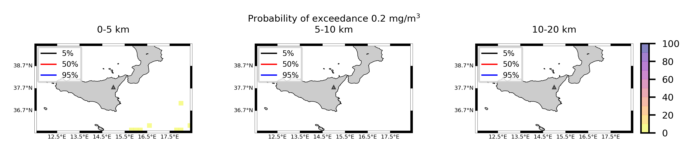
## Forecast at 2021-02-17 17:30 Z from ORANGE VONA issued at 20210217_0531Z
  

|Eruption start [Z]|Eruption end [Z]|Forecast time [Z]|Column height asl [m]|
| :--- | :--- | :--- | :--- |
|2021-02-16 16:30:00|2021-02-17 05:30:00|2021-02-17 17:30:00|None|
  
  

|Percentile|MER [kg/s¹]|Mass air [kg]|Mass air nested dom. [kg]|Mass grd [kg]|Mass grd nested dom. [kg]|
| :--- | :--- | :--- | :--- | :--- | :--- |
|5th|0.00e+00|3.22e+03|1.76e+02|3.49e+10|2.57e+10|
|50th|0.00e+00|1.01e+05|1.87e+03|2.28e+11|9.91e+10|
|95th|0.00e+00|4.09e+06|1.67e+04|5.03e+11|2.01e+11|
  

### Ground Nested Domain 2021-02-17 17:30 Z
  
  
  
  
  
  
  
  
  
  
  
  
  
  
  
  
  
  
  
  
  
  
  
  

|Location|Ground load [kg/m²] 5th perc|Ground load [kg/m²] 50th perc|Ground load [kg/m²] 95th perc|
| :--- | :--- | :--- | :--- |
|Catania AP (1)|7.04e+00|2.47e+01|6.18e+01|
|Nicolosi (2)|8.24e+00|3.16e+01|2.21e+02|
|Zafferana (3)|3.96e-02|1.96e+00|7.55e+01|
|Linguaglossa (4)|0.00e+00|9.07e-04|1.44e+00|
|Randazzo (5)|0.00e+00|0.00e+00|2.69e-01|
|Bronte (6)|0.00e+00|5.58e-04|3.02e-01|
|Biancavilla (7)|1.26e-05|1.35e-01|2.54e+00|
  

### Atmosphere 2021-02-17 17:30 Z
  
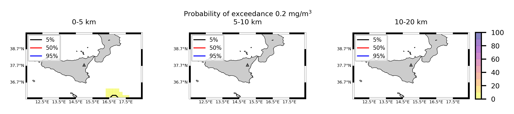  
Go to [Supplementary page](Supplementary_page.md)  
Go to [Main directory](https://github.com/federicapardini/Real_time_ash_forecast)
