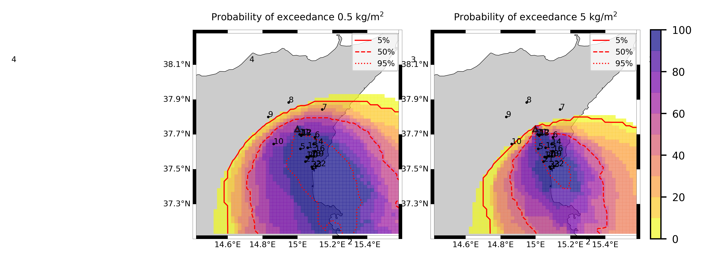
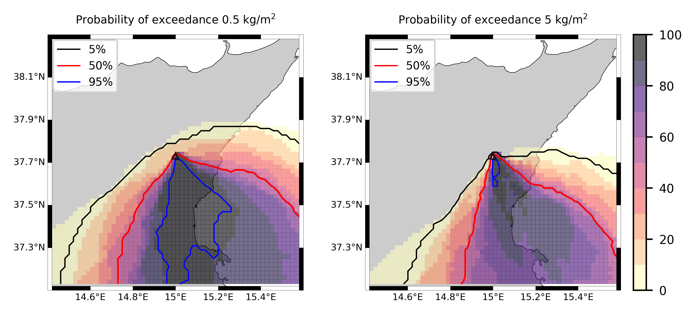

Forecast from VONA_20210216_1631Z
=================================

Contents
========

* [Forecast products](#forecast-products)
	* [Forecast at 2021-02-16 17:30 Z from RED VONA issued at 20210216_1631Z](#forecast-at-2021-02-16-1730-z-from-red-vona-issued-at-20210216_1631z)
	* [Forecast at 2021-02-16 18:30 Z from RED VONA issued at 20210216_1631Z](#forecast-at-2021-02-16-1830-z-from-red-vona-issued-at-20210216_1631z)
	* [Forecast at 2021-02-16 19:30 Z from RED VONA issued at 20210216_1631Z](#forecast-at-2021-02-16-1930-z-from-red-vona-issued-at-20210216_1631z)
	* [Forecast at 2021-02-16 22:30 Z from RED VONA issued at 20210216_1631Z](#forecast-at-2021-02-16-2230-z-from-red-vona-issued-at-20210216_1631z)
	* [Forecast at 2021-02-17 01:30 Z from RED VONA issued at 20210216_1631Z](#forecast-at-2021-02-17-0130-z-from-red-vona-issued-at-20210216_1631z)
	* [Forecast at 2021-02-16 18:10 Z from RED VONA issued at 20210216_1705Z](#forecast-at-2021-02-16-1810-z-from-red-vona-issued-at-20210216_1705z)
	* [Forecast at 2021-02-16 18:40 Z from RED VONA issued at 20210216_1738Z](#forecast-at-2021-02-16-1840-z-from-red-vona-issued-at-20210216_1738z)
	* [Forecast at 2021-02-16 19:40 Z from RED VONA issued at 20210216_1738Z](#forecast-at-2021-02-16-1940-z-from-red-vona-issued-at-20210216_1738z)
	* [Forecast at 2021-02-16 20:40 Z from RED VONA issued at 20210216_1738Z](#forecast-at-2021-02-16-2040-z-from-red-vona-issued-at-20210216_1738z)
	* [Forecast at 2021-02-16 23:40 Z from RED VONA issued at 20210216_1738Z](#forecast-at-2021-02-16-2340-z-from-red-vona-issued-at-20210216_1738z)
	* [Forecast at 2021-02-17 02:40 Z from RED VONA issued at 20210216_1738Z](#forecast-at-2021-02-17-0240-z-from-red-vona-issued-at-20210216_1738z)
	* [Forecast at 2021-02-17 05:40 Z from RED VONA issued at 20210216_1738Z](#forecast-at-2021-02-17-0540-z-from-red-vona-issued-at-20210216_1738z)
	* [Forecast at 2021-02-17 08:30 Z from ORANGE VONA issued at 20210217_0531Z](#forecast-at-2021-02-17-0830-z-from-orange-vona-issued-at-20210217_0531z)
	* [Forecast at 2021-02-17 11:30 Z from ORANGE VONA issued at 20210217_0531Z](#forecast-at-2021-02-17-1130-z-from-orange-vona-issued-at-20210217_0531z)
	* [Forecast at 2021-02-17 14:30 Z from ORANGE VONA issued at 20210217_0531Z](#forecast-at-2021-02-17-1430-z-from-orange-vona-issued-at-20210217_0531z)

# Forecast products

## Forecast at 2021-02-16 17:30 Z from RED VONA issued at 20210216_1631Z
  

|Eruption start [Z]|Eruption end [Z]|Forecast time [Z]|Column height asl [m]|
| :--- | :--- | :--- | :--- |
|2021-02-16 16:30:00|Ongoing|2021-02-16 17:30:00|6000 ± 500 - from VONA|
  
  

|Percentile|MER [kg/s¹]|Mass air [kg]|Mass air nested dom. [kg]|Mass grd [kg]|Mass grd nested dom. [kg]|
| :--- | :--- | :--- | :--- | :--- | :--- |
|5th|1.43e+04|1.37e+07|1.37e+07|4.16e+07|4.16e+07|
|50th|8.93e+04|9.06e+07|9.06e+07|2.23e+08|2.23e+08|
|95th|2.16e+05|3.14e+08|2.85e+08|3.88e+08|3.84e+08|
  

### Ground Nested Domain 2021-02-16 17:30 Z
  
  
  
  
  
  
  
  
  
  
  
  
  
  
  
  
  
  
  
  
  
  
  
  
  
  

|Location|Ground load [kg/m²] 5th perc|Ground load [kg/m²] 50th perc|Ground load [kg/m²] 95th perc|
| :--- | :--- | :--- | :--- |
|Catania AP (1)|0.00e+00|1.20e-03|7.46e-01|
|Siracusa (2)|nan|nan|nan|
|Reggio Calabria (3)|nan|nan|nan|
|Palermo (4)|nan|nan|nan|
|Nicolosi (5)|0.00e+00|2.16e-01|2.86e+00|
|Zafferana (6)|0.00e+00|0.00e+00|7.94e-03|
|Linguaglossa (7)|0.00e+00|0.00e+00|0.00e+00|
|Randazzo (8)|0.00e+00|0.00e+00|0.00e+00|
|Bronte (9)|0.00e+00|0.00e+00|0.00e+00|
|Biancavilla (10)|0.00e+00|0.00e+00|0.00e+00|
|Sarro (11)|0.00e+00|0.00e+00|1.17e-02|
|Airone (12)|0.00e+00|0.00e+00|4.40e-02|
|Zafferana Ingresso (13)|0.00e+00|0.00e+00|3.59e-03|
|Zafferana Rotonda (14)|0.00e+00|0.00e+00|1.75e-03|
|Petrulli (15)|0.00e+00|0.00e+00|6.44e-04|
|Milo (16)|0.00e+00|0.00e+00|0.00e+00|
|Fornazzo (17)|0.00e+00|0.00e+00|0.00e+00|
|Rinuccio (18)|0.00e+00|0.00e+00|0.00e+00|
|S. Alfio (19)|0.00e+00|0.00e+00|0.00e+00|
|Macchia (20)|0.00e+00|0.00e+00|0.00e+00|
|S. Venerina (21)|0.00e+00|0.00e+00|0.00e+00|
|Linera (22)|0.00e+00|0.00e+00|4.86e-04|
|Dagala chiesa S. Maria (23)|0.00e+00|0.00e+00|0.00e+00|
|Giarre Piazza Maccheroni (24)|0.00e+00|0.00e+00|0.00e+00|
|Milo parco (25)|0.00e+00|0.00e+00|0.00e+00|
  

### Atmosphere 2021-02-16 17:30 Z
  

## Forecast at 2021-02-16 18:30 Z from RED VONA issued at 20210216_1631Z
  

|Eruption start [Z]|Eruption end [Z]|Forecast time [Z]|Column height asl [m]|
| :--- | :--- | :--- | :--- |
|2021-02-16 16:30:00|Ongoing|2021-02-16 18:30:00|6000 ± 500 - from VONA|
  
  

|Percentile|MER [kg/s¹]|Mass air [kg]|Mass air nested dom. [kg]|Mass grd [kg]|Mass grd nested dom. [kg]|
| :--- | :--- | :--- | :--- | :--- | :--- |
|5th|1.52e+04|2.61e+07|1.97e+07|1.96e+08|1.96e+08|
|50th|6.95e+04|9.90e+07|8.53e+07|4.36e+08|4.35e+08|
|95th|1.84e+05|2.34e+08|1.97e+08|9.42e+08|8.99e+08|
  

### Ground Nested Domain 2021-02-16 18:30 Z
  
  
  
  
  
  
  
  
  
  
  
  
  
  
  
  
  
  
  
  
  
  
  
  
  
  

|Location|Ground load [kg/m²] 5th perc|Ground load [kg/m²] 50th perc|Ground load [kg/m²] 95th perc|
| :--- | :--- | :--- | :--- |
|Catania AP (1)|2.74e-04|4.02e-02|1.20e+00|
|Siracusa (2)|nan|nan|nan|
|Reggio Calabria (3)|nan|nan|nan|
|Palermo (4)|nan|nan|nan|
|Nicolosi (5)|5.33e-03|1.68e+00|4.07e+00|
|Zafferana (6)|0.00e+00|0.00e+00|1.53e-01|
|Linguaglossa (7)|0.00e+00|0.00e+00|0.00e+00|
|Randazzo (8)|0.00e+00|0.00e+00|0.00e+00|
|Bronte (9)|0.00e+00|0.00e+00|0.00e+00|
|Biancavilla (10)|0.00e+00|0.00e+00|2.36e-06|
|Sarro (11)|0.00e+00|0.00e+00|2.70e-01|
|Airone (12)|0.00e+00|5.91e-05|1.62e-01|
|Zafferana Ingresso (13)|0.00e+00|0.00e+00|6.48e-02|
|Zafferana Rotonda (14)|0.00e+00|0.00e+00|6.84e-03|
|Petrulli (15)|0.00e+00|0.00e+00|2.24e-03|
|Milo (16)|0.00e+00|0.00e+00|2.23e-05|
|Fornazzo (17)|0.00e+00|0.00e+00|0.00e+00|
|Rinuccio (18)|0.00e+00|0.00e+00|0.00e+00|
|S. Alfio (19)|0.00e+00|0.00e+00|3.96e-06|
|Macchia (20)|0.00e+00|0.00e+00|3.02e-05|
|S. Venerina (21)|0.00e+00|0.00e+00|9.05e-04|
|Linera (22)|0.00e+00|0.00e+00|1.06e-01|
|Dagala chiesa S. Maria (23)|0.00e+00|0.00e+00|4.68e-04|
|Giarre Piazza Maccheroni (24)|0.00e+00|0.00e+00|1.09e-05|
|Milo parco (25)|0.00e+00|0.00e+00|2.12e-05|
  

### Atmosphere 2021-02-16 18:30 Z
  

## Forecast at 2021-02-16 19:30 Z from RED VONA issued at 20210216_1631Z
  

|Eruption start [Z]|Eruption end [Z]|Forecast time [Z]|Column height asl [m]|
| :--- | :--- | :--- | :--- |
|2021-02-16 16:30:00|Ongoing|2021-02-16 19:30:00|6000 ± 500 - from VONA|
  
  

|Percentile|MER [kg/s¹]|Mass air [kg]|Mass air nested dom. [kg]|Mass grd [kg]|Mass grd nested dom. [kg]|
| :--- | :--- | :--- | :--- | :--- | :--- |
|5th|1.71e+04|4.14e+07|2.46e+07|4.47e+08|4.46e+08|
|50th|7.66e+04|1.05e+08|7.38e+07|6.68e+08|6.54e+08|
|95th|1.46e+05|2.03e+08|1.74e+08|1.32e+09|1.30e+09|
  

### Ground Nested Domain 2021-02-16 19:30 Z
  
  
  
  
  
  
  
  
  
  
  
  
  
  
  
  
  
  
  
  
  
  
  
  
  
  

|Location|Ground load [kg/m²] 5th perc|Ground load [kg/m²] 50th perc|Ground load [kg/m²] 95th perc|
| :--- | :--- | :--- | :--- |
|Catania AP (1)|6.52e-04|1.25e-01|1.80e+00|
|Siracusa (2)|nan|nan|nan|
|Reggio Calabria (3)|nan|nan|nan|
|Palermo (4)|nan|nan|nan|
|Nicolosi (5)|2.11e-01|2.55e+00|8.88e+00|
|Zafferana (6)|0.00e+00|1.17e-04|2.08e-01|
|Linguaglossa (7)|0.00e+00|0.00e+00|0.00e+00|
|Randazzo (8)|0.00e+00|0.00e+00|0.00e+00|
|Bronte (9)|0.00e+00|0.00e+00|0.00e+00|
|Biancavilla (10)|0.00e+00|0.00e+00|1.47e-05|
|Sarro (11)|0.00e+00|2.11e-04|3.69e-01|
|Airone (12)|0.00e+00|6.48e-04|2.63e-01|
|Zafferana Ingresso (13)|0.00e+00|3.38e-05|8.46e-02|
|Zafferana Rotonda (14)|0.00e+00|0.00e+00|4.65e-02|
|Petrulli (15)|0.00e+00|0.00e+00|1.69e-02|
|Milo (16)|0.00e+00|0.00e+00|1.11e-04|
|Fornazzo (17)|0.00e+00|0.00e+00|2.44e-05|
|Rinuccio (18)|0.00e+00|0.00e+00|1.74e-05|
|S. Alfio (19)|0.00e+00|0.00e+00|7.92e-06|
|Macchia (20)|0.00e+00|0.00e+00|1.72e-04|
|S. Venerina (21)|0.00e+00|0.00e+00|4.76e-03|
|Linera (22)|0.00e+00|4.92e-05|1.44e-01|
|Dagala chiesa S. Maria (23)|0.00e+00|0.00e+00|2.69e-03|
|Giarre Piazza Maccheroni (24)|0.00e+00|0.00e+00|2.29e-05|
|Milo parco (25)|0.00e+00|0.00e+00|1.13e-04|
  

### Atmosphere 2021-02-16 19:30 Z
  

## Forecast at 2021-02-16 22:30 Z from RED VONA issued at 20210216_1631Z
  

|Eruption start [Z]|Eruption end [Z]|Forecast time [Z]|Column height asl [m]|
| :--- | :--- | :--- | :--- |
|2021-02-16 16:30:00|Ongoing|2021-02-16 22:30:00|6000 ± 500 - from VONA|
  
  

|Percentile|MER [kg/s¹]|Mass air [kg]|Mass air nested dom. [kg]|Mass grd [kg]|Mass grd nested dom. [kg]|
| :--- | :--- | :--- | :--- | :--- | :--- |
|5th|1.09e+04|1.74e+07|1.09e+07|1.07e+09|1.03e+09|
|50th|6.88e+04|8.15e+07|7.02e+07|1.36e+09|1.35e+09|
|95th|1.44e+05|2.37e+08|1.46e+08|2.07e+09|2.01e+09|
  

### Ground Nested Domain 2021-02-16 22:30 Z
  
  
  
  
  
  
  
  
  
  
  
  
  
  
  
  
  
  
  
  
  
  
  
  
  
  

|Location|Ground load [kg/m²] 5th perc|Ground load [kg/m²] 50th perc|Ground load [kg/m²] 95th perc|
| :--- | :--- | :--- | :--- |
|Catania AP (1)|4.46e-03|2.31e-01|3.08e+00|
|Siracusa (2)|nan|nan|nan|
|Reggio Calabria (3)|nan|nan|nan|
|Palermo (4)|nan|nan|nan|
|Nicolosi (5)|2.97e-01|5.05e+00|2.02e+01|
|Zafferana (6)|0.00e+00|2.57e-04|5.79e-01|
|Linguaglossa (7)|0.00e+00|0.00e+00|0.00e+00|
|Randazzo (8)|0.00e+00|0.00e+00|0.00e+00|
|Bronte (9)|0.00e+00|0.00e+00|0.00e+00|
|Biancavilla (10)|0.00e+00|0.00e+00|1.47e-05|
|Sarro (11)|0.00e+00|4.65e-04|8.47e-01|
|Airone (12)|0.00e+00|2.08e-03|6.01e-01|
|Zafferana Ingresso (13)|0.00e+00|7.44e-05|2.48e-01|
|Zafferana Rotonda (14)|0.00e+00|1.39e-05|1.49e-01|
|Petrulli (15)|0.00e+00|1.00e-05|5.43e-02|
|Milo (16)|0.00e+00|3.88e-06|2.11e-04|
|Fornazzo (17)|0.00e+00|0.00e+00|1.28e-04|
|Rinuccio (18)|0.00e+00|0.00e+00|1.91e-04|
|S. Alfio (19)|0.00e+00|0.00e+00|3.29e-05|
|Macchia (20)|0.00e+00|1.15e-05|2.60e-04|
|S. Venerina (21)|0.00e+00|5.03e-05|5.60e-03|
|Linera (22)|0.00e+00|4.76e-04|1.63e-01|
|Dagala chiesa S. Maria (23)|0.00e+00|3.70e-05|2.97e-03|
|Giarre Piazza Maccheroni (24)|0.00e+00|5.45e-08|1.01e-04|
|Milo parco (25)|0.00e+00|3.97e-06|1.90e-04|
  

### Atmosphere 2021-02-16 22:30 Z
  

## Forecast at 2021-02-17 01:30 Z from RED VONA issued at 20210216_1631Z
  

|Eruption start [Z]|Eruption end [Z]|Forecast time [Z]|Column height asl [m]|
| :--- | :--- | :--- | :--- |
|2021-02-16 16:30:00|Ongoing|2021-02-17 01:30:00|6000 ± 500 - from VONA|
  
  

|Percentile|MER [kg/s¹]|Mass air [kg]|Mass air nested dom. [kg]|Mass grd [kg]|Mass grd nested dom. [kg]|
| :--- | :--- | :--- | :--- | :--- | :--- |
|5th|1.98e+04|2.69e+07|2.53e+07|1.40e+09|1.37e+09|
|50th|5.60e+04|1.10e+08|7.18e+07|2.10e+09|2.08e+09|
|95th|1.16e+05|2.83e+08|1.68e+08|3.10e+09|2.95e+09|
  

### Ground Nested Domain 2021-02-17 01:30 Z
  
  
  
  
  
  
  
  
  
  
  
  
  
  
  
  
  
  
  
  
  
  
  
  
  
  

|Location|Ground load [kg/m²] 5th perc|Ground load [kg/m²] 50th perc|Ground load [kg/m²] 95th perc|
| :--- | :--- | :--- | :--- |
|Catania AP (1)|7.63e-02|3.52e-01|3.40e+00|
|Siracusa (2)|nan|nan|nan|
|Reggio Calabria (3)|nan|nan|nan|
|Palermo (4)|nan|nan|nan|
|Nicolosi (5)|2.06e+00|8.37e+00|2.65e+01|
|Zafferana (6)|2.33e-05|1.99e-03|6.24e-01|
|Linguaglossa (7)|0.00e+00|0.00e+00|0.00e+00|
|Randazzo (8)|0.00e+00|0.00e+00|0.00e+00|
|Bronte (9)|0.00e+00|0.00e+00|0.00e+00|
|Biancavilla (10)|0.00e+00|0.00e+00|1.47e-05|
|Sarro (11)|3.68e-05|3.55e-03|1.05e+00|
|Airone (12)|1.06e-05|2.66e-02|7.50e-01|
|Zafferana Ingresso (13)|1.89e-05|7.65e-04|3.34e-01|
|Zafferana Rotonda (14)|0.00e+00|2.18e-04|2.04e-01|
|Petrulli (15)|0.00e+00|8.88e-05|7.42e-02|
|Milo (16)|0.00e+00|1.39e-05|1.03e-03|
|Fornazzo (17)|0.00e+00|0.00e+00|1.28e-04|
|Rinuccio (18)|0.00e+00|0.00e+00|1.91e-04|
|S. Alfio (19)|0.00e+00|0.00e+00|4.11e-05|
|Macchia (20)|0.00e+00|1.41e-05|6.90e-04|
|S. Venerina (21)|0.00e+00|2.68e-04|7.04e-03|
|Linera (22)|7.95e-05|5.34e-03|2.26e-01|
|Dagala chiesa S. Maria (23)|0.00e+00|1.88e-04|4.07e-03|
|Giarre Piazza Maccheroni (24)|0.00e+00|1.09e-07|2.34e-04|
|Milo parco (25)|0.00e+00|1.40e-05|1.05e-03|
  

### Atmosphere 2021-02-17 01:30 Z
  

## Forecast at 2021-02-16 18:10 Z from RED VONA issued at 20210216_1705Z
  

|Eruption start [Z]|Eruption end [Z]|Forecast time [Z]|Column height asl [m]|
| :--- | :--- | :--- | :--- |
|2021-02-16 16:30:00|Ongoing|2021-02-16 18:10:00|10000 ± 500 - from VONA|
  
  

|Percentile|MER [kg/s¹]|Mass air [kg]|Mass air nested dom. [kg]|Mass grd [kg]|Mass grd nested dom. [kg]|
| :--- | :--- | :--- | :--- | :--- | :--- |
|5th|1.14e+05|2.28e+08|2.24e+08|4.35e+08|4.06e+08|
|50th|7.88e+05|1.59e+09|9.67e+08|1.53e+09|1.07e+09|
|95th|2.22e+06|5.18e+09|3.08e+09|4.52e+09|2.40e+09|
  

### Ground Nested Domain 2021-02-16 18:10 Z
  
  
  
  
  
  
  
  
  
  
  
  
  
  
  
  
  
  
  
  
  
  
  
  
  
  

|Location|Ground load [kg/m²] 5th perc|Ground load [kg/m²] 50th perc|Ground load [kg/m²] 95th perc|
| :--- | :--- | :--- | :--- |
|Catania AP (1)|9.52e-03|3.10e-01|2.79e+00|
|Siracusa (2)|nan|nan|nan|
|Reggio Calabria (3)|nan|nan|nan|
|Palermo (4)|nan|nan|nan|
|Nicolosi (5)|1.91e-03|2.16e+00|9.68e+00|
|Zafferana (6)|0.00e+00|1.50e-04|1.39e-01|
|Linguaglossa (7)|0.00e+00|0.00e+00|0.00e+00|
|Randazzo (8)|0.00e+00|0.00e+00|0.00e+00|
|Bronte (9)|0.00e+00|0.00e+00|0.00e+00|
|Biancavilla (10)|0.00e+00|0.00e+00|6.29e-04|
|Sarro (11)|0.00e+00|2.12e-04|2.47e-01|
|Airone (12)|0.00e+00|2.32e-04|1.18e-01|
|Zafferana Ingresso (13)|0.00e+00|8.82e-05|5.62e-02|
|Zafferana Rotonda (14)|0.00e+00|5.65e-05|4.86e-02|
|Petrulli (15)|0.00e+00|1.75e-05|2.54e-02|
|Milo (16)|0.00e+00|0.00e+00|5.73e-04|
|Fornazzo (17)|0.00e+00|0.00e+00|9.65e-05|
|Rinuccio (18)|0.00e+00|0.00e+00|9.84e-05|
|S. Alfio (19)|0.00e+00|0.00e+00|1.16e-04|
|Macchia (20)|0.00e+00|0.00e+00|5.70e-04|
|S. Venerina (21)|0.00e+00|0.00e+00|3.07e-02|
|Linera (22)|0.00e+00|1.94e-05|1.49e-01|
|Dagala chiesa S. Maria (23)|0.00e+00|0.00e+00|1.61e-02|
|Giarre Piazza Maccheroni (24)|0.00e+00|0.00e+00|2.44e-04|
|Milo parco (25)|0.00e+00|0.00e+00|5.80e-04|
  

### Atmosphere 2021-02-16 18:10 Z
  

## Forecast at 2021-02-16 18:40 Z from RED VONA issued at 20210216_1738Z
  

|Eruption start [Z]|Eruption end [Z]|Forecast time [Z]|Column height asl [m]|
| :--- | :--- | :--- | :--- |
|2021-02-16 16:30:00|Ongoing|2021-02-16 18:40:00|[5000 m, 15000 m]|
  
  

|Percentile|MER [kg/s¹]|Mass air [kg]|Mass air nested dom. [kg]|Mass grd [kg]|Mass grd nested dom. [kg]|
| :--- | :--- | :--- | :--- | :--- | :--- |
|5th|2.29e+04|5.23e+07|4.43e+07|1.10e+09|8.35e+08|
|50th|9.25e+05|1.51e+09|1.22e+09|4.58e+09|3.95e+09|
|95th|4.56e+07|8.45e+10|3.14e+10|6.36e+10|2.63e+10|
  

### Ground Nested Domain 2021-02-16 18:40 Z
  
  
  
  
  
  
  
  
  
  
  
  
  
  
  
  
  
  
  
  
  
  
  
  
  
  

|Location|Ground load [kg/m²] 5th perc|Ground load [kg/m²] 50th perc|Ground load [kg/m²] 95th perc|
| :--- | :--- | :--- | :--- |
|Catania AP (1)|3.98e-02|1.09e+00|5.43e+00|
|Siracusa (2)|nan|nan|nan|
|Reggio Calabria (3)|nan|nan|nan|
|Palermo (4)|nan|nan|nan|
|Nicolosi (5)|2.42e-01|4.29e+00|5.66e+01|
|Zafferana (6)|0.00e+00|3.49e-03|9.61e-01|
|Linguaglossa (7)|0.00e+00|0.00e+00|9.60e-04|
|Randazzo (8)|0.00e+00|0.00e+00|0.00e+00|
|Bronte (9)|0.00e+00|0.00e+00|7.50e-05|
|Biancavilla (10)|0.00e+00|0.00e+00|5.01e-02|
|Sarro (11)|0.00e+00|4.42e-03|1.70e+00|
|Airone (12)|0.00e+00|4.74e-03|7.36e-01|
|Zafferana Ingresso (13)|0.00e+00|2.03e-03|7.69e-01|
|Zafferana Rotonda (14)|0.00e+00|1.17e-03|5.58e-01|
|Petrulli (15)|0.00e+00|4.31e-04|2.04e-01|
|Milo (16)|0.00e+00|0.00e+00|1.11e-01|
|Fornazzo (17)|0.00e+00|0.00e+00|7.65e-02|
|Rinuccio (18)|0.00e+00|0.00e+00|8.03e-02|
|S. Alfio (19)|0.00e+00|0.00e+00|4.66e-02|
|Macchia (20)|0.00e+00|0.00e+00|6.80e-02|
|S. Venerina (21)|0.00e+00|1.42e-04|2.77e-01|
|Linera (22)|0.00e+00|2.10e-03|2.00e+00|
|Dagala chiesa S. Maria (23)|0.00e+00|7.70e-05|1.69e-01|
|Giarre Piazza Maccheroni (24)|0.00e+00|0.00e+00|5.19e-02|
|Milo parco (25)|0.00e+00|0.00e+00|1.10e-01|
  

### Atmosphere 2021-02-16 18:40 Z
  

## Forecast at 2021-02-16 19:40 Z from RED VONA issued at 20210216_1738Z
  

|Eruption start [Z]|Eruption end [Z]|Forecast time [Z]|Column height asl [m]|
| :--- | :--- | :--- | :--- |
|2021-02-16 16:30:00|Ongoing|2021-02-16 19:40:00|[5000 m, 15000 m]|
  
  

|Percentile|MER [kg/s¹]|Mass air [kg]|Mass air nested dom. [kg]|Mass grd [kg]|Mass grd nested dom. [kg]|
| :--- | :--- | :--- | :--- | :--- | :--- |
|5th|4.46e+04|2.53e+08|8.62e+07|2.42e+09|1.25e+09|
|50th|7.64e+05|4.20e+09|1.18e+09|1.01e+10|9.14e+09|
|95th|3.23e+07|7.12e+10|3.94e+10|1.76e+11|6.39e+10|
  

### Ground Nested Domain 2021-02-16 19:40 Z
  
  
  
  
  
  
  
  
  
  
  
  
  
  
  
  
  
  
  
  
  
  
  
  
  
  

|Location|Ground load [kg/m²] 5th perc|Ground load [kg/m²] 50th perc|Ground load [kg/m²] 95th perc|
| :--- | :--- | :--- | :--- |
|Catania AP (1)|1.00e-01|3.30e+00|1.15e+01|
|Siracusa (2)|nan|nan|nan|
|Reggio Calabria (3)|nan|nan|nan|
|Palermo (4)|nan|nan|nan|
|Nicolosi (5)|4.27e-01|6.79e+00|7.42e+01|
|Zafferana (6)|6.67e-05|2.39e-02|3.13e+00|
|Linguaglossa (7)|0.00e+00|0.00e+00|1.24e-02|
|Randazzo (8)|0.00e+00|0.00e+00|2.08e-04|
|Bronte (9)|0.00e+00|0.00e+00|1.27e-03|
|Biancavilla (10)|0.00e+00|6.48e-04|6.95e-02|
|Sarro (11)|8.70e-05|3.01e-02|3.58e+00|
|Airone (12)|6.81e-05|2.47e-02|2.85e+00|
|Zafferana Ingresso (13)|4.52e-05|1.83e-02|3.02e+00|
|Zafferana Rotonda (14)|0.00e+00|1.49e-02|9.49e-01|
|Petrulli (15)|0.00e+00|7.19e-03|7.63e-01|
|Milo (16)|0.00e+00|1.35e-03|4.83e-01|
|Fornazzo (17)|0.00e+00|4.21e-04|2.64e-01|
|Rinuccio (18)|0.00e+00|3.88e-04|2.32e-01|
|S. Alfio (19)|0.00e+00|2.10e-04|2.60e-01|
|Macchia (20)|0.00e+00|1.35e-03|6.04e-01|
|S. Venerina (21)|0.00e+00|1.27e-02|1.46e+00|
|Linera (22)|7.66e-05|3.72e-02|6.29e+00|
|Dagala chiesa S. Maria (23)|0.00e+00|7.93e-03|1.19e+00|
|Giarre Piazza Maccheroni (24)|0.00e+00|4.33e-04|3.37e-01|
|Milo parco (25)|0.00e+00|1.37e-03|4.90e-01|
  

### Atmosphere 2021-02-16 19:40 Z
  

## Forecast at 2021-02-16 20:40 Z from RED VONA issued at 20210216_1738Z
  

|Eruption start [Z]|Eruption end [Z]|Forecast time [Z]|Column height asl [m]|
| :--- | :--- | :--- | :--- |
|2021-02-16 16:30:00|Ongoing|2021-02-16 20:40:00|[5000 m, 15000 m]|
  
  

|Percentile|MER [kg/s¹]|Mass air [kg]|Mass air nested dom. [kg]|Mass grd [kg]|Mass grd nested dom. [kg]|
| :--- | :--- | :--- | :--- | :--- | :--- |
|5th|5.42e+04|3.06e+08|6.96e+07|3.52e+09|2.09e+09|
|50th|6.11e+05|3.14e+09|9.30e+08|2.26e+10|1.92e+10|
|95th|2.72e+07|6.40e+10|2.69e+10|3.20e+11|8.98e+10|
  

### Ground Nested Domain 2021-02-16 20:40 Z
  
  
  
  
  
  
  
  
  
  
  
  
  
  
  
  
  
  
  
  
  
  
  
  
  
  

|Location|Ground load [kg/m²] 5th perc|Ground load [kg/m²] 50th perc|Ground load [kg/m²] 95th perc|
| :--- | :--- | :--- | :--- |
|Catania AP (1)|1.42e-01|4.95e+00|1.42e+01|
|Siracusa (2)|nan|nan|nan|
|Reggio Calabria (3)|nan|nan|nan|
|Palermo (4)|nan|nan|nan|
|Nicolosi (5)|6.56e-01|9.31e+00|1.41e+02|
|Zafferana (6)|7.00e-04|6.83e-02|8.61e+00|
|Linguaglossa (7)|0.00e+00|0.00e+00|1.01e-01|
|Randazzo (8)|0.00e+00|0.00e+00|5.77e-03|
|Bronte (9)|0.00e+00|0.00e+00|6.20e-03|
|Biancavilla (10)|0.00e+00|7.54e-03|1.95e-01|
|Sarro (11)|1.11e-03|7.79e-02|1.52e+01|
|Airone (12)|2.47e-04|5.70e-02|8.51e+00|
|Zafferana Ingresso (13)|3.38e-04|6.35e-02|3.56e+00|
|Zafferana Rotonda (14)|1.67e-04|3.08e-02|3.37e+00|
|Petrulli (15)|4.91e-05|1.76e-02|2.94e+00|
|Milo (16)|0.00e+00|7.24e-03|2.19e+00|
|Fornazzo (17)|0.00e+00|2.26e-03|1.49e+00|
|Rinuccio (18)|0.00e+00|2.13e-03|1.34e+00|
|S. Alfio (19)|0.00e+00|1.41e-03|1.48e+00|
|Macchia (20)|0.00e+00|7.28e-03|2.63e+00|
|S. Venerina (21)|0.00e+00|2.53e-02|4.70e+00|
|Linera (22)|1.99e-04|1.23e-01|7.14e+00|
|Dagala chiesa S. Maria (23)|0.00e+00|1.97e-02|4.07e+00|
|Giarre Piazza Maccheroni (24)|0.00e+00|2.17e-03|1.70e+00|
|Milo parco (25)|0.00e+00|7.32e-03|2.22e+00|
  

### Atmosphere 2021-02-16 20:40 Z
  

## Forecast at 2021-02-16 23:40 Z from RED VONA issued at 20210216_1738Z
  

|Eruption start [Z]|Eruption end [Z]|Forecast time [Z]|Column height asl [m]|
| :--- | :--- | :--- | :--- |
|2021-02-16 16:30:00|Ongoing|2021-02-16 23:40:00|[5000 m, 15000 m]|
  
  

|Percentile|MER [kg/s¹]|Mass air [kg]|Mass air nested dom. [kg]|Mass grd [kg]|Mass grd nested dom. [kg]|
| :--- | :--- | :--- | :--- | :--- | :--- |
|5th|2.11e+04|1.11e+08|2.11e+07|1.59e+10|1.27e+10|
|50th|7.82e+05|1.33e+09|9.61e+08|9.41e+10|4.35e+10|
|95th|3.47e+07|9.65e+10|3.07e+10|3.44e+11|1.21e+11|
  

### Ground Nested Domain 2021-02-16 23:40 Z
  
  
  
  
  
  
  
  
  
  
  
  
  
  
  
  
  
  
  
  
  
  
  
  
  
  

|Location|Ground load [kg/m²] 5th perc|Ground load [kg/m²] 50th perc|Ground load [kg/m²] 95th perc|
| :--- | :--- | :--- | :--- |
|Catania AP (1)|1.16e+00|1.21e+01|5.15e+01|
|Siracusa (2)|nan|nan|nan|
|Reggio Calabria (3)|nan|nan|nan|
|Palermo (4)|nan|nan|nan|
|Nicolosi (5)|3.84e+00|2.78e+01|1.50e+02|
|Zafferana (6)|3.63e-03|2.17e-01|1.55e+01|
|Linguaglossa (7)|0.00e+00|0.00e+00|1.01e-01|
|Randazzo (8)|0.00e+00|0.00e+00|5.77e-03|
|Bronte (9)|0.00e+00|2.00e-05|6.20e-03|
|Biancavilla (10)|0.00e+00|7.01e-02|4.92e-01|
|Sarro (11)|4.63e-03|2.56e-01|2.68e+01|
|Airone (12)|4.92e-03|1.76e-01|1.45e+01|
|Zafferana Ingresso (13)|2.65e-03|1.81e-01|5.20e+00|
|Zafferana Rotonda (14)|2.19e-03|1.09e-01|3.38e+00|
|Petrulli (15)|8.66e-04|6.75e-02|2.94e+00|
|Milo (16)|4.15e-05|3.31e-02|2.19e+00|
|Fornazzo (17)|2.16e-05|1.94e-02|1.49e+00|
|Rinuccio (18)|2.23e-05|2.05e-02|1.34e+00|
|S. Alfio (19)|1.55e-05|9.70e-03|1.48e+00|
|Macchia (20)|5.32e-05|1.80e-02|2.63e+00|
|S. Venerina (21)|8.23e-04|9.81e-02|4.70e+00|
|Linera (22)|5.16e-03|3.16e-01|7.64e+00|
|Dagala chiesa S. Maria (23)|6.46e-04|7.37e-02|4.07e+00|
|Giarre Piazza Maccheroni (24)|4.30e-05|9.89e-03|1.70e+00|
|Milo parco (25)|3.99e-05|3.28e-02|2.22e+00|
  

### Atmosphere 2021-02-16 23:40 Z
  

## Forecast at 2021-02-17 02:40 Z from RED VONA issued at 20210216_1738Z
  

|Eruption start [Z]|Eruption end [Z]|Forecast time [Z]|Column height asl [m]|
| :--- | :--- | :--- | :--- |
|2021-02-16 16:30:00|Ongoing|2021-02-17 02:40:00|[5000 m, 15000 m]|
  
  

|Percentile|MER [kg/s¹]|Mass air [kg]|Mass air nested dom. [kg]|Mass grd [kg]|Mass grd nested dom. [kg]|
| :--- | :--- | :--- | :--- | :--- | :--- |
|5th|3.27e+04|1.17e+08|2.68e+07|1.92e+10|1.42e+10|
|50th|8.24e+05|1.91e+09|1.27e+09|1.47e+11|7.19e+10|
|95th|3.66e+07|8.51e+10|2.38e+10|4.27e+11|1.51e+11|
  

### Ground Nested Domain 2021-02-17 02:40 Z
  
  
  
  
  
  
  
  
  
  
  
  
  
  
  
  
  
  
  
  
  
  
  
  
  
  

|Location|Ground load [kg/m²] 5th perc|Ground load [kg/m²] 50th perc|Ground load [kg/m²] 95th perc|
| :--- | :--- | :--- | :--- |
|Catania AP (1)|2.32e+00|1.26e+01|6.23e+01|
|Siracusa (2)|nan|nan|nan|
|Reggio Calabria (3)|nan|nan|nan|
|Palermo (4)|nan|nan|nan|
|Nicolosi (5)|3.98e+00|4.09e+01|1.50e+02|
|Zafferana (6)|1.72e-02|1.10e+00|3.24e+01|
|Linguaglossa (7)|0.00e+00|0.00e+00|4.32e-01|
|Randazzo (8)|0.00e+00|0.00e+00|2.49e-02|
|Bronte (9)|0.00e+00|9.17e-05|3.29e-02|
|Biancavilla (10)|0.00e+00|7.08e-02|8.01e-01|
|Sarro (11)|2.41e-02|1.26e+00|4.93e+01|
|Airone (12)|2.36e-02|9.03e-01|2.83e+01|
|Zafferana Ingresso (13)|1.04e-02|5.19e-01|1.88e+01|
|Zafferana Rotonda (14)|6.81e-03|3.42e-01|1.28e+01|
|Petrulli (15)|2.32e-03|1.40e-01|1.11e+01|
|Milo (16)|1.25e-04|6.04e-02|3.96e+00|
|Fornazzo (17)|2.16e-05|2.90e-02|2.79e+00|
|Rinuccio (18)|2.39e-05|2.48e-02|2.69e+00|
|S. Alfio (19)|1.55e-05|2.17e-02|3.12e+00|
|Macchia (20)|1.23e-04|6.20e-02|5.69e+00|
|S. Venerina (21)|6.29e-03|2.39e-01|7.68e+00|
|Linera (22)|4.67e-02|8.45e-01|3.92e+01|
|Dagala chiesa S. Maria (23)|3.58e-03|1.72e-01|6.60e+00|
|Giarre Piazza Maccheroni (24)|4.33e-05|3.57e-02|4.95e+00|
|Milo parco (25)|1.25e-04|6.15e-02|3.98e+00|
  

### Atmosphere 2021-02-17 02:40 Z
  

## Forecast at 2021-02-17 05:40 Z from RED VONA issued at 20210216_1738Z
  

|Eruption start [Z]|Eruption end [Z]|Forecast time [Z]|Column height asl [m]|
| :--- | :--- | :--- | :--- |
|2021-02-16 16:30:00|Ongoing|2021-02-17 05:40:00|[5000 m, 15000 m]|
  
  

|Percentile|MER [kg/s¹]|Mass air [kg]|Mass air nested dom. [kg]|Mass grd [kg]|Mass grd nested dom. [kg]|
| :--- | :--- | :--- | :--- | :--- | :--- |
|5th|3.62e+04|2.24e+08|4.30e+07|2.39e+10|1.95e+10|
|50th|5.21e+05|1.59e+09|9.36e+08|2.44e+11|9.52e+10|
|95th|3.69e+07|7.93e+10|2.74e+10|4.33e+11|2.19e+11|
  

### Ground Nested Domain 2021-02-17 05:40 Z
  
  
  
  
  
  
  
  
  
  
  
  
  
  
  
  
  
  
  
  
  
  
  
  
  
  

|Location|Ground load [kg/m²] 5th perc|Ground load [kg/m²] 50th perc|Ground load [kg/m²] 95th perc|
| :--- | :--- | :--- | :--- |
|Catania AP (1)|2.36e+00|1.80e+01|8.06e+01|
|Siracusa (2)|nan|nan|nan|
|Reggio Calabria (3)|nan|nan|nan|
|Palermo (4)|nan|nan|nan|
|Nicolosi (5)|4.87e+00|6.38e+01|1.64e+02|
|Zafferana (6)|4.60e-02|1.70e+00|8.31e+01|
|Linguaglossa (7)|0.00e+00|0.00e+00|4.93e-01|
|Randazzo (8)|0.00e+00|0.00e+00|2.98e-02|
|Bronte (9)|0.00e+00|9.17e-05|8.77e-02|
|Biancavilla (10)|1.81e-06|1.33e-01|1.61e+00|
|Sarro (11)|6.45e-02|2.85e+00|9.46e+01|
|Airone (12)|4.05e-02|3.25e+00|8.71e+01|
|Zafferana Ingresso (13)|2.89e-02|6.83e-01|5.44e+01|
|Zafferana Rotonda (14)|1.97e-02|5.97e-01|4.04e+01|
|Petrulli (15)|7.95e-03|4.20e-01|1.44e+01|
|Milo (16)|1.26e-03|1.53e-01|4.68e+00|
|Fornazzo (17)|1.64e-04|7.11e-02|3.32e+00|
|Rinuccio (18)|1.61e-04|8.20e-02|3.20e+00|
|S. Alfio (19)|7.07e-05|3.26e-02|3.41e+00|
|Macchia (20)|1.14e-03|9.87e-02|6.12e+00|
|S. Venerina (21)|1.86e-02|5.54e-01|9.01e+00|
|Linera (22)|8.24e-02|1.40e+00|4.34e+01|
|Dagala chiesa S. Maria (23)|1.13e-02|3.43e-01|7.70e+00|
|Giarre Piazza Maccheroni (24)|1.63e-04|5.44e-02|5.37e+00|
|Milo parco (25)|1.28e-03|1.52e-01|4.71e+00|
  

### Atmosphere 2021-02-17 05:40 Z
  

## Forecast at 2021-02-17 08:30 Z from ORANGE VONA issued at 20210217_0531Z
  

|Eruption start [Z]|Eruption end [Z]|Forecast time [Z]|Column height asl [m]|
| :--- | :--- | :--- | :--- |
|2021-02-16 16:30:00|2021-02-17 05:30:00|2021-02-17 08:30:00|[5000 m, 15000 m]|
  
  

|Percentile|MER [kg/s¹]|Mass air [kg]|Mass air nested dom. [kg]|Mass grd [kg]|Mass grd nested dom. [kg]|
| :--- | :--- | :--- | :--- | :--- | :--- |
|5th|0.00e+00|1.08e+06|2.63e+04|2.42e+10|2.02e+10|
|50th|0.00e+00|6.03e+07|1.22e+05|2.61e+11|9.84e+10|
|95th|0.00e+00|4.10e+09|2.02e+06|4.61e+11|2.19e+11|
  

### Ground Nested Domain 2021-02-17 08:30 Z
  
  
  
  
  
  
  
  
  
  
  
  
  
  
  
  
  
  
  
  
  
  
  
  
  
  

|Location|Ground load [kg/m²] 5th perc|Ground load [kg/m²] 50th perc|Ground load [kg/m²] 95th perc|
| :--- | :--- | :--- | :--- |
|Catania AP (1)|2.50e+00|1.96e+01|8.63e+01|
|Siracusa (2)|nan|nan|nan|
|Reggio Calabria (3)|nan|nan|nan|
|Palermo (4)|nan|nan|nan|
|Nicolosi (5)|4.88e+00|6.42e+01|1.66e+02|
|Zafferana (6)|4.81e-02|1.91e+00|8.13e+01|
|Linguaglossa (7)|0.00e+00|1.81e-05|4.93e-01|
|Randazzo (8)|0.00e+00|0.00e+00|2.98e-02|
|Bronte (9)|0.00e+00|9.17e-05|9.91e-02|
|Biancavilla (10)|1.89e-05|1.33e-01|1.72e+00|
|Sarro (11)|6.77e-02|3.08e+00|9.31e+01|
|Airone (12)|4.13e-02|3.25e+00|8.45e+01|
|Zafferana Ingresso (13)|3.00e-02|8.65e-01|5.30e+01|
|Zafferana Rotonda (14)|2.04e-02|5.96e-01|3.93e+01|
|Petrulli (15)|8.22e-03|4.31e-01|1.40e+01|
|Milo (16)|1.31e-03|1.62e-01|4.93e+00|
|Fornazzo (17)|1.64e-04|1.03e-01|3.51e+00|
|Rinuccio (18)|1.61e-04|1.01e-01|3.37e+00|
|S. Alfio (19)|7.07e-05|6.43e-02|3.41e+00|
|Macchia (20)|1.19e-03|1.05e-01|6.12e+00|
|S. Venerina (21)|1.92e-02|5.54e-01|9.46e+00|
|Linera (22)|8.24e-02|1.41e+00|4.34e+01|
|Dagala chiesa S. Maria (23)|1.17e-02|3.43e-01|8.10e+00|
|Giarre Piazza Maccheroni (24)|1.63e-04|6.07e-02|5.37e+00|
|Milo parco (25)|1.33e-03|1.63e-01|4.96e+00|
  

### Atmosphere 2021-02-17 08:30 Z
  

## Forecast at 2021-02-17 11:30 Z from ORANGE VONA issued at 20210217_0531Z
  

|Eruption start [Z]|Eruption end [Z]|Forecast time [Z]|Column height asl [m]|
| :--- | :--- | :--- | :--- |
|2021-02-16 16:30:00|2021-02-17 05:30:00|2021-02-17 11:30:00|None|
  
  

|Percentile|MER [kg/s¹]|Mass air [kg]|Mass air nested dom. [kg]|Mass grd [kg]|Mass grd nested dom. [kg]|
| :--- | :--- | :--- | :--- | :--- | :--- |
|5th|0.00e+00|2.58e+04|4.51e+02|2.43e+10|2.02e+10|
|50th|0.00e+00|4.18e+06|1.49e+04|2.62e+11|9.84e+10|
|95th|0.00e+00|1.81e+09|1.47e+05|4.62e+11|2.19e+11|
  

### Ground Nested Domain 2021-02-17 11:30 Z
  
  
  
  
  
  
  
  
  
  
  
  
  
  
  
  
  
  
  
  
  
  
  
  
  
  

|Location|Ground load [kg/m²] 5th perc|Ground load [kg/m²] 50th perc|Ground load [kg/m²] 95th perc|
| :--- | :--- | :--- | :--- |
|Catania AP (1)|2.50e+00|1.96e+01|8.63e+01|
|Siracusa (2)|nan|nan|nan|
|Reggio Calabria (3)|nan|nan|nan|
|Palermo (4)|nan|nan|nan|
|Nicolosi (5)|4.88e+00|6.42e+01|1.66e+02|
|Zafferana (6)|4.81e-02|1.91e+00|8.13e+01|
|Linguaglossa (7)|0.00e+00|1.81e-05|4.93e-01|
|Randazzo (8)|0.00e+00|0.00e+00|2.98e-02|
|Bronte (9)|0.00e+00|9.17e-05|9.91e-02|
|Biancavilla (10)|1.89e-05|1.33e-01|1.72e+00|
|Sarro (11)|6.77e-02|3.08e+00|9.31e+01|
|Airone (12)|4.13e-02|3.25e+00|8.45e+01|
|Zafferana Ingresso (13)|3.00e-02|8.65e-01|5.30e+01|
|Zafferana Rotonda (14)|2.04e-02|5.96e-01|3.93e+01|
|Petrulli (15)|8.22e-03|4.31e-01|1.40e+01|
|Milo (16)|1.31e-03|1.62e-01|4.93e+00|
|Fornazzo (17)|1.64e-04|1.03e-01|3.51e+00|
|Rinuccio (18)|1.61e-04|1.01e-01|3.37e+00|
|S. Alfio (19)|7.07e-05|6.43e-02|3.41e+00|
|Macchia (20)|1.19e-03|1.05e-01|6.12e+00|
|S. Venerina (21)|1.92e-02|5.54e-01|9.46e+00|
|Linera (22)|8.24e-02|1.41e+00|4.34e+01|
|Dagala chiesa S. Maria (23)|1.17e-02|3.43e-01|8.10e+00|
|Giarre Piazza Maccheroni (24)|1.63e-04|6.07e-02|5.37e+00|
|Milo parco (25)|1.33e-03|1.63e-01|4.96e+00|
  

### Atmosphere 2021-02-17 11:30 Z
  

## Forecast at 2021-02-17 14:30 Z from ORANGE VONA issued at 20210217_0531Z
  

|Eruption start [Z]|Eruption end [Z]|Forecast time [Z]|Column height asl [m]|
| :--- | :--- | :--- | :--- |
|2021-02-16 16:30:00|2021-02-17 05:30:00|2021-02-17 14:30:00|None|
  
  

|Percentile|MER [kg/s¹]|Mass air [kg]|Mass air nested dom. [kg]|Mass grd [kg]|Mass grd nested dom. [kg]|
| :--- | :--- | :--- | :--- | :--- | :--- |
|5th|0.00e+00|1.15e+04|1.87e+02|2.43e+10|2.02e+10|
|50th|0.00e+00|3.81e+05|3.54e+03|2.63e+11|9.84e+10|
|95th|0.00e+00|1.26e+07|6.33e+04|4.62e+11|2.19e+11|
  

### Ground Nested Domain 2021-02-17 14:30 Z
  
  
  
  
  
  
  
  
  
  
  
  
  
  
  
  
  
  
  
  
  
  
  
  
  
  

|Location|Ground load [kg/m²] 5th perc|Ground load [kg/m²] 50th perc|Ground load [kg/m²] 95th perc|
| :--- | :--- | :--- | :--- |
|Catania AP (1)|2.50e+00|1.96e+01|8.63e+01|
|Siracusa (2)|nan|nan|nan|
|Reggio Calabria (3)|nan|nan|nan|
|Palermo (4)|nan|nan|nan|
|Nicolosi (5)|4.88e+00|6.42e+01|1.66e+02|
|Zafferana (6)|4.81e-02|1.91e+00|8.13e+01|
|Linguaglossa (7)|0.00e+00|1.81e-05|4.93e-01|
|Randazzo (8)|0.00e+00|0.00e+00|2.98e-02|
|Bronte (9)|0.00e+00|9.17e-05|9.91e-02|
|Biancavilla (10)|1.89e-05|1.33e-01|1.72e+00|
|Sarro (11)|6.77e-02|3.08e+00|9.31e+01|
|Airone (12)|4.13e-02|3.25e+00|8.45e+01|
|Zafferana Ingresso (13)|3.00e-02|8.65e-01|5.30e+01|
|Zafferana Rotonda (14)|2.04e-02|5.96e-01|3.93e+01|
|Petrulli (15)|8.22e-03|4.31e-01|1.40e+01|
|Milo (16)|1.31e-03|1.62e-01|4.93e+00|
|Fornazzo (17)|1.64e-04|1.03e-01|3.51e+00|
|Rinuccio (18)|1.61e-04|1.01e-01|3.37e+00|
|S. Alfio (19)|7.07e-05|6.43e-02|3.41e+00|
|Macchia (20)|1.19e-03|1.05e-01|6.12e+00|
|S. Venerina (21)|1.92e-02|5.54e-01|9.46e+00|
|Linera (22)|8.24e-02|1.41e+00|4.34e+01|
|Dagala chiesa S. Maria (23)|1.17e-02|3.43e-01|8.10e+00|
|Giarre Piazza Maccheroni (24)|1.63e-04|6.07e-02|5.37e+00|
|Milo parco (25)|1.33e-03|1.63e-01|4.96e+00|
  

### Atmosphere 2021-02-17 14:30 Z
  
  
Go to [Supplementary page](Supplementary_page.md)  
Go to [Main directory](https://github.com/federicapardini/Real_time_ash_forecast)