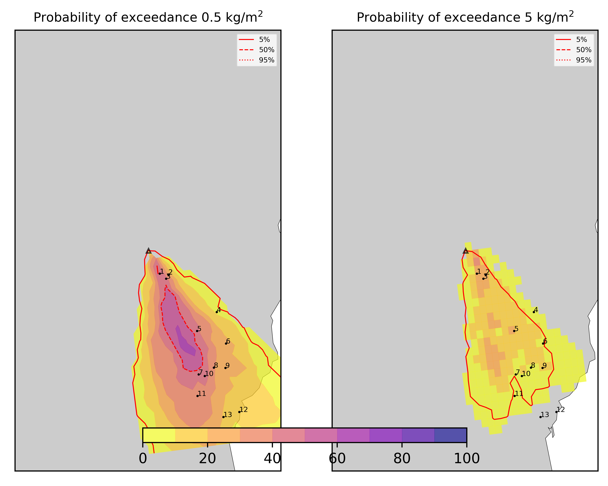
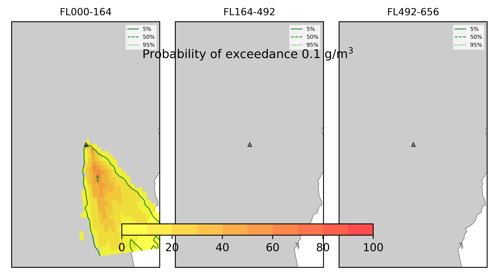

Forecast from VONA bulletin - 20210216_1631Z
============================================

Contents
========

* [Forecast products](#forecast-products)
	* [Forecast at 2021-02-16 18:30 Z - Ongoing Eruption](#forecast-at-2021-02-16-1830-z---ongoing-eruption)

# Forecast products

## Forecast at 2021-02-16 18:30 Z - Ongoing Eruption
  

|Eruption start [Z]|Eruption end [Z]|Forecast time [Z]|Column height asl [m]|
| :--- | :--- | :--- | :--- |
|2021-02-16 16:30:00|Ongoing|2021-02-16 18:30:00|6000 ± 500 - from VONA|
  
  

|Percentile|MER [kg/s¹]|Mass in the air [kg]|Mass on the ground [kg]|
| :--- | :--- | :--- | :--- |
|5th|1.25e+04|1.25e+07|7.76e+07|
|50th|7.29e+04|6.66e+07|3.88e+08|
|95th|1.73e+05|1.92e+08|8.19e+08|
  

### Ground 2021-02-16 18:30 Z
  
  
  
  
  
  
  
  
  
  
  
  
  
  

|Location|Ground load [kg/m²] 5th perc|Ground load [kg/m²] 50th perc|Ground load [kg/m²] 95th perc|
| :--- | :--- | :--- | :--- |
|Schiena Asino (1)|1.49e-05|2.72e+00|1.93e+01|
|Rif.Vescovo (2)|0.00e+00|7.01e-02|1.24e+01|
|Serra Pituzza (3)|0.00e+00|8.29e-01|1.67e+01|
|Monterosso (4)|0.00e+00|9.75e-05|1.77e+00|
|Cim.Pedara (5)|0.00e+00|2.16e-01|9.31e+00|
|Cim.Viagrande (6)|0.00e+00|1.07e-03|5.40e+00|
|Cim.Mascalucia (7)|0.00e+00|4.90e-01|5.60e+00|
|Cim.Tremestieri (8)|0.00e+00|1.21e-01|7.94e+00|
|Cim.S.Giov.La Punta (9)|0.00e+00|2.95e-02|6.92e+00|
|Cim.Gravina (10)|0.00e+00|4.39e-01|5.23e+00|
|ENI S.Giov.Galermo (11)|0.00e+00|2.03e-01|3.96e+00|
|Bio Piazza Europa (12)|0.00e+00|3.54e-02|1.39e+00|
|INGV-OE (13)|0.00e+00|1.00e-01|1.58e+00|
  

### Atmosphere 2021-02-16 18:30 Z
  
  
Go to [Supplementary page](Supplementary_page.md)  
Go to [Main directory](https://github.com/federicapardini/Real_time_ash_forecast)