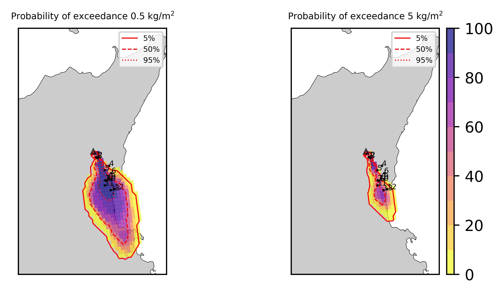
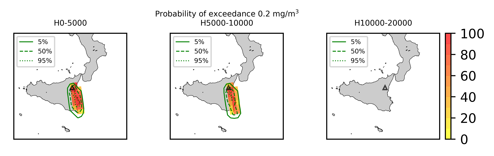
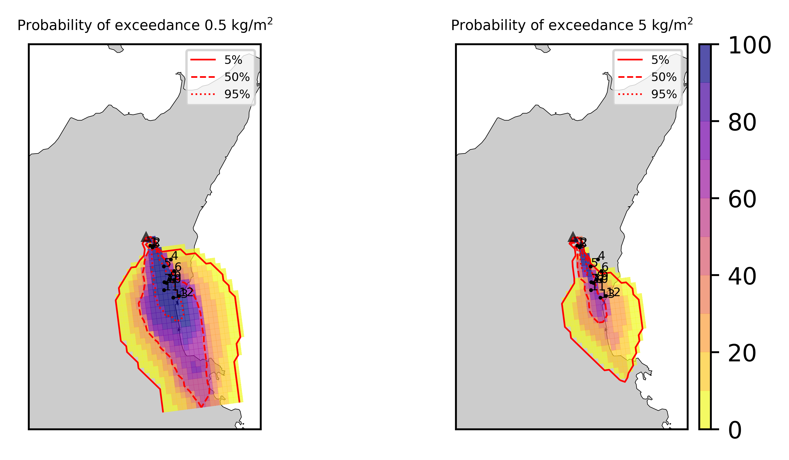
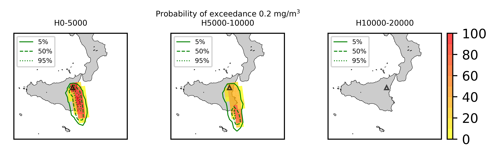
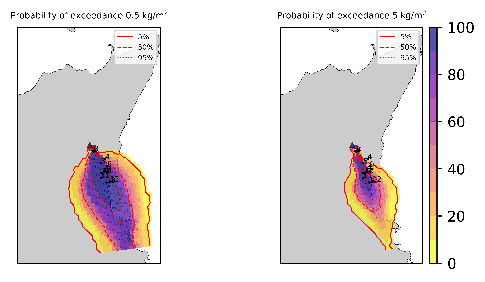
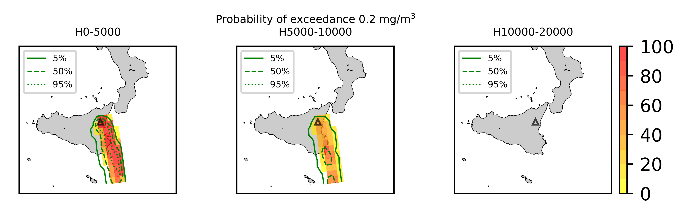

Forecast from VONA_20210216_1631Z
=================================

Contents
========

* [Forecast products](#forecast-products)
	* [Forecast at 2021-02-16 17:30 Z from RED VONA issued at 20210216_1631Z](#forecast-at-2021-02-16-1730-z-from-red-vona-issued-at-20210216_1631z)
	* [Forecast at 2021-02-16 18:30 Z from RED VONA issued at 20210216_1631Z](#forecast-at-2021-02-16-1830-z-from-red-vona-issued-at-20210216_1631z)
	* [Forecast at 2021-02-16 19:30 Z from RED VONA issued at 20210216_1631Z](#forecast-at-2021-02-16-1930-z-from-red-vona-issued-at-20210216_1631z)
	* [Forecast at 2021-02-16 18:10 Z from RED VONA issued at 20210216_1705Z](#forecast-at-2021-02-16-1810-z-from-red-vona-issued-at-20210216_1705z)
	* [Forecast at 2021-02-16 18:40 Z from RED VONA issued at 20210216_1738Z](#forecast-at-2021-02-16-1840-z-from-red-vona-issued-at-20210216_1738z)
	* [Forecast at 2021-02-16 19:40 Z from RED VONA issued at 20210216_1738Z](#forecast-at-2021-02-16-1940-z-from-red-vona-issued-at-20210216_1738z)

# Forecast products

## Forecast at 2021-02-16 17:30 Z from RED VONA issued at 20210216_1631Z
  

|Eruption start [Z]|Eruption end [Z]|Forecast time [Z]|Column height asl [m]|
| :--- | :--- | :--- | :--- |
|2021-02-16 16:30:00|Ongoing|2021-02-16 17:30:00|6000 ± 500 - from VONA|
  
  

|Percentile|MER [kg/s¹]|Mass air [kg]|Mass air nested dom. [kg]|Mass grd [kg]|Mass grd nested dom. [kg]|
| :--- | :--- | :--- | :--- | :--- | :--- |
|5th|2.15e+04|1.36e+07|1.36e+07|6.16e+07|6.16e+07|
|50th|8.47e+04|8.45e+07|8.44e+07|2.13e+08|2.13e+08|
|95th|1.96e+05|1.85e+08|1.84e+08|4.50e+08|4.50e+08|
  

### Ground Nested Domain 2021-02-16 17:30 Z
  
  
  
  
  
  
  
  
  
  
  
  
  
  

|Location|Ground load [kg/m²] 5th perc|Ground load [kg/m²] 50th perc|Ground load [kg/m²] 95th perc|
| :--- | :--- | :--- | :--- |
|Schiena Asino (1)|7.81e-01|2.49e+00|4.79e+00|
|Rif.Vescovo (2)|4.31e-01|1.33e+00|2.50e+00|
|Serra Pituzza (3)|5.75e-01|1.82e+00|3.43e+00|
|Monterosso (4)|5.44e-06|7.77e-04|2.72e-02|
|Cim.Pedara (5)|9.80e-02|4.24e-01|2.39e+00|
|Cim.Viagrande (6)|2.18e-05|3.72e-04|1.22e-02|
|Cim.Mascalucia (7)|7.09e-02|6.87e-01|2.49e+00|
|Cim.Tremestieri (8)|2.07e-02|1.79e-01|6.90e-01|
|Cim.S.Giov.La Punta (9)|3.56e-03|3.88e-02|1.42e-01|
|Cim.Gravina (10)|6.72e-02|6.59e-01|2.01e+00|
|ENI S.Giov.Galermo (11)|1.40e-02|3.98e-01|1.18e+00|
|Bio Piazza Europa (12)|6.54e-03|5.72e-02|2.08e-01|
|INGV-OE (13)|1.49e-02|1.71e-01|5.42e-01|
  

### Atmosphere 2021-02-16 17:30 Z
  

## Forecast at 2021-02-16 18:30 Z from RED VONA issued at 20210216_1631Z
  

|Eruption start [Z]|Eruption end [Z]|Forecast time [Z]|Column height asl [m]|
| :--- | :--- | :--- | :--- |
|2021-02-16 16:30:00|Ongoing|2021-02-16 18:30:00|6000 ± 500 - from VONA|
  
  

|Percentile|MER [kg/s¹]|Mass air [kg]|Mass air nested dom. [kg]|Mass grd [kg]|Mass grd nested dom. [kg]|
| :--- | :--- | :--- | :--- | :--- | :--- |
|5th|2.22e+04|2.62e+07|2.56e+07|2.14e+08|2.13e+08|
|50th|8.32e+04|9.95e+07|8.13e+07|5.27e+08|5.27e+08|
|95th|1.78e+05|2.47e+08|2.36e+08|9.24e+08|9.21e+08|
  

### Ground Nested Domain 2021-02-16 18:30 Z
  
  
  
  
  
  
  
  
  
  
  
  
  
  

|Location|Ground load [kg/m²] 5th perc|Ground load [kg/m²] 50th perc|Ground load [kg/m²] 95th perc|
| :--- | :--- | :--- | :--- |
|Schiena Asino (1)|1.68e+00|4.68e+00|8.19e+00|
|Rif.Vescovo (2)|8.54e-01|2.35e+00|4.13e+00|
|Serra Pituzza (3)|1.13e+00|3.22e+00|5.61e+00|
|Monterosso (4)|2.27e-04|5.52e-03|4.62e-02|
|Cim.Pedara (5)|3.91e-01|1.24e+00|4.32e+00|
|Cim.Viagrande (6)|4.61e-04|1.99e-03|2.05e-02|
|Cim.Mascalucia (7)|4.53e-01|2.36e+00|4.35e+00|
|Cim.Tremestieri (8)|1.55e-01|7.03e-01|1.28e+00|
|Cim.S.Giov.La Punta (9)|3.69e-02|1.66e-01|2.77e-01|
|Cim.Gravina (10)|4.68e-01|2.31e+00|3.71e+00|
|ENI S.Giov.Galermo (11)|1.20e-01|1.14e+00|2.27e+00|
|Bio Piazza Europa (12)|8.27e-02|3.56e-01|7.97e-01|
|INGV-OE (13)|1.14e-01|6.93e-01|1.55e+00|
  

### Atmosphere 2021-02-16 18:30 Z
  

## Forecast at 2021-02-16 19:30 Z from RED VONA issued at 20210216_1631Z
  

|Eruption start [Z]|Eruption end [Z]|Forecast time [Z]|Column height asl [m]|
| :--- | :--- | :--- | :--- |
|2021-02-16 16:30:00|Ongoing|2021-02-16 19:30:00|6000 ± 500 - from VONA|
  
  

|Percentile|MER [kg/s¹]|Mass air [kg]|Mass air nested dom. [kg]|Mass grd [kg]|Mass grd nested dom. [kg]|
| :--- | :--- | :--- | :--- | :--- | :--- |
|5th|2.53e+04|5.08e+07|3.83e+07|4.34e+08|4.33e+08|
|50th|8.39e+04|1.11e+08|9.59e+07|7.78e+08|7.76e+08|
|95th|1.89e+05|2.57e+08|2.15e+08|1.34e+09|1.32e+09|
  

### Ground Nested Domain 2021-02-16 19:30 Z
  
  
  
  
  
  
  
  
  
  
  
  
  
  

|Location|Ground load [kg/m²] 5th perc|Ground load [kg/m²] 50th perc|Ground load [kg/m²] 95th perc|
| :--- | :--- | :--- | :--- |
|Schiena Asino (1)|3.99e+00|6.85e+00|1.10e+01|
|Rif.Vescovo (2)|1.85e+00|3.90e+00|5.91e+00|
|Serra Pituzza (3)|2.51e+00|5.29e+00|8.03e+00|
|Monterosso (4)|5.63e-04|1.11e-02|5.94e-02|
|Cim.Pedara (5)|7.14e-01|2.34e+00|5.20e+00|
|Cim.Viagrande (6)|1.15e-03|3.93e-03|2.49e-02|
|Cim.Mascalucia (7)|1.41e+00|3.38e+00|6.14e+00|
|Cim.Tremestieri (8)|4.38e-01|9.91e-01|1.87e+00|
|Cim.S.Giov.La Punta (9)|1.05e-01|2.46e-01|4.87e-01|
|Cim.Gravina (10)|1.44e+00|3.19e+00|6.13e+00|
|ENI S.Giov.Galermo (11)|6.93e-01|1.85e+00|4.41e+00|
|Bio Piazza Europa (12)|2.13e-01|6.90e-01|1.20e+00|
|INGV-OE (13)|3.34e-01|1.28e+00|2.47e+00|
  

### Atmosphere 2021-02-16 19:30 Z
  

## Forecast at 2021-02-16 18:10 Z from RED VONA issued at 20210216_1705Z
  

|Eruption start [Z]|Eruption end [Z]|Forecast time [Z]|Column height asl [m]|
| :--- | :--- | :--- | :--- |
|2021-02-16 16:30:00|Ongoing|2021-02-16 18:10:00|10000 ± 500 - from VONA|
  
  

|Percentile|MER [kg/s¹]|Mass air [kg]|Mass air nested dom. [kg]|Mass grd [kg]|Mass grd nested dom. [kg]|
| :--- | :--- | :--- | :--- | :--- | :--- |
|5th|4.12e+05|5.10e+08|4.61e+08|1.03e+09|1.03e+09|
|50th|8.79e+05|1.18e+09|8.90e+08|2.09e+09|2.05e+09|
|95th|2.20e+06|4.18e+09|2.56e+09|3.85e+09|3.75e+09|
  

### Ground Nested Domain 2021-02-16 18:10 Z
  
  
  
  
  
  
  
  
  
  
  
  
  
  

|Location|Ground load [kg/m²] 5th perc|Ground load [kg/m²] 50th perc|Ground load [kg/m²] 95th perc|
| :--- | :--- | :--- | :--- |
|Schiena Asino (1)|8.78e+00|1.43e+01|2.65e+01|
|Rif.Vescovo (2)|4.75e+00|8.76e+00|1.68e+01|
|Serra Pituzza (3)|6.54e+00|1.20e+01|2.30e+01|
|Monterosso (4)|4.48e-04|2.84e-02|2.23e-01|
|Cim.Pedara (5)|3.45e-01|1.55e+00|4.24e+00|
|Cim.Viagrande (6)|1.45e-02|1.67e-01|8.71e-01|
|Cim.Mascalucia (7)|2.05e+00|4.37e+00|9.34e+00|
|Cim.Tremestieri (8)|5.04e-01|1.47e+00|4.16e+00|
|Cim.S.Giov.La Punta (9)|2.07e-01|7.91e-01|2.51e+00|
|Cim.Gravina (10)|1.44e+00|3.67e+00|8.46e+00|
|ENI S.Giov.Galermo (11)|1.93e+00|5.36e+00|1.02e+01|
|Bio Piazza Europa (12)|4.90e-01|2.86e+00|5.85e+00|
|INGV-OE (13)|1.49e+00|4.88e+00|9.34e+00|
  

### Atmosphere 2021-02-16 18:10 Z
  

## Forecast at 2021-02-16 18:40 Z from RED VONA issued at 20210216_1738Z
  

|Eruption start [Z]|Eruption end [Z]|Forecast time [Z]|Column height asl [m]|
| :--- | :--- | :--- | :--- |
|2021-02-16 16:30:00|Ongoing|2021-02-16 18:40:00|[6000 m, 12000 m]|
  
  

|Percentile|MER [kg/s¹]|Mass air [kg]|Mass air nested dom. [kg]|Mass grd [kg]|Mass grd nested dom. [kg]|
| :--- | :--- | :--- | :--- | :--- | :--- |
|5th|1.25e+05|3.41e+08|1.80e+08|1.55e+09|1.47e+09|
|50th|4.08e+05|8.99e+08|5.55e+08|2.67e+09|2.52e+09|
|95th|6.84e+06|1.07e+10|6.45e+09|1.17e+10|1.11e+10|
  

### Ground Nested Domain 2021-02-16 18:40 Z
  
  
  
  
  
  
  
  
  
  
  
  
  
  

|Location|Ground load [kg/m²] 5th perc|Ground load [kg/m²] 50th perc|Ground load [kg/m²] 95th perc|
| :--- | :--- | :--- | :--- |
|Schiena Asino (1)|1.04e+01|1.69e+01|4.93e+01|
|Rif.Vescovo (2)|6.02e+00|9.84e+00|3.13e+01|
|Serra Pituzza (3)|8.23e+00|1.36e+01|4.27e+01|
|Monterosso (4)|1.72e-02|1.98e-01|1.07e+00|
|Cim.Pedara (5)|1.24e+00|3.97e+00|8.01e+00|
|Cim.Viagrande (6)|9.12e-02|2.23e-01|3.12e+00|
|Cim.Mascalucia (7)|4.15e+00|9.14e+00|1.69e+01|
|Cim.Tremestieri (8)|1.31e+00|3.17e+00|8.12e+00|
|Cim.S.Giov.La Punta (9)|3.64e-01|9.94e-01|6.29e+00|
|Cim.Gravina (10)|3.42e+00|7.84e+00|1.64e+01|
|ENI S.Giov.Galermo (11)|2.78e+00|6.72e+00|1.56e+01|
|Bio Piazza Europa (12)|6.22e-01|3.01e+00|1.42e+01|
|INGV-OE (13)|1.66e+00|5.39e+00|1.88e+01|
  

### Atmosphere 2021-02-16 18:40 Z
  

## Forecast at 2021-02-16 19:40 Z from RED VONA issued at 20210216_1738Z
  

|Eruption start [Z]|Eruption end [Z]|Forecast time [Z]|Column height asl [m]|
| :--- | :--- | :--- | :--- |
|2021-02-16 16:30:00|Ongoing|2021-02-16 19:40:00|[6000 m, 12000 m]|
  
  

|Percentile|MER [kg/s¹]|Mass air [kg]|Mass air nested dom. [kg]|Mass grd [kg]|Mass grd nested dom. [kg]|
| :--- | :--- | :--- | :--- | :--- | :--- |
|5th|1.25e+05|7.26e+08|2.49e+08|2.70e+09|2.65e+09|
|50th|3.90e+05|1.66e+09|5.47e+08|5.56e+09|5.43e+09|
|95th|5.77e+06|8.74e+09|5.49e+09|1.75e+10|1.59e+10|
  

### Ground Nested Domain 2021-02-16 19:40 Z
  
  
  
  
  
  
  
  
  
  
  
  
  
  

|Location|Ground load [kg/m²] 5th perc|Ground load [kg/m²] 50th perc|Ground load [kg/m²] 95th perc|
| :--- | :--- | :--- | :--- |
|Schiena Asino (1)|1.86e+01|3.21e+01|8.47e+01|
|Rif.Vescovo (2)|1.09e+01|2.03e+01|5.03e+01|
|Serra Pituzza (3)|1.48e+01|2.76e+01|6.93e+01|
|Monterosso (4)|3.23e-02|3.60e-01|2.46e+00|
|Cim.Pedara (5)|1.75e+00|7.72e+00|1.02e+01|
|Cim.Viagrande (6)|1.69e-01|8.23e-01|6.52e+00|
|Cim.Mascalucia (7)|9.08e+00|1.47e+01|3.11e+01|
|Cim.Tremestieri (8)|2.79e+00|5.67e+00|1.64e+01|
|Cim.S.Giov.La Punta (9)|1.01e+00|3.07e+00|1.27e+01|
|Cim.Gravina (10)|7.49e+00|1.32e+01|2.99e+01|
|ENI S.Giov.Galermo (11)|8.61e+00|1.47e+01|3.09e+01|
|Bio Piazza Europa (12)|1.29e+00|7.47e+00|2.58e+01|
|INGV-OE (13)|3.79e+00|1.21e+01|3.37e+01|
  

### Atmosphere 2021-02-16 19:40 Z
  
  
Go to [Supplementary page](Supplementary_page.md)  
Go to [Main directory](https://github.com/federicapardini/Real_time_ash_forecast)