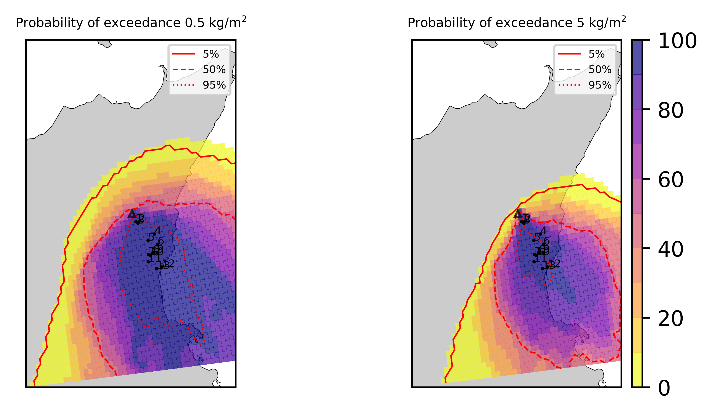

Forecast from VONA_20210216_1631Z
=================================

Contents
========

* [Forecast products](#forecast-products)
	* [Forecast at 2021-02-16 17:30 Z from RED VONA issued at 20210216_1631Z](#forecast-at-2021-02-16-1730-z-from-red-vona-issued-at-20210216_1631z)
	* [Forecast at 2021-02-16 18:30 Z from RED VONA issued at 20210216_1631Z](#forecast-at-2021-02-16-1830-z-from-red-vona-issued-at-20210216_1631z)
	* [Forecast at 2021-02-16 19:30 Z from RED VONA issued at 20210216_1631Z](#forecast-at-2021-02-16-1930-z-from-red-vona-issued-at-20210216_1631z)
	* [Forecast at 2021-02-16 22:30 Z from RED VONA issued at 20210216_1631Z](#forecast-at-2021-02-16-2230-z-from-red-vona-issued-at-20210216_1631z)
	* [Forecast at 2021-02-17 01:30 Z from RED VONA issued at 20210216_1631Z](#forecast-at-2021-02-17-0130-z-from-red-vona-issued-at-20210216_1631z)
	* [Forecast at 2021-02-16 18:10 Z from RED VONA issued at 20210216_1705Z](#forecast-at-2021-02-16-1810-z-from-red-vona-issued-at-20210216_1705z)
	* [Forecast at 2021-02-16 18:40 Z from RED VONA issued at 20210216_1738Z](#forecast-at-2021-02-16-1840-z-from-red-vona-issued-at-20210216_1738z)
	* [Forecast at 2021-02-16 19:40 Z from RED VONA issued at 20210216_1738Z](#forecast-at-2021-02-16-1940-z-from-red-vona-issued-at-20210216_1738z)
	* [Forecast at 2021-02-16 20:40 Z from RED VONA issued at 20210216_1738Z](#forecast-at-2021-02-16-2040-z-from-red-vona-issued-at-20210216_1738z)
	* [Forecast at 2021-02-16 23:40 Z from RED VONA issued at 20210216_1738Z](#forecast-at-2021-02-16-2340-z-from-red-vona-issued-at-20210216_1738z)
	* [Forecast at 2021-02-17 02:40 Z from RED VONA issued at 20210216_1738Z](#forecast-at-2021-02-17-0240-z-from-red-vona-issued-at-20210216_1738z)

# Forecast products

## Forecast at 2021-02-16 17:30 Z from RED VONA issued at 20210216_1631Z
  

|Eruption start [Z]|Eruption end [Z]|Forecast time [Z]|Column height asl [m]|
| :--- | :--- | :--- | :--- |
|2021-02-16 16:30:00|Ongoing|2021-02-16 17:30:00|6000 ± 500 - from VONA|
  
  

|Percentile|MER [kg/s¹]|Mass air [kg]|Mass air nested dom. [kg]|Mass grd [kg]|Mass grd nested dom. [kg]|
| :--- | :--- | :--- | :--- | :--- | :--- |
|5th|1.19e+04|1.89e+07|1.89e+07|2.72e+07|2.72e+07|
|50th|7.64e+04|8.44e+07|8.29e+07|1.68e+08|1.68e+08|
|95th|2.30e+05|2.67e+08|2.43e+08|4.93e+08|4.94e+08|
  

### Ground Nested Domain 2021-02-16 17:30 Z
  
  
  
  
  
  
  
  
  
  
  
  
  
  
  
  
  
  
  
  
  

|Location|Ground load [kg/m²] 5th perc|Ground load [kg/m²] 50th perc|Ground load [kg/m²] 95th perc|
| :--- | :--- | :--- | :--- |
|Schiena Asino (1)|1.51e-04|7.10e-01|2.87e+00|
|Rif.Vescovo (2)|0.00e+00|3.35e-01|2.74e+00|
|Serra Pituzza (3)|0.00e+00|2.24e-01|3.81e+00|
|Monterosso (4)|0.00e+00|1.23e-04|1.75e+00|
|Cim.Pedara (5)|3.75e-05|1.38e-02|5.05e+00|
|Cim.Viagrande (6)|0.00e+00|5.62e-06|1.70e+00|
|Cim.Mascalucia (7)|0.00e+00|8.87e-03|8.89e-01|
|Cim.Tremestieri (8)|0.00e+00|1.89e-03|2.59e+00|
|Cim.S.Giov.La Punta (9)|0.00e+00|3.54e-04|1.01e+00|
|Cim.Gravina (10)|0.00e+00|9.26e-03|9.21e-01|
|ENI S.Giov.Galermo (11)|0.00e+00|3.40e-03|1.04e+00|
|Bio Piazza Europa (12)|0.00e+00|2.53e-05|5.97e-01|
|INGV-OE (13)|0.00e+00|4.76e-04|6.50e-01|
|Catania AP (14)|0.00e+00|2.63e-04|4.29e-01|
|Nicolosi (15)|0.00e+00|5.84e-01|5.68e+00|
|Zafferana (16)|0.00e+00|0.00e+00|3.70e-02|
|Linguaglossa (17)|0.00e+00|0.00e+00|0.00e+00|
|Randazzo (18)|0.00e+00|0.00e+00|0.00e+00|
|Bronte (19)|0.00e+00|0.00e+00|0.00e+00|
|Biancavilla (20)|0.00e+00|0.00e+00|0.00e+00|
  

### Atmosphere 2021-02-16 17:30 Z
  

## Forecast at 2021-02-16 18:30 Z from RED VONA issued at 20210216_1631Z
  

|Eruption start [Z]|Eruption end [Z]|Forecast time [Z]|Column height asl [m]|
| :--- | :--- | :--- | :--- |
|2021-02-16 16:30:00|Ongoing|2021-02-16 18:30:00|6000 ± 500 - from VONA|
  
  

|Percentile|MER [kg/s¹]|Mass air [kg]|Mass air nested dom. [kg]|Mass grd [kg]|Mass grd nested dom. [kg]|
| :--- | :--- | :--- | :--- | :--- | :--- |
|5th|1.42e+04|6.17e+07|5.10e+07|1.79e+08|1.79e+08|
|50th|6.48e+04|1.42e+08|1.20e+08|3.69e+08|3.59e+08|
|95th|2.22e+05|4.90e+08|3.45e+08|8.37e+08|7.97e+08|
  

### Ground Nested Domain 2021-02-16 18:30 Z
  
  
  
  
  
  
  
  
  
  
  
  
  
  
  
  
  
  
  
  
  

|Location|Ground load [kg/m²] 5th perc|Ground load [kg/m²] 50th perc|Ground load [kg/m²] 95th perc|
| :--- | :--- | :--- | :--- |
|Schiena Asino (1)|6.73e-01|1.77e+00|3.59e+00|
|Rif.Vescovo (2)|3.31e-02|8.72e-01|4.71e+00|
|Serra Pituzza (3)|4.65e-02|9.42e-01|5.13e+00|
|Monterosso (4)|0.00e+00|6.23e-02|2.78e+00|
|Cim.Pedara (5)|3.58e-03|1.02e+00|6.01e+00|
|Cim.Viagrande (6)|0.00e+00|5.19e-02|2.97e+00|
|Cim.Mascalucia (7)|1.70e-03|2.56e-01|1.65e+00|
|Cim.Tremestieri (8)|1.76e-04|1.42e-01|3.39e+00|
|Cim.S.Giov.La Punta (9)|2.35e-05|1.20e-01|1.66e+00|
|Cim.Gravina (10)|2.14e-04|7.21e-02|1.66e+00|
|ENI S.Giov.Galermo (11)|2.65e-04|1.21e-01|1.51e+00|
|Bio Piazza Europa (12)|4.79e-05|2.60e-02|7.75e-01|
|INGV-OE (13)|3.58e-04|6.42e-02|8.44e-01|
|Catania AP (14)|4.48e-04|5.97e-02|5.40e-01|
|Nicolosi (15)|4.01e-02|2.52e+00|6.67e+00|
|Zafferana (16)|0.00e+00|6.67e-06|1.60e-01|
|Linguaglossa (17)|0.00e+00|0.00e+00|0.00e+00|
|Randazzo (18)|0.00e+00|0.00e+00|0.00e+00|
|Bronte (19)|0.00e+00|0.00e+00|0.00e+00|
|Biancavilla (20)|0.00e+00|0.00e+00|1.13e-04|
  

### Atmosphere 2021-02-16 18:30 Z
  

## Forecast at 2021-02-16 19:30 Z from RED VONA issued at 20210216_1631Z
  

|Eruption start [Z]|Eruption end [Z]|Forecast time [Z]|Column height asl [m]|
| :--- | :--- | :--- | :--- |
|2021-02-16 16:30:00|Ongoing|2021-02-16 19:30:00|6000 ± 500 - from VONA|
  
  

|Percentile|MER [kg/s¹]|Mass air [kg]|Mass air nested dom. [kg]|Mass grd [kg]|Mass grd nested dom. [kg]|
| :--- | :--- | :--- | :--- | :--- | :--- |
|5th|1.78e+04|5.18e+07|4.82e+07|4.12e+08|4.12e+08|
|50th|6.61e+04|1.73e+08|1.35e+08|5.96e+08|5.76e+08|
|95th|1.73e+05|3.56e+08|2.32e+08|1.29e+09|1.22e+09|
  

### Ground Nested Domain 2021-02-16 19:30 Z
  
  
  
  
  
  
  
  
  
  
  
  
  
  
  
  
  
  
  
  
  

|Location|Ground load [kg/m²] 5th perc|Ground load [kg/m²] 50th perc|Ground load [kg/m²] 95th perc|
| :--- | :--- | :--- | :--- |
|Schiena Asino (1)|1.27e+00|2.59e+00|5.44e+00|
|Rif.Vescovo (2)|4.41e-02|2.12e+00|4.89e+00|
|Serra Pituzza (3)|6.19e-02|2.45e+00|5.45e+00|
|Monterosso (4)|4.43e-05|2.64e-01|3.71e+00|
|Cim.Pedara (5)|2.24e-02|2.02e+00|1.04e+01|
|Cim.Viagrande (6)|0.00e+00|2.61e-01|3.65e+00|
|Cim.Mascalucia (7)|1.53e-02|6.46e-01|3.28e+00|
|Cim.Tremestieri (8)|4.70e-03|5.05e-01|3.69e+00|
|Cim.S.Giov.La Punta (9)|1.73e-04|4.46e-01|1.73e+00|
|Cim.Gravina (10)|1.33e-02|5.79e-01|2.20e+00|
|ENI S.Giov.Galermo (11)|3.27e-02|8.13e-01|2.20e+00|
|Bio Piazza Europa (12)|1.79e-03|1.39e-01|1.04e+00|
|INGV-OE (13)|4.62e-03|1.30e-01|8.85e-01|
|Catania AP (14)|5.69e-03|1.42e-01|8.82e-01|
|Nicolosi (15)|9.86e-02|3.93e+00|9.82e+00|
|Zafferana (16)|0.00e+00|2.87e-04|1.70e-01|
|Linguaglossa (17)|0.00e+00|0.00e+00|0.00e+00|
|Randazzo (18)|0.00e+00|0.00e+00|0.00e+00|
|Bronte (19)|0.00e+00|0.00e+00|0.00e+00|
|Biancavilla (20)|0.00e+00|0.00e+00|7.21e-04|
  

### Atmosphere 2021-02-16 19:30 Z
  

## Forecast at 2021-02-16 22:30 Z from RED VONA issued at 20210216_1631Z
  

|Eruption start [Z]|Eruption end [Z]|Forecast time [Z]|Column height asl [m]|
| :--- | :--- | :--- | :--- |
|2021-02-16 16:30:00|Ongoing|2021-02-16 22:30:00|6000 ± 500 - from VONA|
  
  

|Percentile|MER [kg/s¹]|Mass air [kg]|Mass air nested dom. [kg]|Mass grd [kg]|Mass grd nested dom. [kg]|
| :--- | :--- | :--- | :--- | :--- | :--- |
|5th|1.17e+04|6.43e+07|4.58e+07|8.54e+08|8.30e+08|
|50th|5.90e+04|1.57e+08|1.14e+08|1.34e+09|1.29e+09|
|95th|1.48e+05|5.10e+08|2.56e+08|2.26e+09|2.12e+09|
  

### Ground Nested Domain 2021-02-16 22:30 Z
  
  
  
  
  
  
  
  
  
  
  
  
  
  
  
  
  
  
  
  
  

|Location|Ground load [kg/m²] 5th perc|Ground load [kg/m²] 50th perc|Ground load [kg/m²] 95th perc|
| :--- | :--- | :--- | :--- |
|Schiena Asino (1)|3.10e+00|5.13e+00|9.22e+00|
|Rif.Vescovo (2)|9.66e-01|3.58e+00|7.91e+00|
|Serra Pituzza (3)|1.27e+00|3.82e+00|1.05e+01|
|Monterosso (4)|1.10e-03|5.95e-01|6.18e+00|
|Cim.Pedara (5)|1.37e-01|3.18e+00|1.57e+01|
|Cim.Viagrande (6)|1.28e-04|5.10e-01|5.24e+00|
|Cim.Mascalucia (7)|1.56e-01|1.10e+00|7.40e+00|
|Cim.Tremestieri (8)|3.72e-02|7.35e-01|4.68e+00|
|Cim.S.Giov.La Punta (9)|4.21e-03|7.24e-01|4.15e+00|
|Cim.Gravina (10)|1.29e-01|8.89e-01|6.04e+00|
|ENI S.Giov.Galermo (11)|1.66e-01|1.11e+00|5.53e+00|
|Bio Piazza Europa (12)|3.47e-02|2.62e-01|4.20e+00|
|INGV-OE (13)|5.13e-02|3.50e-01|2.28e+00|
|Catania AP (14)|5.47e-02|4.05e-01|2.97e+00|
|Nicolosi (15)|2.24e+00|7.52e+00|1.38e+01|
|Zafferana (16)|0.00e+00|2.10e-03|3.07e-01|
|Linguaglossa (17)|0.00e+00|0.00e+00|9.72e-07|
|Randazzo (18)|0.00e+00|0.00e+00|0.00e+00|
|Bronte (19)|0.00e+00|0.00e+00|0.00e+00|
|Biancavilla (20)|0.00e+00|1.12e-05|1.22e-03|
  

### Atmosphere 2021-02-16 22:30 Z
  

## Forecast at 2021-02-17 01:30 Z from RED VONA issued at 20210216_1631Z
  

|Eruption start [Z]|Eruption end [Z]|Forecast time [Z]|Column height asl [m]|
| :--- | :--- | :--- | :--- |
|2021-02-16 16:30:00|Ongoing|2021-02-17 01:30:00|6000 ± 500 - from VONA|
  
  

|Percentile|MER [kg/s¹]|Mass air [kg]|Mass air nested dom. [kg]|Mass grd [kg]|Mass grd nested dom. [kg]|
| :--- | :--- | :--- | :--- | :--- | :--- |
|5th|2.16e+04|6.34e+07|3.35e+07|1.09e+09|1.05e+09|
|50th|5.33e+04|1.75e+08|1.09e+08|1.85e+09|1.74e+09|
|95th|1.35e+05|4.67e+08|2.89e+08|3.09e+09|2.92e+09|
  

### Ground Nested Domain 2021-02-17 01:30 Z
  
  
  
  
  
  
  
  
  
  
  
  
  
  
  
  
  
  
  
  
  

|Location|Ground load [kg/m²] 5th perc|Ground load [kg/m²] 50th perc|Ground load [kg/m²] 95th perc|
| :--- | :--- | :--- | :--- |
|Schiena Asino (1)|4.08e+00|9.23e+00|1.36e+01|
|Rif.Vescovo (2)|2.15e+00|6.96e+00|1.14e+01|
|Serra Pituzza (3)|2.50e+00|8.14e+00|1.58e+01|
|Monterosso (4)|1.12e-01|2.28e+00|6.76e+00|
|Cim.Pedara (5)|3.43e-01|6.29e+00|1.92e+01|
|Cim.Viagrande (6)|1.22e-01|1.44e+00|6.69e+00|
|Cim.Mascalucia (7)|3.65e-01|1.32e+00|7.68e+00|
|Cim.Tremestieri (8)|1.58e-01|1.50e+00|5.29e+00|
|Cim.S.Giov.La Punta (9)|6.91e-02|8.14e-01|5.27e+00|
|Cim.Gravina (10)|2.99e-01|1.06e+00|6.47e+00|
|ENI S.Giov.Galermo (11)|1.77e-01|2.00e+00|5.78e+00|
|Bio Piazza Europa (12)|5.47e-02|5.63e-01|4.31e+00|
|INGV-OE (13)|1.05e-01|1.03e+00|2.75e+00|
|Catania AP (14)|9.44e-02|5.84e-01|3.14e+00|
|Nicolosi (15)|2.66e+00|1.14e+01|1.92e+01|
|Zafferana (16)|5.93e-04|1.83e-02|1.22e+00|
|Linguaglossa (17)|0.00e+00|0.00e+00|3.61e-06|
|Randazzo (18)|0.00e+00|0.00e+00|0.00e+00|
|Bronte (19)|0.00e+00|0.00e+00|0.00e+00|
|Biancavilla (20)|0.00e+00|6.08e-05|1.50e-03|
  

### Atmosphere 2021-02-17 01:30 Z
  

## Forecast at 2021-02-16 18:10 Z from RED VONA issued at 20210216_1705Z
  

|Eruption start [Z]|Eruption end [Z]|Forecast time [Z]|Column height asl [m]|
| :--- | :--- | :--- | :--- |
|2021-02-16 16:30:00|Ongoing|2021-02-16 18:10:00|10000 ± 500 - from VONA|
  
  

|Percentile|MER [kg/s¹]|Mass air [kg]|Mass air nested dom. [kg]|Mass grd [kg]|Mass grd nested dom. [kg]|
| :--- | :--- | :--- | :--- | :--- | :--- |
|5th|1.58e+05|3.64e+08|3.57e+08|5.09e+08|5.08e+08|
|50th|6.96e+05|1.26e+09|6.91e+08|1.30e+09|1.26e+09|
|95th|2.28e+06|5.51e+09|2.24e+09|2.95e+09|2.82e+09|
  

### Ground Nested Domain 2021-02-16 18:10 Z
  
  
  
  
  
  
  
  
  
  
  
  
  
  
  
  
  
  
  
  
  

|Location|Ground load [kg/m²] 5th perc|Ground load [kg/m²] 50th perc|Ground load [kg/m²] 95th perc|
| :--- | :--- | :--- | :--- |
|Schiena Asino (1)|4.32e-01|4.32e+00|8.72e+00|
|Rif.Vescovo (2)|1.28e-04|1.43e+00|7.82e+00|
|Serra Pituzza (3)|1.80e-04|1.28e+00|9.68e+00|
|Monterosso (4)|1.24e-05|2.18e-01|3.14e+00|
|Cim.Pedara (5)|1.06e-02|1.09e+00|4.64e+00|
|Cim.Viagrande (6)|2.79e-04|1.92e-01|2.08e+00|
|Cim.Mascalucia (7)|3.26e-02|7.50e-01|8.66e+00|
|Cim.Tremestieri (8)|9.75e-03|1.00e+00|3.10e+00|
|Cim.S.Giov.La Punta (9)|4.70e-03|6.84e-01|2.72e+00|
|Cim.Gravina (10)|2.67e-02|8.35e-01|9.40e+00|
|ENI S.Giov.Galermo (11)|1.44e-01|9.63e-01|5.67e+00|
|Bio Piazza Europa (12)|9.87e-03|6.16e-01|4.48e+00|
|INGV-OE (13)|3.14e-02|6.34e-01|3.58e+00|
|Catania AP (14)|1.92e-02|5.22e-01|4.05e+00|
|Nicolosi (15)|5.55e-02|1.94e+00|1.10e+01|
|Zafferana (16)|0.00e+00|1.66e-03|4.63e-01|
|Linguaglossa (17)|0.00e+00|0.00e+00|0.00e+00|
|Randazzo (18)|0.00e+00|0.00e+00|0.00e+00|
|Bronte (19)|0.00e+00|0.00e+00|0.00e+00|
|Biancavilla (20)|0.00e+00|0.00e+00|3.51e-02|
  

### Atmosphere 2021-02-16 18:10 Z
  

## Forecast at 2021-02-16 18:40 Z from RED VONA issued at 20210216_1738Z
  

|Eruption start [Z]|Eruption end [Z]|Forecast time [Z]|Column height asl [m]|
| :--- | :--- | :--- | :--- |
|2021-02-16 16:30:00|Ongoing|2021-02-16 18:40:00|[5000 m, 15000 m]|
  
  

|Percentile|MER [kg/s¹]|Mass air [kg]|Mass air nested dom. [kg]|Mass grd [kg]|Mass grd nested dom. [kg]|
| :--- | :--- | :--- | :--- | :--- | :--- |
|5th|4.76e+04|4.93e+08|1.28e+08|1.12e+09|9.40e+08|
|50th|7.92e+05|2.85e+09|1.40e+09|3.26e+09|2.15e+09|
|95th|3.35e+07|4.38e+10|2.22e+10|3.14e+10|2.20e+10|
  

### Ground Nested Domain 2021-02-16 18:40 Z
  
  
  
  
  
  
  
  
  
  
  
  
  
  
  
  
  
  
  
  
  

|Location|Ground load [kg/m²] 5th perc|Ground load [kg/m²] 50th perc|Ground load [kg/m²] 95th perc|
| :--- | :--- | :--- | :--- |
|Schiena Asino (1)|2.14e+00|5.68e+00|6.53e+01|
|Rif.Vescovo (2)|7.01e-01|3.29e+00|5.73e+01|
|Serra Pituzza (3)|6.52e-01|4.24e+00|7.12e+01|
|Monterosso (4)|3.03e-02|1.02e+00|2.22e+01|
|Cim.Pedara (5)|2.70e-01|5.88e+00|2.50e+01|
|Cim.Viagrande (6)|6.59e-02|1.20e+00|1.58e+01|
|Cim.Mascalucia (7)|6.34e-01|3.03e+00|2.11e+01|
|Cim.Tremestieri (8)|5.14e-01|2.70e+00|2.58e+01|
|Cim.S.Giov.La Punta (9)|3.68e-01|1.94e+00|2.50e+01|
|Cim.Gravina (10)|5.50e-01|2.58e+00|2.39e+01|
|ENI S.Giov.Galermo (11)|2.95e-01|2.65e+00|1.92e+01|
|Bio Piazza Europa (12)|2.75e-01|2.08e+00|3.09e+01|
|INGV-OE (13)|4.24e-01|2.48e+00|2.51e+01|
|Catania AP (14)|3.43e-01|2.53e+00|2.47e+01|
|Nicolosi (15)|1.35e+00|6.24e+00|1.59e+01|
|Zafferana (16)|0.00e+00|1.07e-01|6.05e+00|
|Linguaglossa (17)|0.00e+00|0.00e+00|1.16e-01|
|Randazzo (18)|0.00e+00|0.00e+00|2.77e-02|
|Bronte (19)|0.00e+00|0.00e+00|5.05e-02|
|Biancavilla (20)|0.00e+00|2.53e-03|5.35e-01|
  

### Atmosphere 2021-02-16 18:40 Z
  

## Forecast at 2021-02-16 19:40 Z from RED VONA issued at 20210216_1738Z
  

|Eruption start [Z]|Eruption end [Z]|Forecast time [Z]|Column height asl [m]|
| :--- | :--- | :--- | :--- |
|2021-02-16 16:30:00|Ongoing|2021-02-16 19:40:00|[5000 m, 15000 m]|
  
  

|Percentile|MER [kg/s¹]|Mass air [kg]|Mass air nested dom. [kg]|Mass grd [kg]|Mass grd nested dom. [kg]|
| :--- | :--- | :--- | :--- | :--- | :--- |
|5th|5.70e+04|4.39e+08|2.00e+08|1.96e+09|1.65e+09|
|50th|5.25e+05|6.56e+09|1.00e+09|7.85e+09|7.12e+09|
|95th|3.66e+07|1.34e+11|3.02e+10|8.99e+10|4.32e+10|
  

### Ground Nested Domain 2021-02-16 19:40 Z
  
  
  
  
  
  
  
  
  
  
  
  
  
  
  
  
  
  
  
  
  

|Location|Ground load [kg/m²] 5th perc|Ground load [kg/m²] 50th perc|Ground load [kg/m²] 95th perc|
| :--- | :--- | :--- | :--- |
|Schiena Asino (1)|3.41e+00|1.68e+01|8.42e+01|
|Rif.Vescovo (2)|7.51e-01|7.71e+00|5.77e+01|
|Serra Pituzza (3)|1.05e+00|8.34e+00|7.16e+01|
|Monterosso (4)|3.44e-02|3.87e+00|7.07e+01|
|Cim.Pedara (5)|7.45e-01|9.86e+00|4.96e+01|
|Cim.Viagrande (6)|1.45e-01|5.30e+00|2.58e+01|
|Cim.Mascalucia (7)|1.04e+00|8.41e+00|2.81e+01|
|Cim.Tremestieri (8)|9.50e-01|7.37e+00|3.75e+01|
|Cim.S.Giov.La Punta (9)|4.62e-01|6.76e+00|3.51e+01|
|Cim.Gravina (10)|7.63e-01|7.51e+00|3.15e+01|
|ENI S.Giov.Galermo (11)|7.15e-01|5.01e+00|3.97e+01|
|Bio Piazza Europa (12)|3.39e-01|5.75e+00|3.86e+01|
|INGV-OE (13)|5.18e-01|5.60e+00|3.16e+01|
|Catania AP (14)|4.05e-01|5.24e+00|3.18e+01|
|Nicolosi (15)|2.68e+00|1.13e+01|2.47e+01|
|Zafferana (16)|6.87e-04|4.82e-01|1.57e+01|
|Linguaglossa (17)|0.00e+00|0.00e+00|1.33e-01|
|Randazzo (18)|0.00e+00|0.00e+00|2.97e-02|
|Bronte (19)|0.00e+00|0.00e+00|6.01e-02|
|Biancavilla (20)|0.00e+00|2.36e-02|6.95e-01|
  

### Atmosphere 2021-02-16 19:40 Z
  

## Forecast at 2021-02-16 20:40 Z from RED VONA issued at 20210216_1738Z
  

|Eruption start [Z]|Eruption end [Z]|Forecast time [Z]|Column height asl [m]|
| :--- | :--- | :--- | :--- |
|2021-02-16 16:30:00|Ongoing|2021-02-16 20:40:00|[5000 m, 15000 m]|
  
  

|Percentile|MER [kg/s¹]|Mass air [kg]|Mass air nested dom. [kg]|Mass grd [kg]|Mass grd nested dom. [kg]|
| :--- | :--- | :--- | :--- | :--- | :--- |
|5th|4.43e+04|3.72e+08|1.46e+08|3.05e+09|2.80e+09|
|50th|6.39e+05|8.92e+09|1.24e+09|2.13e+10|1.44e+10|
|95th|2.49e+07|8.26e+10|2.68e+10|1.60e+11|6.25e+10|
  

### Ground Nested Domain 2021-02-16 20:40 Z
  
  
  
  
  
  
  
  
  
  
  
  
  
  
  
  
  
  
  
  
  

|Location|Ground load [kg/m²] 5th perc|Ground load [kg/m²] 50th perc|Ground load [kg/m²] 95th perc|
| :--- | :--- | :--- | :--- |
|Schiena Asino (1)|3.48e+00|2.91e+01|9.06e+01|
|Rif.Vescovo (2)|8.58e-01|2.40e+01|9.10e+01|
|Serra Pituzza (3)|1.20e+00|3.00e+01|9.06e+01|
|Monterosso (4)|4.14e-02|4.87e+00|9.18e+01|
|Cim.Pedara (5)|8.13e-01|1.30e+01|7.04e+01|
|Cim.Viagrande (6)|1.70e-01|8.37e+00|3.76e+01|
|Cim.Mascalucia (7)|1.83e+00|9.43e+00|4.57e+01|
|Cim.Tremestieri (8)|1.03e+00|1.29e+01|3.83e+01|
|Cim.S.Giov.La Punta (9)|4.88e-01|1.43e+01|3.69e+01|
|Cim.Gravina (10)|1.22e+00|1.02e+01|3.34e+01|
|ENI S.Giov.Galermo (11)|1.62e+00|7.41e+00|4.34e+01|
|Bio Piazza Europa (12)|9.51e-01|1.28e+01|3.94e+01|
|INGV-OE (13)|8.31e-01|1.01e+01|3.24e+01|
|Catania AP (14)|9.77e-01|1.11e+01|3.42e+01|
|Nicolosi (15)|6.18e+00|1.58e+01|5.51e+01|
|Zafferana (16)|7.30e-04|1.13e+00|2.35e+01|
|Linguaglossa (17)|0.00e+00|1.25e-05|1.48e-01|
|Randazzo (18)|0.00e+00|0.00e+00|2.97e-02|
|Bronte (19)|0.00e+00|1.93e-04|6.03e-02|
|Biancavilla (20)|0.00e+00|1.21e-01|8.21e-01|
  

### Atmosphere 2021-02-16 20:40 Z
  

## Forecast at 2021-02-16 23:40 Z from RED VONA issued at 20210216_1738Z
  

|Eruption start [Z]|Eruption end [Z]|Forecast time [Z]|Column height asl [m]|
| :--- | :--- | :--- | :--- |
|2021-02-16 16:30:00|Ongoing|2021-02-16 23:40:00|[5000 m, 15000 m]|
  
  

|Percentile|MER [kg/s¹]|Mass air [kg]|Mass air nested dom. [kg]|Mass grd [kg]|Mass grd nested dom. [kg]|
| :--- | :--- | :--- | :--- | :--- | :--- |
|5th|2.76e+04|9.95e+08|2.68e+08|6.67e+09|5.77e+09|
|50th|6.62e+05|4.62e+09|1.49e+09|8.13e+10|4.47e+10|
|95th|2.36e+07|8.99e+10|2.95e+10|2.08e+11|1.09e+11|
  

### Ground Nested Domain 2021-02-16 23:40 Z
  
  
  
  
  
  
  
  
  
  
  
  
  
  
  
  
  
  
  
  
  

|Location|Ground load [kg/m²] 5th perc|Ground load [kg/m²] 50th perc|Ground load [kg/m²] 95th perc|
| :--- | :--- | :--- | :--- |
|Schiena Asino (1)|1.30e+01|6.09e+01|1.95e+02|
|Rif.Vescovo (2)|9.09e+00|3.27e+01|9.34e+01|
|Serra Pituzza (3)|1.19e+01|3.64e+01|1.13e+02|
|Monterosso (4)|4.42e+00|1.25e+01|1.00e+02|
|Cim.Pedara (5)|7.52e+00|3.23e+01|8.09e+01|
|Cim.Viagrande (6)|4.65e+00|1.83e+01|8.40e+01|
|Cim.Mascalucia (7)|6.74e+00|2.08e+01|5.80e+01|
|Cim.Tremestieri (8)|7.25e+00|2.17e+01|4.52e+01|
|Cim.S.Giov.La Punta (9)|4.83e+00|2.08e+01|3.83e+01|
|Cim.Gravina (10)|6.78e+00|2.04e+01|5.48e+01|
|ENI S.Giov.Galermo (11)|4.42e+00|2.22e+01|7.37e+01|
|Bio Piazza Europa (12)|4.20e+00|2.25e+01|6.13e+01|
|INGV-OE (13)|2.51e+00|2.21e+01|6.76e+01|
|Catania AP (14)|1.86e+00|2.24e+01|7.08e+01|
|Nicolosi (15)|6.49e+00|2.17e+01|1.55e+02|
|Zafferana (16)|1.78e-01|3.16e+00|2.48e+01|
|Linguaglossa (17)|0.00e+00|7.47e-04|4.66e-01|
|Randazzo (18)|0.00e+00|0.00e+00|9.55e-02|
|Bronte (19)|0.00e+00|3.80e-03|1.19e-01|
|Biancavilla (20)|6.95e-04|3.99e-01|3.14e+00|
  

### Atmosphere 2021-02-16 23:40 Z
  

## Forecast at 2021-02-17 02:40 Z from RED VONA issued at 20210216_1738Z
  

|Eruption start [Z]|Eruption end [Z]|Forecast time [Z]|Column height asl [m]|
| :--- | :--- | :--- | :--- |
|2021-02-16 16:30:00|Ongoing|2021-02-17 02:40:00|[5000 m, 15000 m]|
  
  

|Percentile|MER [kg/s¹]|Mass air [kg]|Mass air nested dom. [kg]|Mass grd [kg]|Mass grd nested dom. [kg]|
| :--- | :--- | :--- | :--- | :--- | :--- |
|5th|2.20e+04|6.83e+08|2.93e+08|8.00e+09|6.79e+09|
|50th|6.15e+05|4.20e+09|1.25e+09|1.40e+11|7.89e+10|
|95th|1.68e+07|5.88e+10|2.47e+10|2.37e+11|1.27e+11|
  

### Ground Nested Domain 2021-02-17 02:40 Z
  
  
  
  
  
  
  
  
  
  
  
  
  
  
  
  
  
  
  
  
  

|Location|Ground load [kg/m²] 5th perc|Ground load [kg/m²] 50th perc|Ground load [kg/m²] 95th perc|
| :--- | :--- | :--- | :--- |
|Schiena Asino (1)|1.46e+01|1.07e+02|2.37e+02|
|Rif.Vescovo (2)|9.18e+00|4.06e+01|1.87e+02|
|Serra Pituzza (3)|1.20e+01|4.94e+01|2.33e+02|
|Monterosso (4)|6.94e+00|1.62e+01|1.30e+02|
|Cim.Pedara (5)|1.61e+01|4.45e+01|9.57e+01|
|Cim.Viagrande (6)|6.61e+00|2.67e+01|9.91e+01|
|Cim.Mascalucia (7)|7.08e+00|4.75e+01|8.92e+01|
|Cim.Tremestieri (8)|1.36e+01|3.74e+01|7.38e+01|
|Cim.S.Giov.La Punta (9)|8.56e+00|2.99e+01|6.72e+01|
|Cim.Gravina (10)|7.06e+00|4.22e+01|7.68e+01|
|ENI S.Giov.Galermo (11)|4.80e+00|4.83e+01|1.01e+02|
|Bio Piazza Europa (12)|4.53e+00|3.66e+01|7.76e+01|
|INGV-OE (13)|2.83e+00|4.06e+01|8.89e+01|
|Catania AP (14)|2.11e+00|4.31e+01|8.54e+01|
|Nicolosi (15)|1.00e+01|4.49e+01|1.97e+02|
|Zafferana (16)|6.77e-01|5.75e+00|3.56e+01|
|Linguaglossa (17)|0.00e+00|2.62e-02|1.14e+00|
|Randazzo (18)|0.00e+00|1.29e-03|1.47e-01|
|Bronte (19)|0.00e+00|1.78e-02|1.77e-01|
|Biancavilla (20)|8.66e-04|1.14e+00|3.62e+00|
  

### Atmosphere 2021-02-17 02:40 Z
  
  
Go to [Supplementary page](Supplementary_page.md)  
Go to [Main directory](https://github.com/federicapardini/Real_time_ash_forecast)