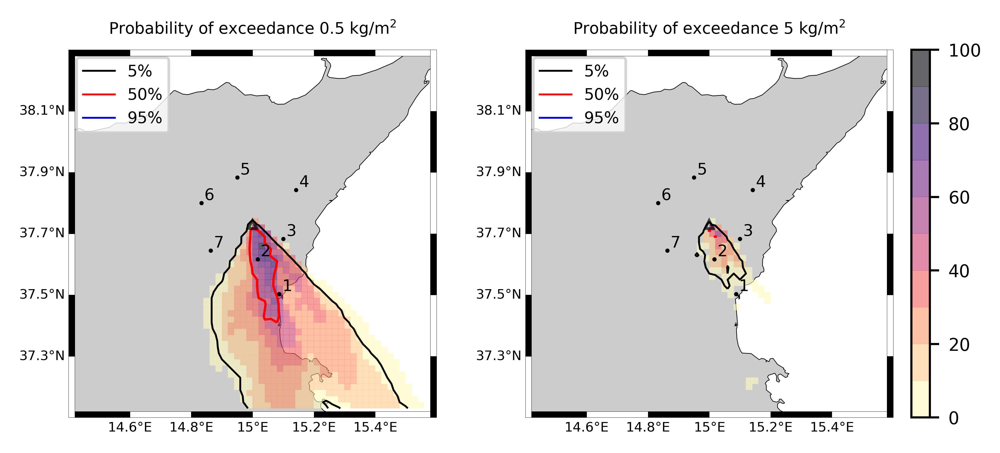
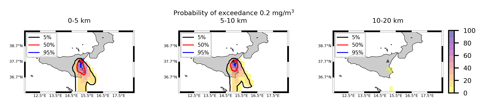
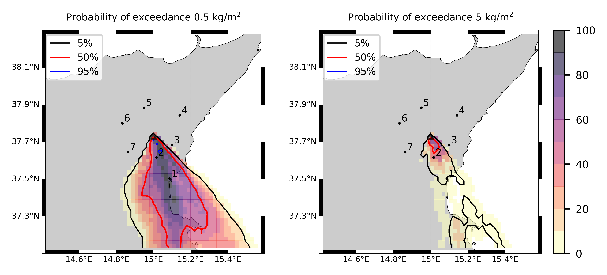
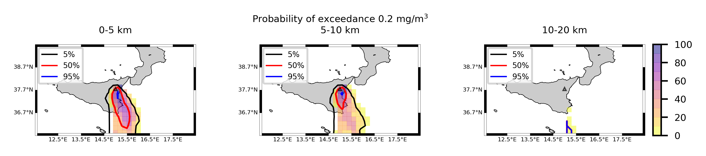
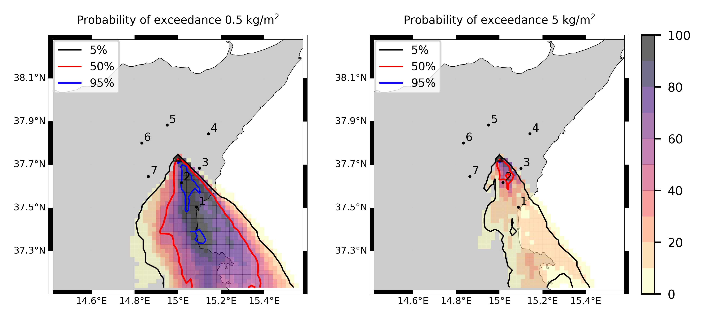

Forecast from VONA_20210216_1631Z
=================================

Contents
========

* [Forecast products](#forecast-products)
	* [Forecast at 2021-02-16 17:30 Z from RED VONA issued at 20210216_1631Z](#forecast-at-2021-02-16-1730-z-from-red-vona-issued-at-20210216_1631z)
	* [Forecast at 2021-02-16 18:30 Z from RED VONA issued at 20210216_1631Z](#forecast-at-2021-02-16-1830-z-from-red-vona-issued-at-20210216_1631z)
	* [Forecast at 2021-02-16 19:30 Z from RED VONA issued at 20210216_1631Z](#forecast-at-2021-02-16-1930-z-from-red-vona-issued-at-20210216_1631z)
	* [Forecast at 2021-02-16 22:30 Z from RED VONA issued at 20210216_1631Z](#forecast-at-2021-02-16-2230-z-from-red-vona-issued-at-20210216_1631z)
	* [Forecast at 2021-02-16 18:10 Z from RED VONA issued at 20210216_1705Z](#forecast-at-2021-02-16-1810-z-from-red-vona-issued-at-20210216_1705z)
	* [Forecast at 2021-02-16 19:10 Z from RED VONA issued at 20210216_1705Z](#forecast-at-2021-02-16-1910-z-from-red-vona-issued-at-20210216_1705z)
	* [Forecast at 2021-02-16 20:10 Z from RED VONA issued at 20210216_1705Z](#forecast-at-2021-02-16-2010-z-from-red-vona-issued-at-20210216_1705z)

# Forecast products

## Forecast at 2021-02-16 17:30 Z from RED VONA issued at 20210216_1631Z
  

|Eruption start [Z]|Eruption end [Z]|Forecast time [Z]|Column height asl [m]|
| :--- | :--- | :--- | :--- |
|2021-02-16 16:30:00|Ongoing|2021-02-16 17:30:00|6000 ± 500 - from VONA|
  
  

|Percentile|MER [kg/s¹]|Mass air [kg]|Mass air nested dom. [kg]|Mass grd [kg]|Mass grd nested dom. [kg]|
| :--- | :--- | :--- | :--- | :--- | :--- |
|5th|1.82e+04|1.36e+07|1.36e+07|5.29e+07|5.29e+07|
|50th|7.93e+04|8.70e+07|7.98e+07|2.02e+08|2.02e+08|
|95th|2.27e+05|3.22e+08|2.55e+08|4.80e+08|4.45e+08|
  

### Ground Nested Domain 2021-02-16 17:30 Z
  
  
  
  
  
  
  
  

|Location|Ground load [kg/m²] 5th perc|Ground load [kg/m²] 50th perc|Ground load [kg/m²] 95th perc|
| :--- | :--- | :--- | :--- |
|Catania AP (1)|0.00e+00|5.38e-03|4.34e-01|
|Nicolosi (2)|1.58e-06|5.06e-01|4.88e+00|
|Zafferana (3)|0.00e+00|0.00e+00|2.27e-04|
|Linguaglossa (4)|0.00e+00|0.00e+00|0.00e+00|
|Randazzo (5)|0.00e+00|0.00e+00|0.00e+00|
|Bronte (6)|0.00e+00|0.00e+00|0.00e+00|
|Biancavilla (7)|0.00e+00|0.00e+00|0.00e+00|
  

### Atmosphere 2021-02-16 17:30 Z
  

## Forecast at 2021-02-16 18:30 Z from RED VONA issued at 20210216_1631Z
  

|Eruption start [Z]|Eruption end [Z]|Forecast time [Z]|Column height asl [m]|
| :--- | :--- | :--- | :--- |
|2021-02-16 16:30:00|Ongoing|2021-02-16 18:30:00|6000 ± 500 - from VONA|
  
  

|Percentile|MER [kg/s¹]|Mass air [kg]|Mass air nested dom. [kg]|Mass grd [kg]|Mass grd nested dom. [kg]|
| :--- | :--- | :--- | :--- | :--- | :--- |
|5th|2.38e+04|5.64e+07|3.42e+07|2.00e+08|2.00e+08|
|50th|8.24e+04|1.12e+08|1.03e+08|4.93e+08|4.77e+08|
|95th|1.87e+05|2.21e+08|1.83e+08|9.51e+08|9.20e+08|
  

### Ground Nested Domain 2021-02-16 18:30 Z
  
  
  
  
  
  
  
  

|Location|Ground load [kg/m²] 5th perc|Ground load [kg/m²] 50th perc|Ground load [kg/m²] 95th perc|
| :--- | :--- | :--- | :--- |
|Catania AP (1)|9.03e-04|1.23e-01|1.36e+00|
|Nicolosi (2)|3.90e-01|1.87e+00|6.47e+00|
|Zafferana (3)|0.00e+00|2.83e-05|1.24e-03|
|Linguaglossa (4)|0.00e+00|0.00e+00|0.00e+00|
|Randazzo (5)|0.00e+00|0.00e+00|0.00e+00|
|Bronte (6)|0.00e+00|0.00e+00|0.00e+00|
|Biancavilla (7)|0.00e+00|0.00e+00|0.00e+00|
  

### Atmosphere 2021-02-16 18:30 Z
  

## Forecast at 2021-02-16 19:30 Z from RED VONA issued at 20210216_1631Z
  

|Eruption start [Z]|Eruption end [Z]|Forecast time [Z]|Column height asl [m]|
| :--- | :--- | :--- | :--- |
|2021-02-16 16:30:00|Ongoing|2021-02-16 19:30:00|6000 ± 500 - from VONA|
  
  

|Percentile|MER [kg/s¹]|Mass air [kg]|Mass air nested dom. [kg]|Mass grd [kg]|Mass grd nested dom. [kg]|
| :--- | :--- | :--- | :--- | :--- | :--- |
|5th|1.71e+04|4.11e+07|2.03e+07|4.03e+08|3.60e+08|
|50th|7.86e+04|1.30e+08|9.29e+07|7.77e+08|7.66e+08|
|95th|1.74e+05|2.36e+08|1.86e+08|1.40e+09|1.28e+09|
  

### Ground Nested Domain 2021-02-16 19:30 Z
  
  
  
  
  
  
  
  

|Location|Ground load [kg/m²] 5th perc|Ground load [kg/m²] 50th perc|Ground load [kg/m²] 95th perc|
| :--- | :--- | :--- | :--- |
|Catania AP (1)|2.13e-03|3.28e-01|2.20e+00|
|Nicolosi (2)|7.61e-01|3.05e+00|9.43e+00|
|Zafferana (3)|0.00e+00|7.83e-05|1.54e-03|
|Linguaglossa (4)|0.00e+00|0.00e+00|0.00e+00|
|Randazzo (5)|0.00e+00|0.00e+00|0.00e+00|
|Bronte (6)|0.00e+00|0.00e+00|0.00e+00|
|Biancavilla (7)|0.00e+00|0.00e+00|0.00e+00|
  

### Atmosphere 2021-02-16 19:30 Z
  

## Forecast at 2021-02-16 22:30 Z from RED VONA issued at 20210216_1631Z
  

|Eruption start [Z]|Eruption end [Z]|Forecast time [Z]|Column height asl [m]|
| :--- | :--- | :--- | :--- |
|2021-02-16 16:30:00|Ongoing|2021-02-16 22:30:00|6000 ± 500 - from VONA|
  
  

|Percentile|MER [kg/s¹]|Mass air [kg]|Mass air nested dom. [kg]|Mass grd [kg]|Mass grd nested dom. [kg]|
| :--- | :--- | :--- | :--- | :--- | :--- |
|5th|2.52e+04|2.92e+07|2.61e+07|9.27e+08|9.17e+08|
|50th|6.91e+04|9.72e+07|7.52e+07|1.55e+09|1.49e+09|
|95th|1.58e+05|2.54e+08|1.75e+08|2.48e+09|2.26e+09|
  

### Ground Nested Domain 2021-02-16 22:30 Z
  
  
  
  
  
  
  
  

|Location|Ground load [kg/m²] 5th perc|Ground load [kg/m²] 50th perc|Ground load [kg/m²] 95th perc|
| :--- | :--- | :--- | :--- |
|Catania AP (1)|5.04e-02|5.94e-01|3.86e+00|
|Nicolosi (2)|2.07e+00|6.78e+00|1.59e+01|
|Zafferana (3)|0.00e+00|1.40e-04|2.38e-03|
|Linguaglossa (4)|0.00e+00|0.00e+00|0.00e+00|
|Randazzo (5)|0.00e+00|0.00e+00|0.00e+00|
|Bronte (6)|0.00e+00|0.00e+00|0.00e+00|
|Biancavilla (7)|0.00e+00|0.00e+00|1.42e-05|
  

### Atmosphere 2021-02-16 22:30 Z
  

## Forecast at 2021-02-16 18:10 Z from RED VONA issued at 20210216_1705Z
  

|Eruption start [Z]|Eruption end [Z]|Forecast time [Z]|Column height asl [m]|
| :--- | :--- | :--- | :--- |
|2021-02-16 16:30:00|Ongoing|2021-02-16 18:10:00|10000 ± 500 - from VONA|
  
  

|Percentile|MER [kg/s¹]|Mass air [kg]|Mass air nested dom. [kg]|Mass grd [kg]|Mass grd nested dom. [kg]|
| :--- | :--- | :--- | :--- | :--- | :--- |
|5th|2.56e+05|4.33e+08|4.03e+08|6.81e+08|6.31e+08|
|50th|6.72e+05|1.24e+09|8.58e+08|1.50e+09|1.27e+09|
|95th|2.71e+06|6.25e+09|3.87e+09|3.60e+09|2.43e+09|
  

### Ground Nested Domain 2021-02-16 18:10 Z
  
  
  
  
  
  
  
  

|Location|Ground load [kg/m²] 5th perc|Ground load [kg/m²] 50th perc|Ground load [kg/m²] 95th perc|
| :--- | :--- | :--- | :--- |
|Catania AP (1)|6.84e-03|3.94e-01|2.45e+00|
|Nicolosi (2)|2.57e-02|1.88e+00|1.18e+01|
|Zafferana (3)|0.00e+00|5.17e-05|6.04e-03|
|Linguaglossa (4)|0.00e+00|0.00e+00|0.00e+00|
|Randazzo (5)|0.00e+00|0.00e+00|0.00e+00|
|Bronte (6)|0.00e+00|0.00e+00|0.00e+00|
|Biancavilla (7)|0.00e+00|0.00e+00|6.13e-03|
  

### Atmosphere 2021-02-16 18:10 Z
  

## Forecast at 2021-02-16 19:10 Z from RED VONA issued at 20210216_1705Z
  

|Eruption start [Z]|Eruption end [Z]|Forecast time [Z]|Column height asl [m]|
| :--- | :--- | :--- | :--- |
|2021-02-16 16:30:00|Ongoing|2021-02-16 19:10:00|10000 ± 500 - from VONA|
  
  

|Percentile|MER [kg/s¹]|Mass air [kg]|Mass air nested dom. [kg]|Mass grd [kg]|Mass grd nested dom. [kg]|
| :--- | :--- | :--- | :--- | :--- | :--- |
|5th|2.46e+05|4.43e+08|3.46e+08|2.08e+09|1.60e+09|
|50th|6.16e+05|1.41e+09|7.66e+08|4.12e+09|2.75e+09|
|95th|2.24e+06|5.20e+09|2.69e+09|9.13e+09|5.39e+09|
  

### Ground Nested Domain 2021-02-16 19:10 Z
  
  
  
  
  
  
  
  

|Location|Ground load [kg/m²] 5th perc|Ground load [kg/m²] 50th perc|Ground load [kg/m²] 95th perc|
| :--- | :--- | :--- | :--- |
|Catania AP (1)|2.69e-01|8.90e-01|5.11e+00|
|Nicolosi (2)|3.15e-01|2.98e+00|1.62e+01|
|Zafferana (3)|0.00e+00|3.07e-04|9.60e-03|
|Linguaglossa (4)|0.00e+00|0.00e+00|0.00e+00|
|Randazzo (5)|0.00e+00|0.00e+00|0.00e+00|
|Bronte (6)|0.00e+00|0.00e+00|0.00e+00|
|Biancavilla (7)|0.00e+00|1.18e-06|1.30e-02|
  

### Atmosphere 2021-02-16 19:10 Z
  

## Forecast at 2021-02-16 20:10 Z from RED VONA issued at 20210216_1705Z
  

|Eruption start [Z]|Eruption end [Z]|Forecast time [Z]|Column height asl [m]|
| :--- | :--- | :--- | :--- |
|2021-02-16 16:30:00|Ongoing|2021-02-16 20:10:00|10000 ± 500 - from VONA|
  
  

|Percentile|MER [kg/s¹]|Mass air [kg]|Mass air nested dom. [kg]|Mass grd [kg]|Mass grd nested dom. [kg]|
| :--- | :--- | :--- | :--- | :--- | :--- |
|5th|2.34e+05|5.93e+08|3.97e+08|3.26e+09|2.53e+09|
|50th|6.16e+05|1.54e+09|7.74e+08|6.52e+09|4.20e+09|
|95th|1.92e+06|3.55e+09|2.23e+09|1.44e+10|8.47e+09|
  

### Ground Nested Domain 2021-02-16 20:10 Z
  
  
  
  
  
  
  
  

|Location|Ground load [kg/m²] 5th perc|Ground load [kg/m²] 50th perc|Ground load [kg/m²] 95th perc|
| :--- | :--- | :--- | :--- |
|Catania AP (1)|2.87e-01|1.65e+00|7.98e+00|
|Nicolosi (2)|7.83e-01|4.52e+00|2.29e+01|
|Zafferana (3)|3.17e-06|6.55e-04|2.03e-02|
|Linguaglossa (4)|0.00e+00|0.00e+00|0.00e+00|
|Randazzo (5)|0.00e+00|0.00e+00|0.00e+00|
|Bronte (6)|0.00e+00|0.00e+00|0.00e+00|
|Biancavilla (7)|0.00e+00|9.58e-06|2.88e-02|
  

### Atmosphere 2021-02-16 20:10 Z
  
  
Go to [Supplementary page](Supplementary_page.md)  
Go to [Main directory](https://github.com/federicapardini/Real_time_ash_forecast)