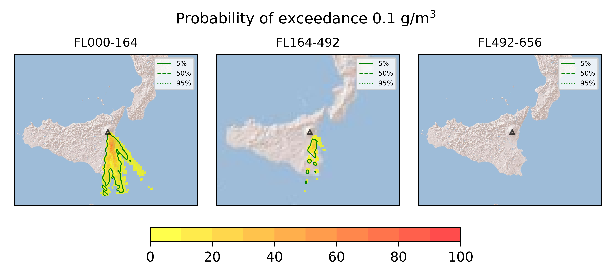

Forecast from VONA bulletin - 20210216_1631Z
============================================

Contents
========

* [Forecast products](#forecast-products)
	* [Forecast at 2021-02-16 19:30 Z - Ongoing Eruption](#forecast-at-2021-02-16-1930-z---ongoing-eruption)
	* [Forecast at 2021-02-16 22:30 Z - Ongoing Eruption](#forecast-at-2021-02-16-2230-z---ongoing-eruption)
	* [Forecast at 2021-02-17 01:30 Z - Ongoing Eruption](#forecast-at-2021-02-17-0130-z---ongoing-eruption)
	* [Forecast at 2021-02-16 20:10 Z - Ongoing Eruption](#forecast-at-2021-02-16-2010-z---ongoing-eruption)

# Forecast products

## Forecast at 2021-02-16 19:30 Z - Ongoing Eruption
  

|Eruption start [Z]|Eruption end [Z]|Forecast time [Z]|Column height asl [m]|
| :--- | :--- | :--- | :--- |
|2021-02-16 16:30:00|Ongoing|2021-02-16 19:30:00|6000 ± 500 - from VONA|
  
  

|Percentile|MER [kg/s¹]|Mass in the air [kg]|Mass on the ground [kg]|
| :--- | :--- | :--- | :--- |
|5th|1.81e+04|1.25e+07|1.68e+08|
|50th|7.56e+04|8.16e+07|6.96e+08|
|95th|1.96e+05|2.57e+08|1.59e+09|
  

### Ground 2021-02-16 19:30 Z
  
  
  
  
  
  
  
  
  
  
  
  
  
  

|Location|Ground load [kg/m²] 5th perc|Ground load [kg/m²] 50th perc|Ground load [kg/m²] 95th perc|
| :--- | :--- | :--- | :--- |
|Schiena Asino (1)|9.07e-05|1.47e+00|5.87e+00|
|Rif.Vescovo (2)|3.60e-01|1.53e+00|4.81e+00|
|Serra Pituzza (3)|3.92e-01|1.72e+00|5.64e+00|
|Monterosso (4)|7.97e-03|4.69e-01|6.89e+00|
|Cim.Pedara (5)|4.62e-02|2.26e+00|7.44e+00|
|Cim.Viagrande (6)|0.00e+00|6.17e-02|1.09e+01|
|Cim.Mascalucia (7)|1.46e-02|1.26e+00|1.04e+01|
|Cim.Tremestieri (8)|1.66e-02|1.10e+00|7.95e+00|
|Cim.S.Giov.La Punta (9)|1.04e-03|4.06e-01|9.49e+00|
|Cim.Gravina (10)|2.34e-02|1.33e+00|8.00e+00|
|ENI S.Giov.Galermo (11)|1.00e-02|8.31e-01|6.48e+00|
|Bio Piazza Europa (12)|2.78e-05|1.17e-01|5.45e+00|
|INGV-OE (13)|8.54e-04|2.27e-01|4.96e+00|
  

### Atmosphere 2021-02-16 19:30 Z
  

## Forecast at 2021-02-16 22:30 Z - Ongoing Eruption
  

|Eruption start [Z]|Eruption end [Z]|Forecast time [Z]|Column height asl [m]|
| :--- | :--- | :--- | :--- |
|2021-02-16 16:30:00|Ongoing|2021-02-16 22:30:00|6000 ± 500 - from VONA|
  
  

|Percentile|MER [kg/s¹]|Mass in the air [kg]|Mass on the ground [kg]|
| :--- | :--- | :--- | :--- |
|5th|2.27e+04|8.78e+06|5.28e+08|
|50th|6.65e+04|1.05e+08|1.18e+09|
|95th|1.50e+05|1.79e+08|2.44e+09|
  

### Ground 2021-02-16 22:30 Z
  
  
  
  
  
  
  
  
  
  
  
  
  
  

|Location|Ground load [kg/m²] 5th perc|Ground load [kg/m²] 50th perc|Ground load [kg/m²] 95th perc|
| :--- | :--- | :--- | :--- |
|Schiena Asino (1)|8.64e-04|3.31e+00|9.12e+00|
|Rif.Vescovo (2)|8.45e-01|2.99e+00|7.22e+00|
|Serra Pituzza (3)|9.23e-01|3.42e+00|8.46e+00|
|Monterosso (4)|3.59e-02|1.09e+00|8.93e+00|
|Cim.Pedara (5)|2.08e-01|5.02e+00|1.06e+01|
|Cim.Viagrande (6)|7.19e-04|4.02e-01|1.38e+01|
|Cim.Mascalucia (7)|2.97e-01|2.99e+00|1.82e+01|
|Cim.Tremestieri (8)|1.46e-01|2.34e+00|1.33e+01|
|Cim.S.Giov.La Punta (9)|2.30e-02|9.26e-01|1.27e+01|
|Cim.Gravina (10)|2.26e-01|2.69e+00|1.54e+01|
|ENI S.Giov.Galermo (11)|2.58e-01|1.85e+00|1.15e+01|
|Bio Piazza Europa (12)|6.85e-03|4.39e-01|8.94e+00|
|INGV-OE (13)|4.82e-02|8.14e-01|7.65e+00|
  

### Atmosphere 2021-02-16 22:30 Z
  

## Forecast at 2021-02-17 01:30 Z - Ongoing Eruption
  

|Eruption start [Z]|Eruption end [Z]|Forecast time [Z]|Column height asl [m]|
| :--- | :--- | :--- | :--- |
|2021-02-16 16:30:00|Ongoing|2021-02-17 01:30:00|6000 ± 500 - from VONA|
  
  

|Percentile|MER [kg/s¹]|Mass in the air [kg]|Mass on the ground [kg]|
| :--- | :--- | :--- | :--- |
|5th|2.27e+04|8.78e+06|5.28e+08|
|50th|6.65e+04|1.05e+08|1.18e+09|
|95th|1.50e+05|1.79e+08|2.44e+09|
  

### Ground 2021-02-17 01:30 Z
  
  
  
  
  
  
  
  
  
  
  
  
  

|Location|Ground load [kg/m²] 5th perc|Ground load [kg/m²] 50th perc|Ground load [kg/m²] 95th perc|
| :--- | :--- | :--- | :--- |
|Schiena Asino (1)|8.64e-04|3.31e+00|9.12e+00|
|Rif.Vescovo (2)|8.45e-01|2.99e+00|7.22e+00|
|Serra Pituzza (3)|9.23e-01|3.42e+00|8.46e+00|
|Monterosso (4)|3.59e-02|1.09e+00|8.93e+00|
|Cim.Pedara (5)|2.08e-01|5.02e+00|1.06e+01|
|Cim.Viagrande (6)|7.19e-04|4.02e-01|1.38e+01|
|Cim.Mascalucia (7)|2.97e-01|2.99e+00|1.82e+01|
|Cim.Tremestieri (8)|1.46e-01|2.34e+00|1.33e+01|
|Cim.S.Giov.La Punta (9)|2.30e-02|9.26e-01|1.27e+01|
|Cim.Gravina (10)|2.26e-01|2.69e+00|1.54e+01|
|ENI S.Giov.Galermo (11)|2.58e-01|1.85e+00|1.15e+01|
|Bio Piazza Europa (12)|6.85e-03|4.39e-01|8.94e+00|
|INGV-OE (13)|4.82e-02|8.14e-01|7.65e+00|
  

### Atmosphere 2021-02-17 01:30 Z

## Forecast at 2021-02-16 20:10 Z - Ongoing Eruption
  

|Eruption start [Z]|Eruption end [Z]|Forecast time [Z]|Column height asl [m]|
| :--- | :--- | :--- | :--- |
|2021-02-16 16:30:00|Ongoing|2021-02-16 20:10:00|10000 ± 500 - from VONA|
  
  

|Percentile|MER [kg/s¹]|Mass in the air [kg]|Mass on the ground [kg]|
| :--- | :--- | :--- | :--- |
|5th|2.26e+05|3.50e+08|1.44e+09|
|50th|5.88e+05|7.53e+08|3.63e+09|
|95th|1.82e+06|2.53e+09|6.45e+09|
  

### Ground 2021-02-16 20:10 Z
  
  
  
  
  
  
  
  
  
  
  
  
  
  

|Location|Ground load [kg/m²] 5th perc|Ground load [kg/m²] 50th perc|Ground load [kg/m²] 95th perc|
| :--- | :--- | :--- | :--- |
|Schiena Asino (1)|1.69e-01|8.19e+00|2.18e+01|
|Rif.Vescovo (2)|1.54e+00|7.11e+00|1.68e+01|
|Serra Pituzza (3)|1.71e+00|8.27e+00|1.97e+01|
|Monterosso (4)|2.78e-02|1.14e+00|5.56e+00|
|Cim.Pedara (5)|1.55e-01|3.93e+00|1.95e+01|
|Cim.Viagrande (6)|1.37e-03|8.74e-01|6.40e+00|
|Cim.Mascalucia (7)|1.31e-01|2.09e+00|1.00e+01|
|Cim.Tremestieri (8)|1.24e-01|2.22e+00|6.67e+00|
|Cim.S.Giov.La Punta (9)|6.39e-02|1.51e+00|7.23e+00|
|Cim.Gravina (10)|1.96e-01|2.33e+00|8.12e+00|
|ENI S.Giov.Galermo (11)|3.01e-02|2.35e+00|9.54e+00|
|Bio Piazza Europa (12)|1.77e-02|9.84e-01|8.29e+00|
|INGV-OE (13)|1.18e-01|2.06e+00|9.25e+00|
  

### Atmosphere 2021-02-16 20:10 Z
  
  
Go to [Supplementary page](Supplementary_page.md)  
Go to [Main directory](https://github.com/federicapardini/Real_time_ash_forecast)