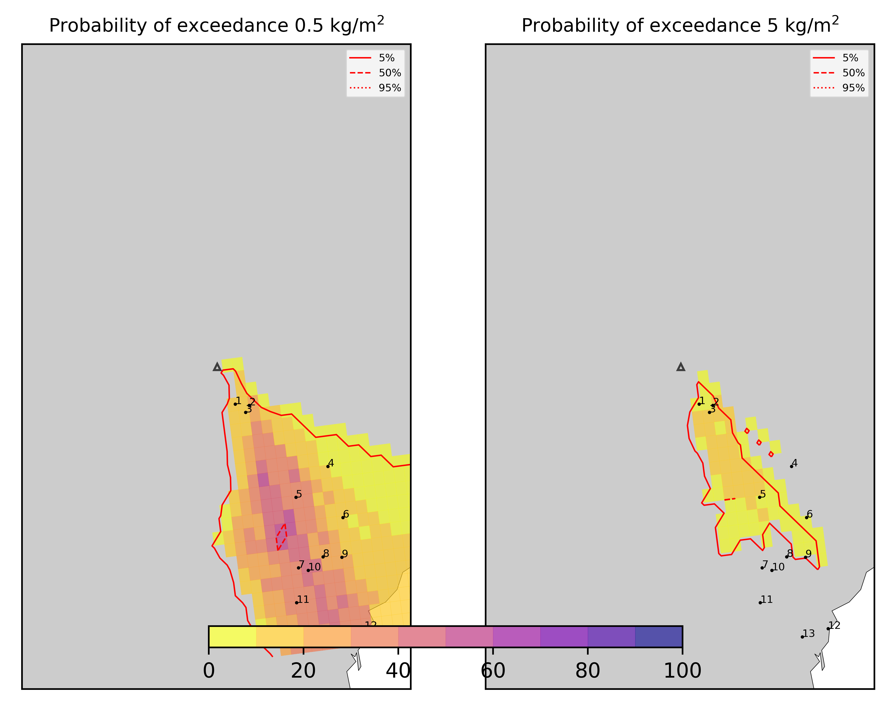
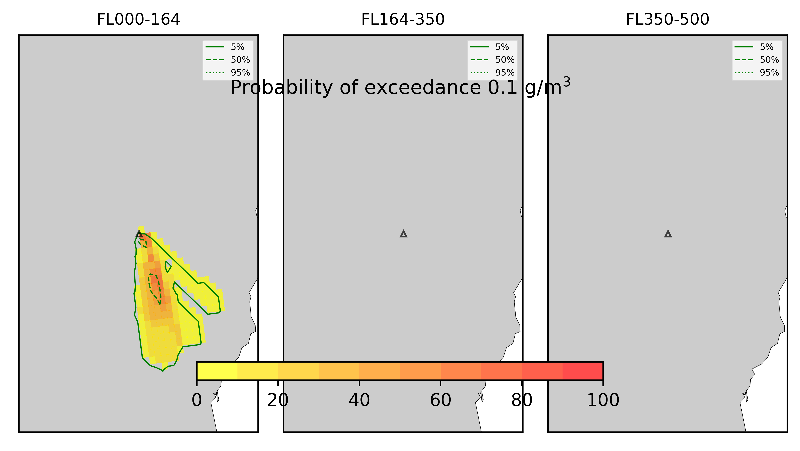

Forecast from VONA bulletin - 20210216_1631Z
============================================

Contents
========

* [Forecast products](#forecast-products)
	* [Forecast at 2021-02-16 19:30 Z - Ongoing Eruption](#forecast-at-2021-02-16-1930-z---ongoing-eruption)

# Forecast products

## Forecast at 2021-02-16 19:30 Z - Ongoing Eruption
  

|Eruption start [Z]|Eruption end [Z]|Forecast time [Z]|Column height asl [m]|
| :--- | :--- | :--- | :--- |
|2021-02-16 16:30:00|Ongoing|2021-02-16 19:30:00|6000 ± 500 - from VONA|
  
  

|Percentile|MER [kg/s¹]|Mass air [kg]|Mass air nested dom. [kg]|Mass grd [kg]|Mass grd nested dom. [kg]|
| :--- | :--- | :--- | :--- | :--- | :--- |
|5th|1.60e+04|7.88e+07|6.49e+07|8.18e+07|5.38e+07|
|50th|7.54e+04|5.09e+08|1.67e+08|2.28e+08|1.73e+08|
|95th|2.10e+05|1.23e+09|3.79e+08|5.47e+08|3.79e+08|
  

### Ground Nested Domain 2021-02-16 19:30 Z
  
  
  
  
  
  
  
  
  
  
  
  
  
  

|Location|Ground load [kg/m²] 5th perc|Ground load [kg/m²] 50th perc|Ground load [kg/m²] 95th perc|
| :--- | :--- | :--- | :--- |
|Schiena Asino (1)|0.00e+00|5.10e-05|5.91e+00|
|Rif.Vescovo (2)|0.00e+00|7.45e-05|5.93e+00|
|Serra Pituzza (3)|0.00e+00|7.97e-05|8.54e+00|
|Monterosso (4)|0.00e+00|5.77e-04|2.91e-01|
|Cim.Pedara (5)|1.41e-03|2.13e-01|4.28e+00|
|Cim.Viagrande (6)|7.32e-04|1.42e-02|4.22e-01|
|Cim.Mascalucia (7)|5.95e-03|3.34e-01|2.77e+00|
|Cim.Tremestieri (8)|3.02e-03|1.08e-01|1.92e+00|
|Cim.S.Giov.La Punta (9)|1.69e-03|3.44e-02|1.09e+00|
|Cim.Gravina (10)|3.46e-04|1.90e-01|3.20e+00|
|ENI S.Giov.Galermo (11)|5.18e-03|2.44e-01|2.15e+00|
|Bio Piazza Europa (12)|1.45e-03|1.53e-01|1.19e+00|
|INGV-OE (13)|1.85e-03|1.51e-01|2.21e+00|
  

### Atmosphere 2021-02-16 19:30 Z
  
  
Go to [Supplementary page](Supplementary_page.md)  
Go to [Main directory](https://github.com/federicapardini/Real_time_ash_forecast)