Forecast from VONA bulletin - 20210216_1631Z
============================================

Contents
========

* [Forecast products](#forecast-products)
	* [Forecast at 2021-02-16 19:30 Z - Ongoing Eruption](#forecast-at-2021-02-16-1930-z---ongoing-eruption)
	* [Forecast at 2021-02-16 22:30 Z - Ongoing Eruption](#forecast-at-2021-02-16-2230-z---ongoing-eruption)
	* [Forecast at 2021-02-17 01:30 Z - Ongoing Eruption](#forecast-at-2021-02-17-0130-z---ongoing-eruption)
	* [Forecast at 2021-02-16 20:10 Z - Ongoing Eruption](#forecast-at-2021-02-16-2010-z---ongoing-eruption)
	* [Forecast at 2021-02-16 23:10 Z - Ongoing Eruption](#forecast-at-2021-02-16-2310-z---ongoing-eruption)
	* [Forecast at 2021-02-17 02:10 Z - Ongoing Eruption](#forecast-at-2021-02-17-0210-z---ongoing-eruption)
	* [Forecast at 2021-02-16 20:40 Z - Ongoing Eruption](#forecast-at-2021-02-16-2040-z---ongoing-eruption)

# Forecast products

## Forecast at 2021-02-16 19:30 Z - Ongoing Eruption
  

|Eruption start [Z]|Eruption end [Z]|Forecast time [Z]|Column height asl [m]|
| :--- | :--- | :--- | :--- |
|2021-02-16 16:30:00|Ongoing|2021-02-16 19:30:00|6000 ± 500 - from VONA|
  
  

|Percentile|MER [kg/s¹]|Mass air [kg]|Mass air nested dom. [kg]|Mass grd [kg]|Mass grd nested dom. [kg]|
| :--- | :--- | :--- | :--- | :--- | :--- |
|5th|1.64e+04|1.45e+08|6.54e+07|4.90e+06|4.90e+06|
|50th|7.32e+04|6.74e+08|1.50e+08|1.01e+08|7.02e+07|
|95th|2.04e+05|1.60e+09|3.00e+08|4.43e+08|3.00e+08|
  

### Ground Nested Domain 2021-02-16 19:30 Z
  
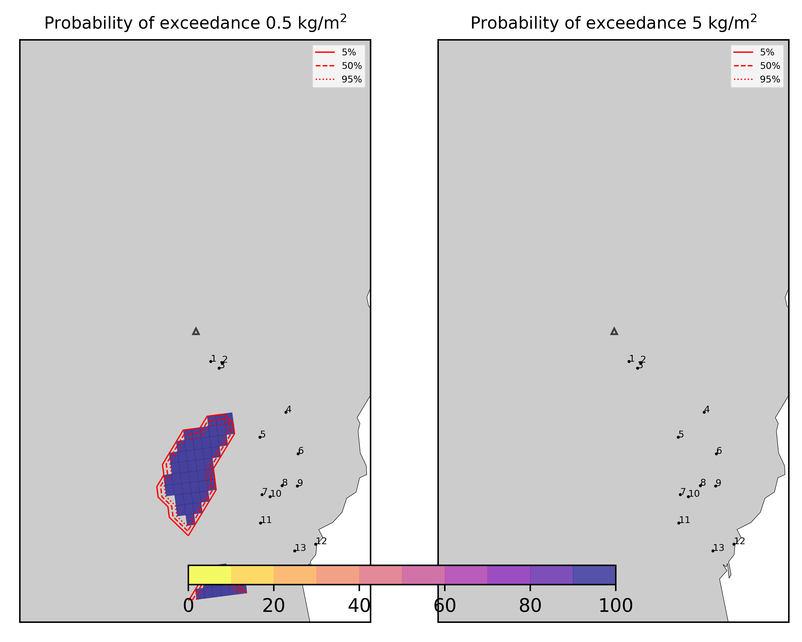  
  
  
  
  
  
  
  
  
  
  
  
  

|Location|Ground load [kg/m²] 5th perc|Ground load [kg/m²] 50th perc|Ground load [kg/m²] 95th perc|
| :--- | :--- | :--- | :--- |
|Schiena Asino (1)|0.00e+00|5.46e-03|1.15e+00|
|Rif.Vescovo (2)|0.00e+00|3.93e-03|3.42e+00|
|Serra Pituzza (3)|0.00e+00|1.67e-02|1.47e+00|
|Monterosso (4)|0.00e+00|3.09e-04|4.30e+00|
|Cim.Pedara (5)|1.69e-03|4.19e-02|3.24e+00|
|Cim.Viagrande (6)|3.79e-05|2.46e-03|7.88e-01|
|Cim.Mascalucia (7)|2.16e-04|4.79e-02|1.10e+00|
|Cim.Tremestieri (8)|1.29e-04|2.67e-02|5.44e-01|
|Cim.S.Giov.La Punta (9)|6.74e-05|1.74e-02|4.27e-01|
|Cim.Gravina (10)|1.81e-04|4.05e-02|6.73e-01|
|ENI S.Giov.Galermo (11)|5.55e-06|2.54e-02|6.46e-01|
|Bio Piazza Europa (12)|1.49e-05|1.14e-02|3.26e-01|
|INGV-OE (13)|5.30e-05|1.64e-02|3.61e-01|
  

### Atmosphere 2021-02-16 19:30 Z
  
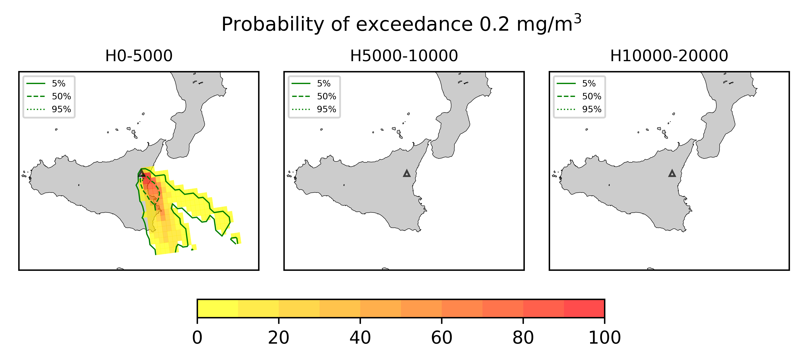
## Forecast at 2021-02-16 22:30 Z - Ongoing Eruption
  

|Eruption start [Z]|Eruption end [Z]|Forecast time [Z]|Column height asl [m]|
| :--- | :--- | :--- | :--- |
|2021-02-16 16:30:00|Ongoing|2021-02-16 22:30:00|6000 ± 500 - from VONA|
  
  

|Percentile|MER [kg/s¹]|Mass air [kg]|Mass air nested dom. [kg]|Mass grd [kg]|Mass grd nested dom. [kg]|
| :--- | :--- | :--- | :--- | :--- | :--- |
|5th|9.11e+03|5.32e+08|8.27e+07|4.68e+07|3.96e+07|
|50th|8.21e+04|1.01e+09|1.42e+08|2.91e+08|1.85e+08|
|95th|1.85e+05|1.68e+09|2.76e+08|5.42e+08|2.76e+08|
  

### Ground Nested Domain 2021-02-16 22:30 Z
  
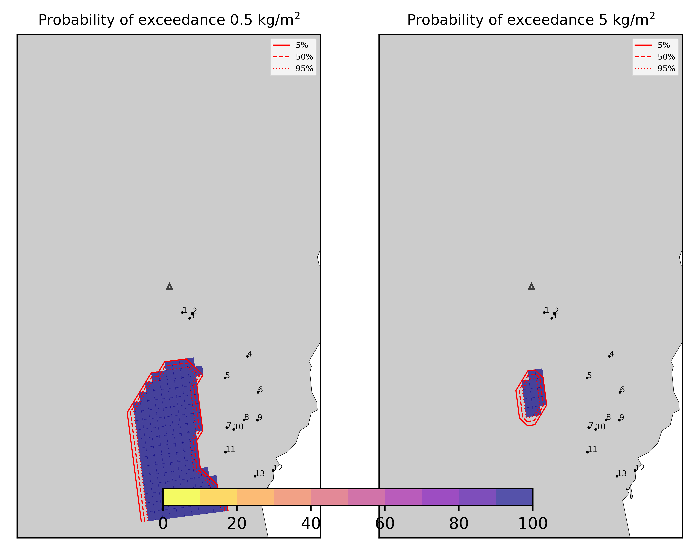  
  
  
  
  
  
  
  
  
  
  
  
  

|Location|Ground load [kg/m²] 5th perc|Ground load [kg/m²] 50th perc|Ground load [kg/m²] 95th perc|
| :--- | :--- | :--- | :--- |
|Schiena Asino (1)|1.24e-04|7.72e-02|3.15e+00|
|Rif.Vescovo (2)|2.11e-04|1.42e-01|2.96e+00|
|Serra Pituzza (3)|2.58e-04|3.35e-01|3.92e+00|
|Monterosso (4)|6.04e-04|7.93e-03|4.26e+00|
|Cim.Pedara (5)|1.28e-02|5.39e-01|3.69e+00|
|Cim.Viagrande (6)|5.30e-04|2.72e-02|8.12e-01|
|Cim.Mascalucia (7)|8.70e-03|1.71e-01|1.56e+00|
|Cim.Tremestieri (8)|1.49e-03|1.08e-01|7.95e-01|
|Cim.S.Giov.La Punta (9)|4.94e-04|6.26e-02|7.15e-01|
|Cim.Gravina (10)|9.79e-03|1.23e-01|1.21e+00|
|ENI S.Giov.Galermo (11)|1.48e-02|1.34e-01|1.02e+00|
|Bio Piazza Europa (12)|1.41e-03|3.20e-02|4.66e-01|
|INGV-OE (13)|4.97e-03|6.07e-02|5.80e-01|
  

### Atmosphere 2021-02-16 22:30 Z
  
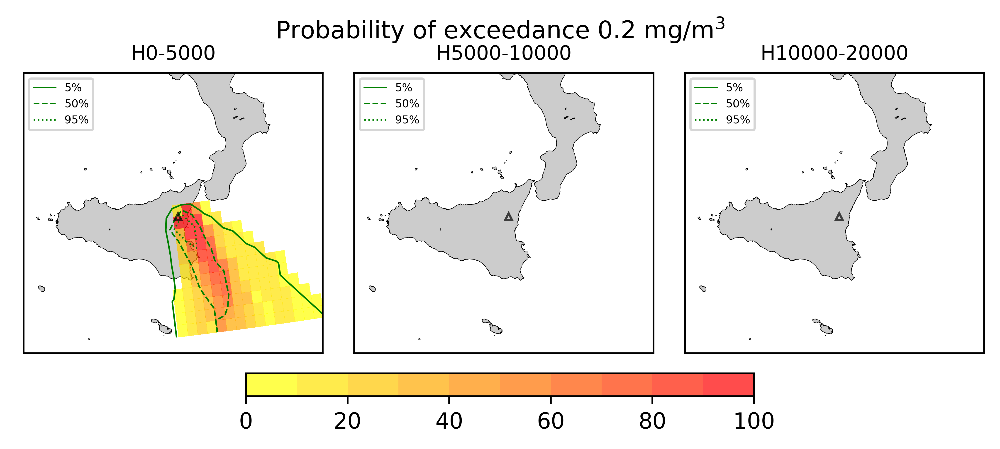
## Forecast at 2021-02-17 01:30 Z - Ongoing Eruption
  

|Eruption start [Z]|Eruption end [Z]|Forecast time [Z]|Column height asl [m]|
| :--- | :--- | :--- | :--- |
|2021-02-16 16:30:00|Ongoing|2021-02-17 01:30:00|6000 ± 500 - from VONA|
  
  

|Percentile|MER [kg/s¹]|Mass air [kg]|Mass air nested dom. [kg]|Mass grd [kg]|Mass grd nested dom. [kg]|
| :--- | :--- | :--- | :--- | :--- | :--- |
|5th|1.80e+04|4.95e+08|1.12e+08|1.61e+08|1.06e+08|
|50th|4.93e+04|1.28e+09|2.07e+08|4.15e+08|2.82e+08|
|95th|2.01e+05|1.69e+09|3.08e+08|8.03e+08|3.08e+08|
  

### Ground Nested Domain 2021-02-17 01:30 Z
  
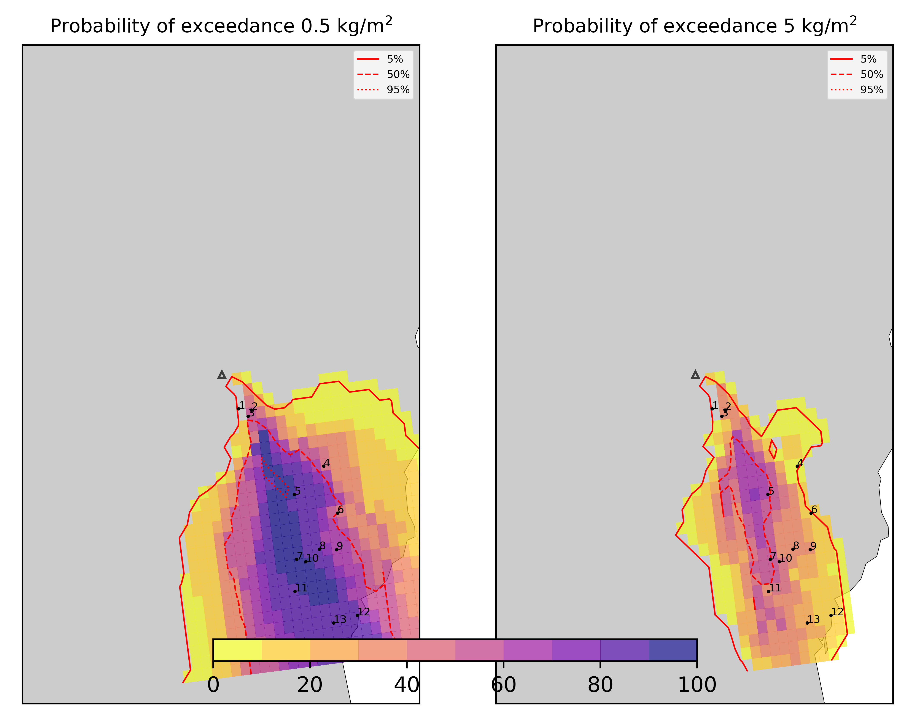  
  
  
  
  
  
  
  
  
  
  
  
  

|Location|Ground load [kg/m²] 5th perc|Ground load [kg/m²] 50th perc|Ground load [kg/m²] 95th perc|
| :--- | :--- | :--- | :--- |
|Schiena Asino (1)|1.58e-03|1.95e-01|2.89e+00|
|Rif.Vescovo (2)|3.11e-03|2.07e-01|4.90e+00|
|Serra Pituzza (3)|2.60e-03|6.98e-01|3.95e+00|
|Monterosso (4)|3.07e-02|2.30e-01|5.64e+00|
|Cim.Pedara (5)|4.19e-02|1.91e+00|4.45e+00|
|Cim.Viagrande (6)|4.28e-02|2.53e-01|1.67e+00|
|Cim.Mascalucia (7)|7.24e-02|5.00e-01|1.88e+00|
|Cim.Tremestieri (8)|7.62e-02|3.47e-01|1.42e+00|
|Cim.S.Giov.La Punta (9)|4.54e-02|2.52e-01|1.37e+00|
|Cim.Gravina (10)|1.00e-01|4.27e-01|1.68e+00|
|ENI S.Giov.Galermo (11)|3.77e-02|2.67e-01|1.19e+00|
|Bio Piazza Europa (12)|3.53e-02|1.40e-01|7.27e-01|
|INGV-OE (13)|1.65e-02|1.69e-01|7.51e-01|
  

### Atmosphere 2021-02-17 01:30 Z
  

## Forecast at 2021-02-16 20:10 Z - Ongoing Eruption
  

|Eruption start [Z]|Eruption end [Z]|Forecast time [Z]|Column height asl [m]|
| :--- | :--- | :--- | :--- |
|2021-02-16 16:30:00|Ongoing|2021-02-16 20:10:00|10000 ± 500 - from VONA|
  
  

|Percentile|MER [kg/s¹]|Mass air [kg]|Mass air nested dom. [kg]|Mass grd [kg]|Mass grd nested dom. [kg]|
| :--- | :--- | :--- | :--- | :--- | :--- |
|5th|2.20e+05|2.57e+09|2.40e+08|3.27e+07|2.76e+07|
|50th|5.91e+05|4.09e+09|5.26e+08|7.26e+08|5.17e+08|
|95th|2.12e+06|9.37e+09|1.25e+09|2.02e+09|1.25e+09|
  

### Ground Nested Domain 2021-02-16 20:10 Z
  
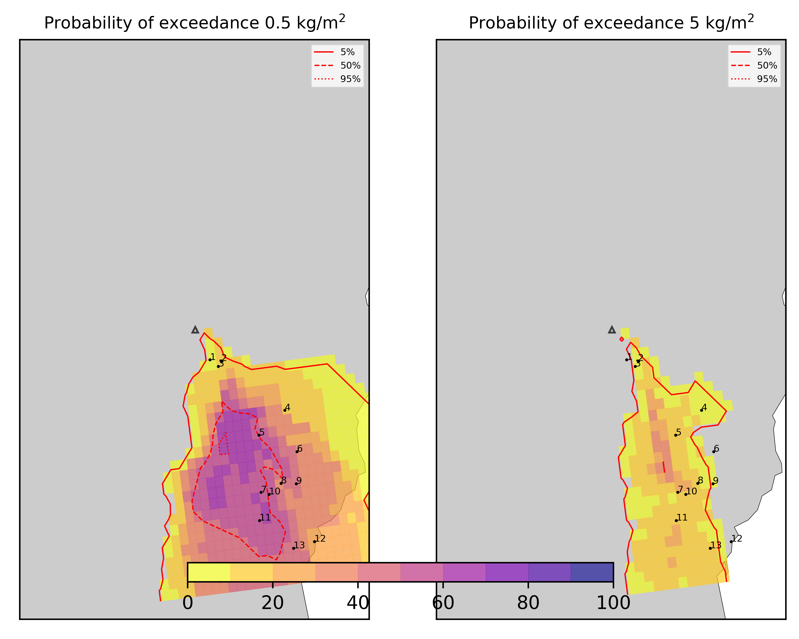  
  
  
  
  
  
  
  
  
  
  
  
  

|Location|Ground load [kg/m²] 5th perc|Ground load [kg/m²] 50th perc|Ground load [kg/m²] 95th perc|
| :--- | :--- | :--- | :--- |
|Schiena Asino (1)|0.00e+00|4.97e-02|1.25e+00|
|Rif.Vescovo (2)|0.00e+00|2.36e-02|7.89e+00|
|Serra Pituzza (3)|0.00e+00|3.53e-02|6.18e+00|
|Monterosso (4)|5.08e-05|2.23e-02|5.00e+00|
|Cim.Pedara (5)|2.40e-04|5.72e-01|1.40e+01|
|Cim.Viagrande (6)|2.56e-04|6.07e-02|2.11e+00|
|Cim.Mascalucia (7)|1.21e-03|6.66e-01|8.02e+00|
|Cim.Tremestieri (8)|3.20e-04|4.67e-01|5.10e+00|
|Cim.S.Giov.La Punta (9)|1.27e-04|3.50e-01|2.35e+00|
|Cim.Gravina (10)|6.81e-04|5.44e-01|7.87e+00|
|ENI S.Giov.Galermo (11)|2.42e-03|8.02e-01|6.86e+00|
|Bio Piazza Europa (12)|1.24e-04|2.23e-01|2.65e+00|
|INGV-OE (13)|2.91e-04|3.87e-01|5.26e+00|
  

### Atmosphere 2021-02-16 20:10 Z
  
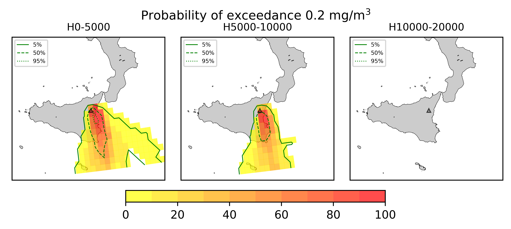
## Forecast at 2021-02-16 23:10 Z - Ongoing Eruption
  

|Eruption start [Z]|Eruption end [Z]|Forecast time [Z]|Column height asl [m]|
| :--- | :--- | :--- | :--- |
|2021-02-16 16:30:00|Ongoing|2021-02-16 23:10:00|10000 ± 500 - from VONA|
  
  

|Percentile|MER [kg/s¹]|Mass air [kg]|Mass air nested dom. [kg]|Mass grd [kg]|Mass grd nested dom. [kg]|
| :--- | :--- | :--- | :--- | :--- | :--- |
|5th|1.51e+05|3.75e+09|2.69e+08|2.70e+08|2.16e+08|
|50th|7.73e+05|7.40e+09|8.99e+08|1.77e+09|1.15e+09|
|95th|1.83e+06|1.24e+10|1.62e+09|4.30e+09|1.62e+09|
  

### Ground Nested Domain 2021-02-16 23:10 Z
  
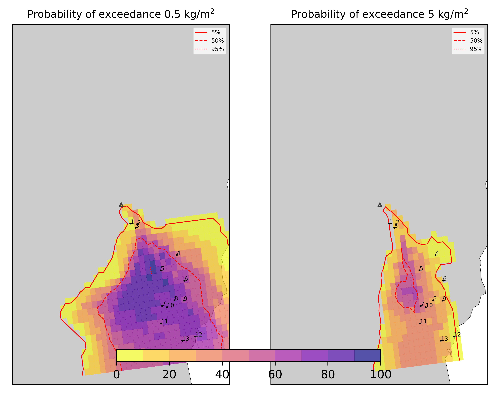  
  
  
  
  
  
  
  
  
  
  
  
  

|Location|Ground load [kg/m²] 5th perc|Ground load [kg/m²] 50th perc|Ground load [kg/m²] 95th perc|
| :--- | :--- | :--- | :--- |
|Schiena Asino (1)|2.69e-02|2.01e-01|3.85e+00|
|Rif.Vescovo (2)|7.16e-04|1.03e-01|1.70e+01|
|Serra Pituzza (3)|2.63e-03|1.37e-01|2.08e+01|
|Monterosso (4)|8.68e-03|3.40e-01|5.40e+00|
|Cim.Pedara (5)|1.94e-01|1.91e+00|3.09e+01|
|Cim.Viagrande (6)|7.04e-02|7.59e-01|3.50e+00|
|Cim.Mascalucia (7)|1.18e-01|4.22e+00|1.83e+01|
|Cim.Tremestieri (8)|1.03e-01|2.09e+00|1.44e+01|
|Cim.S.Giov.La Punta (9)|9.66e-02|1.34e+00|6.84e+00|
|Cim.Gravina (10)|8.85e-02|2.63e+00|1.78e+01|
|ENI S.Giov.Galermo (11)|7.53e-02|3.52e+00|1.33e+01|
|Bio Piazza Europa (12)|2.97e-02|1.72e+00|4.39e+00|
|INGV-OE (13)|3.68e-02|2.72e+00|7.70e+00|
  

### Atmosphere 2021-02-16 23:10 Z
  
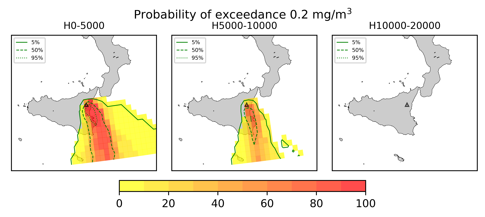
## Forecast at 2021-02-17 02:10 Z - Ongoing Eruption
  

|Eruption start [Z]|Eruption end [Z]|Forecast time [Z]|Column height asl [m]|
| :--- | :--- | :--- | :--- |
|2021-02-16 16:30:00|Ongoing|2021-02-17 02:10:00|10000 ± 500 - from VONA|
  
  

|Percentile|MER [kg/s¹]|Mass air [kg]|Mass air nested dom. [kg]|Mass grd [kg]|Mass grd nested dom. [kg]|
| :--- | :--- | :--- | :--- | :--- | :--- |
|5th|2.17e+05|5.14e+09|5.63e+08|1.02e+09|8.01e+08|
|50th|7.09e+05|7.60e+09|1.02e+09|3.54e+09|1.88e+09|
|95th|1.41e+06|9.92e+09|1.75e+09|7.20e+09|1.75e+09|
  

### Ground Nested Domain 2021-02-17 02:10 Z
  
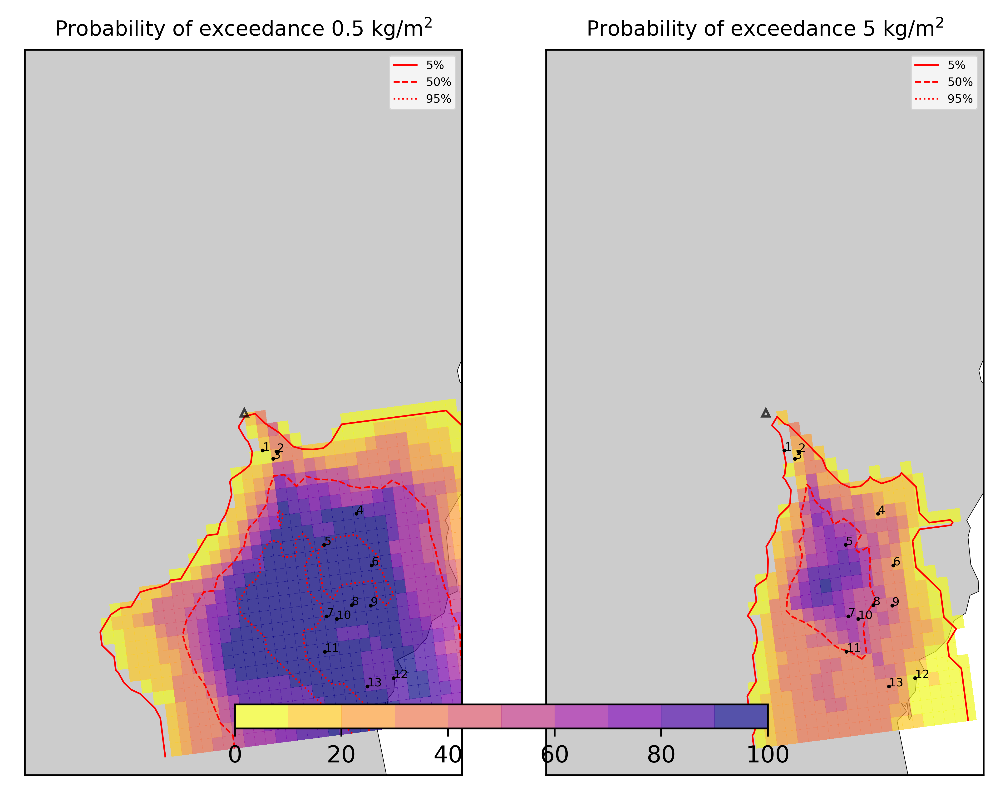  
  
  
  
  
  
  
  
  
  
  
  
  

|Location|Ground load [kg/m²] 5th perc|Ground load [kg/m²] 50th perc|Ground load [kg/m²] 95th perc|
| :--- | :--- | :--- | :--- |
|Schiena Asino (1)|4.07e-02|2.55e-01|6.87e+00|
|Rif.Vescovo (2)|2.51e-03|1.99e-01|3.92e+01|
|Serra Pituzza (3)|4.73e-03|2.12e-01|4.70e+01|
|Monterosso (4)|4.75e-01|2.27e+00|1.24e+01|
|Cim.Pedara (5)|7.15e-01|7.74e+00|3.51e+01|
|Cim.Viagrande (6)|9.70e-01|2.49e+00|9.03e+00|
|Cim.Mascalucia (7)|1.67e+00|6.76e+00|2.47e+01|
|Cim.Tremestieri (8)|1.29e+00|5.23e+00|2.14e+01|
|Cim.S.Giov.La Punta (9)|7.98e-01|2.91e+00|1.31e+01|
|Cim.Gravina (10)|7.75e-01|6.10e+00|2.44e+01|
|ENI S.Giov.Galermo (11)|7.73e-01|4.96e+00|1.82e+01|
|Bio Piazza Europa (12)|4.05e-01|2.36e+00|8.71e+00|
|INGV-OE (13)|3.78e-01|3.58e+00|1.07e+01|
  

### Atmosphere 2021-02-17 02:10 Z
  
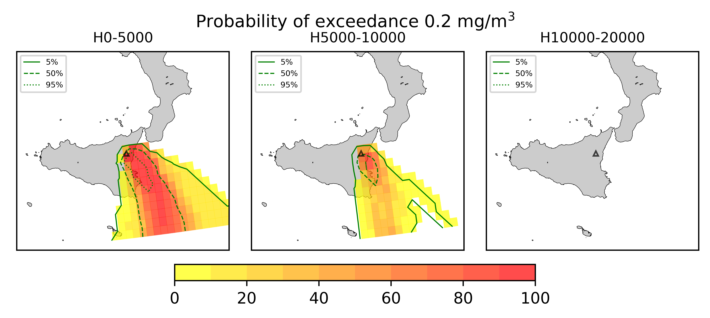
## Forecast at 2021-02-16 20:40 Z - Ongoing Eruption
  

|Eruption start [Z]|Eruption end [Z]|Forecast time [Z]|Column height asl [m]|
| :--- | :--- | :--- | :--- |
|2021-02-16 16:30:00|Ongoing|2021-02-16 20:40:00|[6000 m, 12000 m]|
  
  

|Percentile|MER [kg/s¹]|Mass air [kg]|Mass air nested dom. [kg]|Mass grd [kg]|Mass grd nested dom. [kg]|
| :--- | :--- | :--- | :--- | :--- | :--- |
|5th|6.92e+04|8.38e+08|2.29e+08|2.69e+07|2.00e+07|
|50th|4.53e+05|3.55e+09|4.78e+08|3.45e+08|2.30e+08|
|95th|6.05e+06|1.98e+10|2.20e+09|6.68e+09|2.20e+09|
  

### Ground Nested Domain 2021-02-16 20:40 Z
  
  
  
  
  
  
  
  
  
  
  
  
  
  

|Location|Ground load [kg/m²] 5th perc|Ground load [kg/m²] 50th perc|Ground load [kg/m²] 95th perc|
| :--- | :--- | :--- | :--- |
|Schiena Asino (1)|3.74e-05|3.82e-02|3.59e+00|
|Rif.Vescovo (2)|0.00e+00|3.67e-02|1.21e+01|
|Serra Pituzza (3)|1.26e-05|8.67e-02|2.69e+01|
|Monterosso (4)|0.00e+00|2.05e-02|3.91e+00|
|Cim.Pedara (5)|4.68e-03|2.73e-01|2.14e+01|
|Cim.Viagrande (6)|2.75e-04|5.64e-02|2.53e+00|
|Cim.Mascalucia (7)|1.52e-03|7.84e-01|7.62e+00|
|Cim.Tremestieri (8)|5.37e-03|1.75e-01|1.02e+01|
|Cim.S.Giov.La Punta (9)|3.05e-03|8.10e-02|7.27e+00|
|Cim.Gravina (10)|2.48e-03|6.26e-01|8.94e+00|
|ENI S.Giov.Galermo (11)|7.71e-04|8.11e-01|4.24e+00|
|Bio Piazza Europa (12)|1.16e-04|1.10e-01|5.74e+00|
|INGV-OE (13)|2.08e-04|2.94e-01|5.27e+00|
  

### Atmosphere 2021-02-16 20:40 Z
  
  
Go to [Supplementary page](Supplementary_page.md)  
Go to [Main directory](https://github.com/federicapardini/Real_time_ash_forecast)