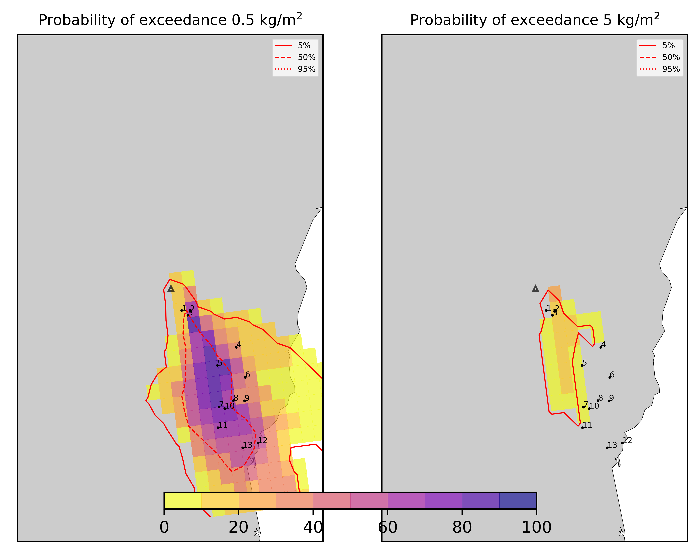
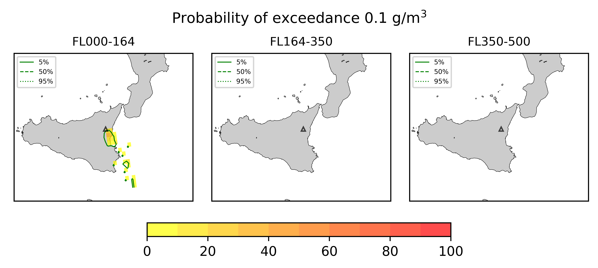

Forecast from VONA bulletin - 20210216_1631Z
============================================

Contents
========

* [Forecast products](#forecast-products)
	* [Forecast at 2021-02-16 19:30 Z - Ongoing Eruption](#forecast-at-2021-02-16-1930-z---ongoing-eruption)
	* [Forecast at 2021-02-16 22:30 Z - Ongoing Eruption](#forecast-at-2021-02-16-2230-z---ongoing-eruption)

# Forecast products

## Forecast at 2021-02-16 19:30 Z - Ongoing Eruption
  

|Eruption start [Z]|Eruption end [Z]|Forecast time [Z]|Column height asl [m]|
| :--- | :--- | :--- | :--- |
|2021-02-16 16:30:00|Ongoing|2021-02-16 19:30:00|6000 ± 500 - from VONA|
  
  

|Percentile|MER [kg/s¹]|Mass air [kg]|Mass air nested dom. [kg]|Mass grd [kg]|Mass grd nested dom. [kg]|
| :--- | :--- | :--- | :--- | :--- | :--- |
|5th|1.84e+04|1.13e+08|6.54e+07|8.13e+07|4.12e+07|
|50th|6.17e+04|4.22e+08|1.84e+08|2.30e+08|1.81e+08|
|95th|1.94e+05|1.19e+09|3.30e+08|6.42e+08|3.30e+08|
  

### Ground Nested Domain 2021-02-16 19:30 Z
  
  
  
  
  
  
  
  
  
  
  
  
  
  

|Location|Ground load [kg/m²] 5th perc|Ground load [kg/m²] 50th perc|Ground load [kg/m²] 95th perc|
| :--- | :--- | :--- | :--- |
|Schiena Asino (1)|0.00e+00|2.44e-05|4.88e+00|
|Rif.Vescovo (2)|0.00e+00|3.93e-05|5.00e+00|
|Serra Pituzza (3)|0.00e+00|3.90e-05|7.62e+00|
|Monterosso (4)|0.00e+00|3.62e-04|1.16e+00|
|Cim.Pedara (5)|1.02e-03|4.57e-01|4.64e+00|
|Cim.Viagrande (6)|6.57e-04|4.47e-03|1.51e+00|
|Cim.Mascalucia (7)|9.12e-03|3.71e-01|3.25e+00|
|Cim.Tremestieri (8)|3.88e-03|1.21e-01|2.41e+00|
|Cim.S.Giov.La Punta (9)|1.68e-03|1.35e-01|2.58e+00|
|Cim.Gravina (10)|9.91e-03|2.81e-01|2.95e+00|
|ENI S.Giov.Galermo (11)|1.38e-02|2.22e-01|1.93e+00|
|Bio Piazza Europa (12)|1.51e-03|1.69e-01|7.61e-01|
|INGV-OE (13)|9.96e-03|1.56e-01|7.48e-01|
  

### Atmosphere 2021-02-16 19:30 Z
  

## Forecast at 2021-02-16 22:30 Z - Ongoing Eruption
  

|Eruption start [Z]|Eruption end [Z]|Forecast time [Z]|Column height asl [m]|
| :--- | :--- | :--- | :--- |
|2021-02-16 16:30:00|Ongoing|2021-02-16 22:30:00|6000 ± 500 - from VONA|
  
  

|Percentile|MER [kg/s¹]|Mass air [kg]|Mass air nested dom. [kg]|Mass grd [kg]|Mass grd nested dom. [kg]|
| :--- | :--- | :--- | :--- | :--- | :--- |
|5th|1.53e+04|1.82e+08|7.30e+07|2.58e+08|2.40e+08|
|50th|5.79e+04|5.23e+08|1.96e+08|5.45e+08|4.41e+08|
|95th|1.62e+05|1.26e+09|2.85e+08|1.29e+09|2.85e+08|
  

### Ground Nested Domain 2021-02-16 22:30 Z
  
  
  
  
  
  
  
  
  
  
  
  
  
  

|Location|Ground load [kg/m²] 5th perc|Ground load [kg/m²] 50th perc|Ground load [kg/m²] 95th perc|
| :--- | :--- | :--- | :--- |
|Schiena Asino (1)|8.45e-06|6.04e-01|6.37e+00|
|Rif.Vescovo (2)|2.06e-05|7.62e-01|5.72e+00|
|Serra Pituzza (3)|1.62e-05|9.14e-01|9.93e+00|
|Monterosso (4)|6.92e-04|5.14e-02|1.45e+00|
|Cim.Pedara (5)|1.95e-02|1.21e+00|6.39e+00|
|Cim.Viagrande (6)|7.25e-03|6.37e-02|2.16e+00|
|Cim.Mascalucia (7)|9.96e-02|1.23e+00|5.20e+00|
|Cim.Tremestieri (8)|8.63e-02|1.20e+00|3.31e+00|
|Cim.S.Giov.La Punta (9)|2.07e-02|3.42e-01|5.04e+00|
|Cim.Gravina (10)|7.18e-02|7.60e-01|5.80e+00|
|ENI S.Giov.Galermo (11)|7.68e-02|1.07e+00|4.78e+00|
|Bio Piazza Europa (12)|7.07e-02|5.24e-01|1.69e+00|
|INGV-OE (13)|5.67e-02|6.08e-01|2.29e+00|
  

### Atmosphere 2021-02-16 22:30 Z
  
  
Go to [Supplementary page](Supplementary_page.md)  
Go to [Main directory](https://github.com/federicapardini/Real_time_ash_forecast)