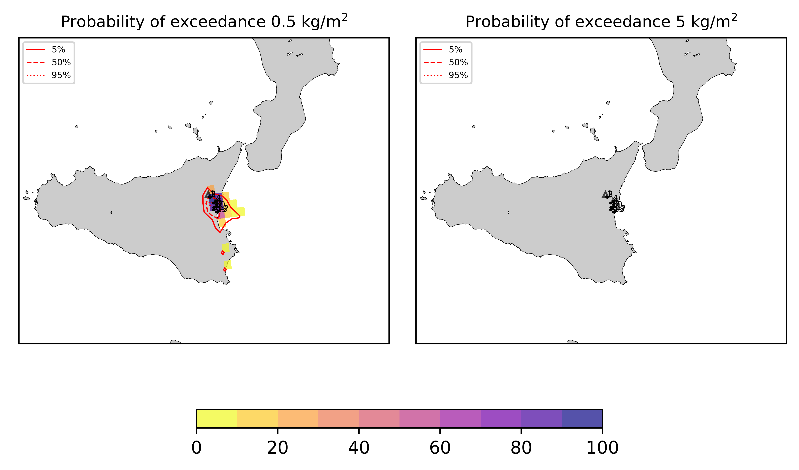
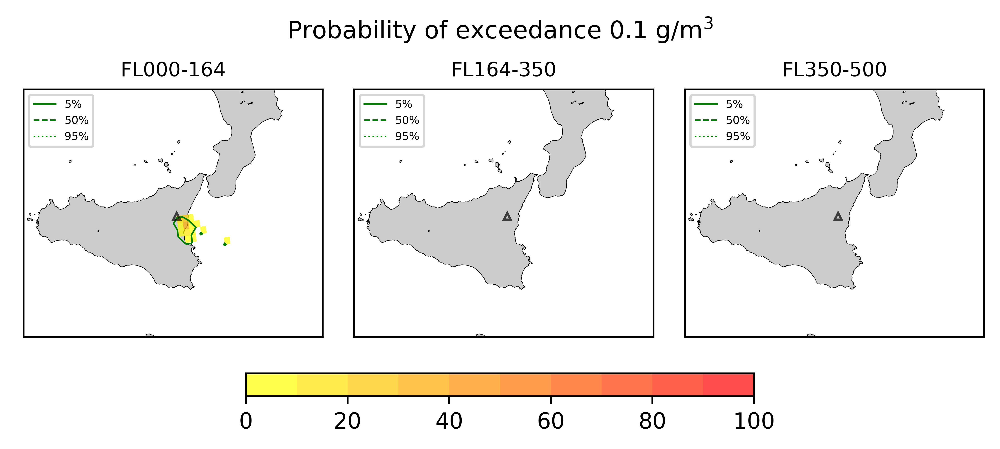
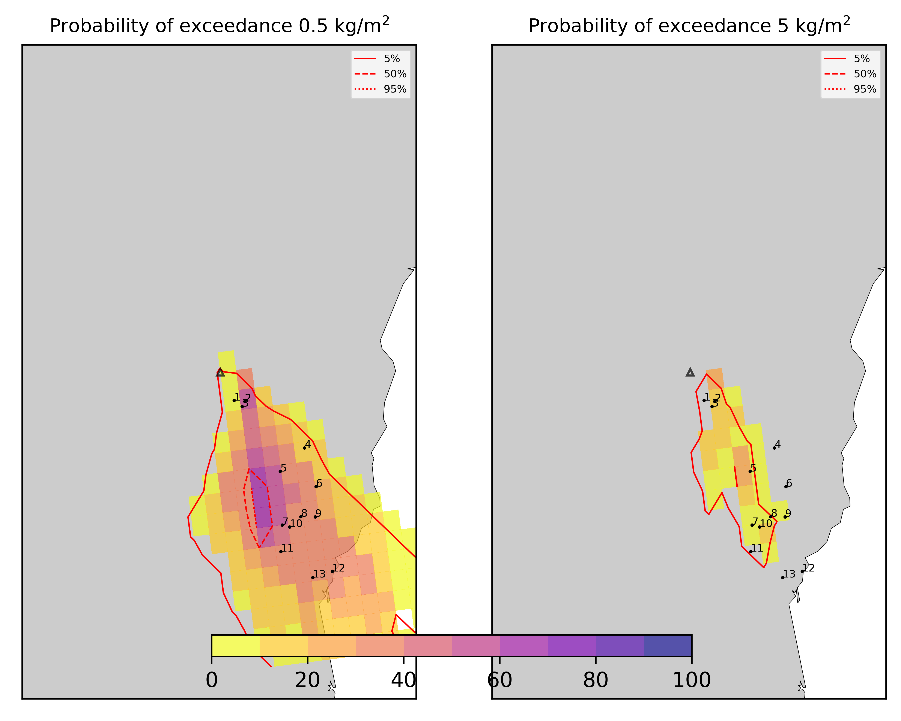
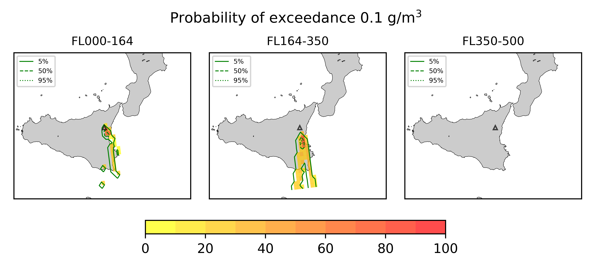
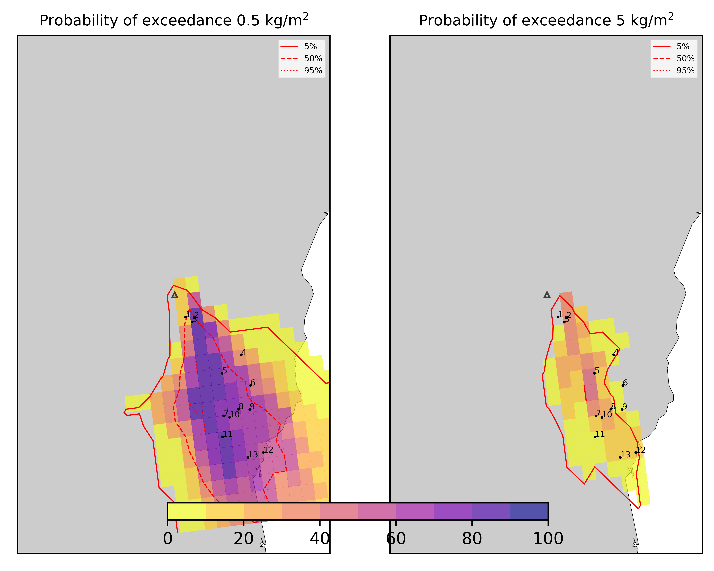
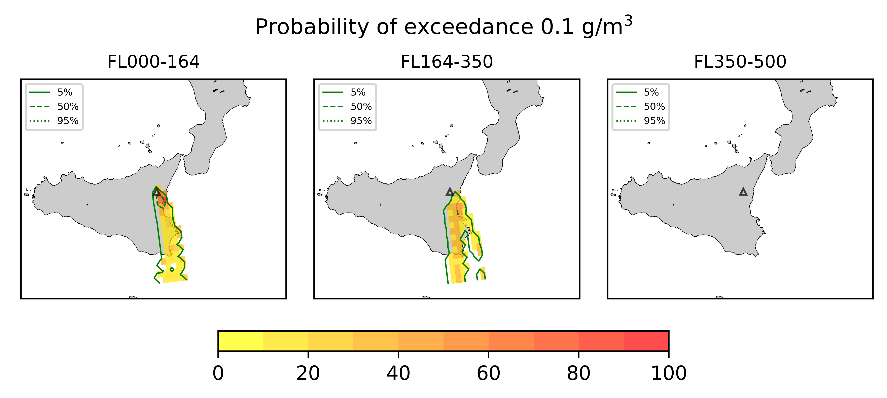

Forecast from VONA bulletin - 20210216_1631Z
============================================

Contents
========

* [Forecast products](#forecast-products)
	* [Forecast at 2021-02-16 19:30 Z - Ongoing Eruption](#forecast-at-2021-02-16-1930-z---ongoing-eruption)
	* [Forecast at 2021-02-16 22:30 Z - Ongoing Eruption](#forecast-at-2021-02-16-2230-z---ongoing-eruption)
	* [Forecast at 2021-02-17 01:30 Z - Ongoing Eruption](#forecast-at-2021-02-17-0130-z---ongoing-eruption)
	* [Forecast at 2021-02-16 20:10 Z - Ongoing Eruption](#forecast-at-2021-02-16-2010-z---ongoing-eruption)
	* [Forecast at 2021-02-16 23:10 Z - Ongoing Eruption](#forecast-at-2021-02-16-2310-z---ongoing-eruption)

# Forecast products

## Forecast at 2021-02-16 19:30 Z - Ongoing Eruption
  

|Eruption start [Z]|Eruption end [Z]|Forecast time [Z]|Column height asl [m]|
| :--- | :--- | :--- | :--- |
|2021-02-16 16:30:00|Ongoing|2021-02-16 19:30:00|6000 ± 500 - from VONA|
  
  

|Percentile|MER [kg/s¹]|Mass air [kg]|Mass air nested dom. [kg]|Mass grd [kg]|Mass grd nested dom. [kg]|
| :--- | :--- | :--- | :--- | :--- | :--- |
|5th|1.60e+04|7.88e+07|6.49e+07|8.18e+07|5.38e+07|
|50th|7.54e+04|5.09e+08|1.67e+08|2.28e+08|1.73e+08|
|95th|2.10e+05|1.23e+09|3.79e+08|5.47e+08|3.79e+08|
  

### Ground Nested Domain 2021-02-16 19:30 Z
  
  
  
  
  
  
  
  
  
  
  
  
  
  

|Location|Ground load [kg/m²] 5th perc|Ground load [kg/m²] 50th perc|Ground load [kg/m²] 95th perc|
| :--- | :--- | :--- | :--- |
|Schiena Asino (1)|0.00e+00|5.10e-05|5.91e+00|
|Rif.Vescovo (2)|0.00e+00|7.45e-05|5.93e+00|
|Serra Pituzza (3)|0.00e+00|7.97e-05|8.54e+00|
|Monterosso (4)|0.00e+00|5.77e-04|2.91e-01|
|Cim.Pedara (5)|1.41e-03|2.13e-01|4.28e+00|
|Cim.Viagrande (6)|7.32e-04|1.42e-02|4.22e-01|
|Cim.Mascalucia (7)|5.95e-03|3.34e-01|2.77e+00|
|Cim.Tremestieri (8)|3.02e-03|1.08e-01|1.92e+00|
|Cim.S.Giov.La Punta (9)|1.69e-03|3.44e-02|1.09e+00|
|Cim.Gravina (10)|3.46e-04|1.90e-01|3.20e+00|
|ENI S.Giov.Galermo (11)|5.18e-03|2.44e-01|2.15e+00|
|Bio Piazza Europa (12)|1.45e-03|1.53e-01|1.19e+00|
|INGV-OE (13)|1.85e-03|1.51e-01|2.21e+00|
  

### Atmosphere 2021-02-16 19:30 Z
  

## Forecast at 2021-02-16 22:30 Z - Ongoing Eruption
  

|Eruption start [Z]|Eruption end [Z]|Forecast time [Z]|Column height asl [m]|
| :--- | :--- | :--- | :--- |
|2021-02-16 16:30:00|Ongoing|2021-02-16 22:30:00|6000 ± 500 - from VONA|
  
  

|Percentile|MER [kg/s¹]|Mass air [kg]|Mass air nested dom. [kg]|Mass grd [kg]|Mass grd nested dom. [kg]|
| :--- | :--- | :--- | :--- | :--- | :--- |
|5th|1.47e+04|1.88e+08|7.20e+07|2.86e+08|1.80e+08|
|50th|6.26e+04|5.66e+08|1.65e+08|6.42e+08|4.46e+08|
|95th|1.76e+05|1.11e+09|2.77e+08|1.16e+09|2.77e+08|
  

### Ground Nested Domain 2021-02-16 22:30 Z
  
  
  
  
  
  
  
  
  
  
  
  
  
  

|Location|Ground load [kg/m²] 5th perc|Ground load [kg/m²] 50th perc|Ground load [kg/m²] 95th perc|
| :--- | :--- | :--- | :--- |
|Schiena Asino (1)|1.11e-05|1.14e+00|5.85e+00|
|Rif.Vescovo (2)|1.16e-05|8.49e-01|6.19e+00|
|Serra Pituzza (3)|1.87e-05|1.80e+00|8.02e+00|
|Monterosso (4)|5.67e-04|3.60e-02|2.31e+00|
|Cim.Pedara (5)|2.15e-03|7.58e-01|6.72e+00|
|Cim.Viagrande (6)|1.96e-03|7.47e-02|1.22e+00|
|Cim.Mascalucia (7)|3.72e-02|1.18e+00|5.45e+00|
|Cim.Tremestieri (8)|6.21e-03|7.29e-01|2.68e+00|
|Cim.S.Giov.La Punta (9)|3.50e-03|3.08e-01|2.16e+00|
|Cim.Gravina (10)|1.52e-02|6.35e-01|4.42e+00|
|ENI S.Giov.Galermo (11)|4.71e-02|9.75e-01|3.97e+00|
|Bio Piazza Europa (12)|1.30e-02|2.93e-01|1.51e+00|
|INGV-OE (13)|1.18e-02|5.05e-01|3.06e+00|
  

### Atmosphere 2021-02-16 22:30 Z
  

## Forecast at 2021-02-17 01:30 Z - Ongoing Eruption
  

|Eruption start [Z]|Eruption end [Z]|Forecast time [Z]|Column height asl [m]|
| :--- | :--- | :--- | :--- |
|2021-02-16 16:30:00|Ongoing|2021-02-17 01:30:00|6000 ± 500 - from VONA|
  
  

|Percentile|MER [kg/s¹]|Mass air [kg]|Mass air nested dom. [kg]|Mass grd [kg]|Mass grd nested dom. [kg]|
| :--- | :--- | :--- | :--- | :--- | :--- |
|5th|1.74e+04|2.05e+08|7.47e+07|5.18e+08|3.99e+08|
|50th|5.51e+04|5.10e+08|1.79e+08|9.58e+08|6.66e+08|
|95th|1.49e+05|1.03e+09|3.19e+08|2.06e+09|3.19e+08|
  

### Ground Nested Domain 2021-02-17 01:30 Z
  
  
  
  
  
  
  
  
  
  
  
  
  
  

|Location|Ground load [kg/m²] 5th perc|Ground load [kg/m²] 50th perc|Ground load [kg/m²] 95th perc|
| :--- | :--- | :--- | :--- |
|Schiena Asino (1)|1.44e-01|2.29e+00|7.75e+00|
|Rif.Vescovo (2)|6.40e-01|2.56e+00|7.86e+00|
|Serra Pituzza (3)|3.22e-01|3.21e+00|1.20e+01|
|Monterosso (4)|2.39e-01|6.52e-01|2.99e+00|
|Cim.Pedara (5)|4.98e-01|2.54e+00|7.68e+00|
|Cim.Viagrande (6)|1.31e-01|7.31e-01|2.08e+00|
|Cim.Mascalucia (7)|5.52e-01|2.19e+00|6.59e+00|
|Cim.Tremestieri (8)|3.24e-01|2.28e+00|3.58e+00|
|Cim.S.Giov.La Punta (9)|1.24e-01|1.23e+00|3.13e+00|
|Cim.Gravina (10)|4.30e-01|1.87e+00|6.33e+00|
|ENI S.Giov.Galermo (11)|4.14e-01|2.23e+00|5.91e+00|
|Bio Piazza Europa (12)|1.85e-01|1.15e+00|2.02e+00|
|INGV-OE (13)|2.25e-01|1.05e+00|3.77e+00|
  

### Atmosphere 2021-02-17 01:30 Z
  

## Forecast at 2021-02-16 20:10 Z - Ongoing Eruption
  

|Eruption start [Z]|Eruption end [Z]|Forecast time [Z]|Column height asl [m]|
| :--- | :--- | :--- | :--- |
|2021-02-16 16:30:00|Ongoing|2021-02-16 20:10:00|10000 ± 500 - from VONA|
  
  

|Percentile|MER [kg/s¹]|Mass air [kg]|Mass air nested dom. [kg]|Mass grd [kg]|Mass grd nested dom. [kg]|
| :--- | :--- | :--- | :--- | :--- | :--- |
|5th|8.34e+04|4.72e+08|4.11e+08|1.44e+08|1.11e+08|
|50th|5.29e+05|3.47e+09|7.25e+08|4.43e+08|2.84e+08|
|95th|1.32e+06|5.68e+09|8.45e+08|1.42e+09|8.45e+08|
  

### Ground Nested Domain 2021-02-16 20:10 Z
  
  
  
  
  
  
  
  
  
  
  
  
  
  

|Location|Ground load [kg/m²] 5th perc|Ground load [kg/m²] 50th perc|Ground load [kg/m²] 95th perc|
| :--- | :--- | :--- | :--- |
|Schiena Asino (1)|0.00e+00|2.57e-01|8.27e+00|
|Rif.Vescovo (2)|0.00e+00|1.69e-01|1.16e+01|
|Serra Pituzza (3)|0.00e+00|4.06e-01|1.29e+01|
|Monterosso (4)|1.69e-04|3.16e-03|1.02e+00|
|Cim.Pedara (5)|1.49e-03|4.15e-01|5.72e+00|
|Cim.Viagrande (6)|9.44e-04|1.73e-02|1.54e+00|
|Cim.Mascalucia (7)|2.10e-02|3.44e-01|5.29e+00|
|Cim.Tremestieri (8)|3.81e-03|4.00e-01|2.71e+00|
|Cim.S.Giov.La Punta (9)|2.16e-03|7.25e-02|1.84e+00|
|Cim.Gravina (10)|8.78e-03|2.51e-01|3.94e+00|
|ENI S.Giov.Galermo (11)|3.58e-02|3.90e-01|3.71e+00|
|Bio Piazza Europa (12)|3.70e-03|1.31e-01|1.85e+00|
|INGV-OE (13)|8.75e-03|1.64e-01|2.46e+00|
  

### Atmosphere 2021-02-16 20:10 Z
  

## Forecast at 2021-02-16 23:10 Z - Ongoing Eruption
  

|Eruption start [Z]|Eruption end [Z]|Forecast time [Z]|Column height asl [m]|
| :--- | :--- | :--- | :--- |
|2021-02-16 16:30:00|Ongoing|2021-02-16 23:10:00|10000 ± 500 - from VONA|
  
  

|Percentile|MER [kg/s¹]|Mass air [kg]|Mass air nested dom. [kg]|Mass grd [kg]|Mass grd nested dom. [kg]|
| :--- | :--- | :--- | :--- | :--- | :--- |
|5th|1.05e+05|2.15e+09|6.31e+08|5.26e+08|3.79e+08|
|50th|4.23e+05|4.06e+09|7.76e+08|1.07e+09|5.74e+08|
|95th|2.41e+06|9.46e+09|1.41e+09|5.22e+09|1.41e+09|
  

### Ground Nested Domain 2021-02-16 23:10 Z
  
  
  
  
  
  
  
  
  
  
  
  
  
  

|Location|Ground load [kg/m²] 5th perc|Ground load [kg/m²] 50th perc|Ground load [kg/m²] 95th perc|
| :--- | :--- | :--- | :--- |
|Schiena Asino (1)|1.21e-01|1.56e+00|1.64e+01|
|Rif.Vescovo (2)|1.70e-01|1.28e+00|1.92e+01|
|Serra Pituzza (3)|1.66e-01|2.21e+00|2.55e+01|
|Monterosso (4)|3.67e-03|1.01e-01|2.91e+00|
|Cim.Pedara (5)|8.36e-02|1.72e+00|7.38e+00|
|Cim.Viagrande (6)|1.40e-02|2.14e-01|2.46e+00|
|Cim.Mascalucia (7)|2.67e-01|1.37e+00|9.90e+00|
|Cim.Tremestieri (8)|6.06e-02|1.14e+00|5.32e+00|
|Cim.S.Giov.La Punta (9)|2.75e-02|9.56e-01|2.19e+00|
|Cim.Gravina (10)|1.46e-01|9.62e-01|8.16e+00|
|ENI S.Giov.Galermo (11)|3.41e-01|1.60e+00|7.66e+00|
|Bio Piazza Europa (12)|7.75e-02|8.00e-01|4.90e+00|
|INGV-OE (13)|1.32e-01|8.31e-01|6.13e+00|
  

### Atmosphere 2021-02-16 23:10 Z
  
  
Go to [Supplementary page](Supplementary_page.md)  
Go to [Main directory](https://github.com/federicapardini/Real_time_ash_forecast)