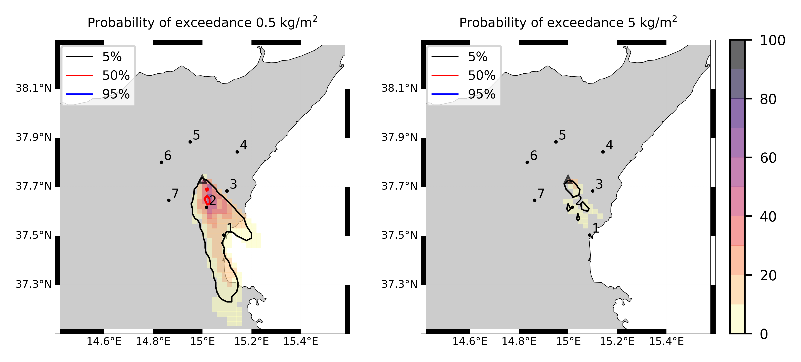

Forecast from VONA_20210216_1631Z
=================================

Contents
========

* [Forecast products](#forecast-products)
	* [Forecast at 2021-02-16 17:30 Z from RED VONA issued at 20210216_1631Z](#forecast-at-2021-02-16-1730-z-from-red-vona-issued-at-20210216_1631z)

# Forecast products

## Forecast at 2021-02-16 17:30 Z from RED VONA issued at 20210216_1631Z
  

|Eruption start [Z]|Eruption end [Z]|Forecast time [Z]|Column height asl [m]|
| :--- | :--- | :--- | :--- |
|2021-02-16 16:30:00|Ongoing|2021-02-16 17:30:00|6000 ± 500 - from VONA|
  
  

|Percentile|MER [kg/s¹]|Mass air [kg]|Mass air nested dom. [kg]|Mass grd [kg]|Mass grd nested dom. [kg]|
| :--- | :--- | :--- | :--- | :--- | :--- |
|5th|2.07e+04|2.38e+07|2.34e+07|3.04e+07|3.04e+07|
|50th|6.39e+04|7.98e+07|7.98e+07|1.62e+08|1.62e+08|
|95th|1.81e+05|2.44e+08|2.19e+08|3.97e+08|3.97e+08|
  

### Ground Nested Domain 2021-02-16 17:30 Z
  
  
  
  
  
  
  
  
  
  
  
  
  
  

|Location|Ground load [kg/m²] 5th perc|Ground load [kg/m²] 50th perc|Ground load [kg/m²] 95th perc|
| :--- | :--- | :--- | :--- |
|Schiena Asino (1)|3.78e-01|1.75e+00|3.31e+00|
|Rif.Vescovo (2)|0.00e+00|5.37e-01|3.25e+00|
|Serra Pituzza (3)|0.00e+00|6.55e-01|4.34e+00|
|Monterosso (4)|0.00e+00|4.20e-05|1.35e+00|
|Cim.Pedara (5)|4.41e-05|1.38e-01|1.57e+00|
|Cim.Viagrande (6)|0.00e+00|1.02e-05|1.76e-01|
|Cim.Mascalucia (7)|0.00e+00|6.41e-03|1.03e+00|
|Cim.Tremestieri (8)|0.00e+00|1.01e-02|1.14e-01|
|Cim.S.Giov.La Punta (9)|0.00e+00|9.86e-04|3.19e-02|
|Cim.Gravina (10)|0.00e+00|5.82e-03|3.61e-01|
|ENI S.Giov.Galermo (11)|0.00e+00|1.31e-03|6.99e-01|
|Bio Piazza Europa (12)|0.00e+00|1.39e-04|1.10e-02|
|INGV-OE (13)|0.00e+00|1.75e-04|2.93e-02|
  

### Atmosphere 2021-02-16 17:30 Z
  
  
Go to [Supplementary page](Supplementary_page.md)  
Go to [Main directory](https://github.com/federicapardini/Real_time_ash_forecast)