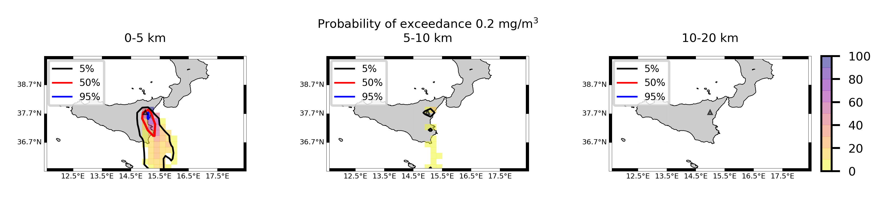
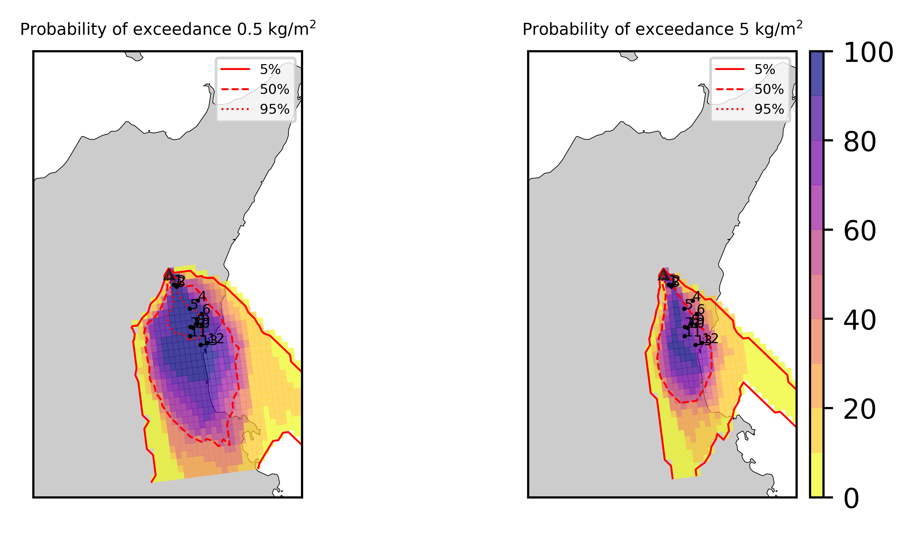

Forecast from VONA_20210216_1631Z
=================================

Contents
========

* [Forecast products](#forecast-products)
	* [Forecast at 2021-02-16 17:30 Z from RED VONA issued at 20210216_1631Z](#forecast-at-2021-02-16-1730-z-from-red-vona-issued-at-20210216_1631z)
	* [Forecast at 2021-02-16 18:30 Z from RED VONA issued at 20210216_1631Z](#forecast-at-2021-02-16-1830-z-from-red-vona-issued-at-20210216_1631z)
	* [Forecast at 2021-02-16 19:30 Z from RED VONA issued at 20210216_1631Z](#forecast-at-2021-02-16-1930-z-from-red-vona-issued-at-20210216_1631z)
	* [Forecast at 2021-02-16 22:30 Z from RED VONA issued at 20210216_1631Z](#forecast-at-2021-02-16-2230-z-from-red-vona-issued-at-20210216_1631z)
	* [Forecast at 2021-02-16 20:10 Z from RED VONA issued at 20210216_1705Z](#forecast-at-2021-02-16-2010-z-from-red-vona-issued-at-20210216_1705z)
	* [Forecast at 2021-02-16 23:10 Z from RED VONA issued at 20210216_1738Z](#forecast-at-2021-02-16-2310-z-from-red-vona-issued-at-20210216_1738z)
	* [Forecast at 2021-02-17 02:40 Z from RED VONA issued at 20210216_1738Z](#forecast-at-2021-02-17-0240-z-from-red-vona-issued-at-20210216_1738z)
	* [Forecast at 2021-02-17 02:40 Z from RED VONA issued at 20210216_1738Z](#forecast-at-2021-02-17-0240-z-from-red-vona-issued-at-20210216_1738z)

# Forecast products

## Forecast at 2021-02-16 17:30 Z from RED VONA issued at 20210216_1631Z
  

|Eruption start [Z]|Eruption end [Z]|Forecast time [Z]|Column height asl [m]|
| :--- | :--- | :--- | :--- |
|2021-02-16 16:30:00|Ongoing|2021-02-16 17:30:00|6000 ± 500 - from VONA|
  
  

|Percentile|MER [kg/s¹]|Mass air [kg]|Mass air nested dom. [kg]|Mass grd [kg]|Mass grd nested dom. [kg]|
| :--- | :--- | :--- | :--- | :--- | :--- |
|5th|2.35e+04|8.26e+07|7.74e+07|3.14e+05|3.14e+05|
|50th|6.54e+04|1.91e+08|1.63e+08|1.40e+07|1.40e+07|
|95th|2.28e+05|6.13e+08|4.61e+08|9.17e+07|9.17e+07|
  

### Ground Nested Domain 2021-02-16 17:30 Z
  
  
  
  
  
  
  
  
  
  
  
  
  
  

|Location|Ground load [kg/m²] 5th perc|Ground load [kg/m²] 50th perc|Ground load [kg/m²] 95th perc|
| :--- | :--- | :--- | :--- |
|Schiena Asino (1)|1.78e-05|1.67e-03|1.11e+00|
|Rif.Vescovo (2)|0.00e+00|2.04e-04|1.14e+00|
|Serra Pituzza (3)|0.00e+00|2.87e-04|1.33e+00|
|Monterosso (4)|0.00e+00|0.00e+00|8.71e-03|
|Cim.Pedara (5)|2.96e-05|3.38e-02|1.93e-01|
|Cim.Viagrande (6)|0.00e+00|1.30e-05|5.15e-03|
|Cim.Mascalucia (7)|0.00e+00|2.29e-03|1.86e-01|
|Cim.Tremestieri (8)|5.46e-05|1.52e-03|7.38e-02|
|Cim.S.Giov.La Punta (9)|5.74e-06|3.01e-04|2.30e-02|
|Cim.Gravina (10)|0.00e+00|1.70e-03|1.52e-01|
|ENI S.Giov.Galermo (11)|0.00e+00|2.10e-03|1.14e-01|
|Bio Piazza Europa (12)|0.00e+00|1.17e-04|1.06e-02|
|INGV-OE (13)|0.00e+00|5.44e-04|2.89e-02|
  

### Atmosphere 2021-02-16 17:30 Z
  

## Forecast at 2021-02-16 18:30 Z from RED VONA issued at 20210216_1631Z
  

|Eruption start [Z]|Eruption end [Z]|Forecast time [Z]|Column height asl [m]|
| :--- | :--- | :--- | :--- |
|2021-02-16 16:30:00|Ongoing|2021-02-16 18:30:00|6000 ± 500 - from VONA|
  
  

|Percentile|MER [kg/s¹]|Mass air [kg]|Mass air nested dom. [kg]|Mass grd [kg]|Mass grd nested dom. [kg]|
| :--- | :--- | :--- | :--- | :--- | :--- |
|5th|1.82e+04|1.99e+08|1.38e+08|5.63e+06|5.63e+06|
|50th|5.43e+04|5.14e+08|3.14e+08|5.05e+07|4.95e+07|
|95th|1.98e+05|9.17e+08|5.27e+08|1.52e+08|1.51e+08|
  

### Ground Nested Domain 2021-02-16 18:30 Z
  
  
  
  
  
  
  
  
  
  
  
  
  
  

|Location|Ground load [kg/m²] 5th perc|Ground load [kg/m²] 50th perc|Ground load [kg/m²] 95th perc|
| :--- | :--- | :--- | :--- |
|Schiena Asino (1)|4.07e-04|1.28e-02|1.14e+00|
|Rif.Vescovo (2)|1.13e-05|8.78e-03|1.18e+00|
|Serra Pituzza (3)|1.34e-05|1.23e-02|1.38e+00|
|Monterosso (4)|0.00e+00|7.07e-03|2.03e-01|
|Cim.Pedara (5)|4.55e-03|8.22e-02|1.29e+00|
|Cim.Viagrande (6)|4.21e-06|5.17e-03|7.51e-02|
|Cim.Mascalucia (7)|1.54e-03|5.23e-02|6.45e-01|
|Cim.Tremestieri (8)|1.69e-04|2.37e-02|3.51e-01|
|Cim.S.Giov.La Punta (9)|6.11e-05|1.18e-02|1.42e-01|
|Cim.Gravina (10)|6.06e-04|3.99e-02|7.08e-01|
|ENI S.Giov.Galermo (11)|2.91e-04|2.53e-02|2.14e-01|
|Bio Piazza Europa (12)|4.06e-04|7.34e-03|1.18e-01|
|INGV-OE (13)|6.79e-04|6.35e-03|1.47e-01|
  

### Atmosphere 2021-02-16 18:30 Z
  

## Forecast at 2021-02-16 19:30 Z from RED VONA issued at 20210216_1631Z
  

|Eruption start [Z]|Eruption end [Z]|Forecast time [Z]|Column height asl [m]|
| :--- | :--- | :--- | :--- |
|2021-02-16 16:30:00|Ongoing|2021-02-16 19:30:00|6000 ± 500 - from VONA|
  
  

|Percentile|MER [kg/s¹]|Mass air [kg]|Mass air nested dom. [kg]|Mass grd [kg]|Mass grd nested dom. [kg]|
| :--- | :--- | :--- | :--- | :--- | :--- |
|5th|2.39e+04|3.38e+08|1.57e+08|1.65e+07|1.63e+07|
|50th|7.23e+04|7.60e+08|3.20e+08|7.37e+07|6.70e+07|
|95th|1.82e+05|1.50e+09|6.27e+08|2.41e+08|2.34e+08|
  

### Ground Nested Domain 2021-02-16 19:30 Z
  
  
  
  
  
  
  
  
  
  
  
  
  
  

|Location|Ground load [kg/m²] 5th perc|Ground load [kg/m²] 50th perc|Ground load [kg/m²] 95th perc|
| :--- | :--- | :--- | :--- |
|Schiena Asino (1)|9.43e-04|2.89e-02|1.30e+00|
|Rif.Vescovo (2)|2.09e-05|3.40e-02|1.37e+00|
|Serra Pituzza (3)|2.15e-05|4.76e-02|1.74e+00|
|Monterosso (4)|1.48e-04|1.51e-02|8.39e-01|
|Cim.Pedara (5)|3.13e-02|1.53e-01|1.61e+00|
|Cim.Viagrande (6)|1.28e-04|1.82e-02|2.68e-01|
|Cim.Mascalucia (7)|1.99e-02|1.77e-01|8.46e-01|
|Cim.Tremestieri (8)|5.41e-03|7.80e-02|4.59e-01|
|Cim.S.Giov.La Punta (9)|1.60e-03|3.12e-02|3.91e-01|
|Cim.Gravina (10)|1.64e-02|1.41e-01|9.06e-01|
|ENI S.Giov.Galermo (11)|4.74e-03|1.13e-01|2.64e-01|
|Bio Piazza Europa (12)|1.43e-03|2.71e-02|1.91e-01|
|INGV-OE (13)|1.96e-03|3.79e-02|2.13e-01|
  

### Atmosphere 2021-02-16 19:30 Z
  

## Forecast at 2021-02-16 22:30 Z from RED VONA issued at 20210216_1631Z
  

|Eruption start [Z]|Eruption end [Z]|Forecast time [Z]|Column height asl [m]|
| :--- | :--- | :--- | :--- |
|2021-02-16 16:30:00|Ongoing|2021-02-16 22:30:00|6000 ± 500 - from VONA|
  
  

|Percentile|MER [kg/s¹]|Mass air [kg]|Mass air nested dom. [kg]|Mass grd [kg]|Mass grd nested dom. [kg]|
| :--- | :--- | :--- | :--- | :--- | :--- |
|5th|1.71e+04|6.29e+08|2.04e+08|8.10e+07|7.04e+07|
|50th|7.93e+04|9.91e+08|3.68e+08|1.88e+08|1.68e+08|
|95th|1.48e+05|1.74e+09|7.00e+08|5.49e+08|4.96e+08|
  

### Ground Nested Domain 2021-02-16 22:30 Z
  
  
  
  
  
  
  
  
  
  
  
  
  
  

|Location|Ground load [kg/m²] 5th perc|Ground load [kg/m²] 50th perc|Ground load [kg/m²] 95th perc|
| :--- | :--- | :--- | :--- |
|Schiena Asino (1)|1.08e-03|2.67e-01|1.43e+00|
|Rif.Vescovo (2)|1.42e-03|2.55e-01|1.56e+00|
|Serra Pituzza (3)|1.37e-03|2.98e-01|2.11e+00|
|Monterosso (4)|4.23e-03|4.29e-02|3.07e+00|
|Cim.Pedara (5)|7.77e-02|5.08e-01|4.20e+00|
|Cim.Viagrande (6)|7.53e-03|8.40e-02|8.39e-01|
|Cim.Mascalucia (7)|6.53e-02|3.43e-01|1.60e+00|
|Cim.Tremestieri (8)|2.83e-02|1.82e-01|1.35e+00|
|Cim.S.Giov.La Punta (9)|2.58e-02|1.12e-01|8.26e-01|
|Cim.Gravina (10)|5.22e-02|2.53e-01|1.61e+00|
|ENI S.Giov.Galermo (11)|3.84e-02|2.91e-01|8.68e-01|
|Bio Piazza Europa (12)|8.30e-03|7.32e-02|4.81e-01|
|INGV-OE (13)|1.16e-02|1.39e-01|4.92e-01|
  

### Atmosphere 2021-02-16 22:30 Z
  

## Forecast at 2021-02-16 20:10 Z from RED VONA issued at 20210216_1705Z
  

|Eruption start [Z]|Eruption end [Z]|Forecast time [Z]|Column height asl [m]|
| :--- | :--- | :--- | :--- |
|2021-02-16 16:30:00|Ongoing|2021-02-16 20:10:00|10000 ± 500 - from VONA|
  
  

|Percentile|MER [kg/s¹]|Mass air [kg]|Mass air nested dom. [kg]|Mass grd [kg]|Mass grd nested dom. [kg]|
| :--- | :--- | :--- | :--- | :--- | :--- |
|5th|1.82e+05|2.26e+09|1.08e+09|1.84e+07|1.84e+07|
|50th|5.52e+05|4.39e+09|1.62e+09|6.98e+08|5.36e+08|
|95th|2.14e+06|1.32e+10|3.80e+09|2.87e+09|2.68e+09|
  

### Ground Nested Domain 2021-02-16 20:10 Z
  
  
  
  
  
  
  
  
  
  
  
  
  
  

|Location|Ground load [kg/m²] 5th perc|Ground load [kg/m²] 50th perc|Ground load [kg/m²] 95th perc|
| :--- | :--- | :--- | :--- |
|Schiena Asino (1)|4.43e-04|6.86e-02|2.99e+00|
|Rif.Vescovo (2)|2.26e-05|2.13e-02|3.63e+00|
|Serra Pituzza (3)|2.68e-05|2.69e-02|5.04e+00|
|Monterosso (4)|4.66e-06|2.07e-02|2.03e+00|
|Cim.Pedara (5)|3.06e-02|5.13e-01|4.90e+00|
|Cim.Viagrande (6)|3.78e-04|9.89e-02|1.42e+00|
|Cim.Mascalucia (7)|1.35e-02|8.45e-01|4.93e+00|
|Cim.Tremestieri (8)|1.95e-02|3.87e-01|2.73e+00|
|Cim.S.Giov.La Punta (9)|9.43e-03|2.59e-01|1.77e+00|
|Cim.Gravina (10)|1.16e-02|6.92e-01|4.50e+00|
|ENI S.Giov.Galermo (11)|2.30e-02|4.13e-01|3.52e+00|
|Bio Piazza Europa (12)|1.05e-02|2.94e-01|1.72e+00|
|INGV-OE (13)|2.71e-03|2.59e-01|2.44e+00|
  

### Atmosphere 2021-02-16 20:10 Z
  

## Forecast at 2021-02-16 23:10 Z from RED VONA issued at 20210216_1738Z
  

|Eruption start [Z]|Eruption end [Z]|Forecast time [Z]|Column height asl [m]|
| :--- | :--- | :--- | :--- |
|2021-02-16 16:30:00|Ongoing|2021-02-16 23:10:00|10000 ± 500 - from VONA|
  
  

|Percentile|MER [kg/s¹]|Mass air [kg]|Mass air nested dom. [kg]|Mass grd [kg]|Mass grd nested dom. [kg]|
| :--- | :--- | :--- | :--- | :--- | :--- |
|5th|9.81e+04|4.65e+09|1.70e+09|4.10e+08|3.50e+08|
|50th|6.83e+05|7.09e+09|2.38e+09|2.09e+09|1.33e+09|
|95th|2.41e+06|1.52e+10|4.19e+09|4.57e+09|3.98e+09|
  

### Ground Nested Domain 2021-02-16 23:10 Z
  
  
  
  
  
  
  
  
  
  
  
  
  
  

|Location|Ground load [kg/m²] 5th perc|Ground load [kg/m²] 50th perc|Ground load [kg/m²] 95th perc|
| :--- | :--- | :--- | :--- |
|Schiena Asino (1)|5.15e-03|1.53e-01|5.79e+00|
|Rif.Vescovo (2)|1.76e-04|6.07e-02|6.58e+00|
|Serra Pituzza (3)|1.90e-04|8.20e-02|8.55e+00|
|Monterosso (4)|1.28e-02|2.31e-01|2.99e+00|
|Cim.Pedara (5)|6.35e-02|3.11e+00|7.81e+00|
|Cim.Viagrande (6)|4.40e-02|6.92e-01|3.59e+00|
|Cim.Mascalucia (7)|5.67e-01|2.38e+00|1.09e+01|
|Cim.Tremestieri (8)|2.62e-01|1.59e+00|7.42e+00|
|Cim.S.Giov.La Punta (9)|1.83e-01|1.16e+00|5.74e+00|
|Cim.Gravina (10)|5.09e-01|1.74e+00|1.13e+01|
|ENI S.Giov.Galermo (11)|2.51e-01|2.77e+00|1.05e+01|
|Bio Piazza Europa (12)|1.13e-01|1.22e+00|4.30e+00|
|INGV-OE (13)|1.06e-01|2.19e+00|6.70e+00|
  

### Atmosphere 2021-02-16 23:10 Z

## Forecast at 2021-02-17 02:40 Z from RED VONA issued at 20210216_1738Z
  

|Eruption start [Z]|Eruption end [Z]|Forecast time [Z]|Column height asl [m]|
| :--- | :--- | :--- | :--- |
|2021-02-16 16:30:00|Ongoing|2021-02-17 02:40:00|[6000 m, 12000 m]|
  
  

|Percentile|MER [kg/s¹]|Mass air [kg]|Mass air nested dom. [kg]|Mass grd [kg]|Mass grd nested dom. [kg]|
| :--- | :--- | :--- | :--- | :--- | :--- |
|5th|9.81e+04|4.65e+09|1.70e+09|4.10e+08|3.50e+08|
|50th|6.83e+05|7.09e+09|2.38e+09|2.09e+09|1.33e+09|
|95th|2.41e+06|1.52e+10|4.19e+09|4.57e+09|3.98e+09|
  

### Ground Nested Domain 2021-02-17 02:40 Z
  
  
  
  
  
  
  
  
  
  
  
  
  

|Location|Ground load [kg/m²] 5th perc|Ground load [kg/m²] 50th perc|Ground load [kg/m²] 95th perc|
| :--- | :--- | :--- | :--- |
|Schiena Asino (1)|5.15e-03|1.53e-01|5.79e+00|
|Rif.Vescovo (2)|1.76e-04|6.07e-02|6.58e+00|
|Serra Pituzza (3)|1.90e-04|8.20e-02|8.55e+00|
|Monterosso (4)|1.28e-02|2.31e-01|2.99e+00|
|Cim.Pedara (5)|6.35e-02|3.11e+00|7.81e+00|
|Cim.Viagrande (6)|4.40e-02|6.92e-01|3.59e+00|
|Cim.Mascalucia (7)|5.67e-01|2.38e+00|1.09e+01|
|Cim.Tremestieri (8)|2.62e-01|1.59e+00|7.42e+00|
|Cim.S.Giov.La Punta (9)|1.83e-01|1.16e+00|5.74e+00|
|Cim.Gravina (10)|5.09e-01|1.74e+00|1.13e+01|
|ENI S.Giov.Galermo (11)|2.51e-01|2.77e+00|1.05e+01|
|Bio Piazza Europa (12)|1.13e-01|1.22e+00|4.30e+00|
|INGV-OE (13)|1.06e-01|2.19e+00|6.70e+00|
  

### Atmosphere 2021-02-17 02:40 Z

## Forecast at 2021-02-17 02:40 Z from RED VONA issued at 20210216_1738Z
  

|Eruption start [Z]|Eruption end [Z]|Forecast time [Z]|Column height asl [m]|
| :--- | :--- | :--- | :--- |
|2021-02-16 16:30:00|Ongoing|2021-02-17 02:40:00|[6000 m, 12000 m]|
  
  

|Percentile|MER [kg/s¹]|Mass air [kg]|Mass air nested dom. [kg]|Mass grd [kg]|Mass grd nested dom. [kg]|
| :--- | :--- | :--- | :--- | :--- | :--- |
|5th|9.81e+04|4.65e+09|1.70e+09|4.10e+08|3.50e+08|
|50th|6.83e+05|7.09e+09|2.38e+09|2.09e+09|1.33e+09|
|95th|2.41e+06|1.52e+10|4.19e+09|4.57e+09|3.98e+09|
  

### Ground Nested Domain 2021-02-17 02:40 Z
  
  
  
  
  
  
  
  
  
  
  
  
  

|Location|Ground load [kg/m²] 5th perc|Ground load [kg/m²] 50th perc|Ground load [kg/m²] 95th perc|
| :--- | :--- | :--- | :--- |
|Schiena Asino (1)|5.15e-03|1.53e-01|5.79e+00|
|Rif.Vescovo (2)|1.76e-04|6.07e-02|6.58e+00|
|Serra Pituzza (3)|1.90e-04|8.20e-02|8.55e+00|
|Monterosso (4)|1.28e-02|2.31e-01|2.99e+00|
|Cim.Pedara (5)|6.35e-02|3.11e+00|7.81e+00|
|Cim.Viagrande (6)|4.40e-02|6.92e-01|3.59e+00|
|Cim.Mascalucia (7)|5.67e-01|2.38e+00|1.09e+01|
|Cim.Tremestieri (8)|2.62e-01|1.59e+00|7.42e+00|
|Cim.S.Giov.La Punta (9)|1.83e-01|1.16e+00|5.74e+00|
|Cim.Gravina (10)|5.09e-01|1.74e+00|1.13e+01|
|ENI S.Giov.Galermo (11)|2.51e-01|2.77e+00|1.05e+01|
|Bio Piazza Europa (12)|1.13e-01|1.22e+00|4.30e+00|
|INGV-OE (13)|1.06e-01|2.19e+00|6.70e+00|
  

### Atmosphere 2021-02-17 02:40 Z
  
Go to [Supplementary page](Supplementary_page.md)  
Go to [Main directory](https://github.com/federicapardini/Real_time_ash_forecast)