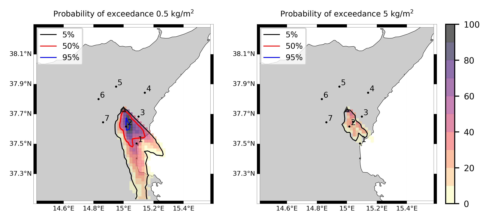

Forecast from VONA_20210216_1631Z
=================================

Contents
========

* [Forecast products](#forecast-products)
	* [Forecast at 2021-02-16 17:30 Z from RED VONA issued at 20210216_1631Z](#forecast-at-2021-02-16-1730-z-from-red-vona-issued-at-20210216_1631z)
	* [Forecast at 2021-02-16 18:30 Z from RED VONA issued at 20210216_1631Z](#forecast-at-2021-02-16-1830-z-from-red-vona-issued-at-20210216_1631z)
	* [Forecast at 2021-02-16 19:30 Z from RED VONA issued at 20210216_1631Z](#forecast-at-2021-02-16-1930-z-from-red-vona-issued-at-20210216_1631z)
	* [Forecast at 2021-02-16 22:30 Z from RED VONA issued at 20210216_1631Z](#forecast-at-2021-02-16-2230-z-from-red-vona-issued-at-20210216_1631z)
	* [Forecast at 2021-02-16 20:10 Z from RED VONA issued at 20210216_1705Z](#forecast-at-2021-02-16-2010-z-from-red-vona-issued-at-20210216_1705z)
	* [Forecast at 2021-02-16 23:10 Z from RED VONA issued at 20210216_1705Z](#forecast-at-2021-02-16-2310-z-from-red-vona-issued-at-20210216_1705z)
	* [Forecast at 2021-02-16 20:40 Z from RED VONA issued at 20210216_1738Z](#forecast-at-2021-02-16-2040-z-from-red-vona-issued-at-20210216_1738z)
	* [Forecast at 2021-02-16 23:40 Z from RED VONA issued at 20210216_1738Z](#forecast-at-2021-02-16-2340-z-from-red-vona-issued-at-20210216_1738z)
	* [Forecast at 2021-02-17 02:40 Z from RED VONA issued at 20210216_1738Z](#forecast-at-2021-02-17-0240-z-from-red-vona-issued-at-20210216_1738z)

# Forecast products

## Forecast at 2021-02-16 17:30 Z from RED VONA issued at 20210216_1631Z
  

|Eruption start [Z]|Eruption end [Z]|Forecast time [Z]|Column height asl [m]|
| :--- | :--- | :--- | :--- |
|2021-02-16 16:30:00|Ongoing|2021-02-16 17:30:00|6000 ± 500 - from VONA|
  
  

|Percentile|MER [kg/s¹]|Mass air [kg]|Mass air nested dom. [kg]|Mass grd [kg]|Mass grd nested dom. [kg]|
| :--- | :--- | :--- | :--- | :--- | :--- |
|5th|2.05e+04|7.62e+07|6.87e+07|3.74e+05|3.75e+05|
|50th|6.11e+04|2.06e+08|2.05e+08|1.58e+07|1.58e+07|
|95th|1.98e+05|5.21e+08|4.35e+08|1.33e+08|1.33e+08|
  

### Ground Nested Domain 2021-02-16 17:30 Z
  
  
  
  
  
  
  
  
  
  
  
  
  
  

|Location|Ground load [kg/m²] 5th perc|Ground load [kg/m²] 50th perc|Ground load [kg/m²] 95th perc|
| :--- | :--- | :--- | :--- |
|Schiena Asino (1)|6.24e-06|2.31e-03|7.35e-01|
|Rif.Vescovo (2)|0.00e+00|1.42e-03|7.98e-01|
|Serra Pituzza (3)|0.00e+00|1.29e-03|9.77e-01|
|Monterosso (4)|0.00e+00|0.00e+00|1.01e+00|
|Cim.Pedara (5)|1.05e-05|3.98e-03|7.23e-01|
|Cim.Viagrande (6)|0.00e+00|1.66e-05|2.74e-01|
|Cim.Mascalucia (7)|0.00e+00|3.32e-03|9.20e-02|
|Cim.Tremestieri (8)|0.00e+00|8.88e-04|6.91e-02|
|Cim.S.Giov.La Punta (9)|0.00e+00|1.62e-04|5.72e-02|
|Cim.Gravina (10)|0.00e+00|2.65e-03|1.04e-01|
|ENI S.Giov.Galermo (11)|0.00e+00|2.88e-04|7.56e-02|
|Bio Piazza Europa (12)|0.00e+00|6.71e-05|1.15e-02|
|INGV-OE (13)|0.00e+00|1.61e-04|2.65e-02|
  

### Atmosphere 2021-02-16 17:30 Z
  

## Forecast at 2021-02-16 18:30 Z from RED VONA issued at 20210216_1631Z
  

|Eruption start [Z]|Eruption end [Z]|Forecast time [Z]|Column height asl [m]|
| :--- | :--- | :--- | :--- |
|2021-02-16 16:30:00|Ongoing|2021-02-16 18:30:00|6000 ± 500 - from VONA|
  
  

|Percentile|MER [kg/s¹]|Mass air [kg]|Mass air nested dom. [kg]|Mass grd [kg]|Mass grd nested dom. [kg]|
| :--- | :--- | :--- | :--- | :--- | :--- |
|5th|2.42e+04|2.10e+08|1.26e+08|4.60e+06|4.59e+06|
|50th|6.34e+04|4.23e+08|2.53e+08|4.22e+07|4.10e+07|
|95th|1.76e+05|9.81e+08|5.08e+08|1.95e+08|1.91e+08|
  

### Ground Nested Domain 2021-02-16 18:30 Z
  
  
  
  
  
  
  
  
  
  
  
  
  
  

|Location|Ground load [kg/m²] 5th perc|Ground load [kg/m²] 50th perc|Ground load [kg/m²] 95th perc|
| :--- | :--- | :--- | :--- |
|Schiena Asino (1)|8.39e-04|2.37e-02|8.51e-01|
|Rif.Vescovo (2)|9.15e-06|2.19e-02|1.03e+00|
|Serra Pituzza (3)|1.28e-05|2.89e-02|1.43e+00|
|Monterosso (4)|0.00e+00|6.90e-03|2.29e+00|
|Cim.Pedara (5)|5.05e-03|1.64e-01|9.57e-01|
|Cim.Viagrande (6)|1.25e-05|5.25e-03|4.44e-01|
|Cim.Mascalucia (7)|2.53e-03|4.29e-02|4.12e-01|
|Cim.Tremestieri (8)|1.81e-03|3.04e-02|1.69e-01|
|Cim.S.Giov.La Punta (9)|3.07e-04|1.85e-02|1.21e-01|
|Cim.Gravina (10)|2.28e-03|2.08e-02|3.80e-01|
|ENI S.Giov.Galermo (11)|5.00e-04|3.19e-02|2.04e-01|
|Bio Piazza Europa (12)|3.22e-04|8.33e-03|7.77e-02|
|INGV-OE (13)|4.32e-04|8.67e-03|2.15e-01|
  

### Atmosphere 2021-02-16 18:30 Z
  

## Forecast at 2021-02-16 19:30 Z from RED VONA issued at 20210216_1631Z
  

|Eruption start [Z]|Eruption end [Z]|Forecast time [Z]|Column height asl [m]|
| :--- | :--- | :--- | :--- |
|2021-02-16 16:30:00|Ongoing|2021-02-16 19:30:00|6000 ± 500 - from VONA|
  
  

|Percentile|MER [kg/s¹]|Mass air [kg]|Mass air nested dom. [kg]|Mass grd [kg]|Mass grd nested dom. [kg]|
| :--- | :--- | :--- | :--- | :--- | :--- |
|5th|1.58e+04|3.04e+08|1.89e+08|2.30e+07|2.25e+07|
|50th|8.17e+04|8.09e+08|3.69e+08|7.14e+07|6.84e+07|
|95th|1.74e+05|1.22e+09|5.74e+08|2.44e+08|2.31e+08|
  

### Ground Nested Domain 2021-02-16 19:30 Z
  
  
  
  
  
  
  
  
  
  
  
  
  
  

|Location|Ground load [kg/m²] 5th perc|Ground load [kg/m²] 50th perc|Ground load [kg/m²] 95th perc|
| :--- | :--- | :--- | :--- |
|Schiena Asino (1)|3.12e-03|1.87e-01|1.35e+00|
|Rif.Vescovo (2)|1.61e-03|2.21e-01|1.61e+00|
|Serra Pituzza (3)|8.52e-04|3.09e-01|2.21e+00|
|Monterosso (4)|2.37e-04|3.21e-02|2.36e+00|
|Cim.Pedara (5)|1.15e-02|3.88e-01|1.49e+00|
|Cim.Viagrande (6)|1.26e-03|4.68e-02|5.12e-01|
|Cim.Mascalucia (7)|1.57e-02|8.40e-02|7.63e-01|
|Cim.Tremestieri (8)|7.19e-03|8.49e-02|2.93e-01|
|Cim.S.Giov.La Punta (9)|2.67e-03|7.82e-02|2.12e-01|
|Cim.Gravina (10)|1.52e-02|6.00e-02|7.24e-01|
|ENI S.Giov.Galermo (11)|1.67e-03|6.87e-02|3.95e-01|
|Bio Piazza Europa (12)|2.35e-03|2.24e-02|1.60e-01|
|INGV-OE (13)|1.33e-03|1.84e-02|3.11e-01|
  

### Atmosphere 2021-02-16 19:30 Z
  

## Forecast at 2021-02-16 22:30 Z from RED VONA issued at 20210216_1631Z
  

|Eruption start [Z]|Eruption end [Z]|Forecast time [Z]|Column height asl [m]|
| :--- | :--- | :--- | :--- |
|2021-02-16 16:30:00|Ongoing|2021-02-16 22:30:00|6000 ± 500 - from VONA|
  
  

|Percentile|MER [kg/s¹]|Mass air [kg]|Mass air nested dom. [kg]|Mass grd [kg]|Mass grd nested dom. [kg]|
| :--- | :--- | :--- | :--- | :--- | :--- |
|5th|8.04e+03|6.18e+08|2.76e+08|5.75e+07|5.42e+07|
|50th|8.00e+04|1.07e+09|3.64e+08|2.68e+08|2.41e+08|
|95th|1.71e+05|1.65e+09|6.33e+08|4.77e+08|4.46e+08|
  

### Ground Nested Domain 2021-02-16 22:30 Z
  
  
  
  
  
  
  
  
  
  
  
  
  
  

|Location|Ground load [kg/m²] 5th perc|Ground load [kg/m²] 50th perc|Ground load [kg/m²] 95th perc|
| :--- | :--- | :--- | :--- |
|Schiena Asino (1)|4.69e-03|4.01e-01|2.78e+00|
|Rif.Vescovo (2)|2.92e-03|3.95e-01|2.91e+00|
|Serra Pituzza (3)|1.55e-03|5.10e-01|3.86e+00|
|Monterosso (4)|4.63e-03|5.67e-02|4.52e+00|
|Cim.Pedara (5)|3.98e-02|4.67e-01|4.60e+00|
|Cim.Viagrande (6)|1.53e-02|1.50e-01|1.31e+00|
|Cim.Mascalucia (7)|1.09e-01|3.27e-01|1.26e+00|
|Cim.Tremestieri (8)|4.09e-02|2.87e-01|1.10e+00|
|Cim.S.Giov.La Punta (9)|2.62e-02|1.82e-01|6.22e-01|
|Cim.Gravina (10)|6.56e-02|2.54e-01|1.03e+00|
|ENI S.Giov.Galermo (11)|5.75e-02|1.99e-01|8.74e-01|
|Bio Piazza Europa (12)|2.67e-02|9.63e-02|3.48e-01|
|INGV-OE (13)|2.65e-02|1.07e-01|4.88e-01|
  

### Atmosphere 2021-02-16 22:30 Z
  

## Forecast at 2021-02-16 20:10 Z from RED VONA issued at 20210216_1705Z
  

|Eruption start [Z]|Eruption end [Z]|Forecast time [Z]|Column height asl [m]|
| :--- | :--- | :--- | :--- |
|2021-02-16 16:30:00|Ongoing|2021-02-16 20:10:00|10000 ± 500 - from VONA|
  
  

|Percentile|MER [kg/s¹]|Mass air [kg]|Mass air nested dom. [kg]|Mass grd [kg]|Mass grd nested dom. [kg]|
| :--- | :--- | :--- | :--- | :--- | :--- |
|5th|2.05e+05|2.24e+09|1.06e+09|4.23e+07|3.61e+07|
|50th|6.09e+05|4.26e+09|1.57e+09|6.79e+08|6.40e+08|
|95th|1.40e+06|1.13e+10|4.31e+09|1.83e+09|1.67e+09|
  

### Ground Nested Domain 2021-02-16 20:10 Z
  
  
  
  
  
  
  
  
  
  
  
  
  
  

|Location|Ground load [kg/m²] 5th perc|Ground load [kg/m²] 50th perc|Ground load [kg/m²] 95th perc|
| :--- | :--- | :--- | :--- |
|Schiena Asino (1)|5.66e-04|1.13e-01|4.90e+00|
|Rif.Vescovo (2)|2.11e-05|9.61e-02|5.14e+00|
|Serra Pituzza (3)|2.25e-05|1.29e-01|7.15e+00|
|Monterosso (4)|5.66e-04|1.31e-01|2.47e+00|
|Cim.Pedara (5)|4.62e-03|9.25e-01|1.37e+01|
|Cim.Viagrande (6)|2.73e-03|2.37e-01|2.61e+00|
|Cim.Mascalucia (7)|6.25e-02|1.22e+00|4.81e+00|
|Cim.Tremestieri (8)|1.91e-02|6.86e-01|4.49e+00|
|Cim.S.Giov.La Punta (9)|9.19e-03|4.31e-01|3.46e+00|
|Cim.Gravina (10)|3.54e-02|1.32e+00|4.87e+00|
|ENI S.Giov.Galermo (11)|4.57e-02|1.00e+00|4.23e+00|
|Bio Piazza Europa (12)|7.66e-03|3.51e-01|2.13e+00|
|INGV-OE (13)|8.12e-03|5.92e-01|2.52e+00|
  

### Atmosphere 2021-02-16 20:10 Z
  

## Forecast at 2021-02-16 23:10 Z from RED VONA issued at 20210216_1705Z
  

|Eruption start [Z]|Eruption end [Z]|Forecast time [Z]|Column height asl [m]|
| :--- | :--- | :--- | :--- |
|2021-02-16 16:30:00|Ongoing|2021-02-16 23:10:00|10000 ± 500 - from VONA|
  
  

|Percentile|MER [kg/s¹]|Mass air [kg]|Mass air nested dom. [kg]|Mass grd [kg]|Mass grd nested dom. [kg]|
| :--- | :--- | :--- | :--- | :--- | :--- |
|5th|2.12e+05|4.54e+09|1.85e+09|4.23e+08|2.85e+08|
|50th|5.84e+05|6.15e+09|2.30e+09|1.52e+09|1.13e+09|
|95th|2.36e+06|1.11e+10|3.41e+09|3.30e+09|2.86e+09|
  

### Ground Nested Domain 2021-02-16 23:10 Z
  
  
  
  
  
  
  
  
  
  
  
  
  
  

|Location|Ground load [kg/m²] 5th perc|Ground load [kg/m²] 50th perc|Ground load [kg/m²] 95th perc|
| :--- | :--- | :--- | :--- |
|Schiena Asino (1)|1.17e-02|5.57e-01|8.51e+00|
|Rif.Vescovo (2)|3.33e-05|6.13e-01|9.17e+00|
|Serra Pituzza (3)|4.17e-05|7.97e-01|1.13e+01|
|Monterosso (4)|1.96e-02|4.67e-01|3.38e+00|
|Cim.Pedara (5)|1.68e-01|3.46e+00|1.67e+01|
|Cim.Viagrande (6)|4.20e-02|5.70e-01|4.90e+00|
|Cim.Mascalucia (7)|2.04e-01|4.30e+00|8.94e+00|
|Cim.Tremestieri (8)|1.81e-01|2.54e+00|7.90e+00|
|Cim.S.Giov.La Punta (9)|1.49e-01|1.48e+00|6.49e+00|
|Cim.Gravina (10)|2.03e-01|4.03e+00|8.20e+00|
|ENI S.Giov.Galermo (11)|1.50e-01|2.70e+00|9.09e+00|
|Bio Piazza Europa (12)|1.27e-01|1.60e+00|3.16e+00|
|INGV-OE (13)|9.45e-02|1.84e+00|3.94e+00|
  

### Atmosphere 2021-02-16 23:10 Z
  

## Forecast at 2021-02-16 20:40 Z from RED VONA issued at 20210216_1738Z
  

|Eruption start [Z]|Eruption end [Z]|Forecast time [Z]|Column height asl [m]|
| :--- | :--- | :--- | :--- |
|2021-02-16 16:30:00|Ongoing|2021-02-16 20:40:00|[6000 m, 12000 m]|
  
  

|Percentile|MER [kg/s¹]|Mass air [kg]|Mass air nested dom. [kg]|Mass grd [kg]|Mass grd nested dom. [kg]|
| :--- | :--- | :--- | :--- | :--- | :--- |
|5th|9.99e+04|1.68e+09|5.35e+08|1.13e+08|1.06e+08|
|50th|4.63e+05|3.86e+09|1.32e+09|5.05e+08|4.80e+08|
|95th|3.97e+06|1.86e+10|8.71e+09|7.12e+09|5.98e+09|
  

### Ground Nested Domain 2021-02-16 20:40 Z
  
  
  
  
  
  
  
  
  
  
  
  
  
  

|Location|Ground load [kg/m²] 5th perc|Ground load [kg/m²] 50th perc|Ground load [kg/m²] 95th perc|
| :--- | :--- | :--- | :--- |
|Schiena Asino (1)|1.95e-02|4.39e-01|1.13e+01|
|Rif.Vescovo (2)|2.03e-03|4.82e-01|1.18e+01|
|Serra Pituzza (3)|2.79e-03|5.17e-01|1.41e+01|
|Monterosso (4)|4.01e-03|1.04e-01|1.10e+01|
|Cim.Pedara (5)|4.84e-02|1.20e+00|1.09e+01|
|Cim.Viagrande (6)|5.99e-03|1.97e-01|7.05e+00|
|Cim.Mascalucia (7)|4.95e-02|8.49e-01|7.08e+00|
|Cim.Tremestieri (8)|2.38e-02|7.36e-01|7.85e+00|
|Cim.S.Giov.La Punta (9)|1.02e-02|4.14e-01|8.36e+00|
|Cim.Gravina (10)|3.11e-02|7.61e-01|7.81e+00|
|ENI S.Giov.Galermo (11)|1.09e-01|7.07e-01|6.52e+00|
|Bio Piazza Europa (12)|7.81e-03|3.64e-01|8.45e+00|
|INGV-OE (13)|1.44e-02|5.31e-01|7.98e+00|
  

### Atmosphere 2021-02-16 20:40 Z
  

## Forecast at 2021-02-16 23:40 Z from RED VONA issued at 20210216_1738Z
  

|Eruption start [Z]|Eruption end [Z]|Forecast time [Z]|Column height asl [m]|
| :--- | :--- | :--- | :--- |
|2021-02-16 16:30:00|Ongoing|2021-02-16 23:40:00|[6000 m, 12000 m]|
  
  

|Percentile|MER [kg/s¹]|Mass air [kg]|Mass air nested dom. [kg]|Mass grd [kg]|Mass grd nested dom. [kg]|
| :--- | :--- | :--- | :--- | :--- | :--- |
|5th|4.48e+04|2.45e+09|8.96e+08|2.08e+08|1.72e+08|
|50th|4.72e+05|4.24e+09|1.35e+09|1.05e+09|8.40e+08|
|95th|4.03e+06|2.78e+10|1.07e+10|1.09e+10|9.83e+09|
  

### Ground Nested Domain 2021-02-16 23:40 Z
  
  
  
  
  
  
  
  
  
  
  
  
  
  

|Location|Ground load [kg/m²] 5th perc|Ground load [kg/m²] 50th perc|Ground load [kg/m²] 95th perc|
| :--- | :--- | :--- | :--- |
|Schiena Asino (1)|6.73e-02|7.84e-01|2.94e+01|
|Rif.Vescovo (2)|3.27e-02|8.74e-01|3.41e+01|
|Serra Pituzza (3)|4.40e-02|1.06e+00|4.54e+01|
|Monterosso (4)|2.62e-02|5.61e-01|1.67e+01|
|Cim.Pedara (5)|2.09e-01|2.27e+00|4.64e+01|
|Cim.Viagrande (6)|7.32e-02|5.00e-01|1.42e+01|
|Cim.Mascalucia (7)|1.32e-01|2.30e+00|1.56e+01|
|Cim.Tremestieri (8)|1.02e-01|1.10e+00|1.92e+01|
|Cim.S.Giov.La Punta (9)|1.15e-01|7.15e-01|1.47e+01|
|Cim.Gravina (10)|7.55e-02|1.74e+00|1.98e+01|
|ENI S.Giov.Galermo (11)|2.04e-01|1.37e+00|8.45e+00|
|Bio Piazza Europa (12)|3.10e-02|6.69e-01|1.38e+01|
|INGV-OE (13)|5.60e-02|8.26e-01|1.72e+01|
  

### Atmosphere 2021-02-16 23:40 Z
  

## Forecast at 2021-02-17 02:40 Z from RED VONA issued at 20210216_1738Z
  

|Eruption start [Z]|Eruption end [Z]|Forecast time [Z]|Column height asl [m]|
| :--- | :--- | :--- | :--- |
|2021-02-16 16:30:00|Ongoing|2021-02-17 02:40:00|[6000 m, 12000 m]|
  
  

|Percentile|MER [kg/s¹]|Mass air [kg]|Mass air nested dom. [kg]|Mass grd [kg]|Mass grd nested dom. [kg]|
| :--- | :--- | :--- | :--- | :--- | :--- |
|5th|3.28e+04|2.02e+09|8.11e+08|5.34e+08|4.73e+08|
|50th|4.05e+05|5.70e+09|1.98e+09|2.26e+09|1.73e+09|
|95th|1.85e+06|1.90e+10|8.42e+09|1.36e+10|1.17e+10|
  

### Ground Nested Domain 2021-02-17 02:40 Z
  
  
  
  
  
  
  
  
  
  
  
  
  
  

|Location|Ground load [kg/m²] 5th perc|Ground load [kg/m²] 50th perc|Ground load [kg/m²] 95th perc|
| :--- | :--- | :--- | :--- |
|Schiena Asino (1)|1.21e-01|9.97e-01|4.04e+01|
|Rif.Vescovo (2)|8.41e-02|1.05e+00|4.67e+01|
|Serra Pituzza (3)|7.93e-02|1.28e+00|6.17e+01|
|Monterosso (4)|1.78e-01|4.47e+00|2.91e+01|
|Cim.Pedara (5)|1.64e+00|6.65e+00|4.96e+01|
|Cim.Viagrande (6)|3.24e-01|2.79e+00|1.83e+01|
|Cim.Mascalucia (7)|7.34e-01|3.75e+00|1.61e+01|
|Cim.Tremestieri (8)|8.86e-01|3.79e+00|2.17e+01|
|Cim.S.Giov.La Punta (9)|7.16e-01|2.63e+00|1.83e+01|
|Cim.Gravina (10)|7.58e-01|3.39e+00|2.06e+01|
|ENI S.Giov.Galermo (11)|3.06e-01|2.49e+00|8.81e+00|
|Bio Piazza Europa (12)|3.56e-01|1.61e+00|1.64e+01|
|INGV-OE (13)|4.09e-01|2.04e+00|1.84e+01|
  

### Atmosphere 2021-02-17 02:40 Z
  
  
Go to [Supplementary page](Supplementary_page.md)  
Go to [Main directory](https://github.com/federicapardini/Real_time_ash_forecast)