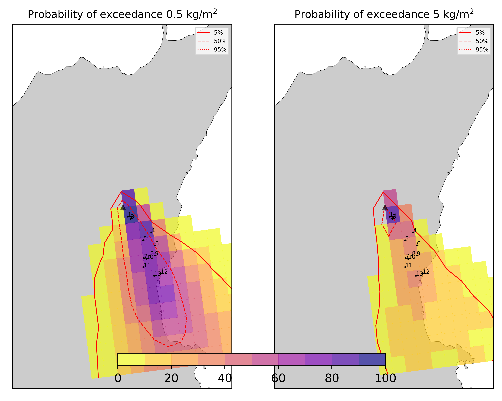

Forecast from VONA bulletin - 20210216_1631Z
============================================

Contents
========

* [Forecast products](#forecast-products)
	* [Forecast at 2021-02-16 19:30 Z - Ongoing Eruption](#forecast-at-2021-02-16-1930-z---ongoing-eruption)
	* [Forecast at 2021-02-16 22:30 Z - Ongoing Eruption](#forecast-at-2021-02-16-2230-z---ongoing-eruption)
	* [Forecast at 2021-02-16 20:10 Z - Ongoing Eruption](#forecast-at-2021-02-16-2010-z---ongoing-eruption)
	* [Forecast at 2021-02-16 23:10 Z - Ongoing Eruption](#forecast-at-2021-02-16-2310-z---ongoing-eruption)

# Forecast products

## Forecast at 2021-02-16 19:30 Z - Ongoing Eruption
  

|Eruption start [Z]|Eruption end [Z]|Forecast time [Z]|Column height asl [m]|
| :--- | :--- | :--- | :--- |
|2021-02-16 16:30:00|Ongoing|2021-02-16 19:30:00|6000 ± 500 - from VONA|
  
  

|Percentile|MER [kg/s¹]|Mass in the air [kg]|Mass on the ground [kg]|
| :--- | :--- | :--- | :--- |
|5th|8.89e+04|2.56e+08|6.29e+08|
|50th|9.07e+04|2.56e+08|6.29e+08|
|95th|9.24e+04|2.56e+08|6.29e+08|
  

### Ground 2021-02-16 19:30 Z
  
  
  
  
  
  
  
  
  
  
  
  
  
  

|Location|Ground load [kg/m²] 5th perc|Ground load [kg/m²] 50th perc|Ground load [kg/m²] 95th perc|
| :--- | :--- | :--- | :--- |
|Schiena Asino (1)|8.38e-05|8.38e-05|8.38e-05|
|Rif.Vescovo (2)|1.26e-04|1.26e-04|1.26e-04|
|Serra Pituzza (3)|1.19e-04|1.19e-04|1.19e-04|
|Monterosso (4)|2.43e-01|2.43e-01|2.43e-01|
|Cim.Pedara (5)|1.40e+00|1.40e+00|1.40e+00|
|Cim.Viagrande (6)|3.87e-02|3.87e-02|3.87e-02|
|Cim.Mascalucia (7)|1.92e+00|1.92e+00|1.92e+00|
|Cim.Tremestieri (8)|9.39e-01|9.39e-01|9.39e-01|
|Cim.S.Giov.La Punta (9)|4.11e-01|4.11e-01|4.11e-01|
|Cim.Gravina (10)|1.72e+00|1.72e+00|1.72e+00|
|ENI S.Giov.Galermo (11)|2.62e+00|2.62e+00|2.62e+00|
|Bio Piazza Europa (12)|1.07e+00|1.07e+00|1.07e+00|
|INGV-OE (13)|2.11e+00|2.11e+00|2.11e+00|
  

### Atmosphere 2021-02-16 19:30 Z
  

## Forecast at 2021-02-16 22:30 Z - Ongoing Eruption
  

|Eruption start [Z]|Eruption end [Z]|Forecast time [Z]|Column height asl [m]|
| :--- | :--- | :--- | :--- |
|2021-02-16 16:30:00|Ongoing|2021-02-16 22:30:00|6000 ± 500 - from VONA|
  
  

|Percentile|MER [kg/s¹]|Mass in the air [kg]|Mass on the ground [kg]|
| :--- | :--- | :--- | :--- |
|5th|1.01e+05|4.62e+07|1.78e+09|
|50th|1.12e+05|4.62e+07|1.78e+09|
|95th|1.23e+05|4.62e+07|1.78e+09|
  

### Ground 2021-02-16 22:30 Z
  
  
  
  
  
  
  
  
  
  
  
  
  
  

|Location|Ground load [kg/m²] 5th perc|Ground load [kg/m²] 50th perc|Ground load [kg/m²] 95th perc|
| :--- | :--- | :--- | :--- |
|Schiena Asino (1)|2.69e-04|2.69e-04|2.69e-04|
|Rif.Vescovo (2)|3.29e-04|3.29e-04|3.29e-04|
|Serra Pituzza (3)|3.43e-04|3.43e-04|3.43e-04|
|Monterosso (4)|1.05e+00|1.05e+00|1.05e+00|
|Cim.Pedara (5)|6.06e+00|6.06e+00|6.06e+00|
|Cim.Viagrande (6)|5.18e-02|5.18e-02|5.18e-02|
|Cim.Mascalucia (7)|6.71e+00|6.71e+00|6.71e+00|
|Cim.Tremestieri (8)|3.17e+00|3.17e+00|3.17e+00|
|Cim.S.Giov.La Punta (9)|1.45e+00|1.45e+00|1.45e+00|
|Cim.Gravina (10)|6.18e+00|6.18e+00|6.18e+00|
|ENI S.Giov.Galermo (11)|1.05e+01|1.05e+01|1.05e+01|
|Bio Piazza Europa (12)|1.99e+00|1.99e+00|1.99e+00|
|INGV-OE (13)|6.51e+00|6.51e+00|6.51e+00|
  

### Atmosphere 2021-02-16 22:30 Z
  

## Forecast at 2021-02-16 20:10 Z - Ongoing Eruption
  

|Eruption start [Z]|Eruption end [Z]|Forecast time [Z]|Column height asl [m]|
| :--- | :--- | :--- | :--- |
|2021-02-16 16:30:00|Ongoing|2021-02-16 20:10:00|10000 ± 500 - from VONA|
  
  

|Percentile|MER [kg/s¹]|Mass in the air [kg]|Mass on the ground [kg]|
| :--- | :--- | :--- | :--- |
|5th|5.87e+05|1.44e+09|4.19e+09|
|50th|5.87e+05|1.44e+09|4.19e+09|
|95th|6.60e+05|1.44e+09|4.19e+09|
  

### Ground 2021-02-16 20:10 Z
  
  
  
  
  
  
  
  
  
  
  
  
  
  

|Location|Ground load [kg/m²] 5th perc|Ground load [kg/m²] 50th perc|Ground load [kg/m²] 95th perc|
| :--- | :--- | :--- | :--- |
|Schiena Asino (1)|9.36e-05|9.36e-05|9.36e-05|
|Rif.Vescovo (2)|1.27e-04|1.27e-04|1.27e-04|
|Serra Pituzza (3)|1.29e-04|1.29e-04|1.29e-04|
|Monterosso (4)|9.41e-01|9.41e-01|9.41e-01|
|Cim.Pedara (5)|5.44e+00|5.44e+00|5.44e+00|
|Cim.Viagrande (6)|1.01e-01|1.01e-01|1.01e-01|
|Cim.Mascalucia (7)|6.21e+00|6.21e+00|6.21e+00|
|Cim.Tremestieri (8)|3.13e+00|3.13e+00|3.13e+00|
|Cim.S.Giov.La Punta (9)|5.58e-01|5.58e-01|5.58e-01|
|Cim.Gravina (10)|4.74e+00|4.74e+00|4.74e+00|
|ENI S.Giov.Galermo (11)|4.48e+00|4.48e+00|4.48e+00|
|Bio Piazza Europa (12)|5.28e-01|5.28e-01|5.28e-01|
|INGV-OE (13)|1.80e+00|1.80e+00|1.80e+00|
  

### Atmosphere 2021-02-16 20:10 Z
  

## Forecast at 2021-02-16 23:10 Z - Ongoing Eruption
  

|Eruption start [Z]|Eruption end [Z]|Forecast time [Z]|Column height asl [m]|
| :--- | :--- | :--- | :--- |
|2021-02-16 16:30:00|Ongoing|2021-02-16 23:10:00|[6000 m, 12000 m]|
  
  

|Percentile|MER [kg/s¹]|Mass in the air [kg]|Mass on the ground [kg]|
| :--- | :--- | :--- | :--- |
|5th|5.87e+05|1.44e+09|4.19e+09|
|50th|5.87e+05|1.44e+09|4.19e+09|
|95th|6.60e+05|1.44e+09|4.19e+09|
  

### Ground 2021-02-16 23:10 Z
  
  
  
  
  
  
  
  
  
  
  
  
  

|Location|Ground load [kg/m²] 5th perc|Ground load [kg/m²] 50th perc|Ground load [kg/m²] 95th perc|
| :--- | :--- | :--- | :--- |
|Schiena Asino (1)|9.36e-05|9.36e-05|9.36e-05|
|Rif.Vescovo (2)|1.27e-04|1.27e-04|1.27e-04|
|Serra Pituzza (3)|1.29e-04|1.29e-04|1.29e-04|
|Monterosso (4)|9.41e-01|9.41e-01|9.41e-01|
|Cim.Pedara (5)|5.44e+00|5.44e+00|5.44e+00|
|Cim.Viagrande (6)|1.01e-01|1.01e-01|1.01e-01|
|Cim.Mascalucia (7)|6.21e+00|6.21e+00|6.21e+00|
|Cim.Tremestieri (8)|3.13e+00|3.13e+00|3.13e+00|
|Cim.S.Giov.La Punta (9)|5.58e-01|5.58e-01|5.58e-01|
|Cim.Gravina (10)|4.74e+00|4.74e+00|4.74e+00|
|ENI S.Giov.Galermo (11)|4.48e+00|4.48e+00|4.48e+00|
|Bio Piazza Europa (12)|5.28e-01|5.28e-01|5.28e-01|
|INGV-OE (13)|1.80e+00|1.80e+00|1.80e+00|
  

### Atmosphere 2021-02-16 23:10 Z
  
Go to [Supplementary page](Supplementary_page.md)  
Go to [Main directory](https://github.com/federicapardini/Real_time_ash_forecast)