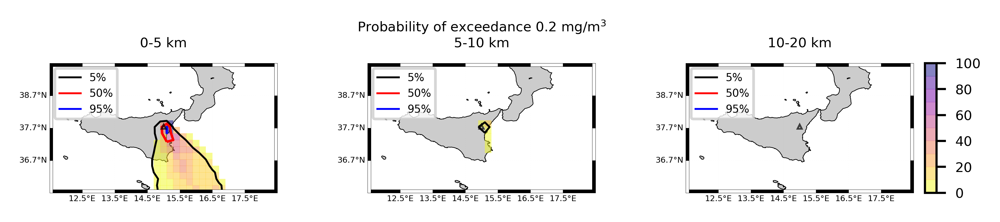

Forecast from VONA_20210216_1631Z
=================================

Contents
========

* [Forecast products](#forecast-products)
	* [Forecast at 2021-02-16 17:30 Z from RED VONA issued at 20210216_1631Z](#forecast-at-2021-02-16-1730-z-from-red-vona-issued-at-20210216_1631z)
	* [Forecast at 2021-02-16 18:30 Z from RED VONA issued at 20210216_1631Z](#forecast-at-2021-02-16-1830-z-from-red-vona-issued-at-20210216_1631z)
	* [Forecast at 2021-02-16 19:30 Z from RED VONA issued at 20210216_1631Z](#forecast-at-2021-02-16-1930-z-from-red-vona-issued-at-20210216_1631z)
	* [Forecast at 2021-02-16 22:30 Z from RED VONA issued at 20210216_1631Z](#forecast-at-2021-02-16-2230-z-from-red-vona-issued-at-20210216_1631z)
	* [Forecast at 2021-02-17 01:30 Z from RED VONA issued at 20210216_1631Z](#forecast-at-2021-02-17-0130-z-from-red-vona-issued-at-20210216_1631z)
	* [Forecast at 2021-02-16 18:10 Z from RED VONA issued at 20210216_1705Z](#forecast-at-2021-02-16-1810-z-from-red-vona-issued-at-20210216_1705z)
	* [Forecast at 2021-02-16 18:40 Z from RED VONA issued at 20210216_1738Z](#forecast-at-2021-02-16-1840-z-from-red-vona-issued-at-20210216_1738z)
	* [Forecast at 2021-02-16 19:40 Z from RED VONA issued at 20210216_1738Z](#forecast-at-2021-02-16-1940-z-from-red-vona-issued-at-20210216_1738z)
	* [Forecast at 2021-02-16 20:40 Z from RED VONA issued at 20210216_1738Z](#forecast-at-2021-02-16-2040-z-from-red-vona-issued-at-20210216_1738z)
	* [Forecast at 2021-02-16 23:40 Z from RED VONA issued at 20210216_1738Z](#forecast-at-2021-02-16-2340-z-from-red-vona-issued-at-20210216_1738z)

# Forecast products

## Forecast at 2021-02-16 17:30 Z from RED VONA issued at 20210216_1631Z
  

|Eruption start [Z]|Eruption end [Z]|Forecast time [Z]|Column height asl [m]|
| :--- | :--- | :--- | :--- |
|2021-02-16 16:30:00|Ongoing|2021-02-16 17:30:00|6000 ± 500 - from VONA|
  
  

|Percentile|MER [kg/s¹]|Mass air [kg]|Mass air nested dom. [kg]|Mass grd [kg]|Mass grd nested dom. [kg]|
| :--- | :--- | :--- | :--- | :--- | :--- |
|5th|1.39e+04|1.07e+07|1.07e+07|4.20e+07|4.19e+07|
|50th|6.49e+04|6.40e+07|6.40e+07|1.53e+08|1.53e+08|
|95th|2.27e+05|2.21e+08|1.96e+08|5.70e+08|5.70e+08|
  

### Ground Nested Domain 2021-02-16 17:30 Z
  
  
  
  
  
  
  
  
  
  
  
  
  
  

|Location|Ground load [kg/m²] 5th perc|Ground load [kg/m²] 50th perc|Ground load [kg/m²] 95th perc|
| :--- | :--- | :--- | :--- |
|Schiena Asino (1)|6.68e-02|1.54e+00|4.02e+00|
|Rif.Vescovo (2)|0.00e+00|5.23e-01|3.11e+00|
|Serra Pituzza (3)|0.00e+00|4.91e-01|4.19e+00|
|Monterosso (4)|0.00e+00|1.39e-03|1.50e+00|
|Cim.Pedara (5)|5.98e-04|9.11e-02|2.04e+00|
|Cim.Viagrande (6)|0.00e+00|1.76e-05|5.73e-01|
|Cim.Mascalucia (7)|0.00e+00|7.71e-03|1.41e+00|
|Cim.Tremestieri (8)|0.00e+00|4.31e-03|5.01e-01|
|Cim.S.Giov.La Punta (9)|0.00e+00|1.41e-03|4.46e-01|
|Cim.Gravina (10)|0.00e+00|3.42e-03|1.27e+00|
|ENI S.Giov.Galermo (11)|0.00e+00|6.17e-03|7.95e-01|
|Bio Piazza Europa (12)|0.00e+00|8.74e-05|2.89e-01|
|INGV-OE (13)|0.00e+00|2.83e-04|3.58e-01|
  

### Atmosphere 2021-02-16 17:30 Z
  

## Forecast at 2021-02-16 18:30 Z from RED VONA issued at 20210216_1631Z
  

|Eruption start [Z]|Eruption end [Z]|Forecast time [Z]|Column height asl [m]|
| :--- | :--- | :--- | :--- |
|2021-02-16 16:30:00|Ongoing|2021-02-16 18:30:00|6000 ± 500 - from VONA|
  
  

|Percentile|MER [kg/s¹]|Mass air [kg]|Mass air nested dom. [kg]|Mass grd [kg]|Mass grd nested dom. [kg]|
| :--- | :--- | :--- | :--- | :--- | :--- |
|5th|1.20e+04|3.17e+07|3.17e+07|1.77e+08|1.77e+08|
|50th|6.88e+04|8.23e+07|7.75e+07|3.74e+08|3.74e+08|
|95th|2.27e+05|2.62e+08|1.95e+08|1.28e+09|1.24e+09|
  

### Ground Nested Domain 2021-02-16 18:30 Z
  
  
  
  
  
  
  
  
  
  
  
  
  
  

|Location|Ground load [kg/m²] 5th perc|Ground load [kg/m²] 50th perc|Ground load [kg/m²] 95th perc|
| :--- | :--- | :--- | :--- |
|Schiena Asino (1)|7.03e-01|3.26e+00|6.52e+00|
|Rif.Vescovo (2)|3.05e-05|1.10e+00|4.61e+00|
|Serra Pituzza (3)|4.28e-05|1.18e+00|5.47e+00|
|Monterosso (4)|2.80e-05|1.32e-01|6.15e+00|
|Cim.Pedara (5)|7.40e-03|8.65e-01|5.40e+00|
|Cim.Viagrande (6)|5.05e-05|1.14e-01|2.31e+00|
|Cim.Mascalucia (7)|9.45e-03|1.70e-01|1.97e+00|
|Cim.Tremestieri (8)|4.70e-03|1.93e-01|1.06e+00|
|Cim.S.Giov.La Punta (9)|4.33e-04|1.41e-01|6.09e-01|
|Cim.Gravina (10)|6.41e-03|8.18e-02|2.29e+00|
|ENI S.Giov.Galermo (11)|1.13e-03|2.19e-01|1.35e+00|
|Bio Piazza Europa (12)|1.73e-03|2.52e-02|5.16e-01|
|INGV-OE (13)|1.24e-03|4.16e-02|7.21e-01|
  

### Atmosphere 2021-02-16 18:30 Z
  

## Forecast at 2021-02-16 19:30 Z from RED VONA issued at 20210216_1631Z
  

|Eruption start [Z]|Eruption end [Z]|Forecast time [Z]|Column height asl [m]|
| :--- | :--- | :--- | :--- |
|2021-02-16 16:30:00|Ongoing|2021-02-16 19:30:00|6000 ± 500 - from VONA|
  
  

|Percentile|MER [kg/s¹]|Mass air [kg]|Mass air nested dom. [kg]|Mass grd [kg]|Mass grd nested dom. [kg]|
| :--- | :--- | :--- | :--- | :--- | :--- |
|5th|1.85e+04|3.14e+07|2.72e+07|3.65e+08|3.65e+08|
|50th|7.64e+04|1.16e+08|7.88e+07|7.01e+08|7.00e+08|
|95th|2.07e+05|2.24e+08|2.14e+08|1.70e+09|1.60e+09|
  

### Ground Nested Domain 2021-02-16 19:30 Z
  
  
  
  
  
  
  
  
  
  
  
  
  
  

|Location|Ground load [kg/m²] 5th perc|Ground load [kg/m²] 50th perc|Ground load [kg/m²] 95th perc|
| :--- | :--- | :--- | :--- |
|Schiena Asino (1)|2.97e+00|4.15e+00|7.76e+00|
|Rif.Vescovo (2)|4.67e-01|3.31e+00|5.73e+00|
|Serra Pituzza (3)|5.29e-01|3.47e+00|7.50e+00|
|Monterosso (4)|4.07e-04|2.47e-01|7.01e+00|
|Cim.Pedara (5)|1.49e-01|1.60e+00|5.74e+00|
|Cim.Viagrande (6)|6.71e-04|5.20e-01|2.34e+00|
|Cim.Mascalucia (7)|5.82e-02|6.12e-01|2.15e+00|
|Cim.Tremestieri (8)|2.14e-02|3.66e-01|1.47e+00|
|Cim.S.Giov.La Punta (9)|5.28e-03|2.50e-01|1.37e+00|
|Cim.Gravina (10)|6.59e-02|2.85e-01|2.46e+00|
|ENI S.Giov.Galermo (11)|6.52e-03|3.73e-01|1.42e+00|
|Bio Piazza Europa (12)|5.17e-03|6.62e-02|6.11e-01|
|INGV-OE (13)|9.26e-03|1.36e-01|7.82e-01|
  

### Atmosphere 2021-02-16 19:30 Z
  

## Forecast at 2021-02-16 22:30 Z from RED VONA issued at 20210216_1631Z
  

|Eruption start [Z]|Eruption end [Z]|Forecast time [Z]|Column height asl [m]|
| :--- | :--- | :--- | :--- |
|2021-02-16 16:30:00|Ongoing|2021-02-16 22:30:00|6000 ± 500 - from VONA|
  
  

|Percentile|MER [kg/s¹]|Mass air [kg]|Mass air nested dom. [kg]|Mass grd [kg]|Mass grd nested dom. [kg]|
| :--- | :--- | :--- | :--- | :--- | :--- |
|5th|1.14e+04|2.97e+07|2.51e+07|8.62e+08|8.62e+08|
|50th|6.34e+04|1.04e+08|7.56e+07|1.43e+09|1.39e+09|
|95th|1.27e+05|2.24e+08|1.71e+08|2.61e+09|2.48e+09|
  

### Ground Nested Domain 2021-02-16 22:30 Z
  
  
  
  
  
  
  
  
  
  
  
  
  
  

|Location|Ground load [kg/m²] 5th perc|Ground load [kg/m²] 50th perc|Ground load [kg/m²] 95th perc|
| :--- | :--- | :--- | :--- |
|Schiena Asino (1)|5.65e+00|9.60e+00|1.59e+01|
|Rif.Vescovo (2)|7.87e-01|5.38e+00|1.49e+01|
|Serra Pituzza (3)|1.10e+00|5.80e+00|1.59e+01|
|Monterosso (4)|1.16e-03|1.04e+00|7.91e+00|
|Cim.Pedara (5)|2.72e-01|3.60e+00|1.13e+01|
|Cim.Viagrande (6)|1.32e-03|7.48e-01|7.08e+00|
|Cim.Mascalucia (7)|1.70e-01|1.11e+00|3.82e+00|
|Cim.Tremestieri (8)|5.78e-02|6.37e-01|2.86e+00|
|Cim.S.Giov.La Punta (9)|1.39e-02|5.62e-01|3.44e+00|
|Cim.Gravina (10)|1.07e-01|6.63e-01|3.88e+00|
|ENI S.Giov.Galermo (11)|4.11e-02|8.35e-01|3.03e+00|
|Bio Piazza Europa (12)|3.57e-02|1.88e-01|9.69e-01|
|INGV-OE (13)|3.64e-02|2.57e-01|1.34e+00|
  

### Atmosphere 2021-02-16 22:30 Z
  

## Forecast at 2021-02-17 01:30 Z from RED VONA issued at 20210216_1631Z
  

|Eruption start [Z]|Eruption end [Z]|Forecast time [Z]|Column height asl [m]|
| :--- | :--- | :--- | :--- |
|2021-02-16 16:30:00|Ongoing|2021-02-17 01:30:00|6000 ± 500 - from VONA|
  
  

|Percentile|MER [kg/s¹]|Mass air [kg]|Mass air nested dom. [kg]|Mass grd [kg]|Mass grd nested dom. [kg]|
| :--- | :--- | :--- | :--- | :--- | :--- |
|5th|7.89e+03|7.03e+07|2.25e+07|1.12e+09|1.08e+09|
|50th|5.78e+04|1.13e+08|9.08e+07|2.05e+09|2.03e+09|
|95th|1.30e+05|2.61e+08|2.13e+08|3.31e+09|3.23e+09|
  

### Ground Nested Domain 2021-02-17 01:30 Z
  
  
  
  
  
  
  
  
  
  
  
  
  
  

|Location|Ground load [kg/m²] 5th perc|Ground load [kg/m²] 50th perc|Ground load [kg/m²] 95th perc|
| :--- | :--- | :--- | :--- |
|Schiena Asino (1)|8.77e+00|1.54e+01|2.43e+01|
|Rif.Vescovo (2)|3.83e+00|7.85e+00|1.98e+01|
|Serra Pituzza (3)|5.31e+00|8.92e+00|2.65e+01|
|Monterosso (4)|9.58e-03|2.15e+00|8.51e+00|
|Cim.Pedara (5)|5.45e-01|7.50e+00|1.56e+01|
|Cim.Viagrande (6)|2.53e-02|1.08e+00|7.83e+00|
|Cim.Mascalucia (7)|1.84e-01|1.74e+00|4.87e+00|
|Cim.Tremestieri (8)|3.70e-01|1.12e+00|3.73e+00|
|Cim.S.Giov.La Punta (9)|1.68e-01|1.02e+00|4.07e+00|
|Cim.Gravina (10)|1.36e-01|9.83e-01|4.62e+00|
|ENI S.Giov.Galermo (11)|4.74e-02|1.23e+00|4.31e+00|
|Bio Piazza Europa (12)|5.52e-02|3.24e-01|1.16e+00|
|INGV-OE (13)|5.50e-02|3.73e-01|1.52e+00|
  

### Atmosphere 2021-02-17 01:30 Z
  

## Forecast at 2021-02-16 18:10 Z from RED VONA issued at 20210216_1705Z
  

|Eruption start [Z]|Eruption end [Z]|Forecast time [Z]|Column height asl [m]|
| :--- | :--- | :--- | :--- |
|2021-02-16 16:30:00|Ongoing|2021-02-16 18:10:00|10000 ± 500 - from VONA|
  
  

|Percentile|MER [kg/s¹]|Mass air [kg]|Mass air nested dom. [kg]|Mass grd [kg]|Mass grd nested dom. [kg]|
| :--- | :--- | :--- | :--- | :--- | :--- |
|5th|1.59e+05|3.42e+08|3.40e+08|6.46e+08|6.45e+08|
|50th|6.13e+05|7.20e+08|6.20e+08|1.79e+09|1.79e+09|
|95th|2.95e+06|3.69e+09|2.09e+09|5.40e+09|4.78e+09|
  

### Ground Nested Domain 2021-02-16 18:10 Z
  
  
  
  
  
  
  
  
  
  
  
  
  
  

|Location|Ground load [kg/m²] 5th perc|Ground load [kg/m²] 50th perc|Ground load [kg/m²] 95th perc|
| :--- | :--- | :--- | :--- |
|Schiena Asino (1)|1.64e+00|8.50e+00|1.78e+01|
|Rif.Vescovo (2)|7.43e-02|3.40e+00|1.54e+01|
|Serra Pituzza (3)|1.03e-01|2.87e+00|2.02e+01|
|Monterosso (4)|9.33e-04|1.66e-01|5.50e+00|
|Cim.Pedara (5)|4.06e-02|1.38e+00|5.55e+00|
|Cim.Viagrande (6)|1.06e-04|2.93e-01|2.75e+00|
|Cim.Mascalucia (7)|5.54e-02|1.35e+00|6.17e+00|
|Cim.Tremestieri (8)|1.61e-02|1.01e+00|6.39e+00|
|Cim.S.Giov.La Punta (9)|5.74e-03|7.21e-01|5.62e+00|
|Cim.Gravina (10)|3.15e-02|1.51e+00|7.44e+00|
|ENI S.Giov.Galermo (11)|1.64e-01|1.29e+00|6.07e+00|
|Bio Piazza Europa (12)|4.09e-03|7.02e-01|5.68e+00|
|INGV-OE (13)|6.93e-03|1.33e+00|8.07e+00|
  

### Atmosphere 2021-02-16 18:10 Z
  

## Forecast at 2021-02-16 18:40 Z from RED VONA issued at 20210216_1738Z
  

|Eruption start [Z]|Eruption end [Z]|Forecast time [Z]|Column height asl [m]|
| :--- | :--- | :--- | :--- |
|2021-02-16 16:30:00|Ongoing|2021-02-16 18:40:00|[5000 m, 15000 m]|
  
  

|Percentile|MER [kg/s¹]|Mass air [kg]|Mass air nested dom. [kg]|Mass grd [kg]|Mass grd nested dom. [kg]|
| :--- | :--- | :--- | :--- | :--- | :--- |
|5th|1.81e+04|2.18e+08|7.97e+07|1.26e+09|1.25e+09|
|50th|1.11e+06|2.26e+09|1.32e+09|4.12e+09|3.90e+09|
|95th|2.46e+07|4.07e+10|2.78e+10|5.12e+10|4.24e+10|
  

### Ground Nested Domain 2021-02-16 18:40 Z
  
  
  
  
  
  
  
  
  
  
  
  
  
  

|Location|Ground load [kg/m²] 5th perc|Ground load [kg/m²] 50th perc|Ground load [kg/m²] 95th perc|
| :--- | :--- | :--- | :--- |
|Schiena Asino (1)|3.45e+00|1.24e+01|8.69e+01|
|Rif.Vescovo (2)|2.87e-01|7.65e+00|4.09e+01|
|Serra Pituzza (3)|3.17e-01|8.41e+00|5.45e+01|
|Monterosso (4)|1.58e-02|1.69e+00|3.21e+01|
|Cim.Pedara (5)|3.90e-01|3.63e+00|2.01e+01|
|Cim.Viagrande (6)|8.31e-02|1.70e+00|2.76e+01|
|Cim.Mascalucia (7)|7.82e-01|4.67e+00|2.00e+01|
|Cim.Tremestieri (8)|4.39e-01|3.23e+00|1.41e+01|
|Cim.S.Giov.La Punta (9)|2.01e-01|2.64e+00|1.54e+01|
|Cim.Gravina (10)|5.06e-01|4.62e+00|1.87e+01|
|ENI S.Giov.Galermo (11)|4.98e-01|3.83e+00|2.80e+01|
|Bio Piazza Europa (12)|7.59e-02|3.89e+00|2.56e+01|
|INGV-OE (13)|2.34e-01|3.53e+00|2.51e+01|
  

### Atmosphere 2021-02-16 18:40 Z
  

## Forecast at 2021-02-16 19:40 Z from RED VONA issued at 20210216_1738Z
  

|Eruption start [Z]|Eruption end [Z]|Forecast time [Z]|Column height asl [m]|
| :--- | :--- | :--- | :--- |
|2021-02-16 16:30:00|Ongoing|2021-02-16 19:40:00|[5000 m, 15000 m]|
  
  

|Percentile|MER [kg/s¹]|Mass air [kg]|Mass air nested dom. [kg]|Mass grd [kg]|Mass grd nested dom. [kg]|
| :--- | :--- | :--- | :--- | :--- | :--- |
|5th|1.95e+04|2.63e+08|1.80e+08|2.67e+09|2.08e+09|
|50th|6.09e+05|8.01e+09|1.85e+09|1.55e+10|1.50e+10|
|95th|2.24e+07|6.08e+10|2.92e+10|8.84e+10|7.18e+10|
  

### Ground Nested Domain 2021-02-16 19:40 Z
  
  
  
  
  
  
  
  
  
  
  
  
  
  

|Location|Ground load [kg/m²] 5th perc|Ground load [kg/m²] 50th perc|Ground load [kg/m²] 95th perc|
| :--- | :--- | :--- | :--- |
|Schiena Asino (1)|6.06e+00|3.07e+01|1.39e+02|
|Rif.Vescovo (2)|2.53e+00|1.57e+01|6.69e+01|
|Serra Pituzza (3)|3.06e+00|1.79e+01|9.28e+01|
|Monterosso (4)|5.71e-01|6.25e+00|3.77e+01|
|Cim.Pedara (5)|1.23e+00|1.07e+01|2.77e+01|
|Cim.Viagrande (6)|9.30e-01|6.81e+00|3.76e+01|
|Cim.Mascalucia (7)|2.08e+00|8.20e+00|2.98e+01|
|Cim.Tremestieri (8)|1.69e+00|8.76e+00|3.02e+01|
|Cim.S.Giov.La Punta (9)|1.62e+00|7.10e+00|2.75e+01|
|Cim.Gravina (10)|2.21e+00|7.36e+00|3.05e+01|
|ENI S.Giov.Galermo (11)|1.20e+00|7.70e+00|3.74e+01|
|Bio Piazza Europa (12)|1.02e+00|5.54e+00|4.36e+01|
|INGV-OE (13)|1.28e+00|6.93e+00|4.17e+01|
  

### Atmosphere 2021-02-16 19:40 Z
  

## Forecast at 2021-02-16 20:40 Z from RED VONA issued at 20210216_1738Z
  

|Eruption start [Z]|Eruption end [Z]|Forecast time [Z]|Column height asl [m]|
| :--- | :--- | :--- | :--- |
|2021-02-16 16:30:00|Ongoing|2021-02-16 20:40:00|[5000 m, 15000 m]|
  
  

|Percentile|MER [kg/s¹]|Mass air [kg]|Mass air nested dom. [kg]|Mass grd [kg]|Mass grd nested dom. [kg]|
| :--- | :--- | :--- | :--- | :--- | :--- |
|5th|3.79e+04|3.16e+08|8.10e+07|3.39e+09|3.28e+09|
|50th|5.43e+05|7.22e+09|1.24e+09|4.30e+10|3.45e+10|
|95th|3.15e+07|6.76e+10|2.89e+10|1.28e+11|9.17e+10|
  

### Ground Nested Domain 2021-02-16 20:40 Z
  
  
  
  
  
  
  
  
  
  
  
  
  
  

|Location|Ground load [kg/m²] 5th perc|Ground load [kg/m²] 50th perc|Ground load [kg/m²] 95th perc|
| :--- | :--- | :--- | :--- |
|Schiena Asino (1)|1.30e+01|5.14e+01|1.84e+02|
|Rif.Vescovo (2)|5.33e+00|2.93e+01|1.24e+02|
|Serra Pituzza (3)|3.88e+00|2.79e+01|1.47e+02|
|Monterosso (4)|7.35e-01|7.67e+00|4.99e+01|
|Cim.Pedara (5)|2.65e+00|1.60e+01|4.80e+01|
|Cim.Viagrande (6)|1.47e+00|8.50e+00|6.21e+01|
|Cim.Mascalucia (7)|3.93e+00|1.49e+01|4.65e+01|
|Cim.Tremestieri (8)|3.32e+00|1.18e+01|4.41e+01|
|Cim.S.Giov.La Punta (9)|2.78e+00|1.20e+01|5.15e+01|
|Cim.Gravina (10)|4.85e+00|1.62e+01|4.39e+01|
|ENI S.Giov.Galermo (11)|2.19e+00|1.47e+01|5.81e+01|
|Bio Piazza Europa (12)|4.22e+00|1.57e+01|6.25e+01|
|INGV-OE (13)|3.32e+00|1.53e+01|6.16e+01|
  

### Atmosphere 2021-02-16 20:40 Z
  

## Forecast at 2021-02-16 23:40 Z from RED VONA issued at 20210216_1738Z
  

|Eruption start [Z]|Eruption end [Z]|Forecast time [Z]|Column height asl [m]|
| :--- | :--- | :--- | :--- |
|2021-02-16 16:30:00|Ongoing|2021-02-16 23:40:00|[5000 m, 15000 m]|
  
  

|Percentile|MER [kg/s¹]|Mass air [kg]|Mass air nested dom. [kg]|Mass grd [kg]|Mass grd nested dom. [kg]|
| :--- | :--- | :--- | :--- | :--- | :--- |
|5th|1.82e+04|4.90e+08|1.76e+08|1.23e+10|1.14e+10|
|50th|4.37e+05|8.91e+09|1.85e+09|1.09e+11|7.86e+10|
|95th|2.71e+07|7.69e+10|2.94e+10|2.26e+11|2.00e+11|
  

### Ground Nested Domain 2021-02-16 23:40 Z
  
  
  
  
  
  
  
  
  
  
  
  
  
  

|Location|Ground load [kg/m²] 5th perc|Ground load [kg/m²] 50th perc|Ground load [kg/m²] 95th perc|
| :--- | :--- | :--- | :--- |
|Schiena Asino (1)|3.69e+01|8.75e+01|3.65e+02|
|Rif.Vescovo (2)|1.35e+01|4.80e+01|2.13e+02|
|Serra Pituzza (3)|1.43e+01|5.51e+01|2.89e+02|
|Monterosso (4)|3.20e+00|2.19e+01|6.51e+01|
|Cim.Pedara (5)|1.09e+01|2.66e+01|1.23e+02|
|Cim.Viagrande (6)|4.76e+00|2.43e+01|8.34e+01|
|Cim.Mascalucia (7)|1.22e+01|2.96e+01|8.34e+01|
|Cim.Tremestieri (8)|1.13e+01|2.38e+01|8.50e+01|
|Cim.S.Giov.La Punta (9)|7.64e+00|2.91e+01|7.13e+01|
|Cim.Gravina (10)|1.09e+01|2.54e+01|7.32e+01|
|ENI S.Giov.Galermo (11)|1.02e+01|2.67e+01|7.65e+01|
|Bio Piazza Europa (12)|6.53e+00|2.51e+01|8.41e+01|
|INGV-OE (13)|9.19e+00|2.72e+01|8.52e+01|
  

### Atmosphere 2021-02-16 23:40 Z
  
  
Go to [Supplementary page](Supplementary_page.md)  
Go to [Main directory](https://github.com/federicapardini/Real_time_ash_forecast)