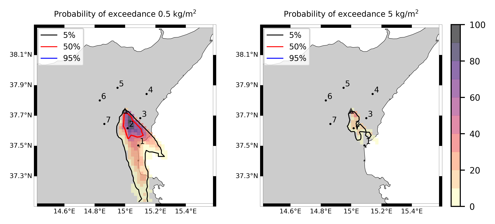

Forecast from VONA_20210216_1631Z
=================================

Contents
========

* [Forecast products](#forecast-products)
	* [Forecast at 2021-02-16 17:30 Z from RED VONA issued at 20210216_1631Z](#forecast-at-2021-02-16-1730-z-from-red-vona-issued-at-20210216_1631z)
	* [Forecast at 2021-02-16 18:30 Z from RED VONA issued at 20210216_1631Z](#forecast-at-2021-02-16-1830-z-from-red-vona-issued-at-20210216_1631z)
	* [Forecast at 2021-02-16 19:30 Z from RED VONA issued at 20210216_1631Z](#forecast-at-2021-02-16-1930-z-from-red-vona-issued-at-20210216_1631z)
	* [Forecast at 2021-02-16 22:30 Z from RED VONA issued at 20210216_1631Z](#forecast-at-2021-02-16-2230-z-from-red-vona-issued-at-20210216_1631z)
	* [Forecast at 2021-02-17 01:30 Z from RED VONA issued at 20210216_1631Z](#forecast-at-2021-02-17-0130-z-from-red-vona-issued-at-20210216_1631z)
	* [Forecast at 2021-02-16 18:10 Z from RED VONA issued at 20210216_1705Z](#forecast-at-2021-02-16-1810-z-from-red-vona-issued-at-20210216_1705z)
	* [Forecast at 2021-02-16 18:40 Z from RED VONA issued at 20210216_1738Z](#forecast-at-2021-02-16-1840-z-from-red-vona-issued-at-20210216_1738z)
	* [Forecast at 2021-02-16 19:40 Z from RED VONA issued at 20210216_1738Z](#forecast-at-2021-02-16-1940-z-from-red-vona-issued-at-20210216_1738z)
	* [Forecast at 2021-02-16 20:40 Z from RED VONA issued at 20210216_1738Z](#forecast-at-2021-02-16-2040-z-from-red-vona-issued-at-20210216_1738z)
	* [Forecast at 2021-02-16 23:40 Z from RED VONA issued at 20210216_1738Z](#forecast-at-2021-02-16-2340-z-from-red-vona-issued-at-20210216_1738z)
	* [Forecast at 2021-02-17 02:40 Z from RED VONA issued at 20210216_1738Z](#forecast-at-2021-02-17-0240-z-from-red-vona-issued-at-20210216_1738z)
	* [Forecast at 2021-02-17 05:40 Z from RED VONA issued at 20210216_1738Z](#forecast-at-2021-02-17-0540-z-from-red-vona-issued-at-20210216_1738z)
	* [Forecast at 2021-02-17 05:40 Z from ORANGE VONA issued at 20210217_0531Z](#forecast-at-2021-02-17-0540-z-from-orange-vona-issued-at-20210217_0531z)

# Forecast products

## Forecast at 2021-02-16 17:30 Z from RED VONA issued at 20210216_1631Z
  

|Eruption start [Z]|Eruption end [Z]|Forecast time [Z]|Column height asl [m]|
| :--- | :--- | :--- | :--- |
|2021-02-16 16:30:00|Ongoing|2021-02-16 17:30:00|6000 ± 500 - from VONA|
  
  

|Percentile|MER [kg/s¹]|Mass air [kg]|Mass air nested dom. [kg]|Mass grd [kg]|Mass grd nested dom. [kg]|
| :--- | :--- | :--- | :--- | :--- | :--- |
|5th|1.24e+04|1.89e+07|1.89e+07|2.80e+07|2.80e+07|
|50th|7.23e+04|1.04e+08|9.42e+07|1.46e+08|1.45e+08|
|95th|1.61e+05|2.00e+08|1.74e+08|4.16e+08|4.17e+08|
  

### Ground Nested Domain 2021-02-16 17:30 Z
  
  
  
  
  
  
  
  
  
  
  
  
  
  
  
  
  
  
  
  
  
  
  
  

|Location|Ground load [kg/m²] 5th perc|Ground load [kg/m²] 50th perc|Ground load [kg/m²] 95th perc|
| :--- | :--- | :--- | :--- |
|Catania AP (1)|0.00e+00|6.36e-05|1.33e-01|
|Siracusa (2)|nan|nan|nan|
|Reggio Calabria (3)|nan|nan|nan|
|Palermo (4)|nan|nan|nan|
|Nicolosi (5)|0.00e+00|5.82e-01|3.27e+00|
|Zafferana (6)|0.00e+00|0.00e+00|1.78e-02|
|Linguaglossa (7)|0.00e+00|0.00e+00|0.00e+00|
|Randazzo (8)|0.00e+00|0.00e+00|0.00e+00|
|Bronte (9)|0.00e+00|0.00e+00|0.00e+00|
|Biancavilla (10)|0.00e+00|0.00e+00|0.00e+00|
|Schiena Asino (11)|7.16e-04|5.36e-01|2.79e+00|
|Rif.Vescovo (12)|0.00e+00|4.10e-01|2.82e+00|
|Serra Pituzza (13)|0.00e+00|5.05e-01|3.87e+00|
|Monterosso (14)|0.00e+00|7.16e-04|1.16e+00|
|Cim.Pedara (15)|5.96e-05|3.73e-02|4.79e+00|
|Cim.Viagrande (16)|0.00e+00|6.79e-06|2.83e+00|
|Cim.Mascalucia (17)|0.00e+00|4.03e-03|7.35e-01|
|Cim.Tremestieri (18)|0.00e+00|6.36e-03|7.64e-01|
|Cim.S.Giov.La Punta (19)|0.00e+00|8.20e-04|6.09e-01|
|Cim.Gravina (20)|0.00e+00|1.08e-03|9.00e-01|
|ENI S.Giov.Galermo (21)|0.00e+00|2.64e-03|4.28e-01|
|Bio Piazza Europa (22)|0.00e+00|1.20e-04|1.81e-01|
|INGV-OE (23)|0.00e+00|5.57e-04|1.76e-01|
  

### Atmosphere 2021-02-16 17:30 Z
  

## Forecast at 2021-02-16 18:30 Z from RED VONA issued at 20210216_1631Z
  

|Eruption start [Z]|Eruption end [Z]|Forecast time [Z]|Column height asl [m]|
| :--- | :--- | :--- | :--- |
|2021-02-16 16:30:00|Ongoing|2021-02-16 18:30:00|6000 ± 500 - from VONA|
  
  

|Percentile|MER [kg/s¹]|Mass air [kg]|Mass air nested dom. [kg]|Mass grd [kg]|Mass grd nested dom. [kg]|
| :--- | :--- | :--- | :--- | :--- | :--- |
|5th|9.87e+03|3.89e+07|3.79e+07|1.96e+08|1.96e+08|
|50th|9.76e+04|1.55e+08|1.11e+08|4.08e+08|3.76e+08|
|95th|1.72e+05|3.75e+08|3.33e+08|6.84e+08|6.80e+08|
  

### Ground Nested Domain 2021-02-16 18:30 Z
  
  
  
  
  
  
  
  
  
  
  
  
  
  
  
  
  
  
  
  
  
  
  
  

|Location|Ground load [kg/m²] 5th perc|Ground load [kg/m²] 50th perc|Ground load [kg/m²] 95th perc|
| :--- | :--- | :--- | :--- |
|Catania AP (1)|2.10e-05|7.93e-02|5.80e-01|
|Siracusa (2)|nan|nan|nan|
|Reggio Calabria (3)|nan|nan|nan|
|Palermo (4)|nan|nan|nan|
|Nicolosi (5)|1.57e-01|2.51e+00|8.22e+00|
|Zafferana (6)|0.00e+00|1.33e-05|1.16e-01|
|Linguaglossa (7)|0.00e+00|0.00e+00|0.00e+00|
|Randazzo (8)|0.00e+00|0.00e+00|0.00e+00|
|Bronte (9)|0.00e+00|0.00e+00|0.00e+00|
|Biancavilla (10)|0.00e+00|0.00e+00|7.08e-05|
|Schiena Asino (11)|2.38e-01|1.22e+00|3.98e+00|
|Rif.Vescovo (12)|7.35e-02|8.86e-01|4.42e+00|
|Serra Pituzza (13)|8.80e-02|9.04e-01|6.05e+00|
|Monterosso (14)|0.00e+00|1.03e-01|2.34e+00|
|Cim.Pedara (15)|2.15e-02|5.45e-01|8.44e+00|
|Cim.Viagrande (16)|0.00e+00|5.42e-02|3.47e+00|
|Cim.Mascalucia (17)|3.95e-04|3.25e-01|1.80e+00|
|Cim.Tremestieri (18)|1.83e-03|3.70e-01|2.06e+00|
|Cim.S.Giov.La Punta (19)|5.52e-06|2.30e-01|1.73e+00|
|Cim.Gravina (20)|0.00e+00|2.40e-01|1.90e+00|
|ENI S.Giov.Galermo (21)|1.47e-03|1.86e-01|1.45e+00|
|Bio Piazza Europa (22)|6.34e-06|4.87e-02|9.61e-01|
|INGV-OE (23)|1.00e-05|8.33e-02|8.31e-01|
  

### Atmosphere 2021-02-16 18:30 Z
  

## Forecast at 2021-02-16 19:30 Z from RED VONA issued at 20210216_1631Z
  

|Eruption start [Z]|Eruption end [Z]|Forecast time [Z]|Column height asl [m]|
| :--- | :--- | :--- | :--- |
|2021-02-16 16:30:00|Ongoing|2021-02-16 19:30:00|6000 ± 500 - from VONA|
  
  

|Percentile|MER [kg/s¹]|Mass air [kg]|Mass air nested dom. [kg]|Mass grd [kg]|Mass grd nested dom. [kg]|
| :--- | :--- | :--- | :--- | :--- | :--- |
|5th|1.84e+04|5.93e+07|4.22e+07|3.32e+08|3.32e+08|
|50th|7.33e+04|1.90e+08|1.27e+08|6.71e+08|6.37e+08|
|95th|1.88e+05|3.39e+08|2.82e+08|1.11e+09|9.91e+08|
  

### Ground Nested Domain 2021-02-16 19:30 Z
  
  
  
  
  
  
  
  
  
  
  
  
  
  
  
  
  
  
  
  
  
  
  
  

|Location|Ground load [kg/m²] 5th perc|Ground load [kg/m²] 50th perc|Ground load [kg/m²] 95th perc|
| :--- | :--- | :--- | :--- |
|Catania AP (1)|1.13e-02|1.48e-01|1.16e+00|
|Siracusa (2)|nan|nan|nan|
|Reggio Calabria (3)|nan|nan|nan|
|Palermo (4)|nan|nan|nan|
|Nicolosi (5)|1.09e+00|4.18e+00|1.02e+01|
|Zafferana (6)|0.00e+00|9.00e-05|1.21e-01|
|Linguaglossa (7)|0.00e+00|0.00e+00|0.00e+00|
|Randazzo (8)|0.00e+00|0.00e+00|0.00e+00|
|Bronte (9)|0.00e+00|0.00e+00|0.00e+00|
|Biancavilla (10)|0.00e+00|0.00e+00|1.13e-03|
|Schiena Asino (11)|6.05e-01|2.58e+00|5.92e+00|
|Rif.Vescovo (12)|1.12e-01|2.20e+00|6.65e+00|
|Serra Pituzza (13)|1.04e-01|1.90e+00|8.83e+00|
|Monterosso (14)|6.26e-05|2.17e-01|2.62e+00|
|Cim.Pedara (15)|7.66e-02|1.41e+00|8.87e+00|
|Cim.Viagrande (16)|2.54e-04|2.33e-01|4.35e+00|
|Cim.Mascalucia (17)|1.58e-01|6.32e-01|6.20e+00|
|Cim.Tremestieri (18)|2.41e-02|6.65e-01|2.55e+00|
|Cim.S.Giov.La Punta (19)|6.09e-03|4.74e-01|2.24e+00|
|Cim.Gravina (20)|5.87e-02|5.59e-01|4.89e+00|
|ENI S.Giov.Galermo (21)|7.29e-02|4.65e-01|4.91e+00|
|Bio Piazza Europa (22)|1.95e-03|1.60e-01|1.78e+00|
|INGV-OE (23)|9.47e-03|1.33e-01|1.74e+00|
  

### Atmosphere 2021-02-16 19:30 Z
  

## Forecast at 2021-02-16 22:30 Z from RED VONA issued at 20210216_1631Z
  

|Eruption start [Z]|Eruption end [Z]|Forecast time [Z]|Column height asl [m]|
| :--- | :--- | :--- | :--- |
|2021-02-16 16:30:00|Ongoing|2021-02-16 22:30:00|6000 ± 500 - from VONA|
  
  

|Percentile|MER [kg/s¹]|Mass air [kg]|Mass air nested dom. [kg]|Mass grd [kg]|Mass grd nested dom. [kg]|
| :--- | :--- | :--- | :--- | :--- | :--- |
|5th|2.07e+04|8.47e+07|4.85e+07|8.24e+08|8.12e+08|
|50th|6.64e+04|1.92e+08|1.12e+08|1.39e+09|1.33e+09|
|95th|1.46e+05|4.61e+08|2.75e+08|1.94e+09|1.86e+09|
  

### Ground Nested Domain 2021-02-16 22:30 Z
  
  
  
  
  
  
  
  
  
  
  
  
  
  
  
  
  
  
  
  
  
  
  
  

|Location|Ground load [kg/m²] 5th perc|Ground load [kg/m²] 50th perc|Ground load [kg/m²] 95th perc|
| :--- | :--- | :--- | :--- |
|Catania AP (1)|4.75e-02|2.96e-01|1.71e+00|
|Siracusa (2)|nan|nan|nan|
|Reggio Calabria (3)|nan|nan|nan|
|Palermo (4)|nan|nan|nan|
|Nicolosi (5)|2.87e+00|8.13e+00|1.40e+01|
|Zafferana (6)|0.00e+00|3.77e-03|3.07e-01|
|Linguaglossa (7)|0.00e+00|0.00e+00|0.00e+00|
|Randazzo (8)|0.00e+00|0.00e+00|0.00e+00|
|Bronte (9)|0.00e+00|0.00e+00|0.00e+00|
|Biancavilla (10)|0.00e+00|1.42e-05|2.73e-03|
|Schiena Asino (11)|1.17e+00|4.10e+00|1.35e+01|
|Rif.Vescovo (12)|3.65e-01|2.88e+00|1.42e+01|
|Serra Pituzza (13)|4.15e-01|3.11e+00|1.68e+01|
|Monterosso (14)|3.91e-04|7.12e-01|4.77e+00|
|Cim.Pedara (15)|1.45e-01|3.22e+00|1.43e+01|
|Cim.Viagrande (16)|1.19e-03|4.51e-01|6.87e+00|
|Cim.Mascalucia (17)|3.04e-01|1.32e+00|7.12e+00|
|Cim.Tremestieri (18)|4.40e-02|1.03e+00|3.56e+00|
|Cim.S.Giov.La Punta (19)|1.51e-02|6.46e-01|4.52e+00|
|Cim.Gravina (20)|1.68e-01|9.70e-01|5.21e+00|
|ENI S.Giov.Galermo (21)|2.13e-01|1.26e+00|5.08e+00|
|Bio Piazza Europa (22)|2.51e-02|2.42e-01|2.33e+00|
|INGV-OE (23)|5.74e-02|3.17e-01|2.15e+00|
  

### Atmosphere 2021-02-16 22:30 Z
  

## Forecast at 2021-02-17 01:30 Z from RED VONA issued at 20210216_1631Z
  

|Eruption start [Z]|Eruption end [Z]|Forecast time [Z]|Column height asl [m]|
| :--- | :--- | :--- | :--- |
|2021-02-16 16:30:00|Ongoing|2021-02-17 01:30:00|6000 ± 500 - from VONA|
  
  

|Percentile|MER [kg/s¹]|Mass air [kg]|Mass air nested dom. [kg]|Mass grd [kg]|Mass grd nested dom. [kg]|
| :--- | :--- | :--- | :--- | :--- | :--- |
|5th|1.75e+04|8.61e+07|5.99e+07|1.33e+09|1.16e+09|
|50th|6.21e+04|1.79e+08|1.11e+08|2.01e+09|1.89e+09|
|95th|1.28e+05|4.43e+08|3.19e+08|3.22e+09|2.97e+09|
  

### Ground Nested Domain 2021-02-17 01:30 Z
  
  
  
  
  
  
  
  
  
  
  
  
  
  
  
  
  
  
  
  
  
  
  
  

|Location|Ground load [kg/m²] 5th perc|Ground load [kg/m²] 50th perc|Ground load [kg/m²] 95th perc|
| :--- | :--- | :--- | :--- |
|Catania AP (1)|1.21e-01|4.86e-01|2.35e+00|
|Siracusa (2)|nan|nan|nan|
|Reggio Calabria (3)|nan|nan|nan|
|Palermo (4)|nan|nan|nan|
|Nicolosi (5)|3.44e+00|1.04e+01|2.89e+01|
|Zafferana (6)|7.67e-05|3.52e-02|9.86e-01|
|Linguaglossa (7)|0.00e+00|0.00e+00|4.58e-06|
|Randazzo (8)|0.00e+00|0.00e+00|0.00e+00|
|Bronte (9)|0.00e+00|0.00e+00|0.00e+00|
|Biancavilla (10)|0.00e+00|1.19e-04|2.89e-03|
|Schiena Asino (11)|2.30e+00|7.90e+00|1.55e+01|
|Rif.Vescovo (12)|9.37e-01|6.14e+00|1.62e+01|
|Serra Pituzza (13)|1.20e+00|7.96e+00|1.85e+01|
|Monterosso (14)|2.76e-02|1.71e+00|9.57e+00|
|Cim.Pedara (15)|4.79e-01|6.75e+00|1.86e+01|
|Cim.Viagrande (16)|8.48e-02|1.82e+00|7.74e+00|
|Cim.Mascalucia (17)|3.74e-01|2.20e+00|7.15e+00|
|Cim.Tremestieri (18)|1.94e-01|1.72e+00|6.38e+00|
|Cim.S.Giov.La Punta (19)|1.89e-01|2.04e+00|4.84e+00|
|Cim.Gravina (20)|3.10e-01|1.75e+00|5.63e+00|
|ENI S.Giov.Galermo (21)|2.71e-01|1.32e+00|5.76e+00|
|Bio Piazza Europa (22)|1.14e-01|4.53e-01|2.56e+00|
|INGV-OE (23)|1.05e-01|6.36e-01|2.63e+00|
  

### Atmosphere 2021-02-17 01:30 Z
  

## Forecast at 2021-02-16 18:10 Z from RED VONA issued at 20210216_1705Z
  

|Eruption start [Z]|Eruption end [Z]|Forecast time [Z]|Column height asl [m]|
| :--- | :--- | :--- | :--- |
|2021-02-16 16:30:00|Ongoing|2021-02-16 18:10:00|10000 ± 500 - from VONA|
  
  

|Percentile|MER [kg/s¹]|Mass air [kg]|Mass air nested dom. [kg]|Mass grd [kg]|Mass grd nested dom. [kg]|
| :--- | :--- | :--- | :--- | :--- | :--- |
|5th|2.47e+05|4.91e+08|4.08e+08|5.92e+08|5.91e+08|
|50th|6.80e+05|1.31e+09|8.60e+08|1.50e+09|1.42e+09|
|95th|1.75e+06|4.06e+09|2.37e+09|2.81e+09|2.26e+09|
  

### Ground Nested Domain 2021-02-16 18:10 Z
  
  
  
  
  
  
  
  
  
  
  
  
  
  
  
  
  
  
  
  
  
  
  
  

|Location|Ground load [kg/m²] 5th perc|Ground load [kg/m²] 50th perc|Ground load [kg/m²] 95th perc|
| :--- | :--- | :--- | :--- |
|Catania AP (1)|5.15e-03|6.72e-01|3.65e+00|
|Siracusa (2)|nan|nan|nan|
|Reggio Calabria (3)|nan|nan|nan|
|Palermo (4)|nan|nan|nan|
|Nicolosi (5)|9.25e-03|2.41e+00|5.55e+00|
|Zafferana (6)|0.00e+00|6.93e-04|4.09e-01|
|Linguaglossa (7)|0.00e+00|0.00e+00|0.00e+00|
|Randazzo (8)|0.00e+00|0.00e+00|0.00e+00|
|Bronte (9)|0.00e+00|0.00e+00|0.00e+00|
|Biancavilla (10)|0.00e+00|0.00e+00|2.19e-02|
|Schiena Asino (11)|8.72e-01|3.43e+00|1.06e+01|
|Rif.Vescovo (12)|1.92e-03|2.44e+00|6.07e+00|
|Serra Pituzza (13)|2.69e-03|2.41e+00|8.17e+00|
|Monterosso (14)|1.40e-04|2.38e-01|3.06e+00|
|Cim.Pedara (15)|3.89e-02|1.15e+00|1.08e+01|
|Cim.Viagrande (16)|2.46e-04|6.97e-01|3.47e+00|
|Cim.Mascalucia (17)|5.57e-02|1.03e+00|6.11e+00|
|Cim.Tremestieri (18)|3.91e-02|7.97e-01|4.32e+00|
|Cim.S.Giov.La Punta (19)|9.34e-03|1.12e+00|2.97e+00|
|Cim.Gravina (20)|9.53e-02|7.64e-01|6.85e+00|
|ENI S.Giov.Galermo (21)|9.56e-02|7.99e-01|3.85e+00|
|Bio Piazza Europa (22)|1.80e-02|6.83e-01|3.22e+00|
|INGV-OE (23)|6.81e-03|9.15e-01|3.98e+00|
  

### Atmosphere 2021-02-16 18:10 Z
  

## Forecast at 2021-02-16 18:40 Z from RED VONA issued at 20210216_1738Z
  

|Eruption start [Z]|Eruption end [Z]|Forecast time [Z]|Column height asl [m]|
| :--- | :--- | :--- | :--- |
|2021-02-16 16:30:00|Ongoing|2021-02-16 18:40:00|[5000 m, 15000 m]|
  
  

|Percentile|MER [kg/s¹]|Mass air [kg]|Mass air nested dom. [kg]|Mass grd [kg]|Mass grd nested dom. [kg]|
| :--- | :--- | :--- | :--- | :--- | :--- |
|5th|3.43e+04|5.16e+08|1.06e+08|1.39e+09|1.26e+09|
|50th|7.69e+05|2.61e+09|1.35e+09|3.38e+09|2.34e+09|
|95th|5.08e+07|1.26e+11|2.17e+10|4.43e+10|3.11e+10|
  

### Ground Nested Domain 2021-02-16 18:40 Z
  
  
  
  
  
  
  
  
  
  
  
  
  
  
  
  
  
  
  
  
  
  
  
  

|Location|Ground load [kg/m²] 5th perc|Ground load [kg/m²] 50th perc|Ground load [kg/m²] 95th perc|
| :--- | :--- | :--- | :--- |
|Catania AP (1)|1.07e-01|2.28e+00|1.08e+01|
|Siracusa (2)|nan|nan|nan|
|Reggio Calabria (3)|nan|nan|nan|
|Palermo (4)|nan|nan|nan|
|Nicolosi (5)|9.91e-01|3.49e+00|3.14e+01|
|Zafferana (6)|0.00e+00|7.93e-02|6.18e+00|
|Linguaglossa (7)|0.00e+00|0.00e+00|5.46e-02|
|Randazzo (8)|0.00e+00|0.00e+00|6.32e-03|
|Bronte (9)|0.00e+00|0.00e+00|3.06e-02|
|Biancavilla (10)|0.00e+00|1.31e-03|6.48e-01|
|Schiena Asino (11)|2.58e+00|5.27e+00|4.45e+01|
|Rif.Vescovo (12)|7.41e-01|2.72e+00|2.06e+01|
|Serra Pituzza (13)|7.09e-01|3.11e+00|2.41e+01|
|Monterosso (14)|2.69e-02|1.91e+00|9.03e+00|
|Cim.Pedara (15)|6.48e-01|5.69e+00|2.61e+01|
|Cim.Viagrande (16)|7.43e-02|3.00e+00|7.67e+00|
|Cim.Mascalucia (17)|5.25e-01|3.01e+00|1.33e+01|
|Cim.Tremestieri (18)|4.05e-01|2.64e+00|1.10e+01|
|Cim.S.Giov.La Punta (19)|1.21e-01|1.66e+00|1.05e+01|
|Cim.Gravina (20)|4.80e-01|2.40e+00|1.30e+01|
|ENI S.Giov.Galermo (21)|1.92e-01|3.17e+00|1.33e+01|
|Bio Piazza Europa (22)|5.70e-02|2.16e+00|1.37e+01|
|INGV-OE (23)|1.45e-01|2.48e+00|1.03e+01|
  

### Atmosphere 2021-02-16 18:40 Z
  

## Forecast at 2021-02-16 19:40 Z from RED VONA issued at 20210216_1738Z
  

|Eruption start [Z]|Eruption end [Z]|Forecast time [Z]|Column height asl [m]|
| :--- | :--- | :--- | :--- |
|2021-02-16 16:30:00|Ongoing|2021-02-16 19:40:00|[5000 m, 15000 m]|
  
  

|Percentile|MER [kg/s¹]|Mass air [kg]|Mass air nested dom. [kg]|Mass grd [kg]|Mass grd nested dom. [kg]|
| :--- | :--- | :--- | :--- | :--- | :--- |
|5th|2.55e+04|4.06e+08|2.08e+08|1.95e+09|1.80e+09|
|50th|6.11e+05|7.66e+09|1.94e+09|1.15e+10|8.03e+09|
|95th|2.49e+07|8.24e+10|2.44e+10|1.12e+11|4.90e+10|
  

### Ground Nested Domain 2021-02-16 19:40 Z
  
  
  
  
  
  
  
  
  
  
  
  
  
  
  
  
  
  
  
  
  
  
  
  

|Location|Ground load [kg/m²] 5th perc|Ground load [kg/m²] 50th perc|Ground load [kg/m²] 95th perc|
| :--- | :--- | :--- | :--- |
|Catania AP (1)|1.82e+00|6.31e+00|1.38e+01|
|Siracusa (2)|nan|nan|nan|
|Reggio Calabria (3)|nan|nan|nan|
|Palermo (4)|nan|nan|nan|
|Nicolosi (5)|1.70e+00|1.12e+01|3.92e+01|
|Zafferana (6)|9.83e-03|1.86e-01|6.70e+00|
|Linguaglossa (7)|0.00e+00|0.00e+00|9.65e-02|
|Randazzo (8)|0.00e+00|0.00e+00|2.31e-02|
|Bronte (9)|0.00e+00|0.00e+00|4.66e-02|
|Biancavilla (10)|0.00e+00|3.54e-02|9.04e-01|
|Schiena Asino (11)|5.01e+00|1.87e+01|8.94e+01|
|Rif.Vescovo (12)|9.19e-01|6.00e+00|5.14e+01|
|Serra Pituzza (13)|9.56e-01|8.18e+00|6.30e+01|
|Monterosso (14)|3.87e-01|2.77e+00|1.43e+01|
|Cim.Pedara (15)|1.83e+00|8.28e+00|4.70e+01|
|Cim.Viagrande (16)|9.89e-01|4.53e+00|1.29e+01|
|Cim.Mascalucia (17)|1.13e+00|5.57e+00|1.84e+01|
|Cim.Tremestieri (18)|2.01e+00|5.09e+00|1.87e+01|
|Cim.S.Giov.La Punta (19)|1.61e+00|4.80e+00|1.87e+01|
|Cim.Gravina (20)|1.30e+00|5.91e+00|1.76e+01|
|ENI S.Giov.Galermo (21)|1.31e+00|6.97e+00|1.59e+01|
|Bio Piazza Europa (22)|1.38e+00|5.31e+00|1.76e+01|
|INGV-OE (23)|1.88e+00|5.90e+00|1.56e+01|
  

### Atmosphere 2021-02-16 19:40 Z
  

## Forecast at 2021-02-16 20:40 Z from RED VONA issued at 20210216_1738Z
  

|Eruption start [Z]|Eruption end [Z]|Forecast time [Z]|Column height asl [m]|
| :--- | :--- | :--- | :--- |
|2021-02-16 16:30:00|Ongoing|2021-02-16 20:40:00|[5000 m, 15000 m]|
  
  

|Percentile|MER [kg/s¹]|Mass air [kg]|Mass air nested dom. [kg]|Mass grd [kg]|Mass grd nested dom. [kg]|
| :--- | :--- | :--- | :--- | :--- | :--- |
|5th|7.02e+04|3.98e+08|1.38e+08|2.85e+09|2.67e+09|
|50th|5.72e+05|1.49e+10|1.31e+09|2.23e+10|1.78e+10|
|95th|2.56e+07|8.59e+10|2.75e+10|1.50e+11|7.18e+10|
  

### Ground Nested Domain 2021-02-16 20:40 Z
  
  
  
  
  
  
  
  
  
  
  
  
  
  
  
  
  
  
  
  
  
  
  
  

|Location|Ground load [kg/m²] 5th perc|Ground load [kg/m²] 50th perc|Ground load [kg/m²] 95th perc|
| :--- | :--- | :--- | :--- |
|Catania AP (1)|2.29e+00|8.64e+00|2.59e+01|
|Siracusa (2)|nan|nan|nan|
|Reggio Calabria (3)|nan|nan|nan|
|Palermo (4)|nan|nan|nan|
|Nicolosi (5)|3.83e+00|1.86e+01|6.27e+01|
|Zafferana (6)|4.36e-02|5.59e-01|7.99e+00|
|Linguaglossa (7)|0.00e+00|0.00e+00|1.23e-01|
|Randazzo (8)|0.00e+00|0.00e+00|2.62e-02|
|Bronte (9)|0.00e+00|0.00e+00|7.97e-02|
|Biancavilla (10)|1.17e-04|1.38e-01|1.70e+00|
|Schiena Asino (11)|5.01e+00|2.71e+01|1.10e+02|
|Rif.Vescovo (12)|9.72e-01|1.06e+01|6.38e+01|
|Serra Pituzza (13)|1.03e+00|1.34e+01|8.59e+01|
|Monterosso (14)|3.92e-01|4.36e+00|2.94e+01|
|Cim.Pedara (15)|2.09e+00|1.61e+01|6.40e+01|
|Cim.Viagrande (16)|9.95e-01|7.25e+00|2.33e+01|
|Cim.Mascalucia (17)|2.09e+00|8.32e+00|2.58e+01|
|Cim.Tremestieri (18)|2.79e+00|6.53e+00|3.26e+01|
|Cim.S.Giov.La Punta (19)|1.76e+00|7.10e+00|2.72e+01|
|Cim.Gravina (20)|1.48e+00|7.88e+00|2.50e+01|
|ENI S.Giov.Galermo (21)|1.75e+00|8.46e+00|2.71e+01|
|Bio Piazza Europa (22)|1.92e+00|6.79e+00|2.80e+01|
|INGV-OE (23)|2.07e+00|7.69e+00|2.55e+01|
  

### Atmosphere 2021-02-16 20:40 Z
  

## Forecast at 2021-02-16 23:40 Z from RED VONA issued at 20210216_1738Z
  

|Eruption start [Z]|Eruption end [Z]|Forecast time [Z]|Column height asl [m]|
| :--- | :--- | :--- | :--- |
|2021-02-16 16:30:00|Ongoing|2021-02-16 23:40:00|[5000 m, 15000 m]|
  
  

|Percentile|MER [kg/s¹]|Mass air [kg]|Mass air nested dom. [kg]|Mass grd [kg]|Mass grd nested dom. [kg]|
| :--- | :--- | :--- | :--- | :--- | :--- |
|5th|4.70e+04|6.57e+08|2.79e+08|1.23e+10|1.11e+10|
|50th|6.19e+05|5.54e+09|2.38e+09|7.12e+10|4.79e+10|
|95th|4.09e+07|8.23e+10|2.73e+10|2.80e+11|1.46e+11|
  

### Ground Nested Domain 2021-02-16 23:40 Z
  
  
  
  
  
  
  
  
  
  
  
  
  
  
  
  
  
  
  
  
  
  
  
  

|Location|Ground load [kg/m²] 5th perc|Ground load [kg/m²] 50th perc|Ground load [kg/m²] 95th perc|
| :--- | :--- | :--- | :--- |
|Catania AP (1)|6.98e+00|1.90e+01|4.75e+01|
|Siracusa (2)|nan|nan|nan|
|Reggio Calabria (3)|nan|nan|nan|
|Palermo (4)|nan|nan|nan|
|Nicolosi (5)|8.64e+00|3.25e+01|1.02e+02|
|Zafferana (6)|1.64e-01|3.31e+00|1.88e+01|
|Linguaglossa (7)|0.00e+00|1.63e-04|1.70e-01|
|Randazzo (8)|0.00e+00|0.00e+00|3.79e-02|
|Bronte (9)|0.00e+00|2.40e-03|1.09e-01|
|Biancavilla (10)|5.97e-03|4.92e-01|2.32e+00|
|Schiena Asino (11)|2.24e+01|5.00e+01|2.25e+02|
|Rif.Vescovo (12)|6.14e+00|2.68e+01|1.62e+02|
|Serra Pituzza (13)|6.69e+00|3.22e+01|2.14e+02|
|Monterosso (14)|9.28e-01|1.20e+01|9.09e+01|
|Cim.Pedara (15)|3.82e+00|2.43e+01|1.17e+02|
|Cim.Viagrande (16)|2.50e+00|1.38e+01|4.05e+01|
|Cim.Mascalucia (17)|8.57e+00|1.71e+01|3.56e+01|
|Cim.Tremestieri (18)|5.05e+00|1.76e+01|5.87e+01|
|Cim.S.Giov.La Punta (19)|2.97e+00|1.59e+01|5.70e+01|
|Cim.Gravina (20)|7.93e+00|1.65e+01|3.78e+01|
|ENI S.Giov.Galermo (21)|1.00e+01|1.82e+01|3.86e+01|
|Bio Piazza Europa (22)|5.69e+00|1.57e+01|4.57e+01|
|INGV-OE (23)|6.85e+00|1.78e+01|4.35e+01|
  

### Atmosphere 2021-02-16 23:40 Z
  

## Forecast at 2021-02-17 02:40 Z from RED VONA issued at 20210216_1738Z
  

|Eruption start [Z]|Eruption end [Z]|Forecast time [Z]|Column height asl [m]|
| :--- | :--- | :--- | :--- |
|2021-02-16 16:30:00|Ongoing|2021-02-17 02:40:00|[5000 m, 15000 m]|
  
  

|Percentile|MER [kg/s¹]|Mass air [kg]|Mass air nested dom. [kg]|Mass grd [kg]|Mass grd nested dom. [kg]|
| :--- | :--- | :--- | :--- | :--- | :--- |
|5th|3.27e+04|6.60e+08|3.90e+08|1.97e+10|1.27e+10|
|50th|5.40e+05|7.44e+09|1.81e+09|1.21e+11|8.94e+10|
|95th|2.39e+07|7.93e+10|2.97e+10|3.44e+11|1.72e+11|
  

### Ground Nested Domain 2021-02-17 02:40 Z
  
  
  
  
  
  
  
  
  
  
  
  
  
  
  
  
  
  
  
  
  
  
  
  

|Location|Ground load [kg/m²] 5th perc|Ground load [kg/m²] 50th perc|Ground load [kg/m²] 95th perc|
| :--- | :--- | :--- | :--- |
|Catania AP (1)|8.21e+00|2.51e+01|6.27e+01|
|Siracusa (2)|nan|nan|nan|
|Reggio Calabria (3)|nan|nan|nan|
|Palermo (4)|nan|nan|nan|
|Nicolosi (5)|1.61e+01|4.72e+01|1.47e+02|
|Zafferana (6)|3.70e-01|8.06e+00|7.56e+01|
|Linguaglossa (7)|0.00e+00|5.83e-02|1.02e+00|
|Randazzo (8)|0.00e+00|9.77e-04|1.49e-01|
|Bronte (9)|0.00e+00|1.05e-02|2.54e-01|
|Biancavilla (10)|6.08e-03|6.67e-01|3.11e+00|
|Schiena Asino (11)|2.49e+01|7.11e+01|2.78e+02|
|Rif.Vescovo (12)|9.56e+00|4.77e+01|2.63e+02|
|Serra Pituzza (13)|1.04e+01|4.53e+01|3.54e+02|
|Monterosso (14)|5.26e+00|2.59e+01|9.41e+01|
|Cim.Pedara (15)|1.20e+01|3.76e+01|1.40e+02|
|Cim.Viagrande (16)|9.04e+00|2.01e+01|5.72e+01|
|Cim.Mascalucia (17)|1.05e+01|2.76e+01|6.65e+01|
|Cim.Tremestieri (18)|9.06e+00|2.32e+01|8.52e+01|
|Cim.S.Giov.La Punta (19)|8.61e+00|2.28e+01|8.12e+01|
|Cim.Gravina (20)|1.02e+01|2.59e+01|6.53e+01|
|ENI S.Giov.Galermo (21)|1.16e+01|2.77e+01|6.05e+01|
|Bio Piazza Europa (22)|7.50e+00|2.06e+01|7.66e+01|
|INGV-OE (23)|7.94e+00|2.51e+01|6.06e+01|
  

### Atmosphere 2021-02-17 02:40 Z
  

## Forecast at 2021-02-17 05:40 Z from RED VONA issued at 20210216_1738Z
  

|Eruption start [Z]|Eruption end [Z]|Forecast time [Z]|Column height asl [m]|
| :--- | :--- | :--- | :--- |
|2021-02-16 16:30:00|Ongoing|2021-02-17 05:40:00|[5000 m, 15000 m]|
  
  

|Percentile|MER [kg/s¹]|Mass air [kg]|Mass air nested dom. [kg]|Mass grd [kg]|Mass grd nested dom. [kg]|
| :--- | :--- | :--- | :--- | :--- | :--- |
|5th|5.74e+04|7.10e+08|2.14e+08|2.67e+10|1.83e+10|
|50th|6.03e+05|4.12e+09|1.39e+09|1.37e+11|9.44e+10|
|95th|1.49e+07|6.55e+10|2.43e+10|4.42e+11|1.90e+11|
  

### Ground Nested Domain 2021-02-17 05:40 Z
  
  
  
  
  
  
  
  
  
  
  
  
  
  
  
  
  
  
  
  
  
  
  
  

|Location|Ground load [kg/m²] 5th perc|Ground load [kg/m²] 50th perc|Ground load [kg/m²] 95th perc|
| :--- | :--- | :--- | :--- |
|Catania AP (1)|1.56e+01|3.45e+01|7.00e+01|
|Siracusa (2)|nan|nan|nan|
|Reggio Calabria (3)|nan|nan|nan|
|Palermo (4)|nan|nan|nan|
|Nicolosi (5)|1.71e+01|5.52e+01|1.63e+02|
|Zafferana (6)|8.54e-01|1.19e+01|8.54e+01|
|Linguaglossa (7)|9.72e-07|1.57e-01|1.07e+00|
|Randazzo (8)|0.00e+00|2.38e-02|2.64e-01|
|Bronte (9)|0.00e+00|3.95e-02|3.35e-01|
|Biancavilla (10)|6.09e-03|1.94e+00|3.22e+00|
|Schiena Asino (11)|3.13e+01|1.42e+02|2.79e+02|
|Rif.Vescovo (12)|1.86e+01|8.36e+01|2.64e+02|
|Serra Pituzza (13)|1.83e+01|9.38e+01|3.55e+02|
|Monterosso (14)|9.72e+00|4.29e+01|9.43e+01|
|Cim.Pedara (15)|2.27e+01|6.09e+01|2.24e+02|
|Cim.Viagrande (16)|1.17e+01|3.82e+01|6.30e+01|
|Cim.Mascalucia (17)|1.26e+01|3.80e+01|7.46e+01|
|Cim.Tremestieri (18)|1.33e+01|3.83e+01|1.26e+02|
|Cim.S.Giov.La Punta (19)|1.11e+01|3.88e+01|9.34e+01|
|Cim.Gravina (20)|1.44e+01|3.67e+01|7.34e+01|
|ENI S.Giov.Galermo (21)|1.35e+01|3.40e+01|7.23e+01|
|Bio Piazza Europa (22)|1.11e+01|3.80e+01|7.88e+01|
|INGV-OE (23)|1.62e+01|3.28e+01|6.89e+01|
  

### Atmosphere 2021-02-17 05:40 Z
  

## Forecast at 2021-02-17 05:40 Z from ORANGE VONA issued at 20210217_0531Z
  

|Eruption start [Z]|Eruption end [Z]|Forecast time [Z]|Column height asl [m]|
| :--- | :--- | :--- | :--- |
|2021-02-16 16:30:00|2021-02-17 05:30:00|2021-02-17 05:40:00|[5000 m, 15000 m]|
  
  

|Percentile|MER [kg/s¹]|Mass air [kg]|Mass air nested dom. [kg]|Mass grd [kg]|Mass grd nested dom. [kg]|
| :--- | :--- | :--- | :--- | :--- | :--- |
|5th|2.96e+04|9.30e+08|3.71e+08|2.21e+10|1.49e+10|
|50th|5.96e+05|3.75e+09|1.21e+09|1.38e+11|1.05e+11|
|95th|1.33e+07|2.96e+10|1.36e+10|3.57e+11|1.84e+11|
  

### Ground Nested Domain 2021-02-17 05:40 Z
  
  
  
  
  
  
  
  
  
  
  
  
  
  
  
  
  
  
  
  
  
  
  
  

|Location|Ground load [kg/m²] 5th perc|Ground load [kg/m²] 50th perc|Ground load [kg/m²] 95th perc|
| :--- | :--- | :--- | :--- |
|Catania AP (1)|1.37e+01|4.07e+01|8.29e+01|
|Siracusa (2)|nan|nan|nan|
|Reggio Calabria (3)|nan|nan|nan|
|Palermo (4)|nan|nan|nan|
|Nicolosi (5)|2.02e+01|5.02e+01|1.64e+02|
|Zafferana (6)|6.33e-01|1.24e+01|8.44e+01|
|Linguaglossa (7)|0.00e+00|1.32e-01|1.91e+00|
|Randazzo (8)|0.00e+00|2.38e-02|3.44e-01|
|Bronte (9)|0.00e+00|5.75e-02|4.48e-01|
|Biancavilla (10)|6.09e-03|2.09e+00|4.44e+00|
|Schiena Asino (11)|2.94e+01|1.45e+02|3.12e+02|
|Rif.Vescovo (12)|1.56e+01|1.21e+02|2.77e+02|
|Serra Pituzza (13)|1.74e+01|8.59e+01|3.60e+02|
|Monterosso (14)|1.48e+01|3.36e+01|1.08e+02|
|Cim.Pedara (15)|1.47e+01|4.53e+01|1.76e+02|
|Cim.Viagrande (16)|1.17e+01|3.05e+01|8.97e+01|
|Cim.Mascalucia (17)|1.31e+01|4.27e+01|8.42e+01|
|Cim.Tremestieri (18)|1.33e+01|3.64e+01|1.05e+02|
|Cim.S.Giov.La Punta (19)|1.14e+01|3.11e+01|9.80e+01|
|Cim.Gravina (20)|1.20e+01|4.28e+01|8.34e+01|
|ENI S.Giov.Galermo (21)|1.35e+01|4.30e+01|6.90e+01|
|Bio Piazza Europa (22)|1.09e+01|4.30e+01|7.96e+01|
|INGV-OE (23)|1.29e+01|3.94e+01|6.98e+01|
  

### Atmosphere 2021-02-17 05:40 Z
  
  
Go to [Supplementary page](Supplementary_page.md)  
Go to [Main directory](https://github.com/federicapardini/Real_time_ash_forecast)