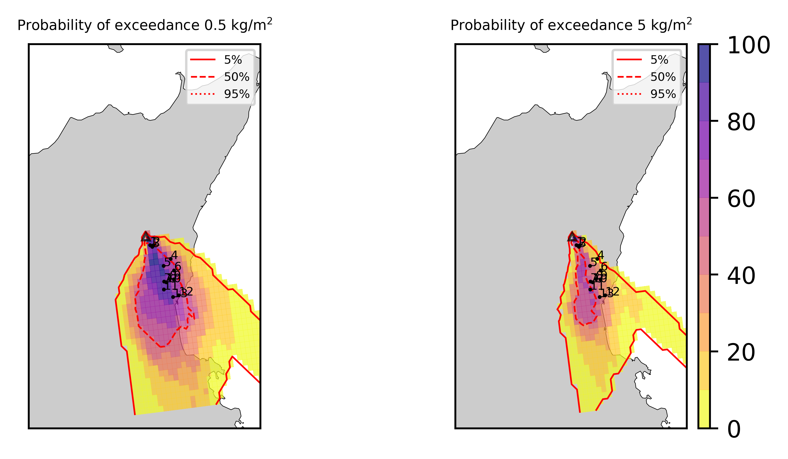
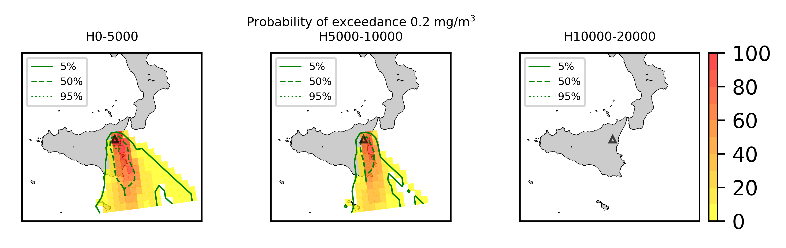
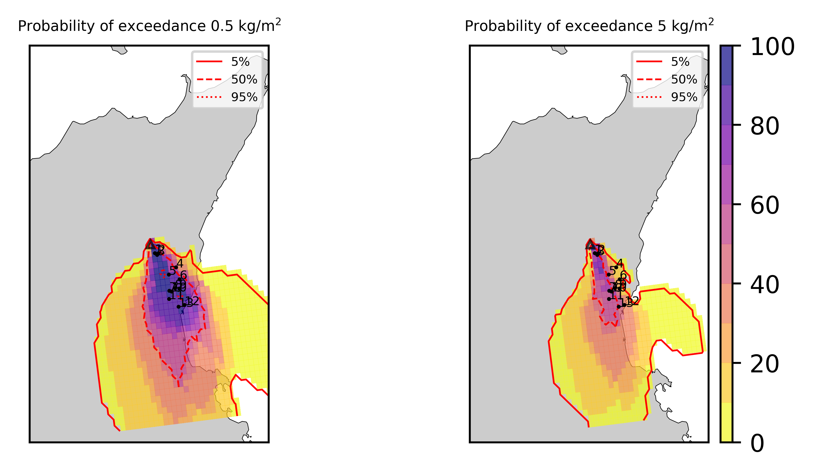
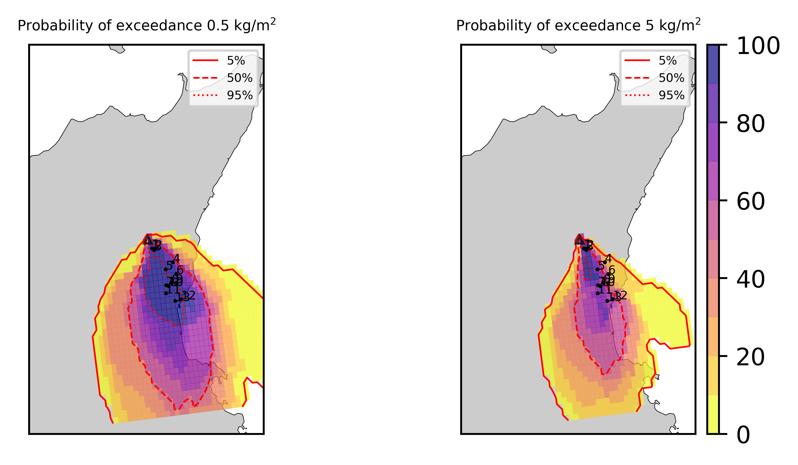

Forecast from VONA_20210216_1631Z
=================================

Contents
========

* [Forecast products](#forecast-products)
	* [Forecast at 2021-02-16 17:30 Z from RED VONA issued at 20210216_1631Z](#forecast-at-2021-02-16-1730-z-from-red-vona-issued-at-20210216_1631z)
	* [Forecast at 2021-02-16 18:30 Z from RED VONA issued at 20210216_1631Z](#forecast-at-2021-02-16-1830-z-from-red-vona-issued-at-20210216_1631z)
	* [Forecast at 2021-02-16 19:30 Z from RED VONA issued at 20210216_1631Z](#forecast-at-2021-02-16-1930-z-from-red-vona-issued-at-20210216_1631z)
	* [Forecast at 2021-02-16 22:30 Z from RED VONA issued at 20210216_1631Z](#forecast-at-2021-02-16-2230-z-from-red-vona-issued-at-20210216_1631z)
	* [Forecast at 2021-02-16 20:10 Z from RED VONA issued at 20210216_1705Z](#forecast-at-2021-02-16-2010-z-from-red-vona-issued-at-20210216_1705z)
	* [Forecast at 2021-02-16 20:40 Z from RED VONA issued at 20210216_1738Z](#forecast-at-2021-02-16-2040-z-from-red-vona-issued-at-20210216_1738z)
	* [Forecast at 2021-02-16 23:40 Z from RED VONA issued at 20210216_1738Z](#forecast-at-2021-02-16-2340-z-from-red-vona-issued-at-20210216_1738z)

# Forecast products

## Forecast at 2021-02-16 17:30 Z from RED VONA issued at 20210216_1631Z
  

|Eruption start [Z]|Eruption end [Z]|Forecast time [Z]|Column height asl [m]|
| :--- | :--- | :--- | :--- |
|2021-02-16 16:30:00|Ongoing|2021-02-16 17:30:00|6000 ± 500 - from VONA|
  
  

|Percentile|MER [kg/s¹]|Mass air [kg]|Mass air nested dom. [kg]|Mass grd [kg]|Mass grd nested dom. [kg]|
| :--- | :--- | :--- | :--- | :--- | :--- |
|5th|1.49e+04|2.02e+07|1.95e+07|3.08e+07|3.08e+07|
|50th|7.09e+04|1.12e+08|1.11e+08|1.58e+08|1.58e+08|
|95th|2.08e+05|2.95e+08|2.18e+08|4.57e+08|4.57e+08|
  

### Ground Nested Domain 2021-02-16 17:30 Z
  
  
  
  
  
  
  
  
  
  
  
  
  
  

|Location|Ground load [kg/m²] 5th perc|Ground load [kg/m²] 50th perc|Ground load [kg/m²] 95th perc|
| :--- | :--- | :--- | :--- |
|Schiena Asino (1)|4.55e-01|1.76e+00|4.76e+00|
|Rif.Vescovo (2)|0.00e+00|9.60e-01|3.68e+00|
|Serra Pituzza (3)|0.00e+00|1.22e+00|4.83e+00|
|Monterosso (4)|0.00e+00|1.71e-05|2.27e+00|
|Cim.Pedara (5)|3.01e-06|8.42e-02|3.17e+00|
|Cim.Viagrande (6)|0.00e+00|2.14e-05|1.40e+00|
|Cim.Mascalucia (7)|2.60e-05|6.84e-03|1.44e+00|
|Cim.Tremestieri (8)|0.00e+00|5.85e-03|1.29e+00|
|Cim.S.Giov.La Punta (9)|0.00e+00|5.47e-04|8.00e-01|
|Cim.Gravina (10)|0.00e+00|2.29e-03|1.55e+00|
|ENI S.Giov.Galermo (11)|1.50e-08|3.74e-03|3.95e-01|
|Bio Piazza Europa (12)|0.00e+00|3.00e-04|5.70e-02|
|INGV-OE (13)|0.00e+00|2.31e-04|7.66e-02|
  

### Atmosphere 2021-02-16 17:30 Z
  

## Forecast at 2021-02-16 18:30 Z from RED VONA issued at 20210216_1631Z
  

|Eruption start [Z]|Eruption end [Z]|Forecast time [Z]|Column height asl [m]|
| :--- | :--- | :--- | :--- |
|2021-02-16 16:30:00|Ongoing|2021-02-16 18:30:00|6000 ± 500 - from VONA|
  
  

|Percentile|MER [kg/s¹]|Mass air [kg]|Mass air nested dom. [kg]|Mass grd [kg]|Mass grd nested dom. [kg]|
| :--- | :--- | :--- | :--- | :--- | :--- |
|5th|1.21e+04|6.39e+07|4.39e+07|9.25e+07|9.23e+07|
|50th|7.46e+04|1.85e+08|1.26e+08|3.45e+08|3.45e+08|
|95th|2.03e+05|4.42e+08|2.95e+08|7.93e+08|7.91e+08|
  

### Ground Nested Domain 2021-02-16 18:30 Z
  
  
  
  
  
  
  
  
  
  
  
  
  
  

|Location|Ground load [kg/m²] 5th perc|Ground load [kg/m²] 50th perc|Ground load [kg/m²] 95th perc|
| :--- | :--- | :--- | :--- |
|Schiena Asino (1)|1.20e+00|3.57e+00|7.73e+00|
|Rif.Vescovo (2)|6.90e-02|1.91e+00|5.84e+00|
|Serra Pituzza (3)|9.67e-02|2.53e+00|7.81e+00|
|Monterosso (4)|2.33e-06|2.70e-03|7.86e+00|
|Cim.Pedara (5)|1.70e-03|6.87e-01|6.88e+00|
|Cim.Viagrande (6)|5.21e-06|2.79e-04|3.30e+00|
|Cim.Mascalucia (7)|5.52e-03|1.63e-01|2.10e+00|
|Cim.Tremestieri (8)|8.56e-04|4.63e-02|1.96e+00|
|Cim.S.Giov.La Punta (9)|1.49e-04|1.68e-02|1.17e+00|
|Cim.Gravina (10)|2.44e-03|1.36e-01|2.07e+00|
|ENI S.Giov.Galermo (11)|4.24e-03|5.81e-02|6.96e-01|
|Bio Piazza Europa (12)|5.25e-04|1.58e-02|1.49e-01|
|INGV-OE (13)|1.30e-03|1.45e-02|1.75e-01|
  

### Atmosphere 2021-02-16 18:30 Z
  

## Forecast at 2021-02-16 19:30 Z from RED VONA issued at 20210216_1631Z
  

|Eruption start [Z]|Eruption end [Z]|Forecast time [Z]|Column height asl [m]|
| :--- | :--- | :--- | :--- |
|2021-02-16 16:30:00|Ongoing|2021-02-16 19:30:00|6000 ± 500 - from VONA|
  
  

|Percentile|MER [kg/s¹]|Mass air [kg]|Mass air nested dom. [kg]|Mass grd [kg]|Mass grd nested dom. [kg]|
| :--- | :--- | :--- | :--- | :--- | :--- |
|5th|2.19e+04|1.31e+08|6.48e+07|2.23e+08|2.22e+08|
|50th|6.61e+04|2.55e+08|1.75e+08|6.13e+08|6.08e+08|
|95th|1.90e+05|5.88e+08|3.66e+08|1.04e+09|1.02e+09|
  

### Ground Nested Domain 2021-02-16 19:30 Z
  
  
  
  
  
  
  
  
  
  
  
  
  
  

|Location|Ground load [kg/m²] 5th perc|Ground load [kg/m²] 50th perc|Ground load [kg/m²] 95th perc|
| :--- | :--- | :--- | :--- |
|Schiena Asino (1)|2.29e+00|5.56e+00|9.76e+00|
|Rif.Vescovo (2)|5.48e-01|3.73e+00|7.52e+00|
|Serra Pituzza (3)|4.39e-01|4.39e+00|9.97e+00|
|Monterosso (4)|1.94e-05|3.96e-02|8.32e+00|
|Cim.Pedara (5)|3.19e-02|1.48e+00|8.25e+00|
|Cim.Viagrande (6)|1.76e-04|3.81e-03|3.46e+00|
|Cim.Mascalucia (7)|1.54e-02|3.19e-01|3.78e+00|
|Cim.Tremestieri (8)|2.72e-03|1.17e-01|3.35e+00|
|Cim.S.Giov.La Punta (9)|9.01e-04|4.04e-02|1.47e+00|
|Cim.Gravina (10)|7.68e-03|2.30e-01|4.10e+00|
|ENI S.Giov.Galermo (11)|9.36e-03|2.10e-01|8.64e-01|
|Bio Piazza Europa (12)|2.43e-03|5.26e-02|2.57e-01|
|INGV-OE (13)|6.44e-03|4.27e-02|3.12e-01|
  

### Atmosphere 2021-02-16 19:30 Z
  

## Forecast at 2021-02-16 22:30 Z from RED VONA issued at 20210216_1631Z
  

|Eruption start [Z]|Eruption end [Z]|Forecast time [Z]|Column height asl [m]|
| :--- | :--- | :--- | :--- |
|2021-02-16 16:30:00|Ongoing|2021-02-16 22:30:00|6000 ± 500 - from VONA|
  
  

|Percentile|MER [kg/s¹]|Mass air [kg]|Mass air nested dom. [kg]|Mass grd [kg]|Mass grd nested dom. [kg]|
| :--- | :--- | :--- | :--- | :--- | :--- |
|5th|1.42e+04|1.43e+08|4.46e+07|5.54e+08|5.42e+08|
|50th|6.74e+04|3.26e+08|1.54e+08|1.25e+09|1.24e+09|
|95th|1.82e+05|9.10e+08|3.86e+08|1.87e+09|1.82e+09|
  

### Ground Nested Domain 2021-02-16 22:30 Z
  
  
  
  
  
  
  
  
  
  
  
  
  
  

|Location|Ground load [kg/m²] 5th perc|Ground load [kg/m²] 50th perc|Ground load [kg/m²] 95th perc|
| :--- | :--- | :--- | :--- |
|Schiena Asino (1)|6.02e+00|1.18e+01|1.40e+01|
|Rif.Vescovo (2)|2.04e+00|6.38e+00|1.14e+01|
|Serra Pituzza (3)|1.40e+00|8.50e+00|1.46e+01|
|Monterosso (4)|5.23e-04|1.25e-01|1.21e+01|
|Cim.Pedara (5)|2.72e-01|3.25e+00|1.10e+01|
|Cim.Viagrande (6)|5.47e-03|1.45e-01|4.37e+00|
|Cim.Mascalucia (7)|2.61e-01|8.54e-01|4.78e+00|
|Cim.Tremestieri (8)|4.11e-02|4.67e-01|3.89e+00|
|Cim.S.Giov.La Punta (9)|1.55e-02|3.39e-01|1.75e+00|
|Cim.Gravina (10)|1.52e-01|5.94e-01|4.91e+00|
|ENI S.Giov.Galermo (11)|1.05e-01|4.10e-01|1.81e+00|
|Bio Piazza Europa (12)|1.38e-02|1.37e-01|4.31e-01|
|INGV-OE (13)|2.30e-02|1.35e-01|5.25e-01|
  

### Atmosphere 2021-02-16 22:30 Z
  

## Forecast at 2021-02-16 20:10 Z from RED VONA issued at 20210216_1705Z
  

|Eruption start [Z]|Eruption end [Z]|Forecast time [Z]|Column height asl [m]|
| :--- | :--- | :--- | :--- |
|2021-02-16 16:30:00|Ongoing|2021-02-16 20:10:00|10000 ± 500 - from VONA|
  
  

|Percentile|MER [kg/s¹]|Mass air [kg]|Mass air nested dom. [kg]|Mass grd [kg]|Mass grd nested dom. [kg]|
| :--- | :--- | :--- | :--- | :--- | :--- |
|5th|1.96e+05|3.79e+08|3.64e+08|1.73e+09|1.71e+09|
|50th|5.69e+05|1.93e+09|9.25e+08|3.79e+09|3.70e+09|
|95th|4.64e+06|6.56e+09|2.87e+09|1.62e+10|1.55e+10|
  

### Ground Nested Domain 2021-02-16 20:10 Z
  
  
  
  
  
  
  
  
  
  
  
  
  
  

|Location|Ground load [kg/m²] 5th perc|Ground load [kg/m²] 50th perc|Ground load [kg/m²] 95th perc|
| :--- | :--- | :--- | :--- |
|Schiena Asino (1)|9.97e+00|2.32e+01|3.92e+01|
|Rif.Vescovo (2)|8.65e-03|1.20e+01|2.86e+01|
|Serra Pituzza (3)|1.21e-02|1.12e+01|3.44e+01|
|Monterosso (4)|1.94e-03|1.87e-01|1.05e+01|
|Cim.Pedara (5)|2.04e-01|2.71e+00|1.81e+01|
|Cim.Viagrande (6)|8.59e-03|6.31e-01|8.30e+00|
|Cim.Mascalucia (7)|3.49e-01|8.28e+00|1.49e+01|
|Cim.Tremestieri (8)|5.81e-02|2.59e+00|1.26e+01|
|Cim.S.Giov.La Punta (9)|2.31e-02|1.50e+00|1.15e+01|
|Cim.Gravina (10)|2.18e-01|5.81e+00|1.37e+01|
|ENI S.Giov.Galermo (11)|1.11e+00|8.55e+00|1.44e+01|
|Bio Piazza Europa (12)|4.68e-02|2.98e+00|1.12e+01|
|INGV-OE (13)|3.42e-01|3.96e+00|1.38e+01|
  

### Atmosphere 2021-02-16 20:10 Z
  

## Forecast at 2021-02-16 20:40 Z from RED VONA issued at 20210216_1738Z
  

|Eruption start [Z]|Eruption end [Z]|Forecast time [Z]|Column height asl [m]|
| :--- | :--- | :--- | :--- |
|2021-02-16 16:30:00|Ongoing|2021-02-16 20:40:00|[6000 m, 12000 m]|
  
  

|Percentile|MER [kg/s¹]|Mass air [kg]|Mass air nested dom. [kg]|Mass grd [kg]|Mass grd nested dom. [kg]|
| :--- | :--- | :--- | :--- | :--- | :--- |
|5th|7.16e+04|5.85e+08|2.26e+08|1.47e+09|1.46e+09|
|50th|4.17e+05|1.44e+09|6.28e+08|4.73e+09|4.58e+09|
|95th|8.56e+06|1.90e+10|6.92e+09|5.03e+10|4.16e+10|
  

### Ground Nested Domain 2021-02-16 20:40 Z
  
  
  
  
  
  
  
  
  
  
  
  
  
  

|Location|Ground load [kg/m²] 5th perc|Ground load [kg/m²] 50th perc|Ground load [kg/m²] 95th perc|
| :--- | :--- | :--- | :--- |
|Schiena Asino (1)|1.20e+01|2.42e+01|7.08e+01|
|Rif.Vescovo (2)|2.16e+00|9.46e+00|2.43e+01|
|Serra Pituzza (3)|3.02e+00|1.30e+01|3.27e+01|
|Monterosso (4)|2.09e-02|6.92e-01|1.19e+01|
|Cim.Pedara (5)|3.18e-01|3.39e+00|2.40e+01|
|Cim.Viagrande (6)|4.39e-02|1.01e+00|6.49e+00|
|Cim.Mascalucia (7)|4.55e-01|6.40e+00|4.02e+01|
|Cim.Tremestieri (8)|4.44e-01|4.37e+00|1.93e+01|
|Cim.S.Giov.La Punta (9)|3.35e-01|2.30e+00|9.53e+00|
|Cim.Gravina (10)|4.19e-01|5.68e+00|3.27e+01|
|ENI S.Giov.Galermo (11)|4.52e-01|1.09e+01|3.26e+01|
|Bio Piazza Europa (12)|5.37e-01|2.22e+00|1.02e+01|
|INGV-OE (13)|4.48e-01|4.23e+00|1.56e+01|
  

### Atmosphere 2021-02-16 20:40 Z
  

## Forecast at 2021-02-16 23:40 Z from RED VONA issued at 20210216_1738Z
  

|Eruption start [Z]|Eruption end [Z]|Forecast time [Z]|Column height asl [m]|
| :--- | :--- | :--- | :--- |
|2021-02-16 16:30:00|Ongoing|2021-02-16 23:40:00|[6000 m, 12000 m]|
  
  

|Percentile|MER [kg/s¹]|Mass air [kg]|Mass air nested dom. [kg]|Mass grd [kg]|Mass grd nested dom. [kg]|
| :--- | :--- | :--- | :--- | :--- | :--- |
|5th|6.33e+04|7.34e+08|3.07e+08|3.36e+09|3.22e+09|
|50th|3.77e+05|2.72e+09|1.16e+09|1.13e+10|1.08e+10|
|95th|7.23e+06|1.62e+10|7.29e+09|6.03e+10|4.74e+10|
  

### Ground Nested Domain 2021-02-16 23:40 Z
  
  
  
  
  
  
  
  
  
  
  
  
  
  

|Location|Ground load [kg/m²] 5th perc|Ground load [kg/m²] 50th perc|Ground load [kg/m²] 95th perc|
| :--- | :--- | :--- | :--- |
|Schiena Asino (1)|2.89e+01|4.10e+01|1.19e+02|
|Rif.Vescovo (2)|7.58e+00|1.23e+01|3.84e+01|
|Serra Pituzza (3)|8.19e+00|1.47e+01|4.94e+01|
|Monterosso (4)|2.75e-01|1.53e+00|1.51e+01|
|Cim.Pedara (5)|2.92e+00|9.58e+00|2.81e+01|
|Cim.Viagrande (6)|3.00e-01|2.09e+00|2.23e+01|
|Cim.Mascalucia (7)|3.94e+00|1.31e+01|4.63e+01|
|Cim.Tremestieri (8)|1.45e+00|7.81e+00|3.57e+01|
|Cim.S.Giov.La Punta (9)|6.51e-01|4.58e+00|2.73e+01|
|Cim.Gravina (10)|3.83e+00|1.02e+01|4.37e+01|
|ENI S.Giov.Galermo (11)|2.63e+00|1.63e+01|4.06e+01|
|Bio Piazza Europa (12)|9.05e-01|8.35e+00|2.34e+01|
|INGV-OE (13)|2.31e+00|1.07e+01|3.23e+01|
  

### Atmosphere 2021-02-16 23:40 Z
  
  
Go to [Supplementary page](Supplementary_page.md)  
Go to [Main directory](https://github.com/federicapardini/Real_time_ash_forecast)