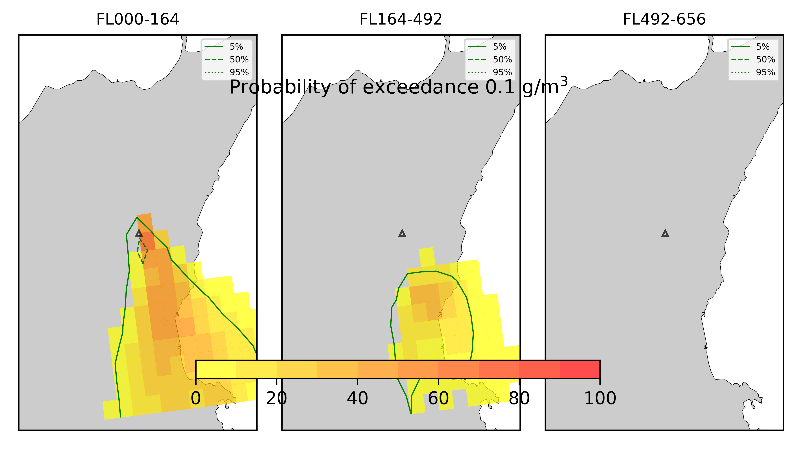

Forecast from VONA bulletin - 20210216_1631Z
============================================

Contents
========

* [Forecast products](#forecast-products)
	* [Forecast at 2021-02-16 19:30 Z - Ongoing Eruption](#forecast-at-2021-02-16-1930-z---ongoing-eruption)
	* [Forecast at 2021-02-16 22:30 Z - Ongoing Eruption](#forecast-at-2021-02-16-2230-z---ongoing-eruption)
	* [Forecast at 2021-02-16 20:10 Z - Ongoing Eruption](#forecast-at-2021-02-16-2010-z---ongoing-eruption)

# Forecast products

## Forecast at 2021-02-16 19:30 Z - Ongoing Eruption
  

|Eruption start [Z]|Eruption end [Z]|Forecast time [Z]|Column height asl [m]|
| :--- | :--- | :--- | :--- |
|2021-02-16 16:30:00|Ongoing|2021-02-16 19:30:00|6000 ± 500 - from VONA|
  
  

|Percentile|MER [kg/s¹]|Mass in the air [kg]|Mass on the ground [kg]|
| :--- | :--- | :--- | :--- |
|5th|1.87e+04|9.49e+06|1.87e+08|
|50th|7.89e+04|8.97e+07|7.35e+08|
|95th|1.91e+05|3.98e+08|1.64e+09|
  

### Ground 2021-02-16 19:30 Z
  
  
  
  
  
  
  
  
  
  
  
  
  
  

|Location|Ground load [kg/m²] 5th perc|Ground load [kg/m²] 50th perc|Ground load [kg/m²] 95th perc|
| :--- | :--- | :--- | :--- |
|Schiena Asino (1)|0.00e+00|6.94e-01|2.95e+00|
|Rif.Vescovo (2)|0.00e+00|8.02e-01|4.29e+00|
|Serra Pituzza (3)|0.00e+00|1.03e+00|3.82e+00|
|Monterosso (4)|3.74e-03|7.08e-01|8.22e+00|
|Cim.Pedara (5)|2.12e-02|3.44e+00|8.71e+00|
|Cim.Viagrande (6)|6.28e-04|4.17e-02|8.25e+00|
|Cim.Mascalucia (7)|8.69e-02|1.48e+00|1.26e+01|
|Cim.Tremestieri (8)|5.28e-02|1.52e+00|6.29e+00|
|Cim.S.Giov.La Punta (9)|3.23e-02|3.94e-01|3.34e+00|
|Cim.Gravina (10)|1.15e-01|1.52e+00|9.24e+00|
|ENI S.Giov.Galermo (11)|1.70e-02|9.48e-01|1.08e+01|
|Bio Piazza Europa (12)|3.04e-03|1.30e-01|1.42e+00|
|INGV-OE (13)|2.14e-03|2.70e-01|6.40e+00|
  

### Atmosphere 2021-02-16 19:30 Z
  

## Forecast at 2021-02-16 22:30 Z - Ongoing Eruption
  

|Eruption start [Z]|Eruption end [Z]|Forecast time [Z]|Column height asl [m]|
| :--- | :--- | :--- | :--- |
|2021-02-16 16:30:00|Ongoing|2021-02-16 22:30:00|6000 ± 500 - from VONA|
  
  

|Percentile|MER [kg/s¹]|Mass in the air [kg]|Mass on the ground [kg]|
| :--- | :--- | :--- | :--- |
|5th|2.46e+04|4.24e+07|6.19e+08|
|50th|7.39e+04|1.33e+08|1.40e+09|
|95th|1.52e+05|2.15e+08|2.52e+09|
  

### Ground 2021-02-16 22:30 Z
  
  
  
  
  
  
  
  
  
  
  
  
  
  

|Location|Ground load [kg/m²] 5th perc|Ground load [kg/m²] 50th perc|Ground load [kg/m²] 95th perc|
| :--- | :--- | :--- | :--- |
|Schiena Asino (1)|4.36e-01|1.51e+00|4.45e+00|
|Rif.Vescovo (2)|4.30e-01|1.68e+00|5.46e+00|
|Serra Pituzza (3)|5.18e-01|1.96e+00|5.78e+00|
|Monterosso (4)|4.94e-01|1.43e+00|8.36e+00|
|Cim.Pedara (5)|2.85e+00|6.33e+00|1.08e+01|
|Cim.Viagrande (6)|2.68e-02|2.28e-01|7.71e+00|
|Cim.Mascalucia (7)|2.43e-01|3.58e+00|1.47e+01|
|Cim.Tremestieri (8)|4.53e-01|3.19e+00|7.40e+00|
|Cim.S.Giov.La Punta (9)|1.11e-01|1.41e+00|5.44e+00|
|Cim.Gravina (10)|3.95e-01|3.19e+00|1.23e+01|
|ENI S.Giov.Galermo (11)|4.16e-01|1.88e+00|1.68e+01|
|Bio Piazza Europa (12)|8.07e-02|4.90e-01|2.08e+00|
|INGV-OE (13)|1.70e-01|6.91e-01|8.27e+00|
  

### Atmosphere 2021-02-16 22:30 Z
  

## Forecast at 2021-02-16 20:10 Z - Ongoing Eruption
  

|Eruption start [Z]|Eruption end [Z]|Forecast time [Z]|Column height asl [m]|
| :--- | :--- | :--- | :--- |
|2021-02-16 16:30:00|Ongoing|2021-02-16 20:10:00|10000 ± 500 - from VONA|
  
  

|Percentile|MER [kg/s¹]|Mass in the air [kg]|Mass on the ground [kg]|
| :--- | :--- | :--- | :--- |
|5th|2.70e+05|5.70e+08|2.24e+09|
|50th|6.82e+05|1.43e+09|5.21e+09|
|95th|1.87e+06|3.67e+09|1.40e+10|
  

### Ground 2021-02-16 20:10 Z
  
  
  
  
  
  
  
  
  
  
  
  
  
  

|Location|Ground load [kg/m²] 5th perc|Ground load [kg/m²] 50th perc|Ground load [kg/m²] 95th perc|
| :--- | :--- | :--- | :--- |
|Schiena Asino (1)|2.30e-03|3.51e+00|1.58e+01|
|Rif.Vescovo (2)|2.74e-03|3.51e+00|1.94e+01|
|Serra Pituzza (3)|2.98e-03|4.50e+00|2.16e+01|
|Monterosso (4)|1.49e-01|2.17e+00|6.62e+00|
|Cim.Pedara (5)|8.53e-01|8.09e+00|2.80e+01|
|Cim.Viagrande (6)|2.48e-04|2.41e-02|8.43e+00|
|Cim.Mascalucia (7)|2.24e-01|4.38e+00|1.49e+01|
|Cim.Tremestieri (8)|1.10e-01|3.13e+00|9.97e+00|
|Cim.S.Giov.La Punta (9)|1.56e-02|7.30e-01|8.87e+00|
|Cim.Gravina (10)|1.70e-01|4.15e+00|1.18e+01|
|ENI S.Giov.Galermo (11)|3.90e-01|3.90e+00|1.31e+01|
|Bio Piazza Europa (12)|5.57e-03|5.23e-01|6.16e+00|
|INGV-OE (13)|5.63e-02|2.24e+00|8.40e+00|
  

### Atmosphere 2021-02-16 20:10 Z
  
  
Go to [Supplementary page](Supplementary_page.md)  
Go to [Main directory](https://github.com/federicapardini/Real_time_ash_forecast)