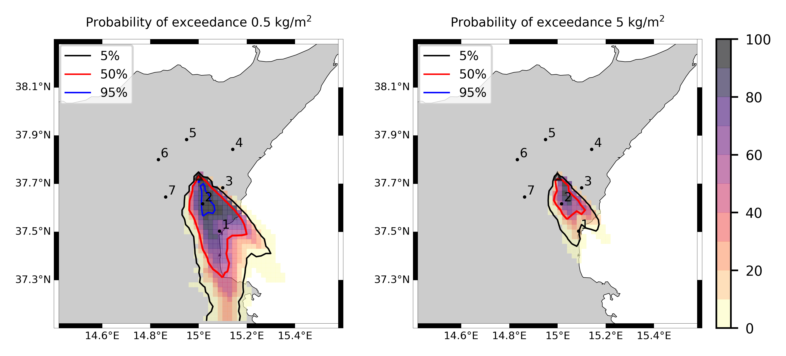

Forecast from VONA_20210216_1631Z
=================================

Contents
========

* [Forecast products](#forecast-products)
	* [Forecast at 2021-02-16 17:30 Z from RED VONA issued at 20210216_1631Z](#forecast-at-2021-02-16-1730-z-from-red-vona-issued-at-20210216_1631z)
	* [Forecast at 2021-02-16 18:30 Z from RED VONA issued at 20210216_1631Z](#forecast-at-2021-02-16-1830-z-from-red-vona-issued-at-20210216_1631z)
	* [Forecast at 2021-02-16 19:30 Z from RED VONA issued at 20210216_1631Z](#forecast-at-2021-02-16-1930-z-from-red-vona-issued-at-20210216_1631z)
	* [Forecast at 2021-02-16 22:30 Z from RED VONA issued at 20210216_1631Z](#forecast-at-2021-02-16-2230-z-from-red-vona-issued-at-20210216_1631z)
	* [Forecast at 2021-02-17 01:30 Z from RED VONA issued at 20210216_1631Z](#forecast-at-2021-02-17-0130-z-from-red-vona-issued-at-20210216_1631z)
	* [Forecast at 2021-02-16 18:10 Z from RED VONA issued at 20210216_1705Z](#forecast-at-2021-02-16-1810-z-from-red-vona-issued-at-20210216_1705z)
	* [Forecast at 2021-02-16 19:10 Z from RED VONA issued at 20210216_1705Z](#forecast-at-2021-02-16-1910-z-from-red-vona-issued-at-20210216_1705z)

# Forecast products

## Forecast at 2021-02-16 17:30 Z from RED VONA issued at 20210216_1631Z
  

|Eruption start [Z]|Eruption end [Z]|Forecast time [Z]|Column height asl [m]|
| :--- | :--- | :--- | :--- |
|2021-02-16 16:30:00|Ongoing|2021-02-16 17:30:00|6000 ± 500 - from VONA|
  
  

|Percentile|MER [kg/s¹]|Mass air [kg]|Mass air nested dom. [kg]|Mass grd [kg]|Mass grd nested dom. [kg]|
| :--- | :--- | :--- | :--- | :--- | :--- |
|5th|1.15e+04|1.57e+07|1.57e+07|2.68e+07|2.68e+07|
|50th|7.18e+04|1.08e+08|8.85e+07|1.67e+08|1.67e+08|
|95th|2.13e+05|2.52e+08|2.42e+08|5.20e+08|5.19e+08|
  

### Ground Nested Domain 2021-02-16 17:30 Z
  
  
  
  
  
  
  
  
  
  
  
  
  
  
  
  
  
  
  
  
  
  
  
  

|Location|Ground load [kg/m²] 5th perc|Ground load [kg/m²] 50th perc|Ground load [kg/m²] 95th perc|
| :--- | :--- | :--- | :--- |
|Catania AP (1)|0.00e+00|5.58e-04|1.65e-01|
|Siracusa (2)|nan|nan|nan|
|Reggio Calabria (3)|nan|nan|nan|
|Palermo (4)|nan|nan|nan|
|Nicolosi (5)|1.17e-05|3.50e-01|4.14e+00|
|Zafferana (6)|0.00e+00|0.00e+00|4.15e-02|
|Linguaglossa (7)|0.00e+00|0.00e+00|0.00e+00|
|Randazzo (8)|0.00e+00|0.00e+00|0.00e+00|
|Bronte (9)|0.00e+00|0.00e+00|0.00e+00|
|Biancavilla (10)|0.00e+00|0.00e+00|4.17e-06|
|Schiena Asino (11)|1.43e-03|6.00e-01|3.21e+00|
|Rif.Vescovo (12)|0.00e+00|3.42e-01|1.88e+00|
|Serra Pituzza (13)|0.00e+00|2.41e-01|2.16e+00|
|Monterosso (14)|0.00e+00|9.33e-06|1.69e+00|
|Cim.Pedara (15)|3.89e-04|6.27e-02|5.01e+00|
|Cim.Viagrande (16)|0.00e+00|1.00e-05|1.82e+00|
|Cim.Mascalucia (17)|0.00e+00|3.16e-02|3.79e-01|
|Cim.Tremestieri (18)|0.00e+00|3.45e-03|5.06e-01|
|Cim.S.Giov.La Punta (19)|0.00e+00|5.99e-04|6.26e-01|
|Cim.Gravina (20)|0.00e+00|6.91e-03|5.07e-01|
|ENI S.Giov.Galermo (21)|0.00e+00|8.11e-03|2.48e-01|
|Bio Piazza Europa (22)|0.00e+00|1.64e-04|2.62e-01|
|INGV-OE (23)|0.00e+00|4.11e-04|1.54e-01|
  

### Atmosphere 2021-02-16 17:30 Z
  

## Forecast at 2021-02-16 18:30 Z from RED VONA issued at 20210216_1631Z
  

|Eruption start [Z]|Eruption end [Z]|Forecast time [Z]|Column height asl [m]|
| :--- | :--- | :--- | :--- |
|2021-02-16 16:30:00|Ongoing|2021-02-16 18:30:00|6000 ± 500 - from VONA|
  
  

|Percentile|MER [kg/s¹]|Mass air [kg]|Mass air nested dom. [kg]|Mass grd [kg]|Mass grd nested dom. [kg]|
| :--- | :--- | :--- | :--- | :--- | :--- |
|5th|1.67e+04|3.84e+07|3.84e+07|1.05e+08|1.05e+08|
|50th|7.54e+04|1.58e+08|1.23e+08|3.61e+08|3.53e+08|
|95th|1.95e+05|3.37e+08|2.96e+08|9.93e+08|8.70e+08|
  

### Ground Nested Domain 2021-02-16 18:30 Z
  
  
  
  
  
  
  
  
  
  
  
  
  
  
  
  
  
  
  
  
  
  
  
  

|Location|Ground load [kg/m²] 5th perc|Ground load [kg/m²] 50th perc|Ground load [kg/m²] 95th perc|
| :--- | :--- | :--- | :--- |
|Catania AP (1)|9.35e-05|9.70e-03|5.54e-01|
|Siracusa (2)|nan|nan|nan|
|Reggio Calabria (3)|nan|nan|nan|
|Palermo (4)|nan|nan|nan|
|Nicolosi (5)|6.10e-02|1.78e+00|1.36e+01|
|Zafferana (6)|0.00e+00|0.00e+00|1.93e-01|
|Linguaglossa (7)|0.00e+00|0.00e+00|0.00e+00|
|Randazzo (8)|0.00e+00|0.00e+00|0.00e+00|
|Bronte (9)|0.00e+00|0.00e+00|0.00e+00|
|Biancavilla (10)|0.00e+00|0.00e+00|2.31e-04|
|Schiena Asino (11)|3.96e-01|2.35e+00|3.58e+00|
|Rif.Vescovo (12)|3.30e-04|1.15e+00|3.52e+00|
|Serra Pituzza (13)|4.62e-04|1.46e+00|4.81e+00|
|Monterosso (14)|0.00e+00|3.33e-02|3.51e+00|
|Cim.Pedara (15)|2.47e-03|9.66e-01|6.52e+00|
|Cim.Viagrande (16)|0.00e+00|3.02e-02|2.31e+00|
|Cim.Mascalucia (17)|5.25e-03|2.10e-01|9.11e-01|
|Cim.Tremestieri (18)|6.52e-05|1.34e-01|2.57e+00|
|Cim.S.Giov.La Punta (19)|1.63e-05|1.13e-01|1.28e+00|
|Cim.Gravina (20)|4.10e-04|8.10e-02|8.43e-01|
|ENI S.Giov.Galermo (21)|2.82e-04|4.75e-02|5.81e-01|
|Bio Piazza Europa (22)|4.02e-05|2.59e-02|1.21e+00|
|INGV-OE (23)|1.58e-04|1.26e-02|5.64e-01|
  

### Atmosphere 2021-02-16 18:30 Z
  

## Forecast at 2021-02-16 19:30 Z from RED VONA issued at 20210216_1631Z
  

|Eruption start [Z]|Eruption end [Z]|Forecast time [Z]|Column height asl [m]|
| :--- | :--- | :--- | :--- |
|2021-02-16 16:30:00|Ongoing|2021-02-16 19:30:00|6000 ± 500 - from VONA|
  
  

|Percentile|MER [kg/s¹]|Mass air [kg]|Mass air nested dom. [kg]|Mass grd [kg]|Mass grd nested dom. [kg]|
| :--- | :--- | :--- | :--- | :--- | :--- |
|5th|1.85e+04|4.97e+07|4.30e+07|4.45e+08|4.45e+08|
|50th|8.11e+04|2.16e+08|1.42e+08|6.14e+08|5.89e+08|
|95th|2.01e+05|3.32e+08|2.79e+08|1.49e+09|1.32e+09|
  

### Ground Nested Domain 2021-02-16 19:30 Z
  
  
  
  
  
  
  
  
  
  
  
  
  
  
  
  
  
  
  
  
  
  
  
  

|Location|Ground load [kg/m²] 5th perc|Ground load [kg/m²] 50th perc|Ground load [kg/m²] 95th perc|
| :--- | :--- | :--- | :--- |
|Catania AP (1)|2.15e-03|1.12e-01|8.68e-01|
|Siracusa (2)|nan|nan|nan|
|Reggio Calabria (3)|nan|nan|nan|
|Palermo (4)|nan|nan|nan|
|Nicolosi (5)|1.59e-01|4.85e+00|1.53e+01|
|Zafferana (6)|0.00e+00|1.53e-04|2.05e-01|
|Linguaglossa (7)|0.00e+00|0.00e+00|0.00e+00|
|Randazzo (8)|0.00e+00|0.00e+00|0.00e+00|
|Bronte (9)|0.00e+00|0.00e+00|0.00e+00|
|Biancavilla (10)|0.00e+00|0.00e+00|3.55e-04|
|Schiena Asino (11)|1.01e+00|3.48e+00|4.63e+00|
|Rif.Vescovo (12)|4.95e-02|1.78e+00|5.08e+00|
|Serra Pituzza (13)|6.93e-02|2.33e+00|5.50e+00|
|Monterosso (14)|1.24e-05|1.68e-01|3.57e+00|
|Cim.Pedara (15)|5.61e-02|2.20e+00|9.06e+00|
|Cim.Viagrande (16)|2.81e-06|1.85e-01|2.48e+00|
|Cim.Mascalucia (17)|1.68e-02|3.75e-01|4.00e+00|
|Cim.Tremestieri (18)|3.43e-03|4.06e-01|2.94e+00|
|Cim.S.Giov.La Punta (19)|6.86e-04|3.58e-01|2.13e+00|
|Cim.Gravina (20)|6.96e-03|2.19e-01|2.60e+00|
|ENI S.Giov.Galermo (21)|9.32e-03|3.34e-01|1.05e+00|
|Bio Piazza Europa (22)|8.70e-04|2.02e-01|1.24e+00|
|INGV-OE (23)|3.52e-03|1.22e-01|7.66e-01|
  

### Atmosphere 2021-02-16 19:30 Z
  

## Forecast at 2021-02-16 22:30 Z from RED VONA issued at 20210216_1631Z
  

|Eruption start [Z]|Eruption end [Z]|Forecast time [Z]|Column height asl [m]|
| :--- | :--- | :--- | :--- |
|2021-02-16 16:30:00|Ongoing|2021-02-16 22:30:00|6000 ± 500 - from VONA|
  
  

|Percentile|MER [kg/s¹]|Mass air [kg]|Mass air nested dom. [kg]|Mass grd [kg]|Mass grd nested dom. [kg]|
| :--- | :--- | :--- | :--- | :--- | :--- |
|5th|1.44e+04|8.51e+07|4.35e+07|9.68e+08|9.66e+08|
|50th|6.50e+04|1.79e+08|1.17e+08|1.21e+09|1.16e+09|
|95th|1.47e+05|5.41e+08|2.99e+08|2.27e+09|2.03e+09|
  

### Ground Nested Domain 2021-02-16 22:30 Z
  
  
  
  
  
  
  
  
  
  
  
  
  
  
  
  
  
  
  
  
  
  
  
  

|Location|Ground load [kg/m²] 5th perc|Ground load [kg/m²] 50th perc|Ground load [kg/m²] 95th perc|
| :--- | :--- | :--- | :--- |
|Catania AP (1)|1.73e-02|2.87e-01|1.47e+00|
|Siracusa (2)|nan|nan|nan|
|Reggio Calabria (3)|nan|nan|nan|
|Palermo (4)|nan|nan|nan|
|Nicolosi (5)|3.00e+00|7.60e+00|1.94e+01|
|Zafferana (6)|0.00e+00|4.09e-03|4.76e-01|
|Linguaglossa (7)|0.00e+00|0.00e+00|0.00e+00|
|Randazzo (8)|0.00e+00|0.00e+00|0.00e+00|
|Bronte (9)|0.00e+00|0.00e+00|0.00e+00|
|Biancavilla (10)|0.00e+00|1.36e-05|2.13e-03|
|Schiena Asino (11)|2.18e+00|5.54e+00|1.24e+01|
|Rif.Vescovo (12)|8.05e-01|3.70e+00|1.08e+01|
|Serra Pituzza (13)|8.94e-01|4.81e+00|1.45e+01|
|Monterosso (14)|1.11e-03|1.19e+00|3.57e+00|
|Cim.Pedara (15)|5.88e-02|2.99e+00|9.56e+00|
|Cim.Viagrande (16)|3.00e-03|6.77e-01|3.01e+00|
|Cim.Mascalucia (17)|1.83e-01|1.03e+00|7.46e+00|
|Cim.Tremestieri (18)|5.88e-03|7.67e-01|4.84e+00|
|Cim.S.Giov.La Punta (19)|3.16e-03|5.21e-01|3.73e+00|
|Cim.Gravina (20)|1.65e-02|6.77e-01|4.71e+00|
|ENI S.Giov.Galermo (21)|9.93e-02|7.34e-01|3.78e+00|
|Bio Piazza Europa (22)|4.48e-03|4.38e-01|1.73e+00|
|INGV-OE (23)|1.30e-02|2.78e-01|2.22e+00|
  

### Atmosphere 2021-02-16 22:30 Z
  

## Forecast at 2021-02-17 01:30 Z from RED VONA issued at 20210216_1631Z
  

|Eruption start [Z]|Eruption end [Z]|Forecast time [Z]|Column height asl [m]|
| :--- | :--- | :--- | :--- |
|2021-02-16 16:30:00|Ongoing|2021-02-17 01:30:00|6000 ± 500 - from VONA|
  
  

|Percentile|MER [kg/s¹]|Mass air [kg]|Mass air nested dom. [kg]|Mass grd [kg]|Mass grd nested dom. [kg]|
| :--- | :--- | :--- | :--- | :--- | :--- |
|5th|1.78e+04|9.58e+07|4.68e+07|1.28e+09|1.20e+09|
|50th|5.96e+04|1.58e+08|1.19e+08|1.93e+09|1.83e+09|
|95th|1.10e+05|4.24e+08|2.77e+08|3.13e+09|2.88e+09|
  

### Ground Nested Domain 2021-02-17 01:30 Z
  
  
  
  
  
  
  
  
  
  
  
  
  
  
  
  
  
  
  
  
  
  
  
  

|Location|Ground load [kg/m²] 5th perc|Ground load [kg/m²] 50th perc|Ground load [kg/m²] 95th perc|
| :--- | :--- | :--- | :--- |
|Catania AP (1)|1.38e-01|4.72e-01|2.25e+00|
|Siracusa (2)|nan|nan|nan|
|Reggio Calabria (3)|nan|nan|nan|
|Palermo (4)|nan|nan|nan|
|Nicolosi (5)|3.24e+00|1.21e+01|2.95e+01|
|Zafferana (6)|9.67e-05|1.47e-02|6.37e-01|
|Linguaglossa (7)|0.00e+00|0.00e+00|9.72e-07|
|Randazzo (8)|0.00e+00|0.00e+00|0.00e+00|
|Bronte (9)|0.00e+00|0.00e+00|0.00e+00|
|Biancavilla (10)|0.00e+00|2.34e-04|2.16e-03|
|Schiena Asino (11)|4.04e+00|8.47e+00|1.65e+01|
|Rif.Vescovo (12)|1.91e+00|5.69e+00|1.56e+01|
|Serra Pituzza (13)|2.21e+00|7.51e+00|1.71e+01|
|Monterosso (14)|2.15e-02|1.37e+00|7.05e+00|
|Cim.Pedara (15)|1.09e+00|3.70e+00|1.20e+01|
|Cim.Viagrande (16)|1.16e-01|1.38e+00|4.63e+00|
|Cim.Mascalucia (17)|3.43e-01|1.90e+00|9.62e+00|
|Cim.Tremestieri (18)|2.76e-01|1.40e+00|6.89e+00|
|Cim.S.Giov.La Punta (19)|1.70e-01|1.11e+00|4.10e+00|
|Cim.Gravina (20)|1.14e-01|1.18e+00|6.82e+00|
|ENI S.Giov.Galermo (21)|2.82e-01|9.48e-01|5.76e+00|
|Bio Piazza Europa (22)|1.59e-01|6.93e-01|2.18e+00|
|INGV-OE (23)|1.33e-01|5.57e-01|3.24e+00|
  

### Atmosphere 2021-02-17 01:30 Z
  

## Forecast at 2021-02-16 18:10 Z from RED VONA issued at 20210216_1705Z
  

|Eruption start [Z]|Eruption end [Z]|Forecast time [Z]|Column height asl [m]|
| :--- | :--- | :--- | :--- |
|2021-02-16 16:30:00|Ongoing|2021-02-16 18:10:00|10000 ± 500 - from VONA|
  
  

|Percentile|MER [kg/s¹]|Mass air [kg]|Mass air nested dom. [kg]|Mass grd [kg]|Mass grd nested dom. [kg]|
| :--- | :--- | :--- | :--- | :--- | :--- |
|5th|2.27e+05|3.55e+08|3.54e+08|5.77e+08|5.76e+08|
|50th|6.60e+05|1.32e+09|7.95e+08|1.21e+09|1.21e+09|
|95th|1.88e+06|5.39e+09|2.21e+09|3.02e+09|2.97e+09|
  

### Ground Nested Domain 2021-02-16 18:10 Z
  
  
  
  
  
  
  
  
  
  
  
  
  
  
  
  
  
  
  
  
  
  
  
  

|Location|Ground load [kg/m²] 5th perc|Ground load [kg/m²] 50th perc|Ground load [kg/m²] 95th perc|
| :--- | :--- | :--- | :--- |
|Catania AP (1)|5.24e-02|7.64e-01|3.30e+00|
|Siracusa (2)|nan|nan|nan|
|Reggio Calabria (3)|nan|nan|nan|
|Palermo (4)|nan|nan|nan|
|Nicolosi (5)|9.92e-02|2.76e+00|1.07e+01|
|Zafferana (6)|0.00e+00|3.29e-03|6.54e-01|
|Linguaglossa (7)|0.00e+00|0.00e+00|0.00e+00|
|Randazzo (8)|0.00e+00|0.00e+00|0.00e+00|
|Bronte (9)|0.00e+00|0.00e+00|1.67e-06|
|Biancavilla (10)|0.00e+00|0.00e+00|2.07e-02|
|Schiena Asino (11)|2.12e-01|4.82e+00|7.89e+00|
|Rif.Vescovo (12)|1.64e-03|1.63e+00|6.16e+00|
|Serra Pituzza (13)|2.30e-03|1.88e+00|7.93e+00|
|Monterosso (14)|4.02e-05|7.46e-01|2.52e+00|
|Cim.Pedara (15)|1.50e-02|1.69e+00|8.28e+00|
|Cim.Viagrande (16)|3.76e-04|3.14e-01|2.46e+00|
|Cim.Mascalucia (17)|3.82e-03|9.58e-01|5.10e+00|
|Cim.Tremestieri (18)|1.56e-02|7.85e-01|4.16e+00|
|Cim.S.Giov.La Punta (19)|1.28e-02|7.51e-01|3.74e+00|
|Cim.Gravina (20)|4.28e-03|7.34e-01|4.35e+00|
|ENI S.Giov.Galermo (21)|4.14e-02|9.17e-01|3.68e+00|
|Bio Piazza Europa (22)|9.00e-03|6.73e-01|4.49e+00|
|INGV-OE (23)|7.52e-02|7.63e-01|2.90e+00|
  

### Atmosphere 2021-02-16 18:10 Z
  

## Forecast at 2021-02-16 19:10 Z from RED VONA issued at 20210216_1705Z
  

|Eruption start [Z]|Eruption end [Z]|Forecast time [Z]|Column height asl [m]|
| :--- | :--- | :--- | :--- |
|2021-02-16 16:30:00|Ongoing|2021-02-16 19:10:00|10000 ± 500 - from VONA|
  
  

|Percentile|MER [kg/s¹]|Mass air [kg]|Mass air nested dom. [kg]|Mass grd [kg]|Mass grd nested dom. [kg]|
| :--- | :--- | :--- | :--- | :--- | :--- |
|5th|1.80e+05|6.93e+08|5.01e+08|1.83e+09|1.43e+09|
|50th|5.87e+05|2.07e+09|8.72e+08|3.10e+09|2.92e+09|
|95th|1.97e+06|4.82e+09|2.34e+09|6.56e+09|5.18e+09|
  

### Ground Nested Domain 2021-02-16 19:10 Z
  
  
  
  
  
  
  
  
  
  
  
  
  
  
  
  
  
  
  
  
  
  
  
  

|Location|Ground load [kg/m²] 5th perc|Ground load [kg/m²] 50th perc|Ground load [kg/m²] 95th perc|
| :--- | :--- | :--- | :--- |
|Catania AP (1)|3.25e-01|2.45e+00|7.50e+00|
|Siracusa (2)|nan|nan|nan|
|Reggio Calabria (3)|nan|nan|nan|
|Palermo (4)|nan|nan|nan|
|Nicolosi (5)|1.42e-01|4.92e+00|1.40e+01|
|Zafferana (6)|6.67e-06|4.21e-02|1.07e+00|
|Linguaglossa (7)|0.00e+00|0.00e+00|0.00e+00|
|Randazzo (8)|0.00e+00|0.00e+00|0.00e+00|
|Bronte (9)|0.00e+00|0.00e+00|1.67e-06|
|Biancavilla (10)|0.00e+00|6.86e-04|5.76e-02|
|Schiena Asino (11)|1.34e+00|7.71e+00|1.69e+01|
|Rif.Vescovo (12)|6.22e-01|3.05e+00|1.41e+01|
|Serra Pituzza (13)|5.51e-01|3.34e+00|1.85e+01|
|Monterosso (14)|4.77e-03|1.27e+00|6.37e+00|
|Cim.Pedara (15)|2.32e-01|2.82e+00|1.82e+01|
|Cim.Viagrande (16)|2.36e-02|1.41e+00|4.52e+00|
|Cim.Mascalucia (17)|5.34e-01|2.74e+00|1.06e+01|
|Cim.Tremestieri (18)|2.51e-01|1.51e+00|1.23e+01|
|Cim.S.Giov.La Punta (19)|1.08e-01|1.66e+00|1.05e+01|
|Cim.Gravina (20)|3.74e-01|1.92e+00|1.31e+01|
|ENI S.Giov.Galermo (21)|3.43e-01|2.22e+00|6.84e+00|
|Bio Piazza Europa (22)|2.78e-01|2.10e+00|8.88e+00|
|INGV-OE (23)|3.88e-01|2.75e+00|7.14e+00|
  

### Atmosphere 2021-02-16 19:10 Z
  
  
Go to [Supplementary page](Supplementary_page.md)  
Go to [Main directory](https://github.com/federicapardini/Real_time_ash_forecast)