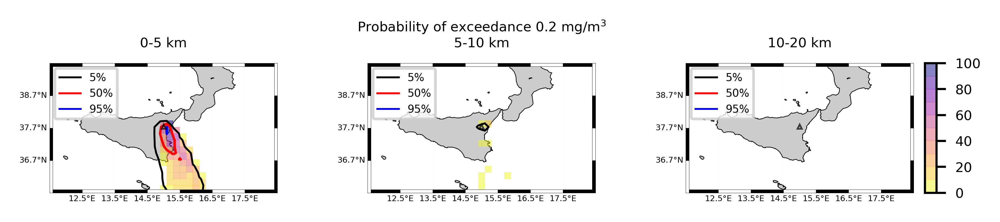

Forecast from VONA_20210216_1631Z
=================================

Contents
========

* [Forecast products](#forecast-products)
	* [Forecast at 2021-02-16 17:30 Z from RED VONA issued at 20210216_1631Z](#forecast-at-2021-02-16-1730-z-from-red-vona-issued-at-20210216_1631z)
	* [Forecast at 2021-02-16 18:30 Z from RED VONA issued at 20210216_1631Z](#forecast-at-2021-02-16-1830-z-from-red-vona-issued-at-20210216_1631z)
	* [Forecast at 2021-02-16 19:30 Z from RED VONA issued at 20210216_1631Z](#forecast-at-2021-02-16-1930-z-from-red-vona-issued-at-20210216_1631z)

# Forecast products

## Forecast at 2021-02-16 17:30 Z from RED VONA issued at 20210216_1631Z
  

|Eruption start [Z]|Eruption end [Z]|Forecast time [Z]|Column height asl [m]|
| :--- | :--- | :--- | :--- |
|2021-02-16 16:30:00|Ongoing|2021-02-16 17:30:00|6000 ± 500 - from VONA|
  
  

|Percentile|MER [kg/s¹]|Mass air [kg]|Mass air nested dom. [kg]|Mass grd [kg]|Mass grd nested dom. [kg]|
| :--- | :--- | :--- | :--- | :--- | :--- |
|5th|1.48e+04|1.80e+07|1.80e+07|3.90e+07|3.90e+07|
|50th|7.79e+04|7.61e+07|7.60e+07|1.78e+08|1.78e+08|
|95th|1.86e+05|1.97e+08|1.97e+08|4.72e+08|4.72e+08|
  

### Ground Nested Domain 2021-02-16 17:30 Z
  
  
  
  
  
  
  
  
  
  
  
  
  
  

|Location|Ground load [kg/m²] 5th perc|Ground load [kg/m²] 50th perc|Ground load [kg/m²] 95th perc|
| :--- | :--- | :--- | :--- |
|Schiena Asino (1)|5.00e-04|1.50e+00|3.03e+00|
|Rif.Vescovo (2)|0.00e+00|5.04e-01|2.97e+00|
|Serra Pituzza (3)|0.00e+00|5.10e-01|3.20e+00|
|Monterosso (4)|0.00e+00|1.55e-05|1.62e+00|
|Cim.Pedara (5)|0.00e+00|8.13e-02|9.29e+00|
|Cim.Viagrande (6)|0.00e+00|2.36e-05|2.30e+00|
|Cim.Mascalucia (7)|0.00e+00|5.12e-03|3.95e+00|
|Cim.Tremestieri (8)|0.00e+00|2.68e-03|3.44e+00|
|Cim.S.Giov.La Punta (9)|0.00e+00|4.47e-04|2.27e+00|
|Cim.Gravina (10)|0.00e+00|3.04e-03|2.58e+00|
|ENI S.Giov.Galermo (11)|0.00e+00|3.79e-03|1.82e+00|
|Bio Piazza Europa (12)|0.00e+00|7.36e-05|1.53e-01|
|INGV-OE (13)|0.00e+00|4.80e-04|1.88e-01|
  

### Atmosphere 2021-02-16 17:30 Z
  

## Forecast at 2021-02-16 18:30 Z from RED VONA issued at 20210216_1631Z
  

|Eruption start [Z]|Eruption end [Z]|Forecast time [Z]|Column height asl [m]|
| :--- | :--- | :--- | :--- |
|2021-02-16 16:30:00|Ongoing|2021-02-16 18:30:00|6000 ± 500 - from VONA|
  
  

|Percentile|MER [kg/s¹]|Mass air [kg]|Mass air nested dom. [kg]|Mass grd [kg]|Mass grd nested dom. [kg]|
| :--- | :--- | :--- | :--- | :--- | :--- |
|5th|2.25e+04|4.31e+07|4.14e+07|1.96e+08|1.95e+08|
|50th|6.17e+04|1.20e+08|9.96e+07|4.10e+08|4.07e+08|
|95th|1.54e+05|2.31e+08|1.95e+08|1.01e+09|1.01e+09|
  

### Ground Nested Domain 2021-02-16 18:30 Z
  
  
  
  
  
  
  
  
  
  
  
  
  
  

|Location|Ground load [kg/m²] 5th perc|Ground load [kg/m²] 50th perc|Ground load [kg/m²] 95th perc|
| :--- | :--- | :--- | :--- |
|Schiena Asino (1)|5.62e-01|2.80e+00|7.90e+00|
|Rif.Vescovo (2)|3.97e-01|1.76e+00|7.39e+00|
|Serra Pituzza (3)|1.98e-01|2.41e+00|1.01e+01|
|Monterosso (4)|1.24e-05|1.66e-01|1.91e+00|
|Cim.Pedara (5)|1.53e-02|1.05e+00|1.47e+01|
|Cim.Viagrande (6)|0.00e+00|1.74e-01|2.62e+00|
|Cim.Mascalucia (7)|2.25e-03|1.31e-01|5.37e+00|
|Cim.Tremestieri (8)|5.77e-03|1.64e-01|4.24e+00|
|Cim.S.Giov.La Punta (9)|1.86e-04|1.29e-01|2.66e+00|
|Cim.Gravina (10)|4.60e-04|9.94e-02|5.97e+00|
|ENI S.Giov.Galermo (11)|3.51e-03|1.32e-01|3.98e+00|
|Bio Piazza Europa (12)|2.65e-04|8.26e-02|8.06e-01|
|INGV-OE (13)|1.68e-03|2.81e-02|1.43e+00|
  

### Atmosphere 2021-02-16 18:30 Z
  

## Forecast at 2021-02-16 19:30 Z from RED VONA issued at 20210216_1631Z
  

|Eruption start [Z]|Eruption end [Z]|Forecast time [Z]|Column height asl [m]|
| :--- | :--- | :--- | :--- |
|2021-02-16 16:30:00|Ongoing|2021-02-16 19:30:00|6000 ± 500 - from VONA|
  
  

|Percentile|MER [kg/s¹]|Mass air [kg]|Mass air nested dom. [kg]|Mass grd [kg]|Mass grd nested dom. [kg]|
| :--- | :--- | :--- | :--- | :--- | :--- |
|5th|1.91e+04|5.07e+07|3.75e+07|4.79e+08|4.78e+08|
|50th|6.72e+04|1.32e+08|9.44e+07|6.65e+08|6.48e+08|
|95th|1.69e+05|2.18e+08|1.97e+08|1.16e+09|1.16e+09|
  

### Ground Nested Domain 2021-02-16 19:30 Z
  
  
  
  
  
  
  
  
  
  
  
  
  
  

|Location|Ground load [kg/m²] 5th perc|Ground load [kg/m²] 50th perc|Ground load [kg/m²] 95th perc|
| :--- | :--- | :--- | :--- |
|Schiena Asino (1)|1.84e+00|4.36e+00|8.89e+00|
|Rif.Vescovo (2)|4.66e-01|2.91e+00|8.22e+00|
|Serra Pituzza (3)|4.00e-01|3.33e+00|1.08e+01|
|Monterosso (4)|3.18e-05|7.34e-01|5.27e+00|
|Cim.Pedara (5)|7.78e-02|1.97e+00|1.60e+01|
|Cim.Viagrande (6)|1.94e-04|6.75e-01|4.82e+00|
|Cim.Mascalucia (7)|9.26e-02|7.98e-01|6.56e+00|
|Cim.Tremestieri (8)|3.57e-02|8.51e-01|4.87e+00|
|Cim.S.Giov.La Punta (9)|2.44e-03|2.68e-01|2.83e+00|
|Cim.Gravina (10)|3.51e-02|7.59e-01|7.13e+00|
|ENI S.Giov.Galermo (11)|3.77e-02|3.59e-01|4.29e+00|
|Bio Piazza Europa (12)|3.29e-03|1.28e-01|9.12e-01|
|INGV-OE (13)|2.33e-02|1.14e-01|1.43e+00|
  

### Atmosphere 2021-02-16 19:30 Z
  
  
Go to [Supplementary page](Supplementary_page.md)  
Go to [Main directory](https://github.com/federicapardini/Real_time_ash_forecast)