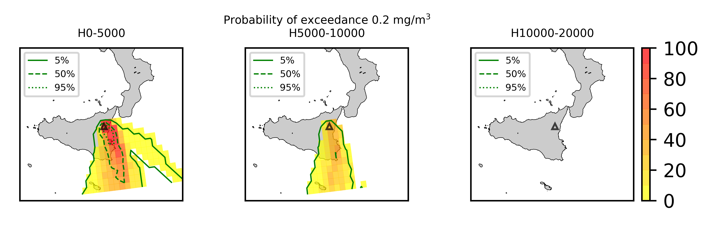
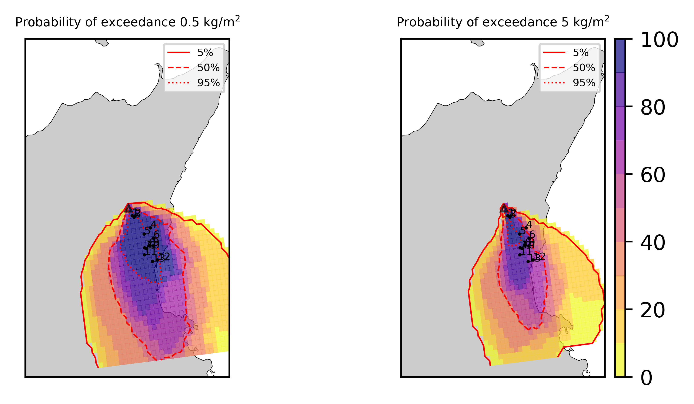
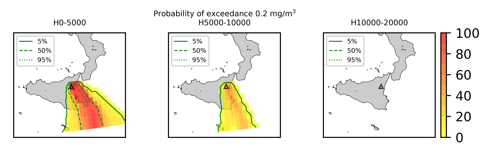

Forecast from VONA_20210216_1631Z
=================================

Contents
========

* [Forecast products](#forecast-products)
	* [Forecast at 2021-02-16 17:30 Z from RED VONA issued at 20210216_1631Z](#forecast-at-2021-02-16-1730-z-from-red-vona-issued-at-20210216_1631z)
	* [Forecast at 2021-02-16 18:30 Z from RED VONA issued at 20210216_1631Z](#forecast-at-2021-02-16-1830-z-from-red-vona-issued-at-20210216_1631z)
	* [Forecast at 2021-02-16 19:30 Z from RED VONA issued at 20210216_1631Z](#forecast-at-2021-02-16-1930-z-from-red-vona-issued-at-20210216_1631z)
	* [Forecast at 2021-02-16 22:30 Z from RED VONA issued at 20210216_1631Z](#forecast-at-2021-02-16-2230-z-from-red-vona-issued-at-20210216_1631z)
	* [Forecast at 2021-02-17 01:30 Z from RED VONA issued at 20210216_1631Z](#forecast-at-2021-02-17-0130-z-from-red-vona-issued-at-20210216_1631z)
	* [Forecast at 2021-02-16 20:40 Z from RED VONA issued at 20210216_1738Z](#forecast-at-2021-02-16-2040-z-from-red-vona-issued-at-20210216_1738z)
	* [Forecast at 2021-02-16 23:40 Z from RED VONA issued at 20210216_1738Z](#forecast-at-2021-02-16-2340-z-from-red-vona-issued-at-20210216_1738z)
	* [Forecast at 2021-02-17 02:40 Z from RED VONA issued at 20210216_1738Z](#forecast-at-2021-02-17-0240-z-from-red-vona-issued-at-20210216_1738z)
	* [Forecast at 2021-02-17 05:40 Z from RED VONA issued at 20210216_1738Z](#forecast-at-2021-02-17-0540-z-from-red-vona-issued-at-20210216_1738z)

# Forecast products

## Forecast at 2021-02-16 17:30 Z from RED VONA issued at 20210216_1631Z
  

|Eruption start [Z]|Eruption end [Z]|Forecast time [Z]|Column height asl [m]|
| :--- | :--- | :--- | :--- |
|2021-02-16 16:30:00|Ongoing|2021-02-16 17:30:00|6000 ± 500 - from VONA|
  
  

|Percentile|MER [kg/s¹]|Mass air [kg]|Mass air nested dom. [kg]|Mass grd [kg]|Mass grd nested dom. [kg]|
| :--- | :--- | :--- | :--- | :--- | :--- |
|5th|1.85e+04|6.81e+07|6.80e+07|2.76e+05|2.84e+05|
|50th|7.76e+04|2.47e+08|2.01e+08|1.08e+07|1.08e+07|
|95th|1.80e+05|5.16e+08|4.60e+08|1.20e+08|1.20e+08|
  

### Ground Nested Domain 2021-02-16 17:30 Z
  
  
  
  
  
  
  
  
  
  
  
  
  
  

|Location|Ground load [kg/m²] 5th perc|Ground load [kg/m²] 50th perc|Ground load [kg/m²] 95th perc|
| :--- | :--- | :--- | :--- |
|Schiena Asino (1)|0.00e+00|8.67e-03|2.61e-01|
|Rif.Vescovo (2)|0.00e+00|6.06e-04|3.10e-01|
|Serra Pituzza (3)|0.00e+00|6.69e-04|4.23e-01|
|Monterosso (4)|0.00e+00|0.00e+00|3.60e-01|
|Cim.Pedara (5)|1.65e-04|2.00e-02|9.81e-01|
|Cim.Viagrande (6)|0.00e+00|0.00e+00|7.86e-02|
|Cim.Mascalucia (7)|0.00e+00|2.97e-03|1.49e-01|
|Cim.Tremestieri (8)|0.00e+00|9.49e-04|1.61e-01|
|Cim.S.Giov.La Punta (9)|0.00e+00|8.86e-05|1.28e-01|
|Cim.Gravina (10)|0.00e+00|2.02e-03|7.39e-02|
|ENI S.Giov.Galermo (11)|0.00e+00|8.61e-04|6.28e-02|
|Bio Piazza Europa (12)|0.00e+00|1.72e-04|4.50e-02|
|INGV-OE (13)|0.00e+00|4.97e-04|3.25e-02|
  

### Atmosphere 2021-02-16 17:30 Z
  

## Forecast at 2021-02-16 18:30 Z from RED VONA issued at 20210216_1631Z
  

|Eruption start [Z]|Eruption end [Z]|Forecast time [Z]|Column height asl [m]|
| :--- | :--- | :--- | :--- |
|2021-02-16 16:30:00|Ongoing|2021-02-16 18:30:00|6000 ± 500 - from VONA|
  
  

|Percentile|MER [kg/s¹]|Mass air [kg]|Mass air nested dom. [kg]|Mass grd [kg]|Mass grd nested dom. [kg]|
| :--- | :--- | :--- | :--- | :--- | :--- |
|5th|1.57e+04|2.04e+08|7.79e+07|4.73e+06|4.74e+06|
|50th|7.13e+04|5.42e+08|3.74e+08|4.03e+07|4.02e+07|
|95th|1.86e+05|8.85e+08|6.14e+08|1.65e+08|1.63e+08|
  

### Ground Nested Domain 2021-02-16 18:30 Z
  
  
  
  
  
  
  
  
  
  
  
  
  
  

|Location|Ground load [kg/m²] 5th perc|Ground load [kg/m²] 50th perc|Ground load [kg/m²] 95th perc|
| :--- | :--- | :--- | :--- |
|Schiena Asino (1)|1.97e-04|3.65e-02|5.43e-01|
|Rif.Vescovo (2)|9.15e-06|4.25e-02|5.75e-01|
|Serra Pituzza (3)|1.28e-05|5.93e-02|7.56e-01|
|Monterosso (4)|0.00e+00|4.08e-03|7.64e-01|
|Cim.Pedara (5)|9.27e-03|9.40e-02|1.33e+00|
|Cim.Viagrande (6)|0.00e+00|6.51e-03|1.77e-01|
|Cim.Mascalucia (7)|3.59e-03|4.60e-02|3.00e-01|
|Cim.Tremestieri (8)|1.65e-03|2.21e-02|3.52e-01|
|Cim.S.Giov.La Punta (9)|1.37e-04|1.44e-02|2.80e-01|
|Cim.Gravina (10)|3.01e-03|3.93e-02|2.09e-01|
|ENI S.Giov.Galermo (11)|5.41e-04|2.87e-02|1.45e-01|
|Bio Piazza Europa (12)|1.15e-04|9.31e-03|1.31e-01|
|INGV-OE (13)|8.10e-04|1.27e-02|7.96e-02|
  

### Atmosphere 2021-02-16 18:30 Z
  

## Forecast at 2021-02-16 19:30 Z from RED VONA issued at 20210216_1631Z
  

|Eruption start [Z]|Eruption end [Z]|Forecast time [Z]|Column height asl [m]|
| :--- | :--- | :--- | :--- |
|2021-02-16 16:30:00|Ongoing|2021-02-16 19:30:00|6000 ± 500 - from VONA|
  
  

|Percentile|MER [kg/s¹]|Mass air [kg]|Mass air nested dom. [kg]|Mass grd [kg]|Mass grd nested dom. [kg]|
| :--- | :--- | :--- | :--- | :--- | :--- |
|5th|1.62e+04|3.60e+08|2.44e+08|1.75e+07|1.74e+07|
|50th|8.47e+04|7.34e+08|4.00e+08|7.83e+07|7.65e+07|
|95th|2.02e+05|1.23e+09|6.62e+08|2.30e+08|2.25e+08|
  

### Ground Nested Domain 2021-02-16 19:30 Z
  
  
  
  
  
  
  
  
  
  
  
  
  
  

|Location|Ground load [kg/m²] 5th perc|Ground load [kg/m²] 50th perc|Ground load [kg/m²] 95th perc|
| :--- | :--- | :--- | :--- |
|Schiena Asino (1)|1.33e-02|1.97e-01|7.32e-01|
|Rif.Vescovo (2)|8.81e-03|2.11e-01|8.50e-01|
|Serra Pituzza (3)|1.23e-02|2.63e-01|1.19e+00|
|Monterosso (4)|3.01e-04|6.73e-03|8.64e-01|
|Cim.Pedara (5)|5.56e-02|1.56e-01|1.49e+00|
|Cim.Viagrande (6)|7.99e-04|2.02e-02|2.12e-01|
|Cim.Mascalucia (7)|1.19e-02|1.17e-01|4.06e-01|
|Cim.Tremestieri (8)|1.91e-02|6.14e-02|4.48e-01|
|Cim.S.Giov.La Punta (9)|9.20e-03|3.31e-02|3.34e-01|
|Cim.Gravina (10)|6.95e-03|7.11e-02|4.13e-01|
|ENI S.Giov.Galermo (11)|8.02e-03|8.67e-02|2.31e-01|
|Bio Piazza Europa (12)|3.03e-03|1.99e-02|1.55e-01|
|INGV-OE (13)|4.92e-03|3.08e-02|1.37e-01|
  

### Atmosphere 2021-02-16 19:30 Z
  

## Forecast at 2021-02-16 22:30 Z from RED VONA issued at 20210216_1631Z
  

|Eruption start [Z]|Eruption end [Z]|Forecast time [Z]|Column height asl [m]|
| :--- | :--- | :--- | :--- |
|2021-02-16 16:30:00|Ongoing|2021-02-16 22:30:00|6000 ± 500 - from VONA|
  
  

|Percentile|MER [kg/s¹]|Mass air [kg]|Mass air nested dom. [kg]|Mass grd [kg]|Mass grd nested dom. [kg]|
| :--- | :--- | :--- | :--- | :--- | :--- |
|5th|1.85e+04|6.22e+08|2.07e+08|5.03e+07|4.38e+07|
|50th|7.06e+04|1.18e+09|4.23e+08|2.80e+08|2.52e+08|
|95th|1.86e+05|1.76e+09|5.97e+08|5.00e+08|4.59e+08|
  

### Ground Nested Domain 2021-02-16 22:30 Z
  
  
  
  
  
  
  
  
  
  
  
  
  
  

|Location|Ground load [kg/m²] 5th perc|Ground load [kg/m²] 50th perc|Ground load [kg/m²] 95th perc|
| :--- | :--- | :--- | :--- |
|Schiena Asino (1)|1.51e-02|4.04e-01|3.74e+00|
|Rif.Vescovo (2)|8.82e-03|4.51e-01|4.39e+00|
|Serra Pituzza (3)|1.23e-02|5.92e-01|6.01e+00|
|Monterosso (4)|9.81e-04|2.87e-02|1.14e+00|
|Cim.Pedara (5)|1.01e-01|4.31e-01|2.13e+00|
|Cim.Viagrande (6)|2.72e-03|4.00e-02|4.79e-01|
|Cim.Mascalucia (7)|8.95e-02|4.15e-01|1.25e+00|
|Cim.Tremestieri (8)|5.91e-02|2.67e-01|6.84e-01|
|Cim.S.Giov.La Punta (9)|2.54e-02|1.16e-01|6.32e-01|
|Cim.Gravina (10)|7.70e-02|3.36e-01|1.19e+00|
|ENI S.Giov.Galermo (11)|4.57e-02|2.33e-01|7.29e-01|
|Bio Piazza Europa (12)|2.63e-02|8.97e-02|3.10e-01|
|INGV-OE (13)|2.36e-02|1.01e-01|4.74e-01|
  

### Atmosphere 2021-02-16 22:30 Z
  

## Forecast at 2021-02-17 01:30 Z from RED VONA issued at 20210216_1631Z
  

|Eruption start [Z]|Eruption end [Z]|Forecast time [Z]|Column height asl [m]|
| :--- | :--- | :--- | :--- |
|2021-02-16 16:30:00|Ongoing|2021-02-17 01:30:00|6000 ± 500 - from VONA|
  
  

|Percentile|MER [kg/s¹]|Mass air [kg]|Mass air nested dom. [kg]|Mass grd [kg]|Mass grd nested dom. [kg]|
| :--- | :--- | :--- | :--- | :--- | :--- |
|5th|1.30e+04|6.42e+08|2.44e+08|1.08e+08|9.32e+07|
|50th|5.80e+04|1.14e+09|4.49e+08|5.02e+08|4.05e+08|
|95th|1.06e+05|1.61e+09|7.00e+08|7.23e+08|6.02e+08|
  

### Ground Nested Domain 2021-02-17 01:30 Z
  
  
  
  
  
  
  
  
  
  
  
  
  
  

|Location|Ground load [kg/m²] 5th perc|Ground load [kg/m²] 50th perc|Ground load [kg/m²] 95th perc|
| :--- | :--- | :--- | :--- |
|Schiena Asino (1)|5.01e-02|4.84e-01|4.07e+00|
|Rif.Vescovo (2)|5.26e-02|5.31e-01|4.60e+00|
|Serra Pituzza (3)|7.24e-02|7.07e-01|6.19e+00|
|Monterosso (4)|3.87e-02|3.58e-01|1.63e+00|
|Cim.Pedara (5)|3.69e-01|1.01e+00|2.65e+00|
|Cim.Viagrande (6)|7.90e-02|3.31e-01|9.26e-01|
|Cim.Mascalucia (7)|1.43e-01|7.06e-01|1.76e+00|
|Cim.Tremestieri (8)|1.40e-01|5.32e-01|1.39e+00|
|Cim.S.Giov.La Punta (9)|1.08e-01|3.57e-01|9.70e-01|
|Cim.Gravina (10)|1.33e-01|5.26e-01|1.78e+00|
|ENI S.Giov.Galermo (11)|6.99e-02|4.35e-01|8.92e-01|
|Bio Piazza Europa (12)|4.03e-02|1.93e-01|5.48e-01|
|INGV-OE (13)|5.23e-02|2.13e-01|6.26e-01|
  

### Atmosphere 2021-02-17 01:30 Z
  

## Forecast at 2021-02-16 20:40 Z from RED VONA issued at 20210216_1738Z
  

|Eruption start [Z]|Eruption end [Z]|Forecast time [Z]|Column height asl [m]|
| :--- | :--- | :--- | :--- |
|2021-02-16 16:30:00|Ongoing|2021-02-16 20:40:00|[6000 m, 12000 m]|
  
  

|Percentile|MER [kg/s¹]|Mass air [kg]|Mass air nested dom. [kg]|Mass grd [kg]|Mass grd nested dom. [kg]|
| :--- | :--- | :--- | :--- | :--- | :--- |
|5th|3.98e+04|9.63e+08|5.22e+08|2.68e+07|2.62e+07|
|50th|5.06e+05|3.61e+09|1.20e+09|4.10e+08|3.76e+08|
|95th|5.05e+06|3.64e+10|1.11e+10|7.76e+09|6.99e+09|
  

### Ground Nested Domain 2021-02-16 20:40 Z
  
  
  
  
  
  
  
  
  
  
  
  
  
  

|Location|Ground load [kg/m²] 5th perc|Ground load [kg/m²] 50th perc|Ground load [kg/m²] 95th perc|
| :--- | :--- | :--- | :--- |
|Schiena Asino (1)|6.62e-03|1.75e-01|4.63e+00|
|Rif.Vescovo (2)|4.06e-04|1.63e-01|5.65e+00|
|Serra Pituzza (3)|5.07e-04|1.91e-01|7.88e+00|
|Monterosso (4)|6.70e-05|2.93e-02|3.38e+00|
|Cim.Pedara (5)|2.28e-02|4.12e-01|2.75e+01|
|Cim.Viagrande (6)|3.55e-04|9.17e-03|5.94e+00|
|Cim.Mascalucia (7)|1.86e-02|3.83e-01|5.90e+00|
|Cim.Tremestieri (8)|5.09e-03|1.35e-01|1.10e+01|
|Cim.S.Giov.La Punta (9)|1.58e-03|5.35e-02|1.32e+01|
|Cim.Gravina (10)|1.33e-02|1.75e-01|6.43e+00|
|ENI S.Giov.Galermo (11)|1.59e-03|2.36e-01|6.07e+00|
|Bio Piazza Europa (12)|4.85e-04|4.51e-02|1.24e+01|
|INGV-OE (13)|1.24e-03|9.10e-02|7.95e+00|
  

### Atmosphere 2021-02-16 20:40 Z
  

## Forecast at 2021-02-16 23:40 Z from RED VONA issued at 20210216_1738Z
  

|Eruption start [Z]|Eruption end [Z]|Forecast time [Z]|Column height asl [m]|
| :--- | :--- | :--- | :--- |
|2021-02-16 16:30:00|Ongoing|2021-02-16 23:40:00|[6000 m, 12000 m]|
  
  

|Percentile|MER [kg/s¹]|Mass air [kg]|Mass air nested dom. [kg]|Mass grd [kg]|Mass grd nested dom. [kg]|
| :--- | :--- | :--- | :--- | :--- | :--- |
|5th|8.57e+04|2.04e+09|6.77e+08|2.29e+08|1.85e+08|
|50th|3.83e+05|5.27e+09|1.64e+09|1.50e+09|1.18e+09|
|95th|5.57e+06|2.50e+10|7.29e+09|1.42e+10|1.08e+10|
  

### Ground Nested Domain 2021-02-16 23:40 Z
  
  
  
  
  
  
  
  
  
  
  
  
  
  

|Location|Ground load [kg/m²] 5th perc|Ground load [kg/m²] 50th perc|Ground load [kg/m²] 95th perc|
| :--- | :--- | :--- | :--- |
|Schiena Asino (1)|1.74e-02|3.87e-01|9.31e+00|
|Rif.Vescovo (2)|4.23e-03|2.76e-01|9.99e+00|
|Serra Pituzza (3)|5.86e-03|3.23e-01|1.40e+01|
|Monterosso (4)|1.71e-02|6.11e-01|1.45e+01|
|Cim.Pedara (5)|1.75e-01|4.67e+00|3.29e+01|
|Cim.Viagrande (6)|4.55e-02|6.00e-01|9.97e+00|
|Cim.Mascalucia (7)|4.87e-01|2.86e+00|9.91e+00|
|Cim.Tremestieri (8)|1.55e-01|2.17e+00|1.36e+01|
|Cim.S.Giov.La Punta (9)|8.02e-02|1.19e+00|1.65e+01|
|Cim.Gravina (10)|2.79e-01|2.87e+00|1.06e+01|
|ENI S.Giov.Galermo (11)|1.44e-01|1.83e+00|1.13e+01|
|Bio Piazza Europa (12)|2.32e-02|1.16e+00|1.49e+01|
|INGV-OE (13)|3.80e-02|1.35e+00|8.99e+00|
  

### Atmosphere 2021-02-16 23:40 Z
  

## Forecast at 2021-02-17 02:40 Z from RED VONA issued at 20210216_1738Z
  

|Eruption start [Z]|Eruption end [Z]|Forecast time [Z]|Column height asl [m]|
| :--- | :--- | :--- | :--- |
|2021-02-16 16:30:00|Ongoing|2021-02-17 02:40:00|[6000 m, 12000 m]|
  
  

|Percentile|MER [kg/s¹]|Mass air [kg]|Mass air nested dom. [kg]|Mass grd [kg]|Mass grd nested dom. [kg]|
| :--- | :--- | :--- | :--- | :--- | :--- |
|5th|5.30e+04|2.74e+09|1.00e+09|5.83e+08|5.38e+08|
|50th|3.86e+05|5.73e+09|1.92e+09|2.02e+09|1.70e+09|
|95th|7.35e+06|3.48e+10|9.09e+09|1.87e+10|1.39e+10|
  

### Ground Nested Domain 2021-02-17 02:40 Z
  
  
  
  
  
  
  
  
  
  
  
  
  
  

|Location|Ground load [kg/m²] 5th perc|Ground load [kg/m²] 50th perc|Ground load [kg/m²] 95th perc|
| :--- | :--- | :--- | :--- |
|Schiena Asino (1)|7.70e-02|8.38e-01|1.04e+01|
|Rif.Vescovo (2)|7.73e-02|9.90e-01|1.15e+01|
|Serra Pituzza (3)|9.69e-02|9.60e-01|1.40e+01|
|Monterosso (4)|1.65e-01|2.12e+00|1.83e+01|
|Cim.Pedara (5)|4.56e-01|7.18e+00|5.53e+01|
|Cim.Viagrande (6)|3.54e-01|3.02e+00|1.36e+01|
|Cim.Mascalucia (7)|6.60e-01|3.85e+00|2.14e+01|
|Cim.Tremestieri (8)|2.92e-01|4.72e+00|2.36e+01|
|Cim.S.Giov.La Punta (9)|3.91e-01|3.37e+00|2.09e+01|
|Cim.Gravina (10)|4.13e-01|3.94e+00|1.91e+01|
|ENI S.Giov.Galermo (11)|3.41e-01|2.66e+00|2.19e+01|
|Bio Piazza Europa (12)|2.51e-01|1.60e+00|1.61e+01|
|INGV-OE (13)|2.11e-01|1.83e+00|1.75e+01|
  

### Atmosphere 2021-02-17 02:40 Z
  

## Forecast at 2021-02-17 05:40 Z from RED VONA issued at 20210216_1738Z
  

|Eruption start [Z]|Eruption end [Z]|Forecast time [Z]|Column height asl [m]|
| :--- | :--- | :--- | :--- |
|2021-02-16 16:30:00|Ongoing|2021-02-17 05:40:00|[6000 m, 12000 m]|
  
  

|Percentile|MER [kg/s¹]|Mass air [kg]|Mass air nested dom. [kg]|Mass grd [kg]|Mass grd nested dom. [kg]|
| :--- | :--- | :--- | :--- | :--- | :--- |
|5th|6.41e+04|2.36e+09|9.67e+08|8.30e+08|7.63e+08|
|50th|3.84e+05|5.66e+09|2.34e+09|3.03e+09|2.43e+09|
|95th|6.85e+06|2.50e+10|7.54e+09|2.15e+10|1.52e+10|
  

### Ground Nested Domain 2021-02-17 05:40 Z
  
  
  
  
  
  
  
  
  
  
  
  
  
  

|Location|Ground load [kg/m²] 5th perc|Ground load [kg/m²] 50th perc|Ground load [kg/m²] 95th perc|
| :--- | :--- | :--- | :--- |
|Schiena Asino (1)|1.46e-01|1.85e+00|1.26e+01|
|Rif.Vescovo (2)|1.53e-01|2.09e+00|1.59e+01|
|Serra Pituzza (3)|1.86e-01|2.54e+00|1.97e+01|
|Monterosso (4)|2.93e-01|5.55e+00|1.89e+01|
|Cim.Pedara (5)|2.61e+00|1.23e+01|6.21e+01|
|Cim.Viagrande (6)|9.35e-01|5.12e+00|2.05e+01|
|Cim.Mascalucia (7)|1.31e+00|5.28e+00|2.50e+01|
|Cim.Tremestieri (8)|8.49e-01|6.13e+00|2.66e+01|
|Cim.S.Giov.La Punta (9)|5.83e-01|4.41e+00|2.47e+01|
|Cim.Gravina (10)|1.20e+00|5.64e+00|2.28e+01|
|ENI S.Giov.Galermo (11)|6.35e-01|3.55e+00|2.37e+01|
|Bio Piazza Europa (12)|3.65e-01|2.03e+00|1.64e+01|
|INGV-OE (13)|4.66e-01|2.37e+00|1.97e+01|
  

### Atmosphere 2021-02-17 05:40 Z
  
  
Go to [Supplementary page](Supplementary_page.md)  
Go to [Main directory](https://github.com/federicapardini/Real_time_ash_forecast)