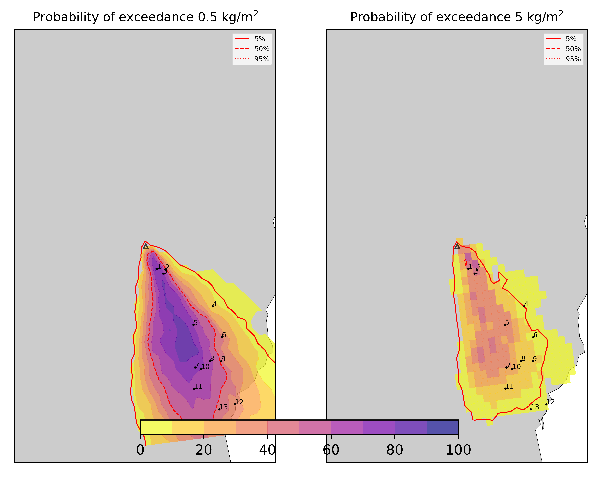
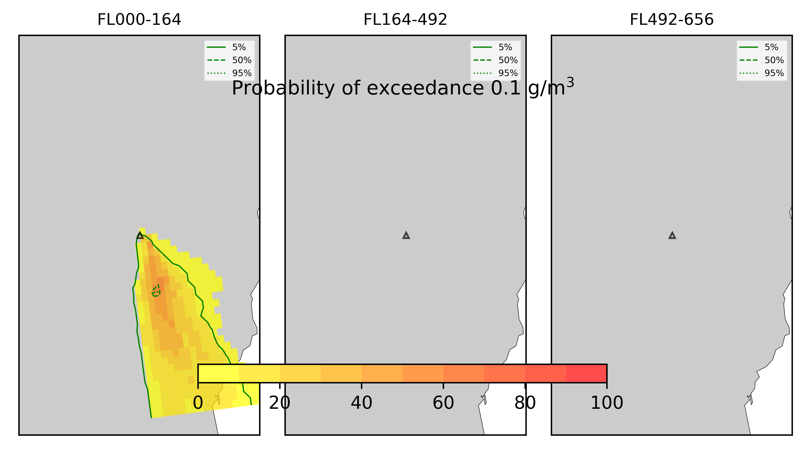
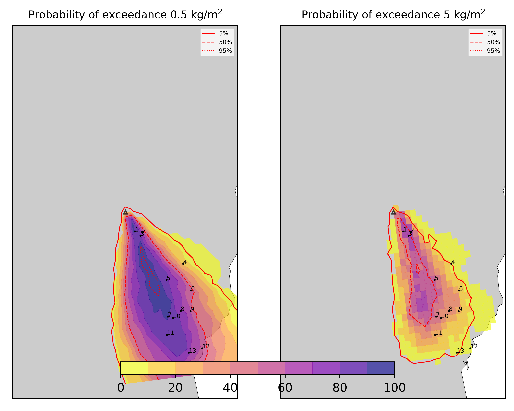
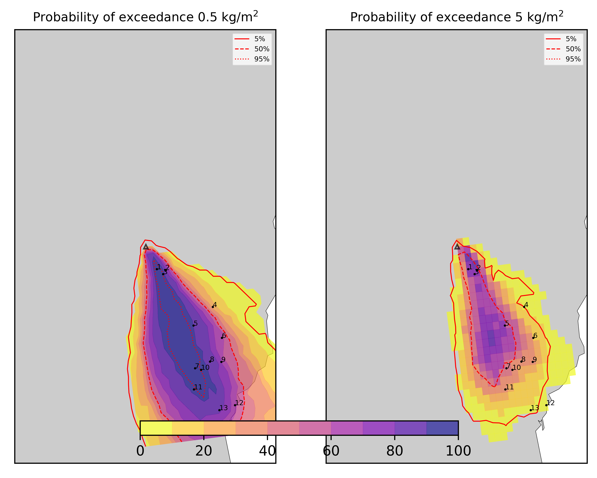
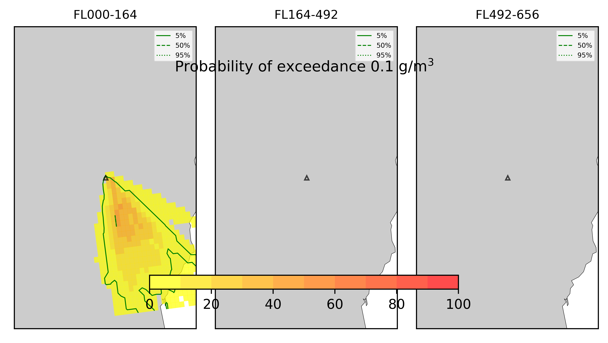

Forecast from VONA bulletin - 20210216_1631Z
============================================

Contents
========

* [Forecast products](#forecast-products)
	* [Forecast at 2021-02-16 18:30 Z - Ongoing Eruption](#forecast-at-2021-02-16-1830-z---ongoing-eruption)
	* [Forecast at 2021-02-16 20:30 Z - Ongoing Eruption](#forecast-at-2021-02-16-2030-z---ongoing-eruption)
	* [Forecast at 2021-02-16 22:30 Z - Ongoing Eruption](#forecast-at-2021-02-16-2230-z---ongoing-eruption)
	* [Forecast at 2021-02-17 00:30 Z - Ongoing Eruption](#forecast-at-2021-02-17-0030-z---ongoing-eruption)

# Forecast products

## Forecast at 2021-02-16 18:30 Z - Ongoing Eruption
  

|Eruption start [Z]|Eruption end [Z]|Forecast time [Z]|Column height asl [m]|
| :--- | :--- | :--- | :--- |
|2021-02-16 16:30:00|Ongoing|2021-02-16 18:30:00|6000 ± 500 - from VONA|
  
  

|Percentile|MER [kg/s¹]|Mass in the air [kg]|Mass on the ground [kg]|
| :--- | :--- | :--- | :--- |
|5th|1.25e+04|1.25e+07|7.76e+07|
|50th|7.29e+04|6.66e+07|3.88e+08|
|95th|1.73e+05|1.92e+08|8.19e+08|
  

### Ground 2021-02-16 18:30 Z
  
  
  
  
  
  
  
  
  
  
  
  
  
  

|Location|Ground load [kg/m²] 5th perc|Ground load [kg/m²] 50th perc|Ground load [kg/m²] 95th perc|
| :--- | :--- | :--- | :--- |
|Schiena Asino (1)|1.49e-05|2.72e+00|1.93e+01|
|Rif.Vescovo (2)|0.00e+00|7.01e-02|1.24e+01|
|Serra Pituzza (3)|0.00e+00|8.29e-01|1.67e+01|
|Monterosso (4)|0.00e+00|9.75e-05|1.77e+00|
|Cim.Pedara (5)|0.00e+00|2.16e-01|9.31e+00|
|Cim.Viagrande (6)|0.00e+00|1.07e-03|5.40e+00|
|Cim.Mascalucia (7)|0.00e+00|4.90e-01|5.60e+00|
|Cim.Tremestieri (8)|0.00e+00|1.21e-01|7.94e+00|
|Cim.S.Giov.La Punta (9)|0.00e+00|2.95e-02|6.92e+00|
|Cim.Gravina (10)|0.00e+00|4.39e-01|5.23e+00|
|ENI S.Giov.Galermo (11)|0.00e+00|2.03e-01|3.96e+00|
|Bio Piazza Europa (12)|0.00e+00|3.54e-02|1.39e+00|
|INGV-OE (13)|0.00e+00|1.00e-01|1.58e+00|
  

### Atmosphere 2021-02-16 18:30 Z
  

## Forecast at 2021-02-16 20:30 Z - Ongoing Eruption
  

|Eruption start [Z]|Eruption end [Z]|Forecast time [Z]|Column height asl [m]|
| :--- | :--- | :--- | :--- |
|2021-02-16 16:30:00|Ongoing|2021-02-16 20:30:00|6000 ± 500 - from VONA|
  
  

|Percentile|MER [kg/s¹]|Mass in the air [kg]|Mass on the ground [kg]|
| :--- | :--- | :--- | :--- |
|5th|1.63e+04|1.55e+07|1.59e+08|
|50th|7.56e+04|6.36e+07|7.55e+08|
|95th|1.80e+05|1.81e+08|1.22e+09|
  

### Ground 2021-02-16 20:30 Z
  
  
  
  
  
  
  
  
  
  
  
  
  
  

|Location|Ground load [kg/m²] 5th perc|Ground load [kg/m²] 50th perc|Ground load [kg/m²] 95th perc|
| :--- | :--- | :--- | :--- |
|Schiena Asino (1)|5.72e-01|5.30e+00|2.68e+01|
|Rif.Vescovo (2)|1.40e-03|4.89e+00|1.58e+01|
|Serra Pituzza (3)|6.03e-02|5.11e+00|2.80e+01|
|Monterosso (4)|3.61e-05|7.27e-03|3.08e+00|
|Cim.Pedara (5)|6.59e-02|2.28e+00|1.04e+01|
|Cim.Viagrande (6)|9.63e-04|2.74e-01|7.49e+00|
|Cim.Mascalucia (7)|8.22e-02|2.43e+00|9.23e+00|
|Cim.Tremestieri (8)|2.90e-02|1.44e+00|1.05e+01|
|Cim.S.Giov.La Punta (9)|7.86e-03|4.98e-01|6.71e+00|
|Cim.Gravina (10)|1.16e-01|1.41e+00|8.51e+00|
|ENI S.Giov.Galermo (11)|1.46e-02|1.48e+00|9.40e+00|
|Bio Piazza Europa (12)|1.68e-02|2.32e-01|3.49e+00|
|INGV-OE (13)|1.25e-02|4.34e-01|4.06e+00|
  

### Atmosphere 2021-02-16 20:30 Z
  

## Forecast at 2021-02-16 22:30 Z - Ongoing Eruption
  

|Eruption start [Z]|Eruption end [Z]|Forecast time [Z]|Column height asl [m]|
| :--- | :--- | :--- | :--- |
|2021-02-16 16:30:00|Ongoing|2021-02-16 22:30:00|6000 ± 500 - from VONA|
  
  

|Percentile|MER [kg/s¹]|Mass in the air [kg]|Mass on the ground [kg]|
| :--- | :--- | :--- | :--- |
|5th|5.90e+03|1.41e+07|3.40e+08|
|50th|6.75e+04|5.74e+07|1.14e+09|
|95th|1.60e+05|1.56e+08|1.70e+09|
  

### Ground 2021-02-16 22:30 Z
  
  
  
  
  
  
  
  
  
  
  
  
  
  

|Location|Ground load [kg/m²] 5th perc|Ground load [kg/m²] 50th perc|Ground load [kg/m²] 95th perc|
| :--- | :--- | :--- | :--- |
|Schiena Asino (1)|2.98e+00|1.26e+01|2.74e+01|
|Rif.Vescovo (2)|8.21e-03|6.55e+00|2.39e+01|
|Serra Pituzza (3)|7.79e-02|1.03e+01|3.12e+01|
|Monterosso (4)|5.55e-05|4.74e-02|3.02e+00|
|Cim.Pedara (5)|1.09e-01|3.94e+00|1.48e+01|
|Cim.Viagrande (6)|2.83e-03|6.14e-01|9.43e+00|
|Cim.Mascalucia (7)|2.48e-01|4.08e+00|1.19e+01|
|Cim.Tremestieri (8)|1.98e-01|2.62e+00|1.16e+01|
|Cim.S.Giov.La Punta (9)|3.36e-02|7.28e-01|9.32e+00|
|Cim.Gravina (10)|1.98e-01|3.40e+00|1.10e+01|
|ENI S.Giov.Galermo (11)|1.14e-01|2.93e+00|9.47e+00|
|Bio Piazza Europa (12)|6.02e-02|7.22e-01|3.64e+00|
|INGV-OE (13)|5.83e-02|8.56e-01|5.08e+00|
  

### Atmosphere 2021-02-16 22:30 Z
  

## Forecast at 2021-02-17 00:30 Z - Ongoing Eruption
  

|Eruption start [Z]|Eruption end [Z]|Forecast time [Z]|Column height asl [m]|
| :--- | :--- | :--- | :--- |
|2021-02-16 16:30:00|Ongoing|2021-02-17 00:30:00|6000 ± 500 - from VONA|
  
  

|Percentile|MER [kg/s¹]|Mass in the air [kg]|Mass on the ground [kg]|
| :--- | :--- | :--- | :--- |
|5th|8.83e+03|1.89e+07|7.52e+08|
|50th|5.40e+04|5.89e+07|1.38e+09|
|95th|1.35e+05|1.38e+08|2.01e+09|
  

### Ground 2021-02-17 00:30 Z
  
  
  
  
  
  
  
  
  
  
  
  
  
  

|Location|Ground load [kg/m²] 5th perc|Ground load [kg/m²] 50th perc|Ground load [kg/m²] 95th perc|
| :--- | :--- | :--- | :--- |
|Schiena Asino (1)|3.34e+00|1.71e+01|4.07e+01|
|Rif.Vescovo (2)|2.90e-01|1.05e+01|2.93e+01|
|Serra Pituzza (3)|2.25e+00|1.46e+01|3.34e+01|
|Monterosso (4)|3.89e-04|1.82e-01|3.02e+00|
|Cim.Pedara (5)|2.01e-01|5.51e+00|1.95e+01|
|Cim.Viagrande (6)|6.65e-03|8.08e-01|1.13e+01|
|Cim.Mascalucia (7)|1.11e+00|4.35e+00|1.58e+01|
|Cim.Tremestieri (8)|2.05e-01|2.86e+00|1.16e+01|
|Cim.S.Giov.La Punta (9)|5.28e-02|1.57e+00|8.39e+00|
|Cim.Gravina (10)|5.52e-01|3.56e+00|1.11e+01|
|ENI S.Giov.Galermo (11)|5.06e-01|3.43e+00|9.98e+00|
|Bio Piazza Europa (12)|1.13e-01|7.41e-01|3.70e+00|
|INGV-OE (13)|1.90e-01|9.80e-01|5.24e+00|
  

### Atmosphere 2021-02-17 00:30 Z
  
  
Go to [Supplementary page](Supplementary_page.md)  
Go to [Main directory](https://github.com/federicapardini/Real_time_ash_forecast)