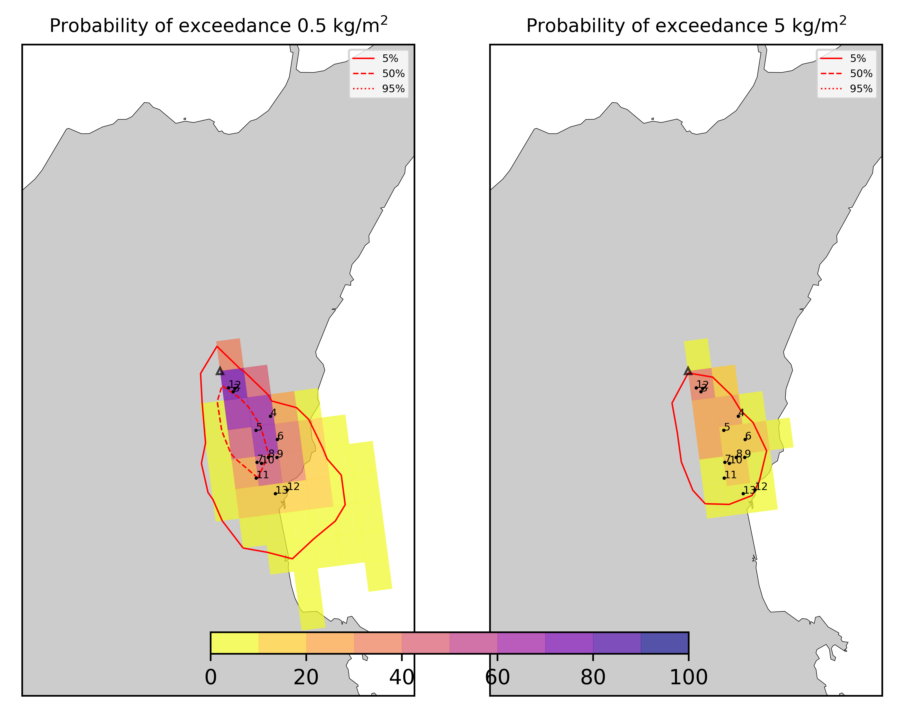
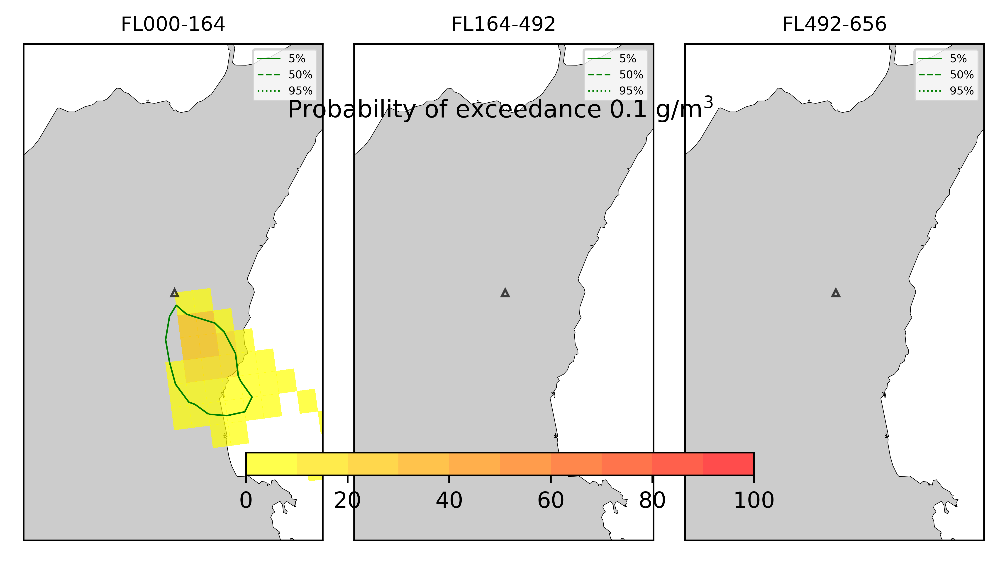
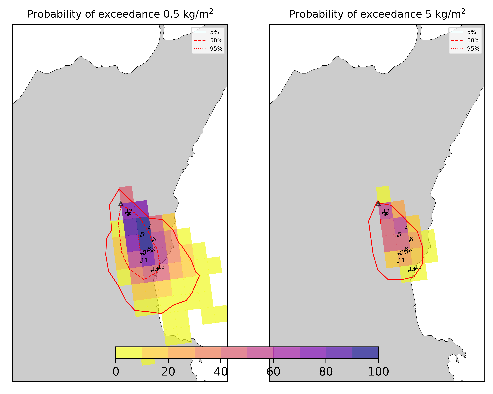
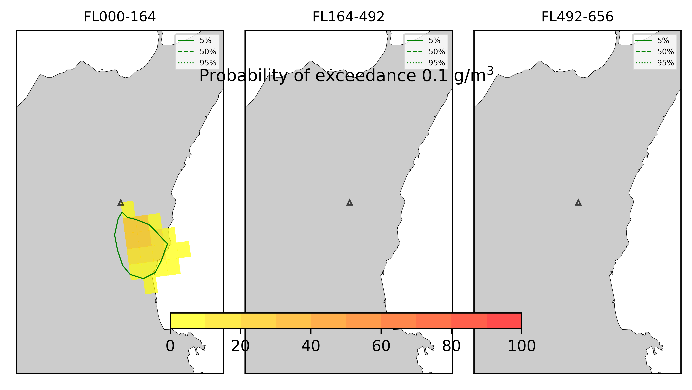
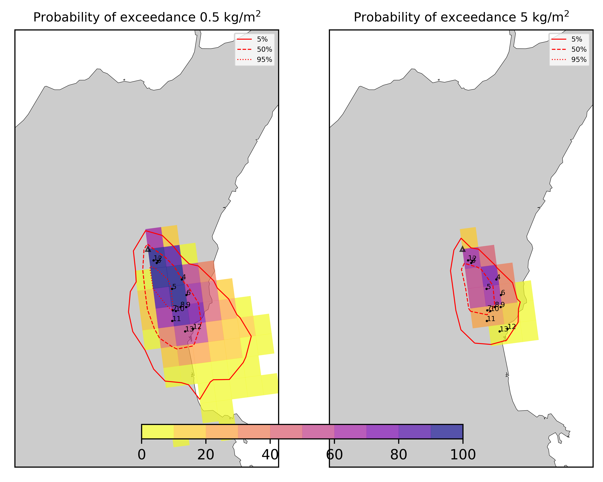

Forecast from VONA bulletin - 20210216_1631Z
============================================

Contents
========

* [Forecast products](#forecast-products)
	* [Forecast at 2021-02-16 19:30 Z - Ongoing Eruption](#forecast-at-2021-02-16-1930-z---ongoing-eruption)
	* [Forecast at 2021-02-16 22:30 Z - Ongoing Eruption](#forecast-at-2021-02-16-2230-z---ongoing-eruption)
	* [Forecast at 2021-02-17 01:30 Z - Ongoing Eruption](#forecast-at-2021-02-17-0130-z---ongoing-eruption)

# Forecast products

## Forecast at 2021-02-16 19:30 Z - Ongoing Eruption
  

|Eruption start [Z]|Eruption end [Z]|Forecast time [Z]|Column height asl [m]|
| :--- | :--- | :--- | :--- |
|2021-02-16 16:30:00|Ongoing|2021-02-16 19:30:00|6000 ± 500 - from VONA|
  
  

|Percentile|MER [kg/s¹]|Mass in the air [kg]|Mass on the ground [kg]|
| :--- | :--- | :--- | :--- |
|5th|1.81e+04|1.25e+07|1.68e+08|
|50th|7.56e+04|8.16e+07|6.96e+08|
|95th|1.96e+05|2.57e+08|1.59e+09|
  

### Ground 2021-02-16 19:30 Z
  
  
  
  
  
  
  
  
  
  
  
  
  
  

|Location|Ground load [kg/m²] 5th perc|Ground load [kg/m²] 50th perc|Ground load [kg/m²] 95th perc|
| :--- | :--- | :--- | :--- |
|Schiena Asino (1)|9.07e-05|1.47e+00|5.87e+00|
|Rif.Vescovo (2)|3.60e-01|1.53e+00|4.81e+00|
|Serra Pituzza (3)|3.92e-01|1.72e+00|5.64e+00|
|Monterosso (4)|7.97e-03|4.69e-01|6.89e+00|
|Cim.Pedara (5)|4.62e-02|2.26e+00|7.44e+00|
|Cim.Viagrande (6)|0.00e+00|6.17e-02|1.09e+01|
|Cim.Mascalucia (7)|1.46e-02|1.26e+00|1.04e+01|
|Cim.Tremestieri (8)|1.66e-02|1.10e+00|7.95e+00|
|Cim.S.Giov.La Punta (9)|1.04e-03|4.06e-01|9.49e+00|
|Cim.Gravina (10)|2.34e-02|1.33e+00|8.00e+00|
|ENI S.Giov.Galermo (11)|1.00e-02|8.31e-01|6.48e+00|
|Bio Piazza Europa (12)|2.78e-05|1.17e-01|5.45e+00|
|INGV-OE (13)|8.54e-04|2.27e-01|4.96e+00|
  

### Atmosphere 2021-02-16 19:30 Z
  

## Forecast at 2021-02-16 22:30 Z - Ongoing Eruption
  

|Eruption start [Z]|Eruption end [Z]|Forecast time [Z]|Column height asl [m]|
| :--- | :--- | :--- | :--- |
|2021-02-16 16:30:00|Ongoing|2021-02-16 22:30:00|6000 ± 500 - from VONA|
  
  

|Percentile|MER [kg/s¹]|Mass in the air [kg]|Mass on the ground [kg]|
| :--- | :--- | :--- | :--- |
|5th|2.27e+04|9.15e+06|5.28e+08|
|50th|6.65e+04|1.05e+08|1.17e+09|
|95th|1.50e+05|1.79e+08|2.35e+09|
  

### Ground 2021-02-16 22:30 Z
  
  
  
  
  
  
  
  
  
  
  
  
  
  

|Location|Ground load [kg/m²] 5th perc|Ground load [kg/m²] 50th perc|Ground load [kg/m²] 95th perc|
| :--- | :--- | :--- | :--- |
|Schiena Asino (1)|1.01e-02|3.16e+00|9.52e+00|
|Rif.Vescovo (2)|7.20e-01|2.84e+00|7.36e+00|
|Serra Pituzza (3)|7.84e-01|3.28e+00|8.62e+00|
|Monterosso (4)|9.59e-02|1.19e+00|7.92e+00|
|Cim.Pedara (5)|5.56e-01|4.64e+00|9.53e+00|
|Cim.Viagrande (6)|9.62e-04|4.26e-01|1.03e+01|
|Cim.Mascalucia (7)|5.98e-01|3.73e+00|1.30e+01|
|Cim.Tremestieri (8)|3.49e-01|3.08e+00|1.27e+01|
|Cim.S.Giov.La Punta (9)|4.59e-02|8.36e-01|1.50e+01|
|Cim.Gravina (10)|4.75e-01|3.80e+00|1.16e+01|
|ENI S.Giov.Galermo (11)|3.94e-01|3.06e+00|7.64e+00|
|Bio Piazza Europa (12)|1.32e-02|5.87e-01|7.04e+00|
|INGV-OE (13)|6.66e-02|1.21e+00|5.93e+00|
  

### Atmosphere 2021-02-16 22:30 Z
  

## Forecast at 2021-02-17 01:30 Z - Ongoing Eruption
  

|Eruption start [Z]|Eruption end [Z]|Forecast time [Z]|Column height asl [m]|
| :--- | :--- | :--- | :--- |
|2021-02-16 16:30:00|Ongoing|2021-02-17 01:30:00|6000 ± 500 - from VONA|
  
  

|Percentile|MER [kg/s¹]|Mass in the air [kg]|Mass on the ground [kg]|
| :--- | :--- | :--- | :--- |
|5th|1.50e+04|1.42e+07|8.37e+08|
|50th|5.75e+04|7.35e+07|1.76e+09|
|95th|1.32e+05|1.77e+08|3.16e+09|
  

### Ground 2021-02-17 01:30 Z
  
  
  
  
  
  
  
  
  
  
  
  
  
  

|Location|Ground load [kg/m²] 5th perc|Ground load [kg/m²] 50th perc|Ground load [kg/m²] 95th perc|
| :--- | :--- | :--- | :--- |
|Schiena Asino (1)|6.77e-01|5.33e+00|1.10e+01|
|Rif.Vescovo (2)|1.92e+00|4.66e+00|8.74e+00|
|Serra Pituzza (3)|2.13e+00|5.45e+00|1.03e+01|
|Monterosso (4)|4.22e-01|2.04e+00|1.06e+01|
|Cim.Pedara (5)|2.46e+00|6.91e+00|1.42e+01|
|Cim.Viagrande (6)|3.63e-02|1.42e+00|1.35e+01|
|Cim.Mascalucia (7)|1.17e+00|5.89e+00|1.63e+01|
|Cim.Tremestieri (8)|8.32e-01|4.29e+00|1.48e+01|
|Cim.S.Giov.La Punta (9)|2.74e-01|1.54e+00|1.59e+01|
|Cim.Gravina (10)|1.05e+00|5.15e+00|1.51e+01|
|ENI S.Giov.Galermo (11)|6.28e-01|4.22e+00|1.00e+01|
|Bio Piazza Europa (12)|9.94e-02|8.70e-01|7.02e+00|
|INGV-OE (13)|1.99e-01|1.65e+00|6.70e+00|
  

### Atmosphere 2021-02-17 01:30 Z
  
  
Go to [Supplementary page](Supplementary_page.md)  
Go to [Main directory](https://github.com/federicapardini/Real_time_ash_forecast)