Forecast from VONA_20210216_1631Z
=================================

Contents
========

* [Forecast products](#forecast-products)
	* [Forecast at 2021-02-16 17:30 Z from RED VONA issued at 20210216_1631Z](#forecast-at-2021-02-16-1730-z-from-red-vona-issued-at-20210216_1631z)
	* [Forecast at 2021-02-16 18:30 Z from RED VONA issued at 20210216_1631Z](#forecast-at-2021-02-16-1830-z-from-red-vona-issued-at-20210216_1631z)
	* [Forecast at 2021-02-16 19:30 Z from RED VONA issued at 20210216_1631Z](#forecast-at-2021-02-16-1930-z-from-red-vona-issued-at-20210216_1631z)
	* [Forecast at 2021-02-16 22:30 Z from RED VONA issued at 20210216_1631Z](#forecast-at-2021-02-16-2230-z-from-red-vona-issued-at-20210216_1631z)
	* [Forecast at 2021-02-16 20:10 Z from RED VONA issued at 20210216_1705Z](#forecast-at-2021-02-16-2010-z-from-red-vona-issued-at-20210216_1705z)
	* [Forecast at 2021-02-16 23:10 Z from RED VONA issued at 20210216_1705Z](#forecast-at-2021-02-16-2310-z-from-red-vona-issued-at-20210216_1705z)
	* [Forecast at 2021-02-17 02:10 Z from RED VONA issued at 20210216_1705Z](#forecast-at-2021-02-17-0210-z-from-red-vona-issued-at-20210216_1705z)
	* [Forecast at 2021-02-16 20:40 Z from RED VONA issued at 20210216_1738Z](#forecast-at-2021-02-16-2040-z-from-red-vona-issued-at-20210216_1738z)
	* [Forecast at 2021-02-16 23:40 Z from RED VONA issued at 20210216_1738Z](#forecast-at-2021-02-16-2340-z-from-red-vona-issued-at-20210216_1738z)
	* [Forecast at 2021-02-17 02:40 Z from RED VONA issued at 20210216_1738Z](#forecast-at-2021-02-17-0240-z-from-red-vona-issued-at-20210216_1738z)
	* [Forecast at 2021-02-17 05:40 Z from RED VONA issued at 20210216_1738Z](#forecast-at-2021-02-17-0540-z-from-red-vona-issued-at-20210216_1738z)

# Forecast products

## Forecast at 2021-02-16 17:30 Z from RED VONA issued at 20210216_1631Z
  

|Eruption start [Z]|Eruption end [Z]|Forecast time [Z]|Column height asl [m]|
| :--- | :--- | :--- | :--- |
|2021-02-16 16:30:00|Ongoing|2021-02-16 17:30:00|6000 ± 500 - from VONA|
  
  

|Percentile|MER [kg/s¹]|Mass air [kg]|Mass air nested dom. [kg]|Mass grd [kg]|Mass grd nested dom. [kg]|
| :--- | :--- | :--- | :--- | :--- | :--- |
|5th|1.47e+04|1.96e+07|1.93e+07|3.19e+07|3.19e+07|
|50th|7.14e+04|1.00e+08|9.35e+07|1.69e+08|1.69e+08|
|95th|2.17e+05|2.85e+08|2.52e+08|4.01e+08|4.01e+08|
  

### Ground Nested Domain 2021-02-16 17:30 Z
  
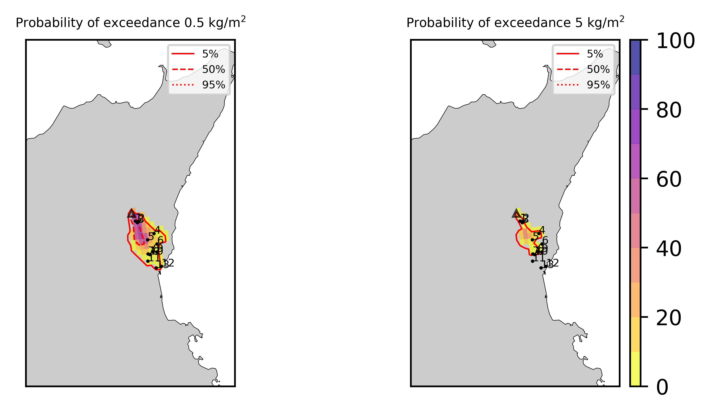  
  
  
  
  
  
  
  
  
  
  
  
  

|Location|Ground load [kg/m²] 5th perc|Ground load [kg/m²] 50th perc|Ground load [kg/m²] 95th perc|
| :--- | :--- | :--- | :--- |
|Schiena Asino (1)|5.35e-01|1.54e+00|3.76e+00|
|Rif.Vescovo (2)|0.00e+00|8.60e-01|4.03e+00|
|Serra Pituzza (3)|0.00e+00|9.95e-01|5.22e+00|
|Monterosso (4)|0.00e+00|1.22e-04|2.66e+00|
|Cim.Pedara (5)|4.56e-05|7.00e-02|7.97e+00|
|Cim.Viagrande (6)|0.00e+00|1.40e-06|6.92e-01|
|Cim.Mascalucia (7)|0.00e+00|1.36e-02|2.05e+00|
|Cim.Tremestieri (8)|0.00e+00|4.40e-03|1.60e+00|
|Cim.S.Giov.La Punta (9)|0.00e+00|3.12e-04|7.14e-01|
|Cim.Gravina (10)|0.00e+00|8.51e-03|1.99e+00|
|ENI S.Giov.Galermo (11)|0.00e+00|4.24e-04|5.90e-01|
|Bio Piazza Europa (12)|0.00e+00|1.34e-04|1.66e-01|
|INGV-OE (13)|0.00e+00|2.34e-04|2.16e-01|
  

### Atmosphere 2021-02-16 17:30 Z
  
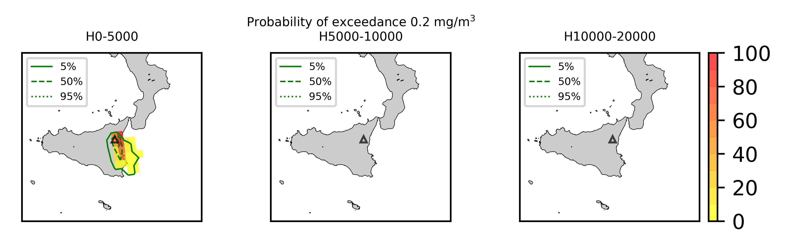
## Forecast at 2021-02-16 18:30 Z from RED VONA issued at 20210216_1631Z
  

|Eruption start [Z]|Eruption end [Z]|Forecast time [Z]|Column height asl [m]|
| :--- | :--- | :--- | :--- |
|2021-02-16 16:30:00|Ongoing|2021-02-16 18:30:00|6000 ± 500 - from VONA|
  
  

|Percentile|MER [kg/s¹]|Mass air [kg]|Mass air nested dom. [kg]|Mass grd [kg]|Mass grd nested dom. [kg]|
| :--- | :--- | :--- | :--- | :--- | :--- |
|5th|1.44e+04|6.33e+07|4.78e+07|7.95e+07|7.95e+07|
|50th|6.95e+04|1.98e+08|1.33e+08|3.47e+08|3.46e+08|
|95th|1.93e+05|4.18e+08|2.62e+08|8.40e+08|8.38e+08|
  

### Ground Nested Domain 2021-02-16 18:30 Z
  
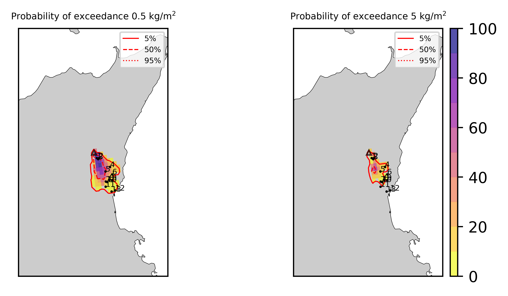  
  
  
  
  
  
  
  
  
  
  
  
  

|Location|Ground load [kg/m²] 5th perc|Ground load [kg/m²] 50th perc|Ground load [kg/m²] 95th perc|
| :--- | :--- | :--- | :--- |
|Schiena Asino (1)|1.67e+00|3.51e+00|6.48e+00|
|Rif.Vescovo (2)|1.13e-01|2.11e+00|5.68e+00|
|Serra Pituzza (3)|1.01e-01|2.55e+00|7.35e+00|
|Monterosso (4)|2.33e-06|1.86e-02|7.45e+00|
|Cim.Pedara (5)|2.34e-02|8.22e-01|8.92e+00|
|Cim.Viagrande (6)|2.81e-06|5.08e-03|1.64e+00|
|Cim.Mascalucia (7)|2.87e-03|1.98e-01|3.17e+00|
|Cim.Tremestieri (8)|3.91e-03|4.42e-02|2.31e+00|
|Cim.S.Giov.La Punta (9)|6.44e-04|3.06e-02|9.87e-01|
|Cim.Gravina (10)|2.41e-03|4.58e-02|2.91e+00|
|ENI S.Giov.Galermo (11)|9.35e-04|9.28e-02|1.09e+00|
|Bio Piazza Europa (12)|4.28e-05|7.98e-03|2.72e-01|
|INGV-OE (13)|2.32e-04|1.04e-02|3.52e-01|
  

### Atmosphere 2021-02-16 18:30 Z
  
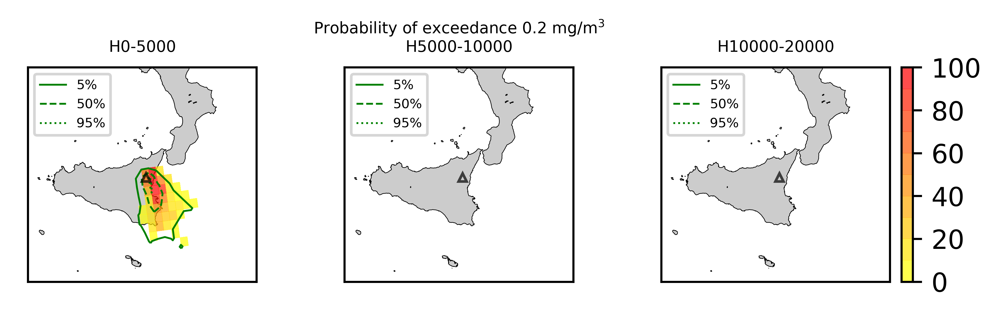
## Forecast at 2021-02-16 19:30 Z from RED VONA issued at 20210216_1631Z
  

|Eruption start [Z]|Eruption end [Z]|Forecast time [Z]|Column height asl [m]|
| :--- | :--- | :--- | :--- |
|2021-02-16 16:30:00|Ongoing|2021-02-16 19:30:00|6000 ± 500 - from VONA|
  
  

|Percentile|MER [kg/s¹]|Mass air [kg]|Mass air nested dom. [kg]|Mass grd [kg]|Mass grd nested dom. [kg]|
| :--- | :--- | :--- | :--- | :--- | :--- |
|5th|1.89e+04|1.37e+08|7.85e+07|2.60e+08|2.60e+08|
|50th|7.29e+04|2.59e+08|1.40e+08|5.17e+08|5.13e+08|
|95th|2.25e+05|6.68e+08|3.65e+08|1.19e+09|1.18e+09|
  

### Ground Nested Domain 2021-02-16 19:30 Z
  
  
  
  
  
  
  
  
  
  
  
  
  
  

|Location|Ground load [kg/m²] 5th perc|Ground load [kg/m²] 50th perc|Ground load [kg/m²] 95th perc|
| :--- | :--- | :--- | :--- |
|Schiena Asino (1)|3.43e+00|5.21e+00|9.47e+00|
|Rif.Vescovo (2)|1.57e+00|2.98e+00|6.90e+00|
|Serra Pituzza (3)|2.01e+00|3.50e+00|8.87e+00|
|Monterosso (4)|3.67e-04|6.05e-02|7.96e+00|
|Cim.Pedara (5)|7.77e-02|1.91e+00|9.22e+00|
|Cim.Viagrande (6)|8.83e-05|7.33e-02|1.80e+00|
|Cim.Mascalucia (7)|2.69e-02|4.29e-01|4.93e+00|
|Cim.Tremestieri (8)|1.43e-02|1.25e-01|3.81e+00|
|Cim.S.Giov.La Punta (9)|1.71e-03|8.01e-02|1.65e+00|
|Cim.Gravina (10)|1.58e-02|2.94e-01|5.02e+00|
|ENI S.Giov.Galermo (11)|1.67e-02|1.72e-01|1.23e+00|
|Bio Piazza Europa (12)|3.62e-03|3.19e-02|3.64e-01|
|INGV-OE (13)|5.63e-03|5.41e-02|4.15e-01|
  

### Atmosphere 2021-02-16 19:30 Z
  
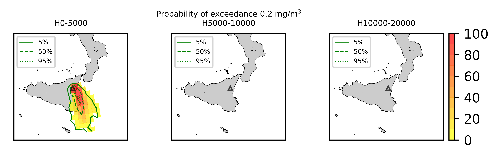
## Forecast at 2021-02-16 22:30 Z from RED VONA issued at 20210216_1631Z
  

|Eruption start [Z]|Eruption end [Z]|Forecast time [Z]|Column height asl [m]|
| :--- | :--- | :--- | :--- |
|2021-02-16 16:30:00|Ongoing|2021-02-16 22:30:00|6000 ± 500 - from VONA|
  
  

|Percentile|MER [kg/s¹]|Mass air [kg]|Mass air nested dom. [kg]|Mass grd [kg]|Mass grd nested dom. [kg]|
| :--- | :--- | :--- | :--- | :--- | :--- |
|5th|1.29e+04|1.86e+08|6.44e+07|5.83e+08|5.67e+08|
|50th|7.02e+04|3.37e+08|1.56e+08|1.22e+09|1.21e+09|
|95th|1.55e+05|1.12e+09|4.00e+08|2.03e+09|1.94e+09|
  

### Ground Nested Domain 2021-02-16 22:30 Z
  
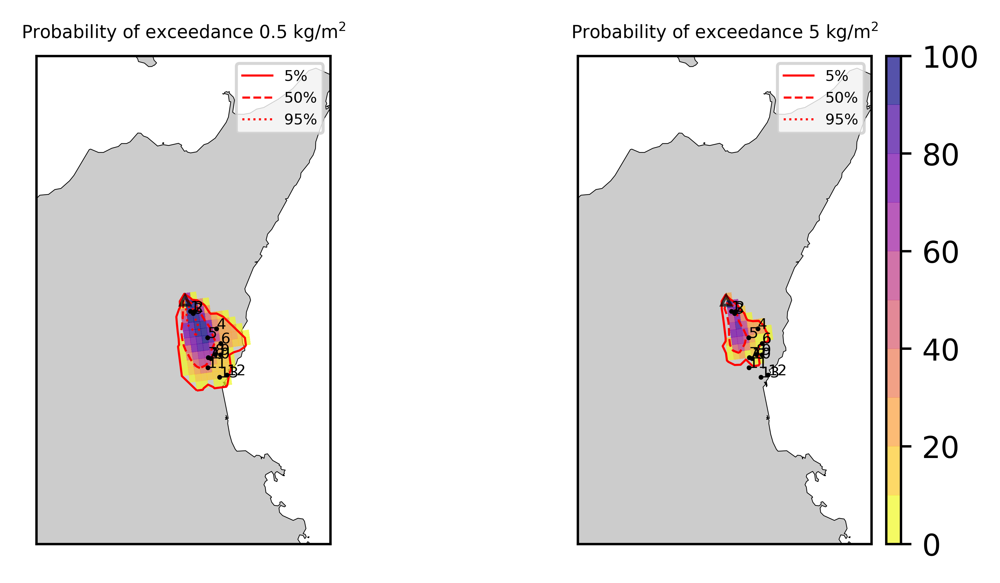  
  
  
  
  
  
  
  
  
  
  
  
  

|Location|Ground load [kg/m²] 5th perc|Ground load [kg/m²] 50th perc|Ground load [kg/m²] 95th perc|
| :--- | :--- | :--- | :--- |
|Schiena Asino (1)|7.38e+00|1.01e+01|1.50e+01|
|Rif.Vescovo (2)|2.52e+00|6.45e+00|1.08e+01|
|Serra Pituzza (3)|3.33e+00|8.37e+00|1.38e+01|
|Monterosso (4)|4.25e-03|1.24e-01|1.16e+01|
|Cim.Pedara (5)|1.97e-01|2.66e+00|1.26e+01|
|Cim.Viagrande (6)|1.18e-02|1.60e-01|4.29e+00|
|Cim.Mascalucia (7)|8.26e-02|1.04e+00|6.67e+00|
|Cim.Tremestieri (8)|6.90e-02|2.66e-01|5.18e+00|
|Cim.S.Giov.La Punta (9)|3.33e-02|1.99e-01|2.20e+00|
|Cim.Gravina (10)|7.59e-02|6.55e-01|6.78e+00|
|ENI S.Giov.Galermo (11)|7.58e-02|4.96e-01|1.90e+00|
|Bio Piazza Europa (12)|1.80e-02|8.20e-02|5.89e-01|
|INGV-OE (13)|1.95e-02|1.31e-01|9.35e-01|
  

### Atmosphere 2021-02-16 22:30 Z
  
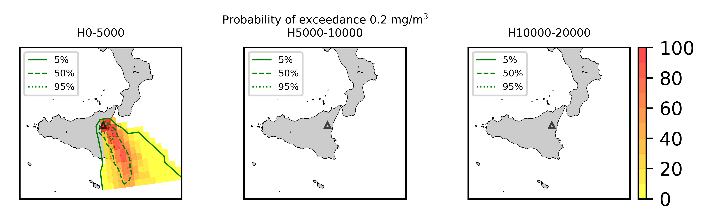
## Forecast at 2021-02-16 20:10 Z from RED VONA issued at 20210216_1705Z
  

|Eruption start [Z]|Eruption end [Z]|Forecast time [Z]|Column height asl [m]|
| :--- | :--- | :--- | :--- |
|2021-02-16 16:30:00|Ongoing|2021-02-16 20:10:00|10000 ± 500 - from VONA|
  
  

|Percentile|MER [kg/s¹]|Mass air [kg]|Mass air nested dom. [kg]|Mass grd [kg]|Mass grd nested dom. [kg]|
| :--- | :--- | :--- | :--- | :--- | :--- |
|5th|1.09e+05|5.05e+08|4.14e+08|1.06e+09|1.06e+09|
|50th|5.83e+05|2.13e+09|9.62e+08|3.73e+09|3.70e+09|
|95th|2.95e+06|6.59e+09|2.81e+09|1.40e+10|1.32e+10|
  

### Ground Nested Domain 2021-02-16 20:10 Z
  
  
  
  
  
  
  
  
  
  
  
  
  
  

|Location|Ground load [kg/m²] 5th perc|Ground load [kg/m²] 50th perc|Ground load [kg/m²] 95th perc|
| :--- | :--- | :--- | :--- |
|Schiena Asino (1)|7.79e+00|1.78e+01|5.83e+01|
|Rif.Vescovo (2)|4.25e-02|1.16e+01|3.21e+01|
|Serra Pituzza (3)|5.95e-02|1.44e+01|4.26e+01|
|Monterosso (4)|6.84e-03|6.73e-01|4.22e+00|
|Cim.Pedara (5)|8.97e-02|5.08e+00|1.09e+01|
|Cim.Viagrande (6)|4.39e-02|8.51e-01|7.83e+00|
|Cim.Mascalucia (7)|8.24e-02|6.18e+00|3.51e+01|
|Cim.Tremestieri (8)|5.83e-02|2.07e+00|2.19e+01|
|Cim.S.Giov.La Punta (9)|4.24e-02|1.28e+00|1.65e+01|
|Cim.Gravina (10)|7.43e-02|3.18e+00|3.29e+01|
|ENI S.Giov.Galermo (11)|6.17e-03|7.41e+00|2.54e+01|
|Bio Piazza Europa (12)|2.09e-02|1.55e+00|2.51e+01|
|INGV-OE (13)|2.03e-03|3.03e+00|2.53e+01|
  

### Atmosphere 2021-02-16 20:10 Z
  

## Forecast at 2021-02-16 23:10 Z from RED VONA issued at 20210216_1705Z
  

|Eruption start [Z]|Eruption end [Z]|Forecast time [Z]|Column height asl [m]|
| :--- | :--- | :--- | :--- |
|2021-02-16 16:30:00|Ongoing|2021-02-16 23:10:00|10000 ± 500 - from VONA|
  
  

|Percentile|MER [kg/s¹]|Mass air [kg]|Mass air nested dom. [kg]|Mass grd [kg]|Mass grd nested dom. [kg]|
| :--- | :--- | :--- | :--- | :--- | :--- |
|5th|1.65e+05|1.12e+09|6.26e+08|6.50e+09|6.25e+09|
|50th|7.41e+05|2.94e+09|1.25e+09|1.12e+10|1.07e+10|
|95th|1.46e+06|4.78e+09|2.35e+09|2.14e+10|2.01e+10|
  

### Ground Nested Domain 2021-02-16 23:10 Z
  
  
  
  
  
  
  
  
  
  
  
  
  
  

|Location|Ground load [kg/m²] 5th perc|Ground load [kg/m²] 50th perc|Ground load [kg/m²] 95th perc|
| :--- | :--- | :--- | :--- |
|Schiena Asino (1)|2.29e+01|5.38e+01|1.13e+02|
|Rif.Vescovo (2)|1.83e+00|1.97e+01|7.20e+01|
|Serra Pituzza (3)|2.50e+00|2.65e+01|9.21e+01|
|Monterosso (4)|7.50e-02|2.51e+00|9.59e+00|
|Cim.Pedara (5)|1.72e+00|9.52e+00|3.32e+01|
|Cim.Viagrande (6)|4.15e-01|3.34e+00|2.91e+01|
|Cim.Mascalucia (7)|1.93e+00|1.57e+01|4.49e+01|
|Cim.Tremestieri (8)|9.21e-01|9.93e+00|3.61e+01|
|Cim.S.Giov.La Punta (9)|4.20e-01|6.35e+00|3.79e+01|
|Cim.Gravina (10)|1.28e+00|1.54e+01|4.90e+01|
|ENI S.Giov.Galermo (11)|1.71e+00|1.99e+01|3.83e+01|
|Bio Piazza Europa (12)|3.07e-01|1.06e+01|4.33e+01|
|INGV-OE (13)|8.38e-01|1.77e+01|4.78e+01|
  

### Atmosphere 2021-02-16 23:10 Z
  
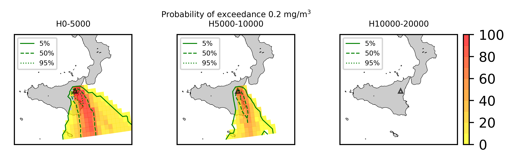
## Forecast at 2021-02-17 02:10 Z from RED VONA issued at 20210216_1705Z
  

|Eruption start [Z]|Eruption end [Z]|Forecast time [Z]|Column height asl [m]|
| :--- | :--- | :--- | :--- |
|2021-02-16 16:30:00|Ongoing|2021-02-17 02:10:00|10000 ± 500 - from VONA|
  
  

|Percentile|MER [kg/s¹]|Mass air [kg]|Mass air nested dom. [kg]|Mass grd [kg]|Mass grd nested dom. [kg]|
| :--- | :--- | :--- | :--- | :--- | :--- |
|5th|2.24e+05|1.19e+09|6.27e+08|9.91e+09|9.27e+09|
|50th|6.29e+05|2.95e+09|1.46e+09|1.64e+10|1.59e+10|
|95th|1.99e+06|6.37e+09|2.67e+09|3.01e+10|2.87e+10|
  

### Ground Nested Domain 2021-02-17 02:10 Z
  
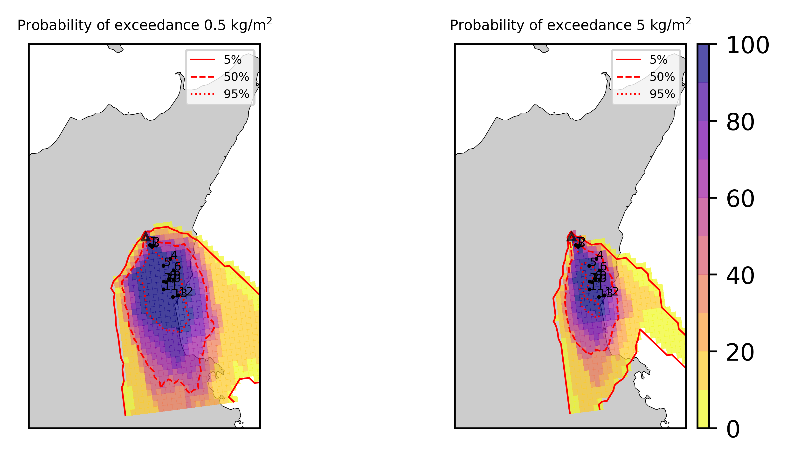  
  
  
  
  
  
  
  
  
  
  
  
  

|Location|Ground load [kg/m²] 5th perc|Ground load [kg/m²] 50th perc|Ground load [kg/m²] 95th perc|
| :--- | :--- | :--- | :--- |
|Schiena Asino (1)|4.15e+01|7.46e+01|1.25e+02|
|Rif.Vescovo (2)|1.09e+01|3.47e+01|8.13e+01|
|Serra Pituzza (3)|1.32e+01|4.55e+01|1.01e+02|
|Monterosso (4)|9.72e-01|9.28e+00|1.89e+01|
|Cim.Pedara (5)|1.05e+01|1.53e+01|4.17e+01|
|Cim.Viagrande (6)|2.23e+00|1.16e+01|3.15e+01|
|Cim.Mascalucia (7)|8.70e+00|3.71e+01|5.63e+01|
|Cim.Tremestieri (8)|9.86e+00|2.49e+01|4.19e+01|
|Cim.S.Giov.La Punta (9)|5.23e+00|1.71e+01|4.02e+01|
|Cim.Gravina (10)|9.36e+00|3.53e+01|5.32e+01|
|ENI S.Giov.Galermo (11)|1.06e+01|3.77e+01|5.77e+01|
|Bio Piazza Europa (12)|2.77e+00|1.65e+01|4.80e+01|
|INGV-OE (13)|5.15e+00|2.81e+01|5.80e+01|
  

### Atmosphere 2021-02-17 02:10 Z
  
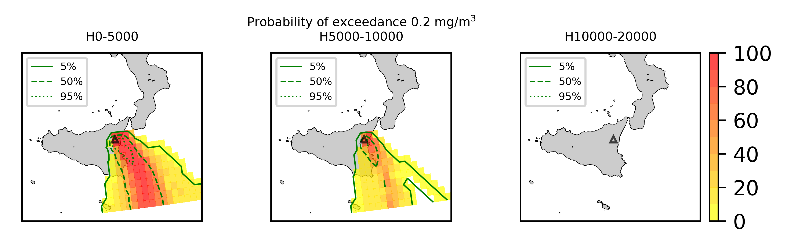
## Forecast at 2021-02-16 20:40 Z from RED VONA issued at 20210216_1738Z
  

|Eruption start [Z]|Eruption end [Z]|Forecast time [Z]|Column height asl [m]|
| :--- | :--- | :--- | :--- |
|2021-02-16 16:30:00|Ongoing|2021-02-16 20:40:00|[6000 m, 12000 m]|
  
  

|Percentile|MER [kg/s¹]|Mass air [kg]|Mass air nested dom. [kg]|Mass grd [kg]|Mass grd nested dom. [kg]|
| :--- | :--- | :--- | :--- | :--- | :--- |
|5th|1.10e+05|5.94e+08|3.26e+08|1.69e+09|1.69e+09|
|50th|3.73e+05|1.33e+09|5.96e+08|4.23e+09|4.14e+09|
|95th|7.38e+06|1.36e+10|5.81e+09|2.94e+10|2.76e+10|
  

### Ground Nested Domain 2021-02-16 20:40 Z
  
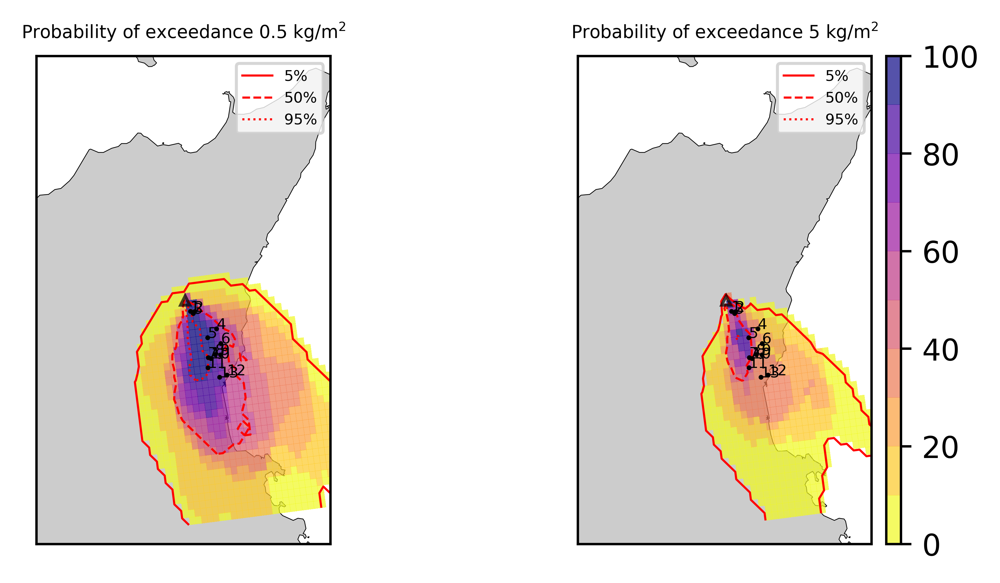  
  
  
  
  
  
  
  
  
  
  
  
  

|Location|Ground load [kg/m²] 5th perc|Ground load [kg/m²] 50th perc|Ground load [kg/m²] 95th perc|
| :--- | :--- | :--- | :--- |
|Schiena Asino (1)|1.04e+01|1.84e+01|1.15e+02|
|Rif.Vescovo (2)|1.01e+00|1.30e+01|7.14e+01|
|Serra Pituzza (3)|1.30e+00|1.14e+01|9.06e+01|
|Monterosso (4)|7.36e-02|1.10e+00|2.36e+01|
|Cim.Pedara (5)|1.64e+00|6.16e+00|3.12e+01|
|Cim.Viagrande (6)|6.12e-02|8.36e-01|2.38e+01|
|Cim.Mascalucia (7)|9.38e-01|7.07e+00|5.04e+01|
|Cim.Tremestieri (8)|1.69e-01|3.10e+00|3.66e+01|
|Cim.S.Giov.La Punta (9)|4.46e-02|2.12e+00|3.81e+01|
|Cim.Gravina (10)|6.43e-01|4.44e+00|4.94e+01|
|ENI S.Giov.Galermo (11)|1.35e+00|4.98e+00|4.76e+01|
|Bio Piazza Europa (12)|6.83e-02|7.42e-01|4.50e+01|
|INGV-OE (13)|4.64e-02|1.54e+00|4.43e+01|
  

### Atmosphere 2021-02-16 20:40 Z
  
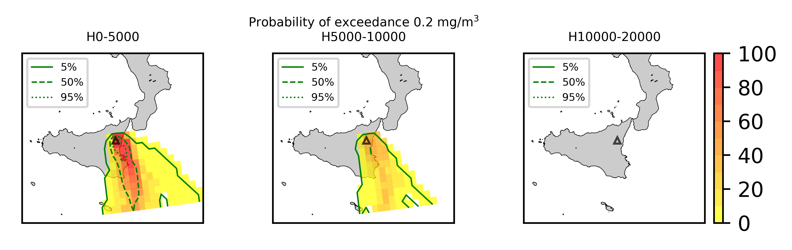
## Forecast at 2021-02-16 23:40 Z from RED VONA issued at 20210216_1738Z
  

|Eruption start [Z]|Eruption end [Z]|Forecast time [Z]|Column height asl [m]|
| :--- | :--- | :--- | :--- |
|2021-02-16 16:30:00|Ongoing|2021-02-16 23:40:00|[6000 m, 12000 m]|
  
  

|Percentile|MER [kg/s¹]|Mass air [kg]|Mass air nested dom. [kg]|Mass grd [kg]|Mass grd nested dom. [kg]|
| :--- | :--- | :--- | :--- | :--- | :--- |
|5th|7.87e+04|6.81e+08|2.71e+08|3.10e+09|2.94e+09|
|50th|3.81e+05|1.88e+09|8.83e+08|1.03e+10|9.86e+09|
|95th|8.99e+06|1.67e+10|5.39e+09|5.24e+10|4.92e+10|
  

### Ground Nested Domain 2021-02-16 23:40 Z
  
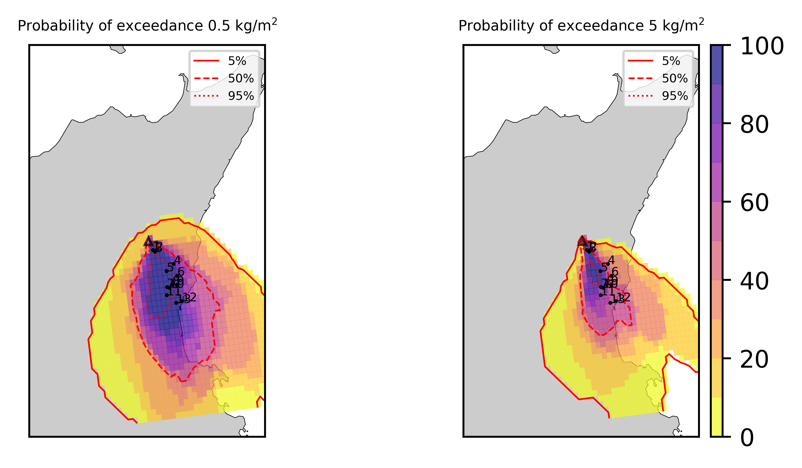  
  
  
  
  
  
  
  
  
  
  
  
  

|Location|Ground load [kg/m²] 5th perc|Ground load [kg/m²] 50th perc|Ground load [kg/m²] 95th perc|
| :--- | :--- | :--- | :--- |
|Schiena Asino (1)|1.90e+01|4.35e+01|1.33e+02|
|Rif.Vescovo (2)|2.39e+00|2.11e+01|8.01e+01|
|Serra Pituzza (3)|2.23e+00|2.31e+01|1.02e+02|
|Monterosso (4)|3.95e-01|3.23e+00|2.80e+01|
|Cim.Pedara (5)|4.58e+00|9.96e+00|4.36e+01|
|Cim.Viagrande (6)|4.05e-01|2.68e+00|2.77e+01|
|Cim.Mascalucia (7)|3.53e+00|1.37e+01|6.35e+01|
|Cim.Tremestieri (8)|1.47e+00|6.98e+00|4.61e+01|
|Cim.S.Giov.La Punta (9)|5.14e-01|5.62e+00|4.58e+01|
|Cim.Gravina (10)|1.70e+00|9.48e+00|5.99e+01|
|ENI S.Giov.Galermo (11)|1.86e+00|1.44e+01|5.78e+01|
|Bio Piazza Europa (12)|3.60e-01|7.34e+00|5.20e+01|
|INGV-OE (13)|6.13e-01|7.22e+00|5.44e+01|
  

### Atmosphere 2021-02-16 23:40 Z
  
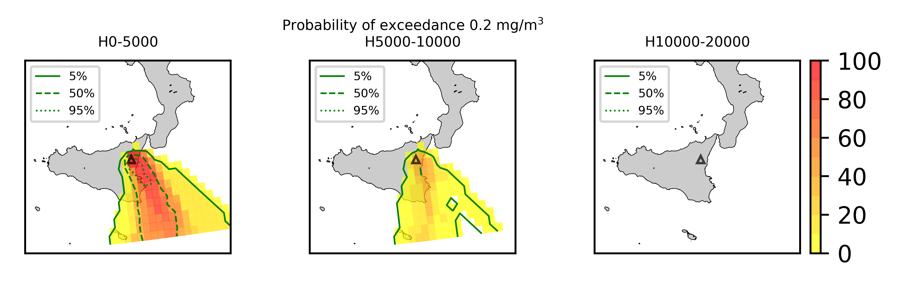
## Forecast at 2021-02-17 02:40 Z from RED VONA issued at 20210216_1738Z
  

|Eruption start [Z]|Eruption end [Z]|Forecast time [Z]|Column height asl [m]|
| :--- | :--- | :--- | :--- |
|2021-02-16 16:30:00|Ongoing|2021-02-17 02:40:00|[6000 m, 12000 m]|
  
  

|Percentile|MER [kg/s¹]|Mass air [kg]|Mass air nested dom. [kg]|Mass grd [kg]|Mass grd nested dom. [kg]|
| :--- | :--- | :--- | :--- | :--- | :--- |
|5th|6.66e+04|7.44e+08|2.66e+08|5.64e+09|5.12e+09|
|50th|3.30e+05|3.28e+09|1.02e+09|2.47e+10|2.31e+10|
|95th|6.67e+06|1.78e+10|6.44e+09|5.86e+10|5.49e+10|
  

### Ground Nested Domain 2021-02-17 02:40 Z
  
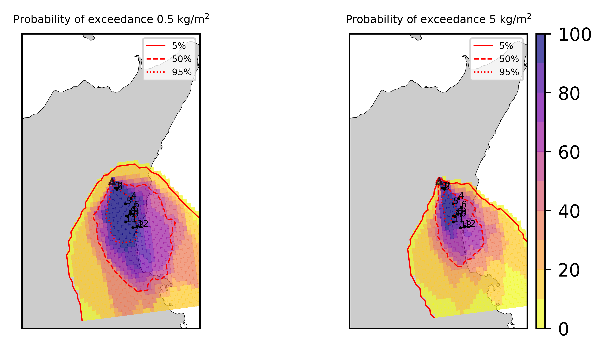  
  
  
  
  
  
  
  
  
  
  
  
  

|Location|Ground load [kg/m²] 5th perc|Ground load [kg/m²] 50th perc|Ground load [kg/m²] 95th perc|
| :--- | :--- | :--- | :--- |
|Schiena Asino (1)|3.02e+01|7.44e+01|1.54e+02|
|Rif.Vescovo (2)|6.19e+00|2.76e+01|1.02e+02|
|Serra Pituzza (3)|4.85e+00|2.78e+01|1.30e+02|
|Monterosso (4)|1.30e+00|9.33e+00|3.65e+01|
|Cim.Pedara (5)|9.34e+00|1.90e+01|7.28e+01|
|Cim.Viagrande (6)|6.75e-01|9.26e+00|3.70e+01|
|Cim.Mascalucia (7)|1.02e+01|1.69e+01|8.11e+01|
|Cim.Tremestieri (8)|3.19e+00|1.06e+01|6.50e+01|
|Cim.S.Giov.La Punta (9)|9.29e-01|6.85e+00|5.78e+01|
|Cim.Gravina (10)|7.00e+00|1.61e+01|7.65e+01|
|ENI S.Giov.Galermo (11)|4.61e+00|2.12e+01|6.63e+01|
|Bio Piazza Europa (12)|6.25e-01|1.29e+01|5.35e+01|
|INGV-OE (13)|1.28e+00|2.30e+01|6.23e+01|
  

### Atmosphere 2021-02-17 02:40 Z
  
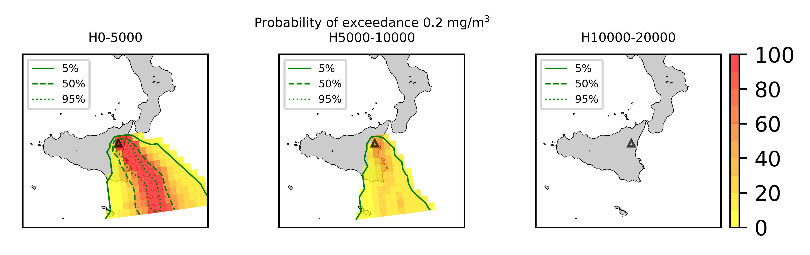
## Forecast at 2021-02-17 05:40 Z from RED VONA issued at 20210216_1738Z
  

|Eruption start [Z]|Eruption end [Z]|Forecast time [Z]|Column height asl [m]|
| :--- | :--- | :--- | :--- |
|2021-02-16 16:30:00|Ongoing|2021-02-17 05:40:00|[6000 m, 12000 m]|
  
  

|Percentile|MER [kg/s¹]|Mass air [kg]|Mass air nested dom. [kg]|Mass grd [kg]|Mass grd nested dom. [kg]|
| :--- | :--- | :--- | :--- | :--- | :--- |
|5th|3.62e+04|1.02e+09|4.72e+08|8.81e+09|8.28e+09|
|50th|4.57e+05|3.05e+09|1.09e+09|3.00e+10|2.86e+10|
|95th|4.54e+06|1.10e+10|4.66e+09|6.14e+10|5.73e+10|
  

### Ground Nested Domain 2021-02-17 05:40 Z
  
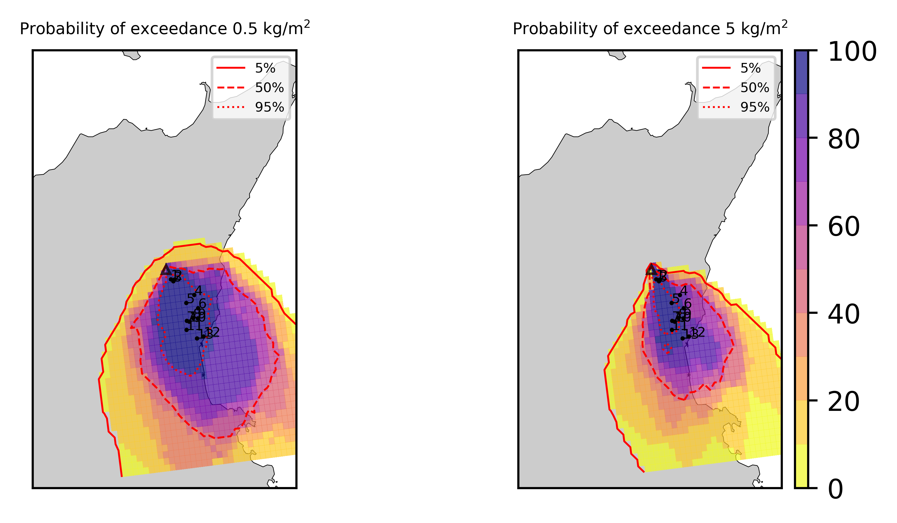  
  
  
  
  
  
  
  
  
  
  
  
  

|Location|Ground load [kg/m²] 5th perc|Ground load [kg/m²] 50th perc|Ground load [kg/m²] 95th perc|
| :--- | :--- | :--- | :--- |
|Schiena Asino (1)|5.42e+01|1.17e+02|1.66e+02|
|Rif.Vescovo (2)|9.30e+00|4.67e+01|1.13e+02|
|Serra Pituzza (3)|9.99e+00|4.62e+01|1.43e+02|
|Monterosso (4)|2.71e+00|1.78e+01|4.47e+01|
|Cim.Pedara (5)|1.20e+01|2.80e+01|8.72e+01|
|Cim.Viagrande (6)|2.87e+00|1.23e+01|4.47e+01|
|Cim.Mascalucia (7)|1.44e+01|3.21e+01|8.63e+01|
|Cim.Tremestieri (8)|8.31e+00|2.22e+01|7.10e+01|
|Cim.S.Giov.La Punta (9)|4.46e+00|1.70e+01|6.35e+01|
|Cim.Gravina (10)|1.16e+01|2.70e+01|8.20e+01|
|ENI S.Giov.Galermo (11)|1.16e+01|3.89e+01|6.79e+01|
|Bio Piazza Europa (12)|2.36e+00|2.07e+01|5.82e+01|
|INGV-OE (13)|6.16e+00|2.71e+01|6.31e+01|
  

### Atmosphere 2021-02-17 05:40 Z
  
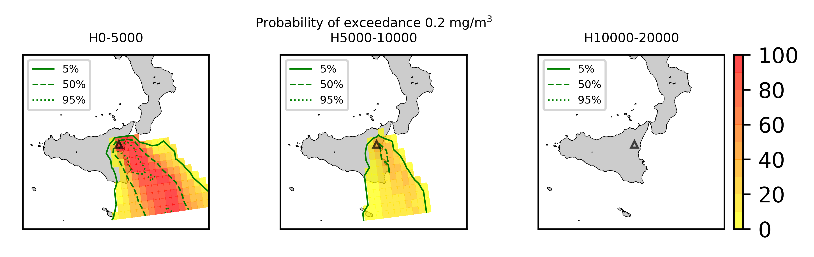  
Go to [Supplementary page](Supplementary_page.md)  
Go to [Main directory](https://github.com/federicapardini/Real_time_ash_forecast)