Forecast from VONA_20210228_0811Z
=================================

Contents
========

* [Forecast products](#forecast-products)
	* [Forecast at 2021-02-28 09:10 Z from RED VONA issued at 20210228_0811Z](#forecast-at-2021-02-28-0910-z-from-red-vona-issued-at-20210228_0811z)
	* [Forecast at 2021-02-28 10:10 Z from RED VONA issued at 20210228_0811Z](#forecast-at-2021-02-28-1010-z-from-red-vona-issued-at-20210228_0811z)
	* [Forecast at 2021-02-28 11:10 Z from RED VONA issued at 20210228_0811Z](#forecast-at-2021-02-28-1110-z-from-red-vona-issued-at-20210228_0811z)
	* [Forecast at 2021-02-28 14:10 Z from RED VONA issued at 20210228_0811Z](#forecast-at-2021-02-28-1410-z-from-red-vona-issued-at-20210228_0811z)
	* [Forecast at 2021-02-28 09:40 Z from RED VONA issued at 20210228_0835Z](#forecast-at-2021-02-28-0940-z-from-red-vona-issued-at-20210228_0835z)
	* [Forecast at 2021-02-28 10:40 Z from RED VONA issued at 20210228_0835Z](#forecast-at-2021-02-28-1040-z-from-red-vona-issued-at-20210228_0835z)
	* [Forecast at 2021-02-28 11:40 Z from RED VONA issued at 20210228_0835Z](#forecast-at-2021-02-28-1140-z-from-red-vona-issued-at-20210228_0835z)
	* [Forecast at 2021-02-28 14:40 Z from RED VONA issued at 20210228_0835Z](#forecast-at-2021-02-28-1440-z-from-red-vona-issued-at-20210228_0835z)
	* [Forecast at 2021-02-28 17:40 Z from RED VONA issued at 20210228_0835Z](#forecast-at-2021-02-28-1740-z-from-red-vona-issued-at-20210228_0835z)
	* [Forecast at 2021-02-28 20:40 Z from RED VONA issued at 20210228_0835Z](#forecast-at-2021-02-28-2040-z-from-red-vona-issued-at-20210228_0835z)

# Forecast products

## Forecast at 2021-02-28 09:10 Z from RED VONA issued at 20210228_0811Z
  

|Eruption start [Z]|Eruption end [Z]|Forecast time [Z]|Column height asl [m]|
| :--- | :--- | :--- | :--- |
|2021-02-28 08:10:00|Ongoing|2021-02-28 09:10:00|6000 ± 500 - from VONA|
  
  

|Percentile|MER [kg/s¹]|Mass air [kg]|Mass air nested dom. [kg]|Mass grd [kg]|Mass grd nested dom. [kg]|
| :--- | :--- | :--- | :--- | :--- | :--- |
|5th|4.06e+03|1.02e+07|1.02e+07|9.64e+06|9.64e+06|
|50th|1.52e+04|2.47e+07|2.47e+07|3.35e+07|3.35e+07|
|95th|3.28e+04|4.35e+07|4.35e+07|6.78e+07|6.78e+07|
  

### Ground Nested Domain 2021-02-28 09:10 Z
  
  
  
  
  
  
  
  
  
  
  
  
  
  
  
  
  
  
  
  
  
  
  

|Location|Ground load [kg/m²] 5th perc|Ground load [kg/m²] 50th perc|Ground load [kg/m²] 95th perc|
| :--- | :--- | :--- | :--- |
|Sarro (1)|0.00e+00|0.00e+00|1.95e-03|
|Airone (2)|0.00e+00|3.23e-05|9.96e-03|
|Zafferana Ingresso (3)|0.00e+00|0.00e+00|1.76e-03|
|Zafferana Rotonda (4)|0.00e+00|0.00e+00|1.48e-03|
|Petrulli (5)|0.00e+00|0.00e+00|8.63e-04|
|Milo (6)|0.00e+00|0.00e+00|6.04e-03|
|Fornazzo (7)|0.00e+00|0.00e+00|1.45e-02|
|Rinuccio (8)|0.00e+00|0.00e+00|2.37e-02|
|S. Alfio (9)|0.00e+00|0.00e+00|1.18e-04|
|Macchia (10)|0.00e+00|0.00e+00|0.00e+00|
|S. Venerina (11)|0.00e+00|0.00e+00|0.00e+00|
|Linera (12)|0.00e+00|0.00e+00|1.76e-06|
|Dagala chiesa S. Maria (13)|0.00e+00|0.00e+00|0.00e+00|
|Giarre Piazza Maccheroni (14)|0.00e+00|0.00e+00|0.00e+00|
|Milo parco (15)|0.00e+00|0.00e+00|4.03e-03|
|Catania AP (16)|0.00e+00|0.00e+00|0.00e+00|
|Nicolosi (17)|0.00e+00|0.00e+00|2.17e-03|
|Zafferana (18)|0.00e+00|0.00e+00|2.29e-03|
|Linguaglossa (19)|0.00e+00|0.00e+00|0.00e+00|
|Randazzo (20)|0.00e+00|0.00e+00|0.00e+00|
|Bronte (21)|0.00e+00|0.00e+00|0.00e+00|
|Biancavilla (22)|0.00e+00|0.00e+00|0.00e+00|
  

### Atmosphere 2021-02-28 09:10 Z
  

## Forecast at 2021-02-28 10:10 Z from RED VONA issued at 20210228_0811Z
  

|Eruption start [Z]|Eruption end [Z]|Forecast time [Z]|Column height asl [m]|
| :--- | :--- | :--- | :--- |
|2021-02-28 08:10:00|Ongoing|2021-02-28 10:10:00|6000 ± 500 - from VONA|
  
  

|Percentile|MER [kg/s¹]|Mass air [kg]|Mass air nested dom. [kg]|Mass grd [kg]|Mass grd nested dom. [kg]|
| :--- | :--- | :--- | :--- | :--- | :--- |
|5th|5.14e+03|1.74e+07|1.74e+07|4.08e+07|4.07e+07|
|50th|1.62e+04|3.61e+07|3.61e+07|8.30e+07|8.30e+07|
|95th|2.80e+04|6.93e+07|6.93e+07|1.10e+08|1.10e+08|
  

### Ground Nested Domain 2021-02-28 10:10 Z
  
  
  
  
  
  
  
  
  
  
  
  
  
  
  
  
  
  
  
  
  
  
  

|Location|Ground load [kg/m²] 5th perc|Ground load [kg/m²] 50th perc|Ground load [kg/m²] 95th perc|
| :--- | :--- | :--- | :--- |
|Sarro (1)|0.00e+00|7.75e-04|1.78e-02|
|Airone (2)|9.81e-06|4.16e-03|1.21e-01|
|Zafferana Ingresso (3)|0.00e+00|1.89e-03|2.91e-02|
|Zafferana Rotonda (4)|0.00e+00|2.02e-03|3.71e-02|
|Petrulli (5)|0.00e+00|1.14e-03|3.82e-02|
|Milo (6)|0.00e+00|7.00e-04|5.61e-02|
|Fornazzo (7)|0.00e+00|1.62e-03|1.18e-01|
|Rinuccio (8)|0.00e+00|2.73e-03|2.89e-01|
|S. Alfio (9)|0.00e+00|0.00e+00|6.30e-02|
|Macchia (10)|0.00e+00|0.00e+00|1.93e-02|
|S. Venerina (11)|0.00e+00|0.00e+00|8.78e-04|
|Linera (12)|0.00e+00|0.00e+00|7.07e-04|
|Dagala chiesa S. Maria (13)|0.00e+00|0.00e+00|9.65e-03|
|Giarre Piazza Maccheroni (14)|0.00e+00|0.00e+00|1.42e-03|
|Milo parco (15)|0.00e+00|3.93e-04|5.15e-02|
|Catania AP (16)|0.00e+00|0.00e+00|0.00e+00|
|Nicolosi (17)|0.00e+00|1.17e-05|5.47e-02|
|Zafferana (18)|0.00e+00|1.93e-03|3.05e-02|
|Linguaglossa (19)|0.00e+00|0.00e+00|0.00e+00|
|Randazzo (20)|0.00e+00|0.00e+00|0.00e+00|
|Bronte (21)|0.00e+00|0.00e+00|0.00e+00|
|Biancavilla (22)|0.00e+00|0.00e+00|4.97e-04|
  

### Atmosphere 2021-02-28 10:10 Z
  

## Forecast at 2021-02-28 11:10 Z from RED VONA issued at 20210228_0811Z
  

|Eruption start [Z]|Eruption end [Z]|Forecast time [Z]|Column height asl [m]|
| :--- | :--- | :--- | :--- |
|2021-02-28 08:10:00|Ongoing|2021-02-28 11:10:00|6000 ± 500 - from VONA|
  
  

|Percentile|MER [kg/s¹]|Mass air [kg]|Mass air nested dom. [kg]|Mass grd [kg]|Mass grd nested dom. [kg]|
| :--- | :--- | :--- | :--- | :--- | :--- |
|5th|3.76e+03|1.73e+07|1.73e+07|8.27e+07|8.27e+07|
|50th|1.73e+04|5.06e+07|4.96e+07|1.48e+08|1.48e+08|
|95th|3.44e+04|8.17e+07|8.17e+07|1.78e+08|1.78e+08|
  

### Ground Nested Domain 2021-02-28 11:10 Z
  
  
  
  
  
  
  
  
  
  
  
  
  
  
  
  
  
  
  
  
  
  
  

|Location|Ground load [kg/m²] 5th perc|Ground load [kg/m²] 50th perc|Ground load [kg/m²] 95th perc|
| :--- | :--- | :--- | :--- |
|Sarro (1)|0.00e+00|6.01e-03|3.59e-01|
|Airone (2)|2.53e-04|3.35e-02|4.87e-01|
|Zafferana Ingresso (3)|0.00e+00|7.17e-03|3.09e-01|
|Zafferana Rotonda (4)|0.00e+00|7.91e-03|2.45e-01|
|Petrulli (5)|0.00e+00|9.19e-03|1.03e-01|
|Milo (6)|0.00e+00|1.14e-02|2.27e-01|
|Fornazzo (7)|0.00e+00|2.91e-02|2.52e-01|
|Rinuccio (8)|0.00e+00|2.51e-02|3.86e-01|
|S. Alfio (9)|0.00e+00|1.46e-03|7.00e-02|
|Macchia (10)|0.00e+00|1.64e-03|3.48e-02|
|S. Venerina (11)|0.00e+00|1.17e-03|2.23e-02|
|Linera (12)|0.00e+00|1.28e-04|9.14e-02|
|Dagala chiesa S. Maria (13)|0.00e+00|2.48e-03|2.90e-02|
|Giarre Piazza Maccheroni (14)|0.00e+00|7.68e-06|6.37e-03|
|Milo parco (15)|0.00e+00|8.96e-03|2.12e-01|
|Catania AP (16)|0.00e+00|0.00e+00|1.64e-03|
|Nicolosi (17)|0.00e+00|1.00e-02|7.76e-02|
|Zafferana (18)|0.00e+00|8.16e-03|2.70e-01|
|Linguaglossa (19)|0.00e+00|0.00e+00|1.57e-02|
|Randazzo (20)|0.00e+00|0.00e+00|0.00e+00|
|Bronte (21)|0.00e+00|0.00e+00|0.00e+00|
|Biancavilla (22)|0.00e+00|0.00e+00|1.34e-02|
  

### Atmosphere 2021-02-28 11:10 Z
  

## Forecast at 2021-02-28 14:10 Z from RED VONA issued at 20210228_0811Z
  

|Eruption start [Z]|Eruption end [Z]|Forecast time [Z]|Column height asl [m]|
| :--- | :--- | :--- | :--- |
|2021-02-28 08:10:00|Ongoing|2021-02-28 14:10:00|6000 ± 500 - from VONA|
  
  

|Percentile|MER [kg/s¹]|Mass air [kg]|Mass air nested dom. [kg]|Mass grd [kg]|Mass grd nested dom. [kg]|
| :--- | :--- | :--- | :--- | :--- | :--- |
|5th|4.01e+03|3.19e+07|3.19e+07|1.87e+08|1.87e+08|
|50th|2.29e+04|7.47e+07|7.46e+07|3.60e+08|3.60e+08|
|95th|5.56e+04|2.08e+08|2.06e+08|5.14e+08|5.14e+08|
  

### Ground Nested Domain 2021-02-28 14:10 Z
  
  
  
  
  
  
  
  
  
  
  
  
  
  
  
  
  
  
  
  
  
  
  

|Location|Ground load [kg/m²] 5th perc|Ground load [kg/m²] 50th perc|Ground load [kg/m²] 95th perc|
| :--- | :--- | :--- | :--- |
|Sarro (1)|4.64e-03|5.82e-02|4.12e-01|
|Airone (2)|1.11e-02|1.16e-01|7.12e-01|
|Zafferana Ingresso (3)|3.12e-03|5.46e-02|4.40e-01|
|Zafferana Rotonda (4)|3.45e-03|5.82e-02|3.62e-01|
|Petrulli (5)|4.32e-03|5.25e-02|4.88e-01|
|Milo (6)|2.72e-05|3.42e-02|8.92e-01|
|Fornazzo (7)|0.00e+00|4.90e-02|8.06e-01|
|Rinuccio (8)|0.00e+00|6.05e-02|1.12e+00|
|S. Alfio (9)|0.00e+00|1.41e-02|3.56e-01|
|Macchia (10)|0.00e+00|6.91e-03|1.08e-01|
|S. Venerina (11)|0.00e+00|1.53e-02|7.52e-02|
|Linera (12)|2.50e-04|8.66e-03|1.84e-01|
|Dagala chiesa S. Maria (13)|0.00e+00|2.19e-02|1.28e-01|
|Giarre Piazza Maccheroni (14)|0.00e+00|2.20e-03|4.86e-02|
|Milo parco (15)|2.78e-05|3.13e-02|8.95e-01|
|Catania AP (16)|0.00e+00|3.37e-05|3.23e-02|
|Nicolosi (17)|2.55e-03|7.00e-02|7.19e-01|
|Zafferana (18)|6.19e-03|6.13e-02|3.93e-01|
|Linguaglossa (19)|0.00e+00|2.64e-06|2.29e-02|
|Randazzo (20)|0.00e+00|0.00e+00|4.17e-04|
|Bronte (21)|0.00e+00|0.00e+00|4.17e-05|
|Biancavilla (22)|0.00e+00|1.01e-02|4.21e-02|
  

### Atmosphere 2021-02-28 14:10 Z
  

## Forecast at 2021-02-28 09:40 Z from RED VONA issued at 20210228_0835Z
  

|Eruption start [Z]|Eruption end [Z]|Forecast time [Z]|Column height asl [m]|
| :--- | :--- | :--- | :--- |
|2021-02-28 08:10:00|Ongoing|2021-02-28 09:40:00|9000 ± 500 - from VONA|
  
  

|Percentile|MER [kg/s¹]|Mass air [kg]|Mass air nested dom. [kg]|Mass grd [kg]|Mass grd nested dom. [kg]|
| :--- | :--- | :--- | :--- | :--- | :--- |
|5th|3.21e+04|1.02e+08|1.02e+08|1.21e+08|1.21e+08|
|50th|1.79e+05|3.81e+08|3.80e+08|3.96e+08|3.95e+08|
|95th|9.24e+05|1.92e+09|1.86e+09|1.42e+09|1.42e+09|
  

### Ground Nested Domain 2021-02-28 09:40 Z
  
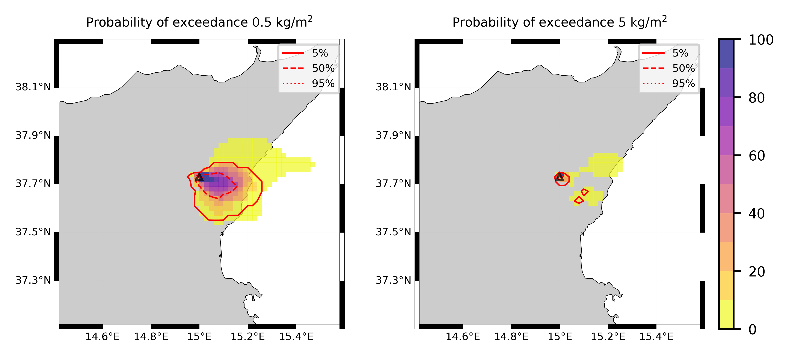  
  
  
  
  
  
  
  
  
  
  
  
  
  
  
  
  
  
  
  
  
  

|Location|Ground load [kg/m²] 5th perc|Ground load [kg/m²] 50th perc|Ground load [kg/m²] 95th perc|
| :--- | :--- | :--- | :--- |
|Sarro (1)|6.58e-02|1.10e+00|2.84e+00|
|Airone (2)|6.99e-02|1.45e+00|2.39e+00|
|Zafferana Ingresso (3)|4.10e-02|1.35e+00|2.60e+00|
|Zafferana Rotonda (4)|2.45e-02|1.27e+00|2.74e+00|
|Petrulli (5)|9.16e-03|9.13e-01|2.49e+00|
|Milo (6)|3.21e-03|5.67e-01|2.15e+00|
|Fornazzo (7)|4.42e-03|3.30e-01|3.53e+00|
|Rinuccio (8)|6.87e-03|3.95e-01|3.11e+00|
|S. Alfio (9)|1.22e-04|1.30e-01|6.32e+00|
|Macchia (10)|0.00e+00|1.60e-01|3.91e+00|
|S. Venerina (11)|9.14e-04|8.05e-01|2.22e+00|
|Linera (12)|4.06e-03|4.10e-01|2.71e+00|
|Dagala chiesa S. Maria (13)|4.73e-04|6.73e-01|1.88e+00|
|Giarre Piazza Maccheroni (14)|0.00e+00|4.82e-02|4.54e+00|
|Milo parco (15)|2.67e-03|5.43e-01|2.21e+00|
|Catania AP (16)|0.00e+00|0.00e+00|8.83e-02|
|Nicolosi (17)|4.50e-05|1.78e-02|2.48e+00|
|Zafferana (18)|7.80e-02|1.34e+00|2.51e+00|
|Linguaglossa (19)|0.00e+00|0.00e+00|3.41e-01|
|Randazzo (20)|0.00e+00|0.00e+00|3.48e-04|
|Bronte (21)|0.00e+00|0.00e+00|0.00e+00|
|Biancavilla (22)|0.00e+00|0.00e+00|0.00e+00|
  

### Atmosphere 2021-02-28 09:40 Z
  
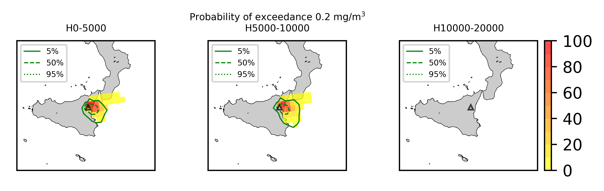
## Forecast at 2021-02-28 10:40 Z from RED VONA issued at 20210228_0835Z
  

|Eruption start [Z]|Eruption end [Z]|Forecast time [Z]|Column height asl [m]|
| :--- | :--- | :--- | :--- |
|2021-02-28 08:10:00|Ongoing|2021-02-28 10:40:00|9000 ± 500 - from VONA|
  
  

|Percentile|MER [kg/s¹]|Mass air [kg]|Mass air nested dom. [kg]|Mass grd [kg]|Mass grd nested dom. [kg]|
| :--- | :--- | :--- | :--- | :--- | :--- |
|5th|6.19e+04|2.67e+08|2.66e+08|4.63e+08|4.63e+08|
|50th|1.84e+05|5.97e+08|5.55e+08|1.17e+09|1.17e+09|
|95th|6.01e+05|1.62e+09|1.50e+09|2.33e+09|2.30e+09|
  

### Ground Nested Domain 2021-02-28 10:40 Z
  
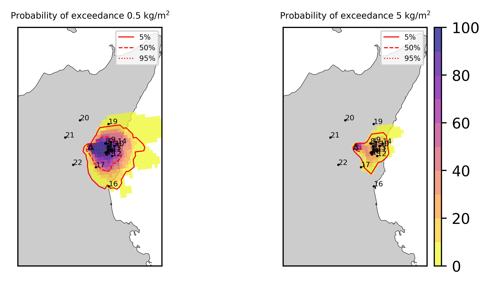  
  
  
  
  
  
  
  
  
  
  
  
  
  
  
  
  
  
  
  
  
  

|Location|Ground load [kg/m²] 5th perc|Ground load [kg/m²] 50th perc|Ground load [kg/m²] 95th perc|
| :--- | :--- | :--- | :--- |
|Sarro (1)|6.69e-01|3.07e+00|7.28e+00|
|Airone (2)|1.14e+00|2.98e+00|6.18e+00|
|Zafferana Ingresso (3)|1.14e+00|3.04e+00|5.55e+00|
|Zafferana Rotonda (4)|1.03e+00|2.82e+00|5.34e+00|
|Petrulli (5)|7.23e-01|2.02e+00|5.62e+00|
|Milo (6)|2.44e-01|2.26e+00|5.99e+00|
|Fornazzo (7)|1.63e-01|1.82e+00|6.79e+00|
|Rinuccio (8)|2.12e-01|1.94e+00|6.34e+00|
|S. Alfio (9)|1.13e-02|7.66e-01|8.46e+00|
|Macchia (10)|8.12e-03|7.76e-01|6.16e+00|
|S. Venerina (11)|1.96e-01|1.68e+00|4.55e+00|
|Linera (12)|3.62e-01|2.13e+00|4.06e+00|
|Dagala chiesa S. Maria (13)|1.36e-01|1.48e+00|5.68e+00|
|Giarre Piazza Maccheroni (14)|4.53e-04|3.31e-01|6.31e+00|
|Milo parco (15)|2.31e-01|2.30e+00|6.11e+00|
|Catania AP (16)|0.00e+00|7.79e-05|1.12e+00|
|Nicolosi (17)|5.27e-03|2.54e-01|3.63e+00|
|Zafferana (18)|9.07e-01|3.28e+00|6.78e+00|
|Linguaglossa (19)|0.00e+00|3.06e-04|4.57e-01|
|Randazzo (20)|0.00e+00|0.00e+00|4.32e-04|
|Bronte (21)|0.00e+00|0.00e+00|0.00e+00|
|Biancavilla (22)|0.00e+00|0.00e+00|1.54e-02|
  

### Atmosphere 2021-02-28 10:40 Z
  
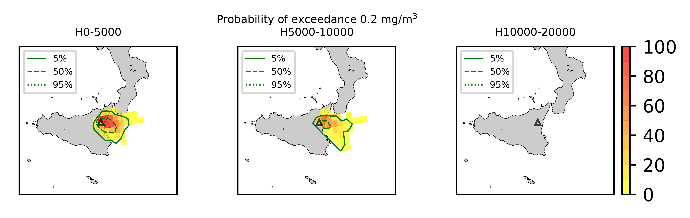
## Forecast at 2021-02-28 11:40 Z from RED VONA issued at 20210228_0835Z
  

|Eruption start [Z]|Eruption end [Z]|Forecast time [Z]|Column height asl [m]|
| :--- | :--- | :--- | :--- |
|2021-02-28 08:10:00|Ongoing|2021-02-28 11:40:00|9000 ± 500 - from VONA|
  
  

|Percentile|MER [kg/s¹]|Mass air [kg]|Mass air nested dom. [kg]|Mass grd [kg]|Mass grd nested dom. [kg]|
| :--- | :--- | :--- | :--- | :--- | :--- |
|5th|7.37e+04|2.49e+08|2.45e+08|8.19e+08|8.18e+08|
|50th|1.89e+05|6.57e+08|4.90e+08|1.66e+09|1.65e+09|
|95th|6.38e+05|2.13e+09|1.72e+09|4.15e+09|4.14e+09|
  

### Ground Nested Domain 2021-02-28 11:40 Z
  
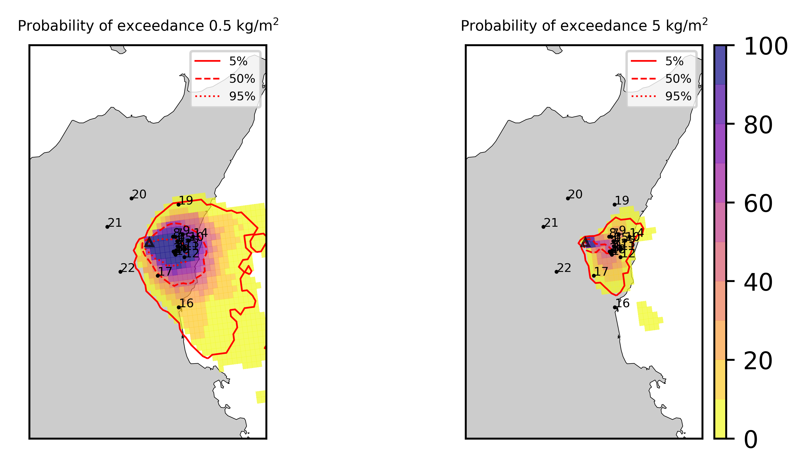  
  
  
  
  
  
  
  
  
  
  
  
  
  
  
  
  
  
  
  
  
  

|Location|Ground load [kg/m²] 5th perc|Ground load [kg/m²] 50th perc|Ground load [kg/m²] 95th perc|
| :--- | :--- | :--- | :--- |
|Sarro (1)|2.48e+00|4.81e+00|9.01e+00|
|Airone (2)|2.30e+00|5.56e+00|9.59e+00|
|Zafferana Ingresso (3)|1.82e+00|4.99e+00|8.23e+00|
|Zafferana Rotonda (4)|1.49e+00|4.95e+00|7.87e+00|
|Petrulli (5)|1.85e+00|4.30e+00|8.66e+00|
|Milo (6)|1.05e+00|3.76e+00|7.80e+00|
|Fornazzo (7)|5.72e-01|3.40e+00|7.66e+00|
|Rinuccio (8)|5.92e-01|3.72e+00|7.16e+00|
|S. Alfio (9)|1.35e-01|1.57e+00|9.49e+00|
|Macchia (10)|2.10e-01|2.25e+00|7.57e+00|
|S. Venerina (11)|1.02e+00|2.73e+00|6.99e+00|
|Linera (12)|9.47e-01|3.34e+00|4.97e+00|
|Dagala chiesa S. Maria (13)|1.38e+00|2.68e+00|8.12e+00|
|Giarre Piazza Maccheroni (14)|3.78e-02|1.04e+00|7.55e+00|
|Milo parco (15)|1.03e+00|3.81e+00|7.88e+00|
|Catania AP (16)|0.00e+00|5.08e-03|1.84e+00|
|Nicolosi (17)|2.49e-02|4.32e-01|5.95e+00|
|Zafferana (18)|2.41e+00|4.97e+00|9.17e+00|
|Linguaglossa (19)|0.00e+00|1.30e-02|6.66e-01|
|Randazzo (20)|0.00e+00|0.00e+00|4.32e-04|
|Bronte (21)|0.00e+00|0.00e+00|0.00e+00|
|Biancavilla (22)|0.00e+00|2.93e-05|3.22e-02|
  

### Atmosphere 2021-02-28 11:40 Z
  
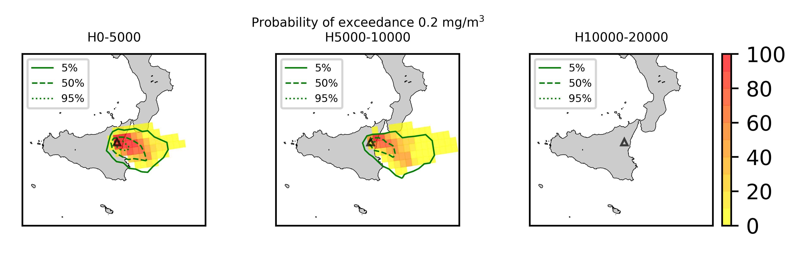
## Forecast at 2021-02-28 14:40 Z from RED VONA issued at 20210228_0835Z
  

|Eruption start [Z]|Eruption end [Z]|Forecast time [Z]|Column height asl [m]|
| :--- | :--- | :--- | :--- |
|2021-02-28 08:10:00|Ongoing|2021-02-28 14:40:00|9000 ± 500 - from VONA|
  
  

|Percentile|MER [kg/s¹]|Mass air [kg]|Mass air nested dom. [kg]|Mass grd [kg]|Mass grd nested dom. [kg]|
| :--- | :--- | :--- | :--- | :--- | :--- |
|5th|3.87e+04|1.96e+08|1.84e+08|2.29e+09|2.29e+09|
|50th|1.65e+05|8.59e+08|6.20e+08|3.53e+09|3.52e+09|
|95th|6.94e+05|3.34e+09|2.25e+09|8.95e+09|8.60e+09|
  

### Ground Nested Domain 2021-02-28 14:40 Z
  
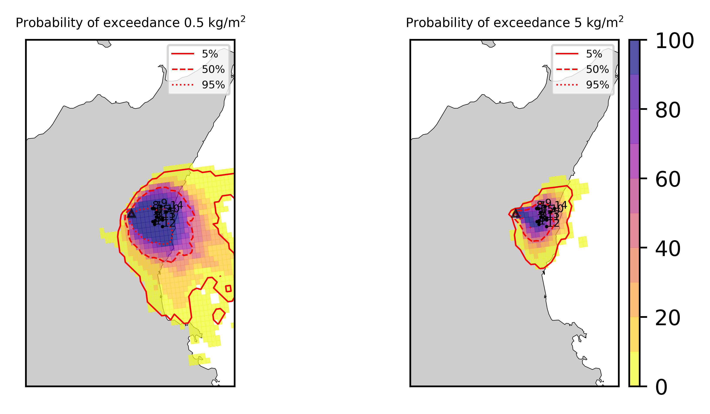  
  
  
  
  
  
  
  
  
  
  
  
  
  
  
  
  
  
  
  
  
  

|Location|Ground load [kg/m²] 5th perc|Ground load [kg/m²] 50th perc|Ground load [kg/m²] 95th perc|
| :--- | :--- | :--- | :--- |
|Sarro (1)|2.73e+00|9.27e+00|2.17e+01|
|Airone (2)|2.80e+00|1.12e+01|1.76e+01|
|Zafferana Ingresso (3)|2.60e+00|1.13e+01|1.58e+01|
|Zafferana Rotonda (4)|3.21e+00|1.08e+01|1.48e+01|
|Petrulli (5)|3.14e+00|9.44e+00|1.59e+01|
|Milo (6)|1.71e+00|7.96e+00|1.80e+01|
|Fornazzo (7)|7.77e-01|6.09e+00|1.68e+01|
|Rinuccio (8)|8.80e-01|6.31e+00|1.54e+01|
|S. Alfio (9)|1.90e-01|3.70e+00|2.60e+01|
|Macchia (10)|2.52e-01|3.97e+00|1.59e+01|
|S. Venerina (11)|2.18e+00|7.53e+00|1.46e+01|
|Linera (12)|1.21e+00|6.53e+00|1.24e+01|
|Dagala chiesa S. Maria (13)|2.08e+00|6.64e+00|1.17e+01|
|Giarre Piazza Maccheroni (14)|5.94e-02|2.49e+00|1.55e+01|
|Milo parco (15)|1.69e+00|7.89e+00|1.81e+01|
|Catania AP (16)|4.27e-05|9.95e-02|3.89e+00|
|Nicolosi (17)|3.51e-02|1.13e+00|7.93e+00|
|Zafferana (18)|2.49e+00|1.05e+01|2.02e+01|
|Linguaglossa (19)|2.93e-05|3.85e-02|8.90e-01|
|Randazzo (20)|0.00e+00|1.00e-05|5.74e-03|
|Bronte (21)|0.00e+00|0.00e+00|3.51e-03|
|Biancavilla (22)|0.00e+00|1.88e-02|2.51e-01|
  

### Atmosphere 2021-02-28 14:40 Z
  
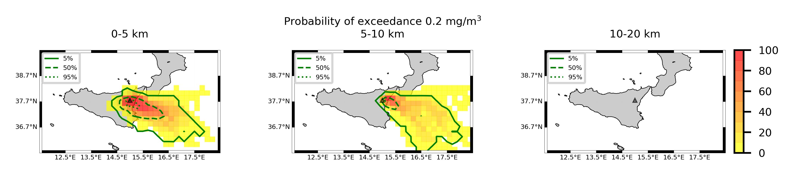
## Forecast at 2021-02-28 17:40 Z from RED VONA issued at 20210228_0835Z
  

|Eruption start [Z]|Eruption end [Z]|Forecast time [Z]|Column height asl [m]|
| :--- | :--- | :--- | :--- |
|2021-02-28 08:10:00|Ongoing|2021-02-28 17:40:00|9000 ± 500 - from VONA|
  
  

|Percentile|MER [kg/s¹]|Mass air [kg]|Mass air nested dom. [kg]|Mass grd [kg]|Mass grd nested dom. [kg]|
| :--- | :--- | :--- | :--- | :--- | :--- |
|5th|4.56e+04|4.20e+08|3.54e+08|3.58e+09|3.57e+09|
|50th|2.49e+05|1.11e+09|8.16e+08|6.95e+09|6.64e+09|
|95th|5.61e+05|3.41e+09|1.99e+09|1.35e+10|1.27e+10|
  

### Ground Nested Domain 2021-02-28 17:40 Z
  
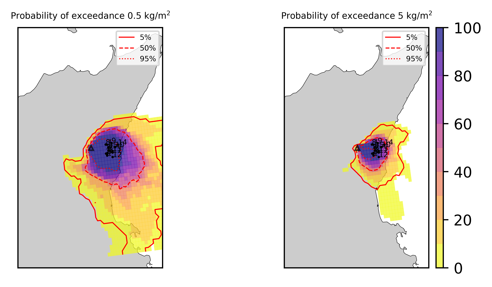  
  
  
  
  
  
  
  
  
  
  
  
  
  
  
  
  
  
  
  
  
  

|Location|Ground load [kg/m²] 5th perc|Ground load [kg/m²] 50th perc|Ground load [kg/m²] 95th perc|
| :--- | :--- | :--- | :--- |
|Sarro (1)|3.94e+00|1.76e+01|3.06e+01|
|Airone (2)|5.32e+00|1.90e+01|3.32e+01|
|Zafferana Ingresso (3)|4.95e+00|1.77e+01|3.05e+01|
|Zafferana Rotonda (4)|5.21e+00|1.75e+01|3.09e+01|
|Petrulli (5)|4.20e+00|1.42e+01|3.04e+01|
|Milo (6)|2.82e+00|1.17e+01|2.77e+01|
|Fornazzo (7)|1.32e+00|8.44e+00|2.50e+01|
|Rinuccio (8)|1.49e+00|7.62e+00|2.27e+01|
|S. Alfio (9)|4.84e-01|8.66e+00|3.01e+01|
|Macchia (10)|4.51e-01|7.03e+00|2.27e+01|
|S. Venerina (11)|2.79e+00|1.08e+01|2.58e+01|
|Linera (12)|2.17e+00|1.21e+01|2.04e+01|
|Dagala chiesa S. Maria (13)|2.85e+00|9.82e+00|2.61e+01|
|Giarre Piazza Maccheroni (14)|1.72e-01|4.24e+00|1.96e+01|
|Milo parco (15)|2.74e+00|1.17e+01|2.81e+01|
|Catania AP (16)|4.29e-02|7.33e-01|4.76e+00|
|Nicolosi (17)|2.55e-01|3.20e+00|1.23e+01|
|Zafferana (18)|4.25e+00|1.85e+01|3.38e+01|
|Linguaglossa (19)|4.70e-04|6.56e-02|1.21e+00|
|Randazzo (20)|0.00e+00|7.17e-05|6.32e-03|
|Bronte (21)|0.00e+00|1.79e-03|9.95e-02|
|Biancavilla (22)|1.94e-02|1.07e-01|6.30e-01|
  

### Atmosphere 2021-02-28 17:40 Z
  
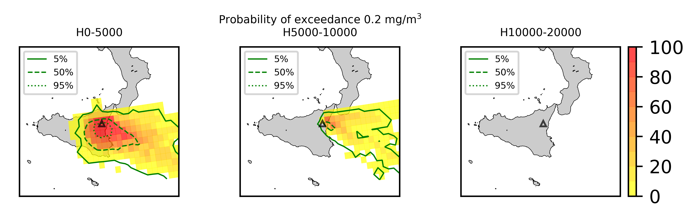
## Forecast at 2021-02-28 20:40 Z from RED VONA issued at 20210228_0835Z
  

|Eruption start [Z]|Eruption end [Z]|Forecast time [Z]|Column height asl [m]|
| :--- | :--- | :--- | :--- |
|2021-02-28 08:10:00|Ongoing|2021-02-28 20:40:00|9000 ± 500 - from VONA|
  
  

|Percentile|MER [kg/s¹]|Mass air [kg]|Mass air nested dom. [kg]|Mass grd [kg]|Mass grd nested dom. [kg]|
| :--- | :--- | :--- | :--- | :--- | :--- |
|5th|5.77e+04|5.22e+08|1.78e+08|4.47e+09|4.45e+09|
|50th|2.71e+05|1.34e+09|8.82e+08|9.26e+09|9.14e+09|
|95th|7.31e+05|3.52e+09|2.22e+09|1.71e+10|1.61e+10|
  

### Ground Nested Domain 2021-02-28 20:40 Z
  
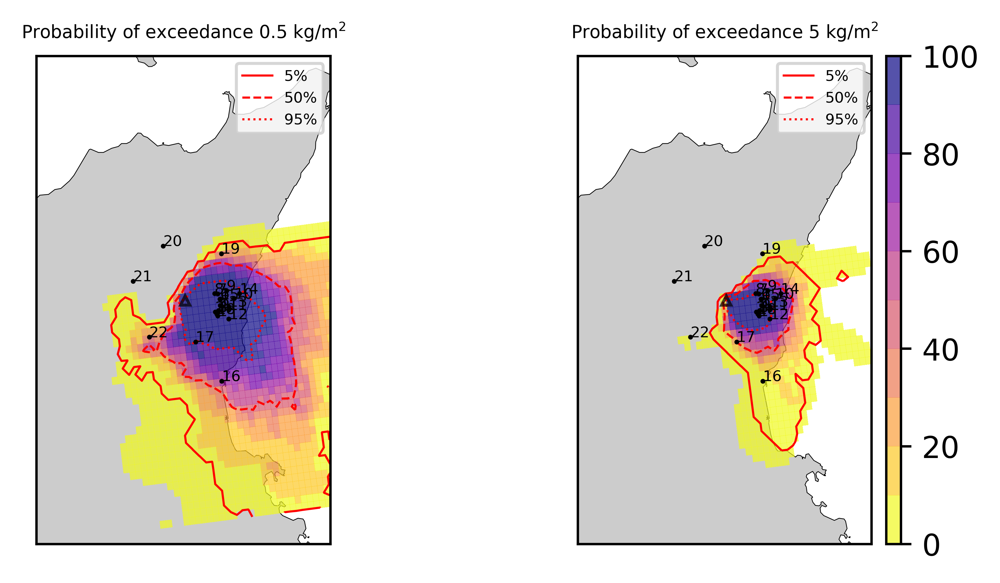  
  
  
  
  
  
  
  
  
  
  
  
  
  
  
  
  
  
  
  
  
  

|Location|Ground load [kg/m²] 5th perc|Ground load [kg/m²] 50th perc|Ground load [kg/m²] 95th perc|
| :--- | :--- | :--- | :--- |
|Sarro (1)|6.06e+00|2.31e+01|4.40e+01|
|Airone (2)|9.33e+00|2.25e+01|4.07e+01|
|Zafferana Ingresso (3)|8.67e+00|2.13e+01|3.66e+01|
|Zafferana Rotonda (4)|1.02e+01|2.03e+01|3.63e+01|
|Petrulli (5)|1.15e+01|1.81e+01|3.24e+01|
|Milo (6)|6.31e+00|1.82e+01|3.43e+01|
|Fornazzo (7)|4.08e+00|1.48e+01|3.05e+01|
|Rinuccio (8)|4.44e+00|1.53e+01|2.89e+01|
|S. Alfio (9)|1.27e+00|1.03e+01|3.04e+01|
|Macchia (10)|1.26e+00|8.46e+00|2.65e+01|
|S. Venerina (11)|7.68e+00|1.36e+01|2.86e+01|
|Linera (12)|3.41e+00|1.54e+01|2.69e+01|
|Dagala chiesa S. Maria (13)|6.26e+00|1.35e+01|3.00e+01|
|Giarre Piazza Maccheroni (14)|5.01e-01|5.11e+00|2.11e+01|
|Milo parco (15)|6.20e+00|1.80e+01|3.43e+01|
|Catania AP (16)|4.74e-02|1.33e+00|5.73e+00|
|Nicolosi (17)|1.35e+00|6.51e+00|1.50e+01|
|Zafferana (18)|7.62e+00|2.24e+01|4.55e+01|
|Linguaglossa (19)|4.70e-04|7.79e-02|1.28e+00|
|Randazzo (20)|0.00e+00|5.38e-04|8.49e-03|
|Bronte (21)|0.00e+00|7.61e-03|1.41e-01|
|Biancavilla (22)|1.95e-02|1.53e-01|1.09e+00|
  

### Atmosphere 2021-02-28 20:40 Z
  
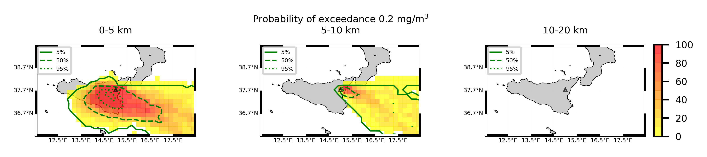  
Go to [Supplementary page](Supplementary_page.md)  
Go to [Main directory](https://github.com/federicapardini/Real_time_ash_forecast)