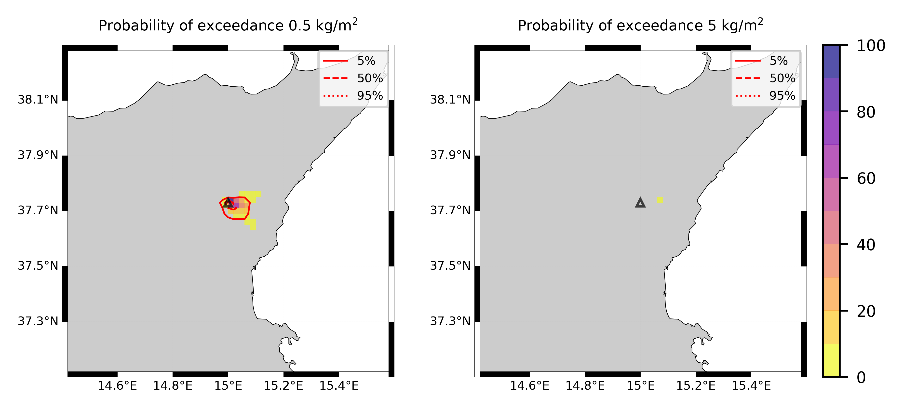

Forecast from VONA_20210228_0811Z
=================================

Contents
========

* [Forecast products](#forecast-products)
	* [Forecast at 2021-02-28 09:10 Z from RED VONA issued at 20210228_0811Z](#forecast-at-2021-02-28-0910-z-from-red-vona-issued-at-20210228_0811z)

# Forecast products

## Forecast at 2021-02-28 09:10 Z from RED VONA issued at 20210228_0811Z
  

|Eruption start [Z]|Eruption end [Z]|Forecast time [Z]|Column height asl [m]|
| :--- | :--- | :--- | :--- |
|2021-02-28 08:10:00|Ongoing|2021-02-28 09:10:00|6000 ± 500 - from VONA|
  
  

|Percentile|MER [kg/s¹]|Mass air [kg]|Mass air nested dom. [kg]|Mass grd [kg]|Mass grd nested dom. [kg]|
| :--- | :--- | :--- | :--- | :--- | :--- |
|5th|2.79e+03|2.02e+06|2.02e+06|7.72e+06|7.72e+06|
|50th|1.79e+04|2.20e+07|2.20e+07|3.99e+07|3.99e+07|
|95th|3.27e+04|3.52e+07|3.51e+07|7.93e+07|7.93e+07|
  

### Ground Nested Domain 2021-02-28 09:10 Z
  
  
  
  
  
  
  
  
  
  
  
  
  
  
  
  
  
  
  
  
  
  
  
  

|Location|Ground load [kg/m²] 5th perc|Ground load [kg/m²] 50th perc|Ground load [kg/m²] 95th perc|
| :--- | :--- | :--- | :--- |
|Catania AP (1)|0.00e+00|0.00e+00|0.00e+00|
|Siracusa (2)|nan|nan|nan|
|Reggio Calabria (3)|nan|nan|nan|
|Palermo (4)|nan|nan|nan|
|Nicolosi (5)|0.00e+00|0.00e+00|5.74e-02|
|Zafferana (6)|0.00e+00|0.00e+00|3.43e-02|
|Linguaglossa (7)|0.00e+00|0.00e+00|0.00e+00|
|Randazzo (8)|0.00e+00|0.00e+00|0.00e+00|
|Bronte (9)|0.00e+00|0.00e+00|0.00e+00|
|Biancavilla (10)|0.00e+00|0.00e+00|0.00e+00|
|Schiena Asino (11)|4.35e-03|2.62e-01|1.15e+00|
|Rif.Vescovo (12)|8.23e-04|3.86e-01|1.20e+00|
|Serra Pituzza (13)|5.38e-04|2.04e-01|1.41e+00|
|Monterosso (14)|0.00e+00|0.00e+00|1.02e-03|
|Cim.Pedara (15)|0.00e+00|0.00e+00|1.19e-02|
|Cim.Viagrande (16)|0.00e+00|0.00e+00|0.00e+00|
|Cim.Mascalucia (17)|0.00e+00|0.00e+00|0.00e+00|
|Cim.Tremestieri (18)|0.00e+00|0.00e+00|0.00e+00|
|Cim.S.Giov.La Punta (19)|0.00e+00|0.00e+00|0.00e+00|
|Cim.Gravina (20)|0.00e+00|0.00e+00|0.00e+00|
|ENI S.Giov.Galermo (21)|0.00e+00|0.00e+00|0.00e+00|
|Bio Piazza Europa (22)|0.00e+00|0.00e+00|0.00e+00|
|INGV-OE (23)|0.00e+00|0.00e+00|0.00e+00|
  

### Atmosphere 2021-02-28 09:10 Z
  
  
Go to [Supplementary page](Supplementary_page.md)  
Go to [Main directory](https://github.com/federicapardini/Real_time_ash_forecast)